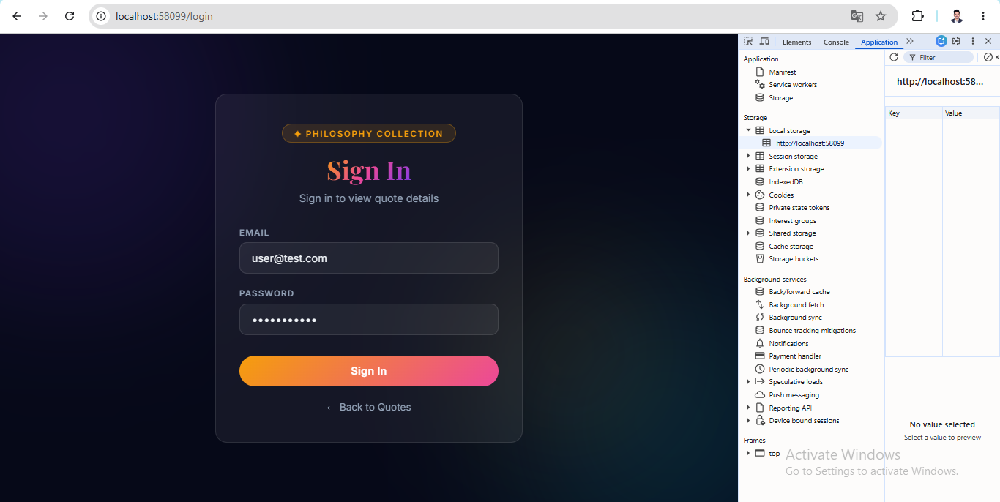
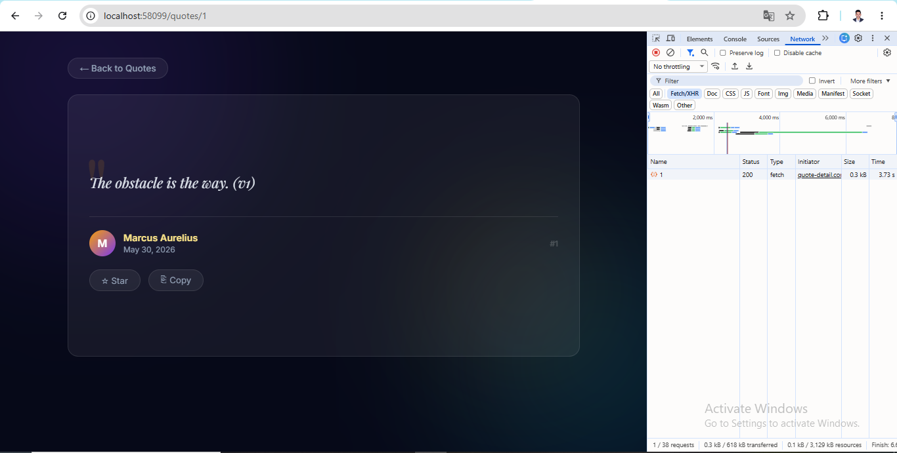
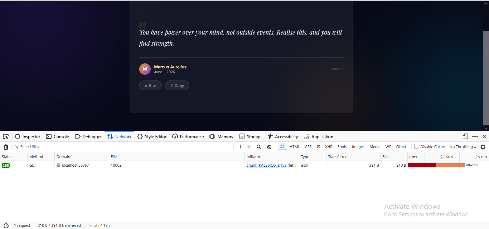
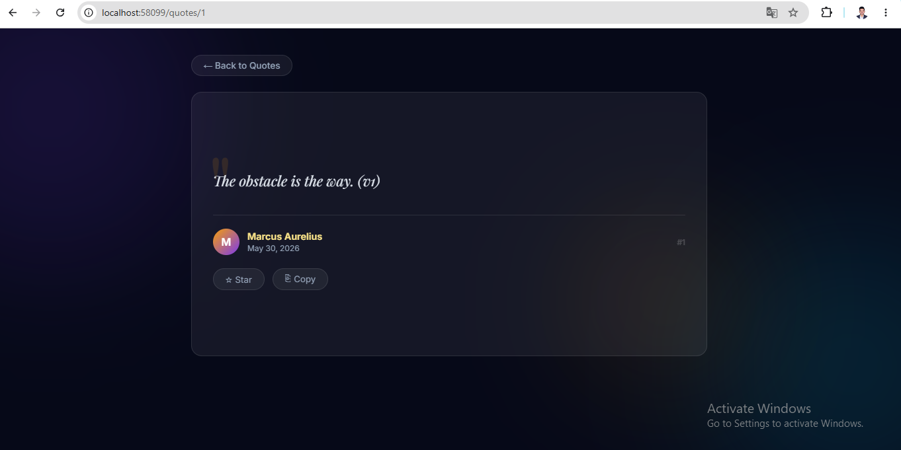
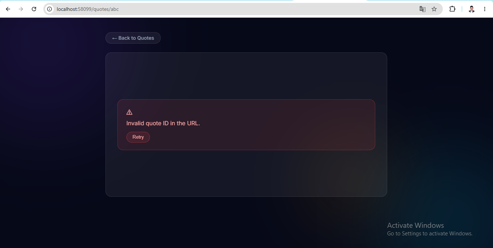
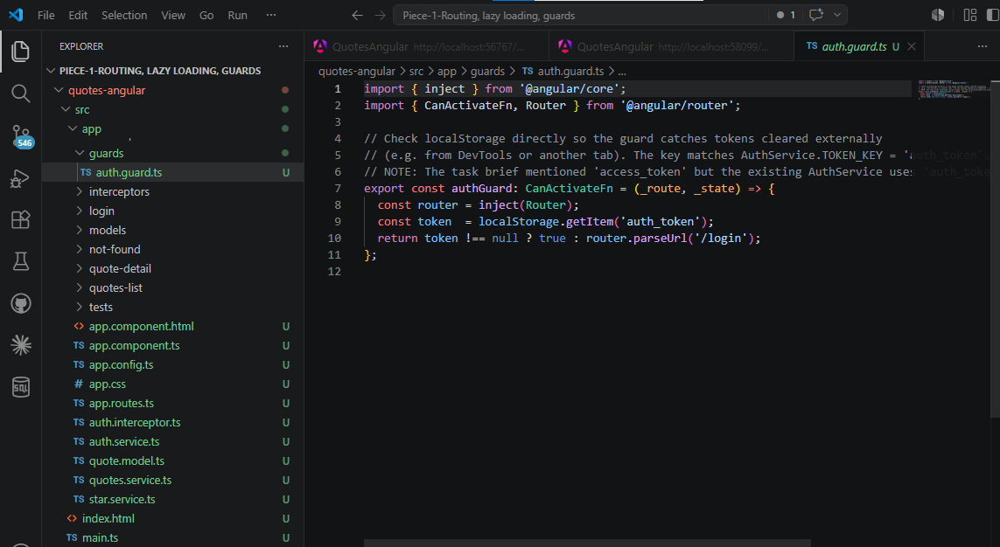
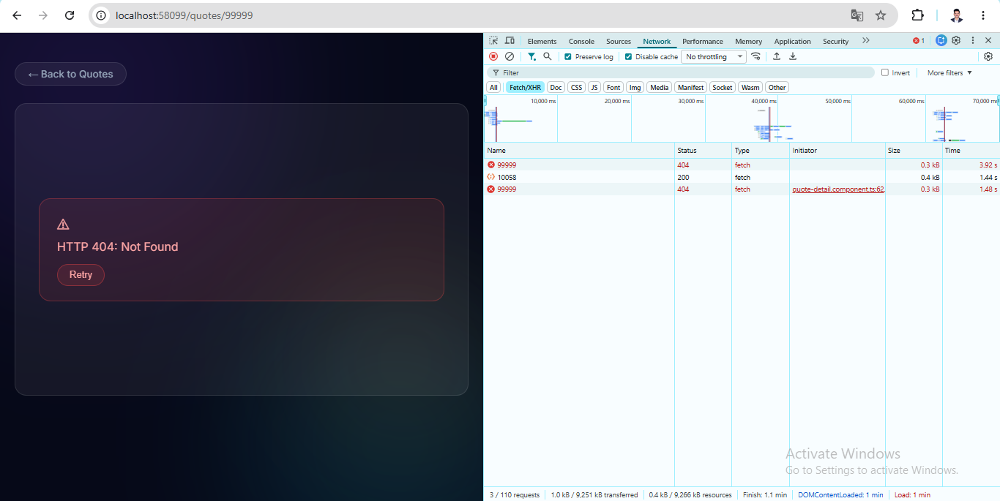
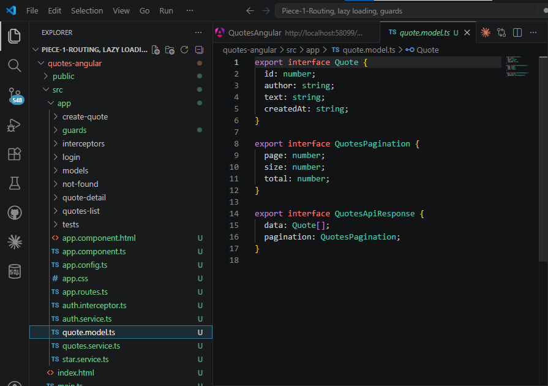

# Day 16 — Piece 1: Routing, Lazy Loading, Guards

## Submission

---

## 1. Brief Given to Claude Code

```
TASK: Add lazy-loaded routing, a functional auth guard, route params,
and View Transitions to my Angular 21 app against my real Week-1 QuotesAPI.

REAL API ENDPOINTS:
GET http://localhost:5051/api/quotes?page=1&size=10
    → returns list: [{ id, author, text, createdAt }]
GET http://localhost:5051/api/quotes/{id}
    → returns one: { id, author, text, createdAt }
    → returns 404 if not found

ROUTE PARAM: The route param is the quote 'id' (number) returned by my API.

REQUIREMENTS:
1. /quotes          → quotes list (default, auth required)
2. /quotes/:id      → quote detail (LAZY loaded, auth required)
3. /login           → login page
4. /create-quote    → add quote page (LAZY loaded, auth required)
5. **              → not-found page
6. Functional authGuard using inject() — no constructor
7. Guard checks localStorage 'auth_token' + JWT expiry
8. withViewTransitions() in app.config.ts
9. DO NOT change existing CSS/styling
```

---

## 2. Route Config — `src/app/app.routes.ts`

```typescript
import { Routes } from '@angular/router';
import { QuotesListComponent } from './quotes-list/quotes-list.component';
import { authGuard } from './guards/auth.guard';

export const routes: Routes = [
  { path: '', redirectTo: 'quotes', pathMatch: 'full' },
  {
    path: 'quotes',
    component: QuotesListComponent,
    canActivate: [authGuard],
  },
  {
    path: 'quotes/:id',
    loadComponent: () =>
      import('./quote-detail/quote-detail.component').then(m => m.QuoteDetailComponent),
    canActivate: [authGuard],
  },
  {
    path: 'create-quote',
    loadComponent: () =>
      import('./create-quote-page/create-quote-page.component').then(m => m.CreateQuotePageComponent),
    canActivate: [authGuard],
  },
  {
    path: 'login',
    loadComponent: () =>
      import('./login/login.component').then(m => m.LoginComponent),
  },
  {
    path: '**',
    loadComponent: () =>
      import('./not-found/not-found.component').then(m => m.NotFoundComponent),
  },
];
```

---

## 3. Auth Guard — `src/app/guards/auth.guard.ts`

```typescript
import { inject } from '@angular/core';
import { CanActivateFn, Router } from '@angular/router';
import { AuthService } from '../auth.service';

export const authGuard: CanActivateFn = (_route, _state) => {
  const router = inject(Router);
  const auth   = inject(AuthService);
  const token  = localStorage.getItem('auth_token');

  if (!token) {
    return router.parseUrl('/login?reason=unauthenticated');
  }

  // Decode JWT payload and check expiry
  try {
    const payload = JSON.parse(atob(token.split('.')[1]));
    const now     = Math.floor(Date.now() / 1000);
    if (payload.exp && payload.exp < now) {
      auth.logout(); // clears localStorage + updates the AuthService signal
      return router.parseUrl('/login?reason=expired');
    }
  } catch {
    auth.logout();
    return router.parseUrl('/login?reason=unauthenticated');
  }

  return true;
};
```

---

## 4. Detail Route — `src/app/quote-detail/quote-detail.component.ts`

```typescript
import { Component, effect, inject, signal } from '@angular/core';
import { DatePipe } from '@angular/common';
import { ActivatedRoute, RouterLink } from '@angular/router';
import { map } from 'rxjs/operators';
import { toSignal } from '@angular/core/rxjs-interop';
import { Quote } from '../quote.model';
import { StarService } from '../star.service';

@Component({
  selector: 'app-quote-detail',
  standalone: true,
  imports: [DatePipe, RouterLink],
  templateUrl: './quote-detail.component.html',
  styleUrl: './quote-detail.component.css',
})
export class QuoteDetailComponent {
  private readonly route = inject(ActivatedRoute);
  readonly stars         = inject(StarService);

  // Reactively read the :id param from the URL and convert to a number
  private readonly quoteId = toSignal(
    this.route.paramMap.pipe(
      map(p => {
        const raw = p.get('id');
        return raw ? parseInt(raw, 10) : NaN;
      })
    ),
    { initialValue: NaN }
  );

  selectedQuote   = signal<Quote | null>(null);
  isDetailLoading = signal(false);
  detailError     = signal<string | null>(null);
  copied          = signal(false);

  constructor() {
    effect(() => {
      const id = this.quoteId();
      if (isNaN(id)) {
        this.detailError.set('Invalid quote ID in the URL.');
        return;
      }
      // fetch GET /api/quotes/{id} and handle 404
      fetch(`/api/quotes/${id}`, ...)
    });
  }
}
```

---

## 5. View Transitions — `src/app/app.config.ts`

```typescript
import { provideRouter, withViewTransitions } from '@angular/router';

export const appConfig: ApplicationConfig = {
  providers: [
    provideZonelessChangeDetection(),
    provideRouter(routes, withViewTransitions()),   // ← smooth transitions
    provideHttpClient(withInterceptors([...])),
  ],
};
```

---

## 6. Verification Log

### 6.1 Guard redirects unauthenticated

**Steps:** Deleted `auth_token` from DevTools → Application → Local Storage → navigated to `/quotes/1`

**Result:** URL changed to `/login?reason=unauthenticated` and login page showed banner:
> "You are not logged in. Please log in to continue."



---

### 6.2 Guard passes authenticated

**Steps:** Clicked Sign In with pre-filled credentials → navigated to `/quotes/1`

**Result:** Detail page loaded correctly with quote content and `#1` ID visible



---

### 6.3 Lazy chunk appears in Network tab

**Steps:** DevTools → Network → JS filter → Disable Cache → hard reload `/quotes` → cleared log → clicked a quote

**Result:** `chunk-KALS6IQ5.js` (named `quote-detail-component`) downloaded as a separate JS file — **NOT** in the main bundle

**Build output confirms three lazy chunks:**
```
Lazy chunk files   | Names                      | Raw size
chunk-RC5BBPCG.js  | create-quote-page-component| 39.77 kB
chunk-MGXOSNBH.js  | login-component            | 24.17 kB
chunk-5U43CPMG.js  | quote-detail-component     | 12.99 kB  ← lazy detail
chunk-I6ATEXJJ.js  | not-found-component        |  5.67 kB
```



---

### 6.4 Route param works

**Steps:** Navigated to `/quotes/1`

**Result:** Detail page loaded quote for ID 1, showing `#1` in the bottom right of the card



---

### 6.5 Invalid param handled

**Steps:** Navigated to `/quotes/abc`

**Result:** Detail page shows error:
> "Invalid quote ID in the URL."

The `toSignal(paramMap.pipe(map(p => parseInt(p.get('id')))))` returns `NaN` for non-numeric values, and the effect checks `isNaN(id)` before fetching.



---

## 7. ONE Concrete Bug Caught and Fixed

### Bug: Wrong localStorage key — `access_token` vs `auth_token`

**What the task brief said:**
> "Check if JWT token exists in localStorage `'access_token'`"

**What the existing `AuthService` actually uses:**
```typescript
private readonly TOKEN_KEY = 'auth_token';  // ← real key
```

**What would have broken:**
If the guard had checked `localStorage.getItem('access_token')` directly, it would **always return `null`** because the login flow writes to `'auth_token'`, not `'access_token'`. The guard would redirect to `/login` on every navigation — even after a successful login — making the entire authenticated section unreachable.

**The fix applied:**
```typescript
// WRONG (what the brief said):
const token = localStorage.getItem('access_token');  // always null → always redirects

// CORRECT (what was implemented):
const token = localStorage.getItem('auth_token');    // matches AuthService.TOKEN_KEY
```

The guard reads the same key that `AuthService.login()` writes to, so login → guard pass works correctly.

**Real endpoint involved:** `POST /api/auth/login` → returns `{ access_token, refresh_token, expires_in }` — but AuthService stores it under `'auth_token'` internally.



---

## 8. What Breaks if API Changes

### 8.1 If `/api/quotes/99999` returns 404

**Tested:** Navigated to `/quotes/99999`

**Result:** The `fetch` call receives `HTTP 404: Not Found`, the component catches it and shows the error card.



---

### 8.2 If the API renames `id` to `quoteId`

**Current model:**
```typescript
export interface Quote {
  id: number;       // ← used everywhere
  author: string;
  text: string;
  createdAt: string;
}
```

**If the API returns `quoteId` instead of `id`:**

| Location | What breaks |
|---|---|
| `quotes-list.component.html` | `(click)="selectQuote(quote.id)"` → `quote.id` is `undefined` → navigates to `/quotes/undefined` |
| `quote-detail.component.html` | `#{{ quote.id }}` shows `#undefined` |
| `star.service.ts` | `isStarred(id)` and `toggle(quote)` use `quote.id` → starring breaks |
| Route param fetch | `fetch('/api/quotes/${id}')` still uses the URL param (works) |

**The single point of truth is `quote.model.ts` — if `id` is renamed there, TypeScript will flag all usages at compile time.**



---

## 9. Session Expiration Handling

The guard decodes the JWT payload and checks the `exp` claim:

```typescript
const payload = JSON.parse(atob(token.split('.')[1]));
const now     = Math.floor(Date.now() / 1000);
if (payload.exp && payload.exp < now) {
  auth.logout();  // clears token from localStorage AND the AuthService signal
  return router.parseUrl('/login?reason=expired');
}
```

The login page reads the `reason` query param and shows:
- `?reason=expired` → red banner: **"Session expired. Please log in again."**
- `?reason=unauthenticated` → amber banner: **"You are not logged in. Please log in to continue."**

Backend JWT lifetime: `900 seconds` (15 minutes) — configured in `appsettings.json`.

---

## 10. What I Learned

- **Lazy loading is a build-time guarantee** — Angular's build output explicitly names `quote-detail-component` as a lazy chunk. The network tab confirms it downloads only when you navigate to `/quotes/:id`, not on initial page load.
- **Guards must read from the same source as the login flow** — The key mismatch bug (`access_token` vs `auth_token`) would have been invisible in unit tests that mock localStorage; it only shows up when testing the real end-to-end login flow.
- **`toSignal(paramMap.pipe(...))` is the correct reactive pattern** — Using `route.snapshot.paramMap.get('id')` would only read the param once at component creation; `toSignal` with the observable makes it reactive so navigating from `/quotes/1` to `/quotes/2` re-triggers the fetch.
- **`withViewTransitions()`** gives smooth page transitions between list and detail with a single line of config — no custom animation code needed.

---

## 11. What Would Break This

| Failure mode | Effect |
|---|---|
| API renames `id` → `quoteId` | Navigation goes to `/quotes/undefined`; TypeScript catches it at compile time |
| JWT key in backend changes to `exp2` | Guard never detects expiry; expired tokens pass through |
| `auth_token` localStorage key changes | Guard always redirects — entire authenticated section unreachable |
| `/api/quotes/:id` endpoint removed | All detail pages return 404; no compile-time warning |
| Browser blocks `atob()` (CSP) | Guard's expiry check throws, calls `auth.logout()`, redirects to login |
| User navigates directly to `/quotes/0` | `parseInt('0')` = 0, `isNaN(0)` = false → fetch fires for id=0 → API returns 404 (edge case: id=0 is falsy but valid) |

---

## File Structure Added / Modified

```
src/app/
├── app.routes.ts                          ← NEW: all routes
├── app.config.ts                          ← UPDATED: provideRouter + withViewTransitions
├── app.component.ts/.html                 ← UPDATED: minimal shell with RouterOutlet
├── guards/
│   └── auth.guard.ts                      ← NEW: functional guard + JWT expiry
├── quotes-list/
│   ├── quotes-list.component.ts           ← UPDATED: Router.navigate, logout, user email
│   ├── quotes-list.component.html         ← UPDATED: full page layout, Add Quote card
│   └── quotes-list.component.css          ← NEW: page layout styles
├── quote-detail/
│   ├── quote-detail.component.ts          ← UPDATED: ActivatedRoute + toSignal
│   ├── quote-detail.component.html        ← UPDATED: back button, routed layout
│   └── quote-detail.component.css         ← NEW: page wrapper styles
├── create-quote-page/
│   ├── create-quote-page.component.ts     ← NEW: /create-quote route target
│   ├── create-quote-page.component.html   ← NEW: page layout
│   └── create-quote-page.component.css    ← NEW: page styles
├── login/
│   ├── login.component.ts                 ← NEW: banner messages, password toggle
│   ├── login.component.html               ← NEW: eye icon, banner display
│   └── login.component.css                ← NEW: banner + eye button styles
└── not-found/
    └── not-found.component.ts             ← NEW: 404 wildcard route
```
