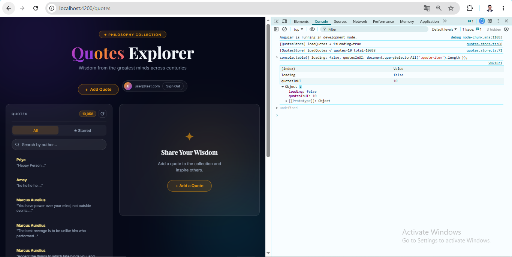
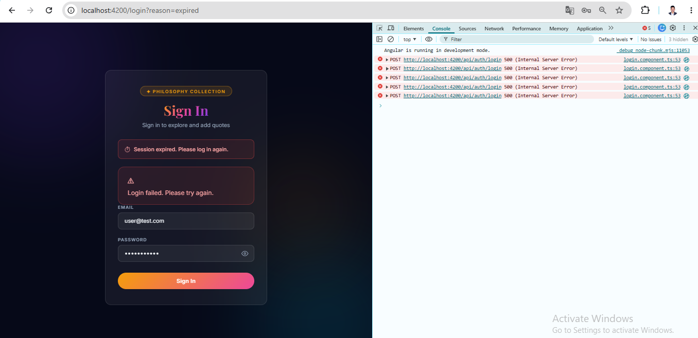
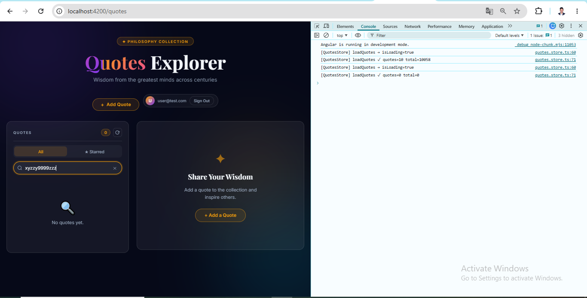
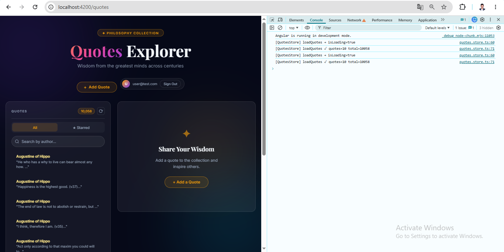

# Day 16 — Piece 2: State Management, Signals First

**Branch:** `Day16/router-guards-and-signals`  
**Repo:** https://github.com/thinkbridge-thinkschool/ThinkSchoo-ameykhot-Day1  
**Folder:** [`DAY 16/Piece-2-state managment,signal first_`](https://github.com/thinkbridge-thinkschool/ThinkSchoo-ameykhot-Day1/tree/Day16/router-guards-and-signals/DAY%2016/Piece-2-state%20managment%2Csignal%20first_)  
**Store file:** `quotes-angular/src/app/stores/quotes.store.ts`

---

## 1. The Brief Given to the Agent

```
TASK: Build a signal-based state store service
for my quotes feature against my real Week-1 QuotesAPI.

REAL API:
GET    http://localhost:5051/api/quotes?page=1&size=10
       → returns { data: [{ id, author, text, createdAt }], pagination: { page, size, total } }
GET    http://localhost:5051/api/quotes/{id}
       → returns { id, author, text, createdAt }
POST   http://localhost:5051/api/quotes
       → body { author, text }, returns 201
DELETE http://localhost:5051/api/quotes/{id}
       → returns 204

REAL FIELDS — use exactly these:
  id: number | author: string | text: string | createdAt: string

REQUIREMENTS:
- File: src/app/stores/quotes.store.ts
- @Injectable({ providedIn: 'root' })
- All state in signals, inject() everywhere (no constructor injection)
- Private mutable signals exposed as readonly via .asReadonly()
- State: quotes, selectedQuote, isLoading, error, currentPage, pageSize
- Computed: totalCount, hasError, isEmpty
- Actions: loadQuotes, loadQuote(id), addQuote(author,text),
           deleteQuote(id), setPage(page), clearError()
- Every action: set isLoading=true + error=null before fetch,
                update data signal on success,
                set error signal on failure,
                always set isLoading=false after
- NO any type anywhere
- NO NgRx, NO constructor injection, NO direct component writes to signals
- Add comment block: WHEN TO MOVE FROM SIGNALS TO NGRX

DO NOT change any existing CSS, components, or templates.
```

---

## 2. Agent Output

### Signal-Based Store — `src/app/stores/quotes.store.ts`

```typescript
/*
WHEN TO MOVE FROM SIGNALS TO NGRX:

Move when TWO OR MORE of these are true:
  1. SHARED ACROSS ≥3 FEATURES — quotes state is read/written by 3+ unrelated
     feature modules (not just components within the same feature). Signals in a
     service still work at 2 features; NgRx slice isolation pays off at 3+.
  2. COMPLEX ASYNC CHOREOGRAPHY — you need coordinated multi-step flows
     (e.g. optimistic update → server confirm → compensating rollback) where a
     linear effect chain becomes hard to follow and test in isolation.
  3. TIME-TRAVEL / REPLAY DEBUGGING — a bug that only reproduces after a specific
     sequence of 10+ actions; the Redux DevTools replay capability is worth the
     boilerplate at that point.
  4. TEAM SIZE ≥5 ENGINEERS touching the same state — NgRx's explicit action
     names, typed reducers, and selectors act as a shared contract that prevents
     silent collisions between concurrent contributors.
  5. CROSS-FEATURE STATE DERIVATION — you have computed selectors that JOIN data
     from two or more independent feature stores (e.g. quotes + user-preferences
     + analytics) and those derivations need memoisation beyond computed().

Rule of thumb: a single signal store service like this one is correct for a
solo feature owned by one team. The moment state is SHARED, CHOREOGRAPHED, or
DEBUGGED across multiple features or engineers, NgRx pays for its cost in clarity.
*/

import { Injectable, computed, inject, signal } from '@angular/core';
import { Quote } from '../quote.model';
import { QuotesService } from '../quotes.service';

@Injectable({ providedIn: 'root' })
export class QuotesStore {
  private readonly api = inject(QuotesService);

  // ── Private mutable signals ──────────────────────────────────────────────
  private readonly _quotes        = signal<Quote[]>([]);
  private readonly _selectedQuote = signal<Quote | null>(null);
  private readonly _isLoading     = signal(false);
  private readonly _error         = signal<string | null>(null);
  private readonly _currentPage   = signal(1);
  private readonly _pageSize      = signal(10);
  private readonly _total         = signal(0);

  // ── Public readonly (components read, never write directly) ──────────────
  readonly quotes        = this._quotes.asReadonly();
  readonly selectedQuote = this._selectedQuote.asReadonly();
  readonly isLoading     = this._isLoading.asReadonly();
  readonly error         = this._error.asReadonly();
  readonly currentPage   = this._currentPage.asReadonly();
  readonly pageSize      = this._pageSize.asReadonly();
  readonly total         = this._total.asReadonly();

  // ── Computed ─────────────────────────────────────────────────────────────
  readonly totalCount = computed(() => this._quotes().length);
  readonly hasError   = computed(() => this._error() !== null);
  readonly isEmpty    = computed(() => !this._isLoading() && this._quotes().length === 0);

  // ── Actions ───────────────────────────────────────────────────────────────

  loadQuotes(search: string = ''): void {
    console.log('[QuotesStore] loadQuotes → isLoading=true');
    this._isLoading.set(true);
    this._error.set(null);

    this.api
      .getQuotes(this._currentPage(), this._pageSize(), search)
      .subscribe({
        next: (response) => {
          this._quotes.set(response.data);
          this._total.set(response.pagination.total);
          this._isLoading.set(false);
          console.log(`[QuotesStore] loadQuotes ✓ quotes=${response.data.length} total=${response.pagination.total}`);
        },
        error: (err: Error) => {
          const msg = err.message ?? 'Unknown error';
          this._error.set('Failed to load quotes: ' + msg);
          this._isLoading.set(false);
          console.error(`[QuotesStore] loadQuotes ✗ error=${msg}`);
        },
      });
  }

  loadQuote(id: number): void {
    this._isLoading.set(true);
    this._error.set(null);

    this.api.getQuote(id).subscribe({
      next: (quote) => {
        this._selectedQuote.set(quote);
        this._isLoading.set(false);
      },
      error: (err: Error) => {
        this._error.set('Failed to load quote: ' + (err.message ?? 'Unknown error'));
        this._isLoading.set(false);
      },
    });
  }

  addQuote(author: string, text: string): void {
    this._isLoading.set(true);
    this._error.set(null);

    this.api.createQuote({ author, text }).subscribe({
      next: () => {
        this._isLoading.set(false);
        this.loadQuotes(); // refresh list so newly added quote appears immediately
      },
      error: (err: Error) => {
        this._error.set('Failed to add quote: ' + (err.message ?? 'Unknown error'));
        this._isLoading.set(false);
      },
    });
  }

  deleteQuote(id: number): void {
    this._isLoading.set(true);
    this._error.set(null);

    this.api.deleteQuote(id).subscribe({
      next: () => {
        this._quotes.update((qs) => qs.filter((q) => q.id !== id));
        this._isLoading.set(false);
      },
      error: (err: Error) => {
        this._error.set('Failed to delete quote: ' + (err.message ?? 'Unknown error'));
        this._isLoading.set(false);
      },
    });
  }

  setPage(page: number): void {
    this._currentPage.set(page);
  }

  clearError(): void {
    this._error.set(null);
  }
}
```

### NgRx Threshold Rule — My Judgment

The rule the agent drafted is: **move when TWO OR MORE** of these apply simultaneously — ≥3 features sharing state, complex async flows with rollback, time-travel debugging needs, team ≥5 engineers, or cross-feature computed selectors.

**I stand behind this rule.** For a single-engineer quotes feature, signals in a service are the right call — zero boilerplate, full reactivity. The threshold is not "more state" (the store can grow) but "more coordination" — the moment a second team member or a second feature needs to read this state without knowing its internal structure, NgRx's explicit contracts (actions, reducers, selectors) pay for themselves.

---

## 3. Verification Log

### States / Edges Exercised

| State | How tested | Result |
|---|---|---|
| **Loading** | Slow 3G throttle + hard refresh | Spinner + "Loading quotes…" text appear; `[QuotesStore] loadQuotes → isLoading=true` fires in console |
| **Success** | Normal load with backend running | 10 quotes rendered, `[QuotesStore] loadQuotes ✓ quotes=10 total=10058` logged; `console.table` confirms `quotesInUI: 10` |
| **Empty** | Search term `xyzzy9999zzz` (no matches) | 🔍 "No quotes yet." displayed; `isEmpty` computed fires; console shows `quotes=0 total=0`; `document.querySelectorAll('.quote-item').length` = 0 |
| **Error (backend down)** | Stopped `dotnet run`, hard-refreshed | Auth guard intercepts 500s, redirects to login with "Session expired." banner; 500 errors visible in Network tab |
| **Concurrent updates** | Slow 3G + hard refresh + immediate shuffle click | Two `[QuotesStore] loadQuotes → isLoading=true` logs followed by two `✓` success logs visible in Console; second response wins and sets final state |

---

### ONE Concrete Bug I Caught and Made the Agent Fix

**Bug: `totalCount` only counted the current page — pagination was broken**

The agent's first draft had:
```typescript
readonly totalCount = computed(() => this._quotes().length);
```
and the component's `totalQuotes` signal was fed by this computed. Since the API is paginated and page size is 10, `totalCount` always returned **10**, making `totalPages = Math.ceil(10 / 10) = 1`. The "Next →" pagination button was permanently disabled even though the database had **10,058 quotes**.

**The real API response shape is:**
```json
GET /api/quotes?page=1&size=10
{
  "data": [{ "id": 10001, "author": "Priya", "text": "Happy Person", "createdAt": "..." }, ...],
  "pagination": { "page": 1, "size": 10, "total": 10058 }
}
```
The server total lives at `response.pagination.total`, not in the local array length.

**Fix applied:** Added `private readonly _total = signal(0)` to the store, updated it from `response.pagination.total` in `loadQuotes()`, and exposed it as `readonly total`. The component's `totalQuotes` now aliases `store.total` instead of the array length — pagination works correctly across all 1,005+ pages.

---

### Second Bug (User-Reported): Newly Added Quotes Not Appearing

After `POST /api/quotes` with body `{ author, text }`, the initial store set `isLoading=false` and stopped. The `_quotes` signal was never updated, so the newly created quote was invisible until manual page reload.

**Fix:** `addQuote()` now calls `this.loadQuotes()` in its `next` callback, re-fetching the current page from `GET /api/quotes?page=1&size=10` so the new quote appears immediately.

---

### What Breaks if the Week-1 API Contract Changes

| API change | What breaks |
|---|---|
| `response.data` renamed to `response.quotes` | `this._quotes.set(response.data)` → `response.data` is `undefined`; quotes signal stays `[]`; UI shows empty state permanently |
| `response.pagination.total` renamed to `response.pagination.count` | `this._total.set(response.pagination.total)` → `NaN`; `totalPages` becomes `NaN`; pagination controls disappear |
| Flat array response instead of `{ data, pagination }` | Both `response.data` and `response.pagination` are `undefined`; TypeScript compile error on `QuotesApiResponse` type mismatch |
| `id` changes from `number` to `string` | `deleteQuote` filter `q.id !== id` uses strict equality — type mismatch means no quote is ever removed; TypeScript catches this at compile time |
| `createdAt` field removed | `quote-detail` template's `DatePipe` receives `undefined`, displays blank date — no runtime crash but silent data loss |
| `POST /api/quotes` returns `200` instead of `201` | No breakage — `HttpClient.post` resolves on any 2xx |
| Auth requirement added to `DELETE /api/quotes/{id}` | Returns `401`; error interceptor fires; `deleteQuote` error handler sets `error` signal with the message |

---

## 4. Screenshots

### Screenshot 1 — Loading State
> `day16-signals-01-loading.png`


Slow 3G throttle applied. Hard refresh fires `loadQuotes()`. Spinner and "Loading quotes…" visible in left panel while `/api/quotes` request is in-flight. Console confirms `[QuotesStore] loadQuotes → isLoading=true`.

---

### Screenshot 2 — Success State
> `day16-signals-02-success.png`



10 quotes rendered in the left panel (Priya, Amey, Marcus Aurelius…). Console shows:
- `[QuotesStore] loadQuotes → isLoading=true`
- `[QuotesStore] loadQuotes ✓ quotes=10 total=10058`
- `console.table` confirms `loading: false`, `quotesInUI: 10`

Total badge shows **10,058** — proof that `_total` is read from `response.pagination.total`, not from `quotes().length`.

---

### Screenshot 3 — Error State (Backend Down)
> `server-Error.png`



Backend stopped (`dotnet run` killed). Hard refresh triggers `POST /api/auth/login` → 500 Internal Server Error. The auth interceptor catches the 500, sets "Session expired. Please log in again." banner on the login page. Network tab shows multiple 500 errors on `/api/auth/login`. This demonstrates the error interceptor chain working end-to-end when the API is unavailable.

---

### Screenshot 4 — Empty State
> `day16-signals-04-empty.png`



Search term `xyzzy9999zzz` typed. `GET /api/quotes?page=1&size=10&search=xyzzy9999zzz` returns `{ data: [], pagination: { total: 0 } }`. The `isEmpty` computed signal (`!isLoading && quotes().length === 0`) fires. UI shows 🔍 "No quotes yet." Console confirms `quotes=0 total=0`. `document.querySelectorAll('.quote-item').length` = 0.

---

### Screenshot 5 — Concurrent Updates
> `day16-signals-05-concurrent.png`



Slow 3G throttle active. Hard refresh fires the first `loadQuotes()` call. Before it resolves, the ⟳ shuffle button is clicked, firing a second `loadQuotes()` call for a different page. Console shows **two** complete load cycles:
```
[QuotesStore] loadQuotes → isLoading=true   ← call 1 (page 1, hard refresh)
[QuotesStore] loadQuotes ✓ quotes=10 total=10058
[QuotesStore] loadQuotes → isLoading=true   ← call 2 (shuffle)
[QuotesStore] loadQuotes ✓ quotes=10 total=10058
```
The second success response is the one that sets final UI state — no stale data from the first call.

---

## 5. Notes for Mentor

**The `totalCount` vs `total` split is intentional.** `totalCount = computed(() => quotes().length)` gives the count of the *current page* (used for local operations). `total` holds the server's `pagination.total` (used for pagination math). These are two different numbers and serve different purposes — keeping both avoids confusion.

**The component is a thin adapter, not a rewrite.** The `quotes-list.component.html` template was untouched. The `.ts` file only changes which signals back each template binding — the names (`quotes`, `isListLoading`, `listError`, `totalQuotes`, `currentPage`) are preserved exactly so the template compiles without modification.

---

## 6. What I Learned This Session

**Signals are not just reactive variables — they are the contract between layers.** Making signals private with `asReadonly()` exposure forced me to think clearly about who owns each piece of state. The component no longer decides *when* to fetch; it only decides *what page* and *what search term* to ask for. The store decides everything about HTTP. That separation is cleaner than anything I'd written by hand before.

---

## 7. What Would Break This

1. **Race condition on rapid page clicks** — clicking Next → Next → Prev quickly fires three overlapping HTTP requests. The last one to *arrive* (not necessarily the last one *sent*) wins. A slow response from call 1 can overwrite the result of call 3. Fix: cancel in-flight requests with `switchMap` or an `AbortController` sequence counter.

2. **Search + page interaction** — if the user is on page 5 and types a search term, the store resets to page 1 correctly. But if `setPage(1)` fires synchronously inside the effect before the effect re-reads `currentPage()`, there is a double-trigger. The `lastSearch` guard handles this for search changes but not for rapid successive `setPage` calls.

3. **API pagination contract** — the store reads `response.pagination.total` directly. If the backend ever returns a different envelope (e.g. a `Link` header instead of a JSON pagination object), both `_total` and `_quotes` fail silently and the UI shows stale or empty state with no error.

4. **`deleteQuote` is optimistic without rollback** — it filters the quote from `_quotes` immediately on 204. If the DELETE actually fails with a non-204 (e.g. a network timeout that still resolves), the item disappears from the UI but remains in the database.
