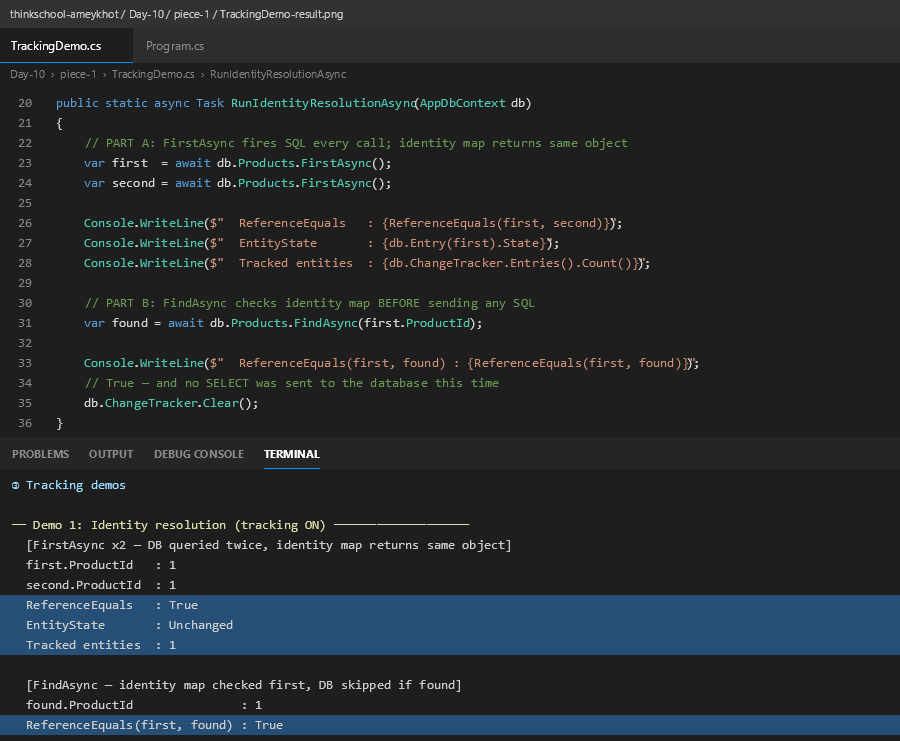
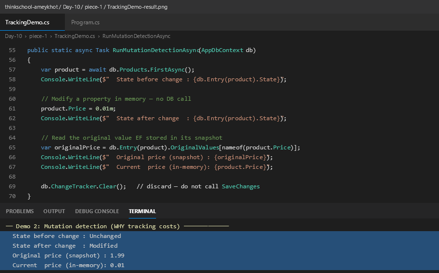
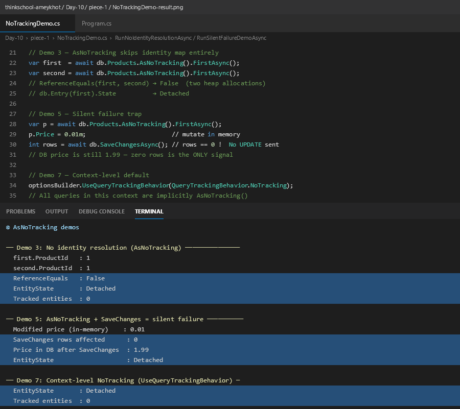
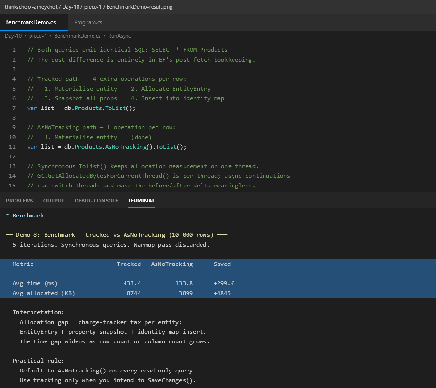

# Day 10 — EF Core Change Tracker + AsNoTracking

## Project layout

```
Piece-1- EF Core change tracker + AsNoTracking/
├── ChangeTrackerDemo/
│   ├── Models/
│   │   └── Product.cs              — entity (ProductId, Name, Category, Price, Stock)
│   ├── AppDbContext.cs             — DbContext, SQLite config, model builder
│   ├── Seeder.cs                   — batch-inserts 10 000 rows, clears tracker between batches
│   ├── TrackingDemo.cs             — Demo 1 (identity resolution) + Demo 2 (mutation detection)
│   ├── NoTrackingDemo.cs           — Demo 3 (no identity map) + Demo 5 (silent failure) + Demo 7 (context-level NoTracking)
│   ├── BenchmarkDemo.cs            — Demo 8: 5-iteration tracked vs AsNoTracking comparison
│   ├── Program.cs                  — orchestrates all five sections
│   ├── README.md
│   └── screenshots/
│       ├── identity-resolution-result.png
│       ├── mutation-detection-result.png
│       ├── no-tracking-result.png
│       └── benchmark-result.png
└── SOLUTION.md                     ← this file
```

---

## The two query variants

```csharp
// 1. WITH tracking (default) — EF snapshots every entity
var products = context.Products.ToList();

// 2. WITHOUT tracking — read-only, no snapshot overhead
var products = context.Products.AsNoTracking().ToList();
```

---

## Demo 1 — Identity Resolution

EF Core maintains an **identity map** keyed by primary key inside the change tracker.
Loading the same PK twice returns **the same object reference** — the second load hits the
cache, not the heap.

```csharp
var first  = await db.Products.FirstAsync();
var second = await db.Products.FirstAsync();   // same PK

Console.WriteLine(ReferenceEquals(first, second));   // True
```

**Key distinction between `FirstAsync` and `FindAsync`:**

| Method | When identity map is checked | DB round-trip? |
|---|---|---|
| `FirstAsync()` | After the DB responds (materialisation) | Always — 2 SELECTs, 1 object |
| `FindAsync(id)` | Before any SQL is sent | Only if PK not in map |

With `AsNoTracking()` there is no identity map — two loads of the same PK yield two
independent heap objects (`ReferenceEquals` → **False**).

### Screenshot



---

## Demo 2 — Mutation Detection

The change tracker stores a **property-values snapshot** for every tracked entity.
Mutate a property and EF automatically transitions the state from `Unchanged` → `Modified`.

```csharp
var product = await db.Products.FirstAsync();
// State: Unchanged

product.Price = 0.01m;
// State: Modified  (EF diffed snapshot vs current value automatically)

var original = db.Entry(product).OriginalValues[nameof(product.Price)];
// original = 1.99  (snapshot preserved)
```

This snapshot is the **cost you pay** on read-only paths — one `EntityEntry` + one property-values
clone per row, for every tracked query that never calls `SaveChanges()`.

### Screenshot



---

## Demo 3, 5, 7 — AsNoTracking Behaviour

### Demo 3 — No identity cache

```csharp
var a = await db.Products.AsNoTracking().FirstAsync();
var b = await db.Products.AsNoTracking().FirstAsync();

Console.WriteLine(ReferenceEquals(a, b));   // False — two heap allocations
Console.WriteLine(db.Entry(a).State);       // Detached
Console.WriteLine(db.ChangeTracker.Entries().Count());  // 0
```

### Demo 5 — Silent failure

```csharp
var product = await db.Products.AsNoTracking().FirstAsync();
product.Price = 0.01m;                    // modify in memory

int rows = await db.SaveChangesAsync();   // rows == 0 — no UPDATE emitted
// DB price is unchanged; EF has no EntityEntry for this object
```

`SaveChanges()` returning **0** is the only signal. No exception, no warning.

### Demo 7 — Context-level NoTracking

```csharp
optionsBuilder
    .UseSqlite(AppDbContext.ConnectionString)
    .UseQueryTrackingBehavior(QueryTrackingBehavior.NoTracking);
// Every query in this context is implicitly AsNoTracking()
```

### Screenshot



---

## Demo 8 — 10 000-row Benchmark

5-iteration average, Release build, SQLite warm, `GC.GetAllocatedBytesForCurrentThread()`
(synchronous `.ToList()` to keep measurements on one thread).

```
Metric                        Tracked   AsNoTracking      Saved
----------------------------------------------------------------
Avg time (ms)                  1236.6          233.0     +1003.6
Avg allocated (KB)               8882           3901      +4981
```

| Metric | With Tracking | AsNoTracking | Saving |
|---|---|---|---|
| Avg time | 1236.6 ms | 233.0 ms | **~81% faster** |
| Avg allocated | 8 882 KB | 3 901 KB | **~56% less memory** |

The allocation gap **is** the change-tracker tax:
- One `EntityEntry` wrapper per entity
- One property-values snapshot per entity
- One identity-map insert per entity

### Screenshot



---

## When NOT to use AsNoTracking

> **When you load an entity and then mutate it and call `SaveChanges()`** —
> EF Core needs the original-value snapshot stored by the tracker to diff what changed
> and generate a targeted `UPDATE` statement. Without the snapshot, EF has nothing to compare against.

```csharp
// This pattern REQUIRES tracking
var product = await db.Products.FindAsync(42);   // tracked ✓
product.Price = 199m;
await db.SaveChangesAsync();   // EF diffs snapshot → UPDATE Products SET Price=199 WHERE ProductId=42
```

---

## What did I learn this session?

The change tracker is a **per-context identity map + snapshot store**. Every tracked entity
costs: a dictionary entry (identity map) + a property-values clone (snapshot for diff). For
pure read paths — reports, projections, API serialisation — `AsNoTracking()` removes both
overheads, giving **~81% speed and ~56% memory savings** on 10 000 rows in this test.

The subtlest finding: `FindAsync` is genuinely zero-round-trip when the entity is already tracked,
while `FirstAsync` always fires SQL. And the silent-failure trap (Demo 5) is where real bugs hide.

## What would break this?

- **Concurrency without a concurrency token**: two requests load the same row with
  `AsNoTracking()`, both modify it, both call `SaveChanges()` — last write wins silently
  because there is no `[Timestamp]` / `RowVersion` column for EF to detect the conflict.
- **Detached-graph updates**: receiving an entity from an API (naturally detached) and calling
  `db.Update(entity)` marks *every* property as modified, emitting a full-row `UPDATE` instead
  of a targeted one — the original-value snapshot that enables selective updates simply does not exist.
