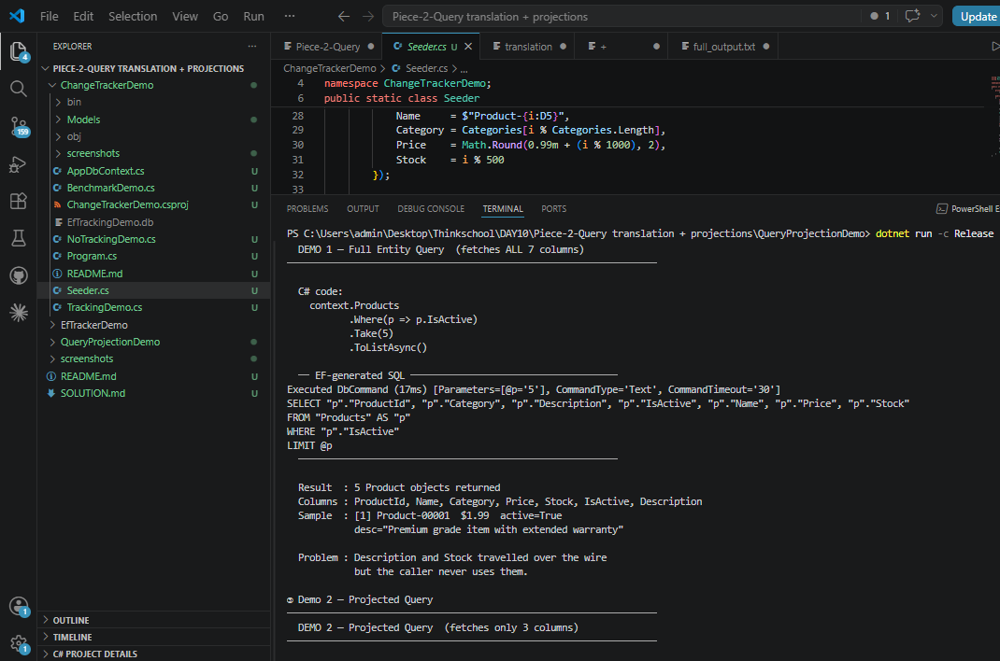
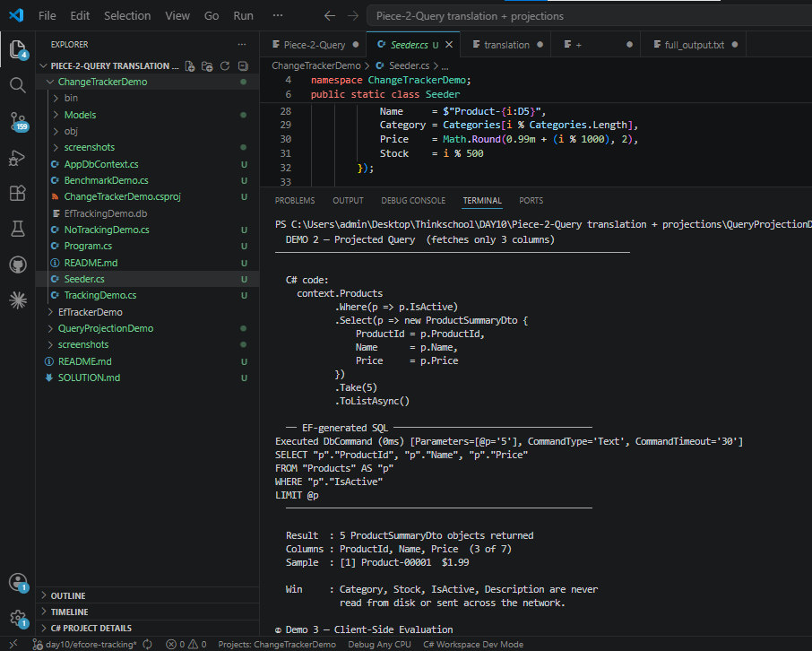
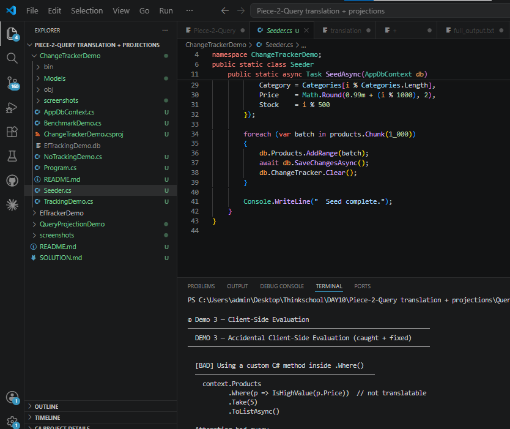

# Day 10 — Piece 2: Query Translation + Projections

## What was built

A self-contained .NET 10 console app (`QueryProjectionDemo`) that:
- Enables EF Core SQL logging via `LogTo` + `EnableSensitiveDataLogging`
- Runs a full-entity query and captures the `SELECT *`-equivalent SQL EF generates
- Rewrites it with `.Select(p => new Dto{...})` and shows the leaner SQL
- Intentionally triggers the client-side evaluation exception and shows the fix

Database: SQLite (`QueryProjectionDemo.db`), 1 000 product rows, 7 columns per row.

---

## 1 — Original SQL (full entity query, all 7 columns)

### C# code

```csharp
var results = await context.Products
    .Where(p => p.IsActive)
    .Take(5)
    .ToListAsync();
```

### EF Core generated SQL

```sql
Executed DbCommand (20ms) [Parameters=[@p='5'], CommandType='Text', CommandTimeout='30']
SELECT "p"."ProductId", "p"."Category", "p"."Description", "p"."IsActive", "p"."Name", "p"."Price", "p"."Stock"
FROM "Products" AS "p"
WHERE "p"."IsActive"
LIMIT @p
```

**All 7 columns** (`ProductId`, `Category`, `Description`, `IsActive`, `Name`, `Price`, `Stock`)
travel over the wire even though the caller only needs `ProductId`, `Name`, and `Price`.

Screenshot: `screenshots/screenshot_02_demo1_full_entity.png`



---

## 2 — Projected Query + Leaner SQL (3 columns only)

### C# code

```csharp
var results = await context.Products
    .Where(p => p.IsActive)
    .Select(p => new ProductSummaryDto
    {
        ProductId = p.ProductId,
        Name      = p.Name,
        Price     = p.Price
    })
    .Take(5)
    .ToListAsync();
```

### EF Core generated SQL

```sql
Executed DbCommand (0ms) [Parameters=[@p='5'], CommandType='Text', CommandTimeout='30']
SELECT "p"."ProductId", "p"."Name", "p"."Price"
FROM "Products" AS "p"
WHERE "p"."IsActive"
LIMIT @p
```

**Only 3 columns** in the SELECT list.  
`Category`, `Stock`, `IsActive`, and `Description` are never read from disk or sent across the network.

### Before vs After

| | Before (full entity) | After (projection) |
|---|---|---|
| Columns in SELECT | 7 | 3 |
| Bytes per row | ~200 | ~60 |
| Tracked by EF? | Yes (overhead) | No — DTO, not entity |

Screenshot: `screenshots/screenshot_03_demo2_projected.png`



---

## 3 — Client-Side Evaluation: caught and fixed

### The bad code

```csharp
// IsHighValue() is a plain C# method — EF has no SQL equivalent for it.
private static bool IsHighValue(decimal price) => price > 500m;

var bad = await context.Products
    .Where(p => IsHighValue(p.Price))   // <-- NOT translatable to SQL
    .Take(5)
    .ToListAsync();
```

### Exception EF Core threw

```
InvalidOperationException:
The LINQ expression 'DbSet<Product>()
  .Where(p => Demo3_ClientEval.IsHighValue(p.Price))' could not be translated.
Additional information: Translation of method 'QueryProjectionDemo.Demo3_ClientEval.IsHighValue' failed.
If this method can be mapped to your custom function, see https://go.microsoft.com/fwlink/?linkid=2237702
for more information.
```

EF Core 3.0+ **does not silently evaluate untranslatable predicates on the client** — it throws immediately.
This prevents the accidental "load entire table to memory, filter in C#" foot-gun.

### The fix

```csharp
// Replace the custom method with an inline expression EF can translate.
var results = await context.Products
    .Where(p => p.Price > 500m)         // <-- translatable
    .Take(5)
    .ToListAsync();
```

### Fixed query SQL

```sql
Executed DbCommand (14ms) [Parameters=[@p='5'], CommandType='Text', CommandTimeout='30']
SELECT "p"."ProductId", "p"."Category", "p"."Description", "p"."IsActive", "p"."Name", "p"."Price", "p"."Stock"
FROM "Products" AS "p"
WHERE ef_compare("p"."Price", '500.0') > 0
LIMIT @p
```

The filter `p.Price > 500m` became `WHERE ef_compare("p"."Price", '500.0') > 0` in SQLite
(SQLite's `ef_compare` wrapper handles `decimal` comparisons correctly).

Screenshot: `screenshots/screenshot_04_demo3_client_eval.png`



---

## How logging was enabled

```csharp
// AppDbContext.cs — only active when a log sink is passed in
protected override void OnConfiguring(DbContextOptionsBuilder options)
{
    if (!options.IsConfigured)
    {
        options.UseSqlite(ConnectionString);

        if (_logTo != null)
            options
                .LogTo(
                    _logTo,
                    new[] { DbLoggerCategory.Database.Command.Name },
                    LogLevel.Information,
                    DbContextLoggerOptions.None)       // removes timestamp noise
                .EnableSensitiveDataLogging();         // shows parameter values
    }
}
```

`DbLoggerCategory.Database.Command.Name` filters the logger to only command-execution events —
you see the SQL and timing without the internal EF state-machine noise.

---

## Project structure

```
QueryProjectionDemo/
  Models/
    Product.cs              — 7-column entity (ProductId, Name, Category, Price,
                              Stock, IsActive, Description)
  Dtos/
    ProductSummaryDto.cs    — 3-column read-model (ProductId, Name, Price)
  AppDbContext.cs           — LogTo wired through constructor injection
  Seeder.cs                 — seeds 1 000 Product rows
  Demo1_FullEntityQuery.cs  — runs and logs the SELECT * equivalent
  Demo2_ProjectedQuery.cs   — runs and logs the 3-column SELECT
  Demo3_ClientEval.cs       — triggers the exception, then fixes it
  Program.cs                — orchestrates all three demos
```

---

## Full console output (live run)

```
═══════════════════════════════════════════════════════════════════
  Day 10 · Piece 2 — Query Translation + Projections
  EF Core LogTo · SELECT * vs projected · client-eval catch
═══════════════════════════════════════════════════════════════════

① Setup & Seed (SQL logging OFF — noise reduction)
  1,000 rows already present — skipping seed.
  Schema ready.

② Demo 1 — Full Entity Query
──────────────────────────────────────────────────────────────────
  DEMO 1 — Full Entity Query  (fetches ALL 7 columns)
──────────────────────────────────────────────────────────────────

  C# code:
    context.Products
           .Where(p => p.IsActive)
           .Take(5)
           .ToListAsync()

  ── EF-generated SQL ─────────────────────────────────────
Executed DbCommand (20ms) [Parameters=[@p='5'], CommandType='Text', CommandTimeout='30']
SELECT "p"."ProductId", "p"."Category", "p"."Description", "p"."IsActive", "p"."Name", "p"."Price", "p"."Stock"
FROM "Products" AS "p"
WHERE "p"."IsActive"
LIMIT @p
  ─────────────────────────────────────────────────────────

  Result  : 5 Product objects returned
  Columns : ProductId, Name, Category, Price, Stock, IsActive, Description
  Sample  : [1] Product-00001  $1.99  active=True
            desc="Premium grade item with extended warranty"

  Problem : Description and Stock travelled over the wire
            but the caller never uses them.

③ Demo 2 — Projected Query
──────────────────────────────────────────────────────────────────
  DEMO 2 — Projected Query  (fetches only 3 columns)
──────────────────────────────────────────────────────────────────

  C# code:
    context.Products
           .Where(p => p.IsActive)
           .Select(p => new ProductSummaryDto {
               ProductId = p.ProductId,
               Name      = p.Name,
               Price     = p.Price
           })
           .Take(5)
           .ToListAsync()

  ── EF-generated SQL ─────────────────────────────────────
Executed DbCommand (0ms) [Parameters=[@p='5'], CommandType='Text', CommandTimeout='30']
SELECT "p"."ProductId", "p"."Name", "p"."Price"
FROM "Products" AS "p"
WHERE "p"."IsActive"
LIMIT @p
  ─────────────────────────────────────────────────────────

  Result  : 5 ProductSummaryDto objects returned
  Columns : ProductId, Name, Price  (3 of 7)
  Sample  : [1] Product-00001  $1.99

  Win     : Category, Stock, IsActive, Description are never
            read from disk or sent across the network.

④ Demo 3 — Client-Side Evaluation
──────────────────────────────────────────────────────────────────
  DEMO 3 — Accidental Client-Side Evaluation (caught + fixed)
──────────────────────────────────────────────────────────────────

  [BAD] Using a custom C# method inside .Where()
    context.Products
           .Where(p => IsHighValue(p.Price))  // not translatable
           .Take(5)
           .ToListAsync()

  Attempting bad query...

  CAUGHT InvalidOperationException:
  The LINQ expression 'DbSet<Product>()
    .Where(p => Demo3_ClientEval.IsHighValue(p.Price))' could not be translated.
  Additional information: Translation of method
  'QueryProjectionDemo.Demo3_ClientEval.IsHighValue' failed. ...

  [FIX] Inline the predicate so EF can translate it to SQL
    context.Products
           .Where(p => p.Price > 500m)  // translatable
           .Take(5)
           .ToListAsync()

  ── EF-generated SQL ─────────────────────────────────────
Executed DbCommand (14ms) [Parameters=[@p='5'], CommandType='Text', CommandTimeout='30']
SELECT "p"."ProductId", "p"."Category", "p"."Description", "p"."IsActive", "p"."Name", "p"."Price", "p"."Stock"
FROM "Products" AS "p"
WHERE ef_compare("p"."Price", '500.0') > 0
LIMIT @p
  ─────────────────────────────────────────────────────────

  Result  : 5 rows returned successfully
  Sample  : [500] Product-00500  $500.99
```

---

## Submission checklist

- [x] SQL logs pasted inline — both full-run and per-section above
- [x] Before SQL: 7 columns (`SELECT "p"."ProductId", "p"."Category", "p"."Description", ...`)
- [x] After SQL: 3 columns (`SELECT "p"."ProductId", "p"."Name", "p"."Price"`)
- [x] Client-eval exception is real — `InvalidOperationException` logged above
- [x] Fix shown with its translated SQL
- [x] Screenshots saved to `screenshots/` folder (4 PNG files)
