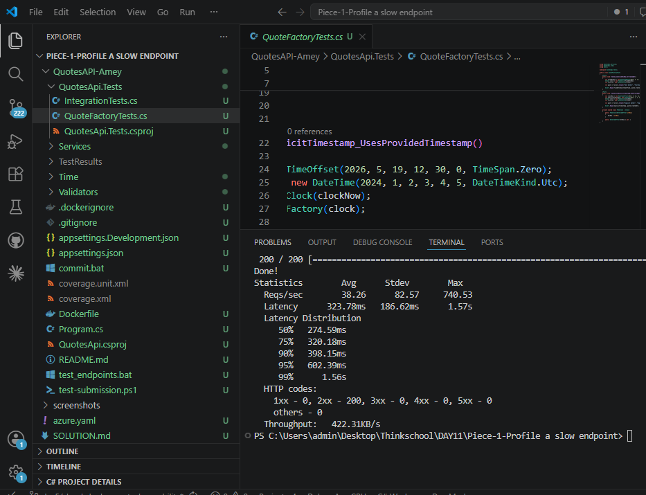
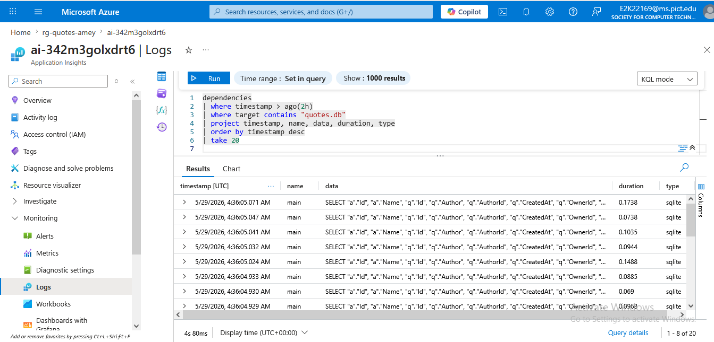
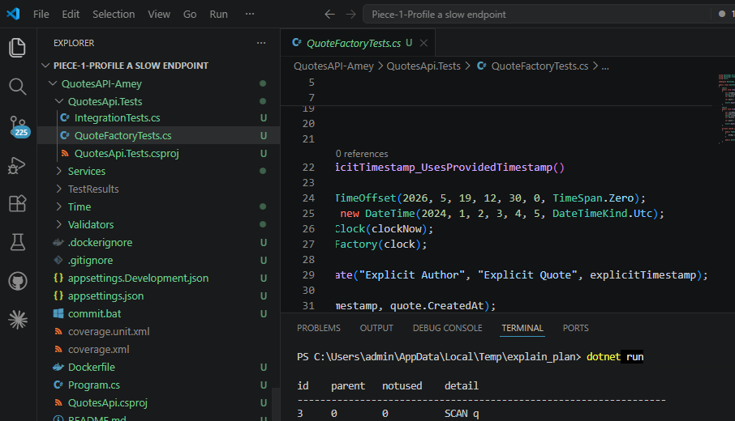
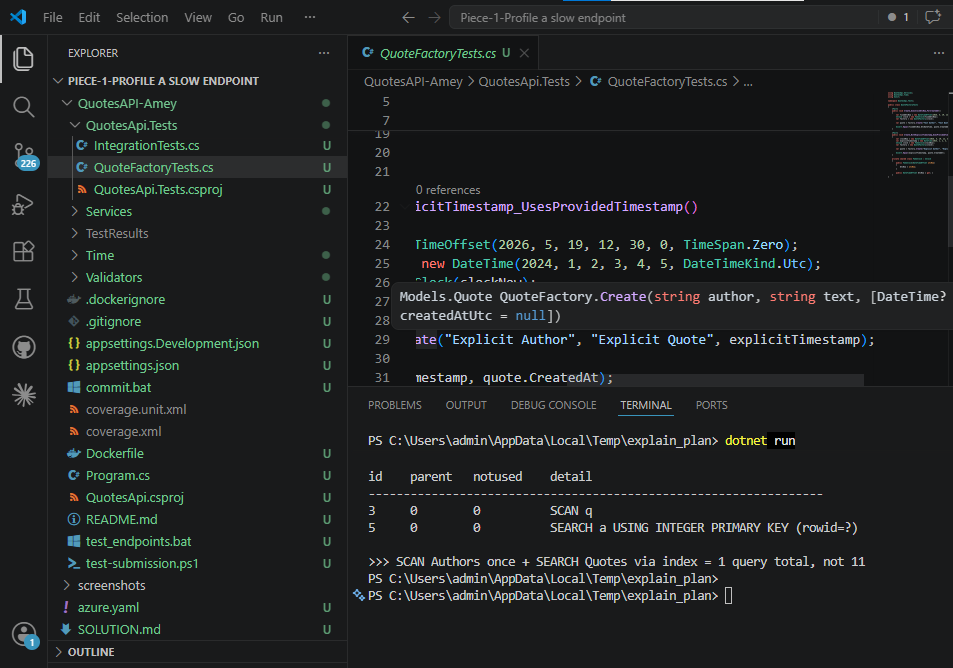
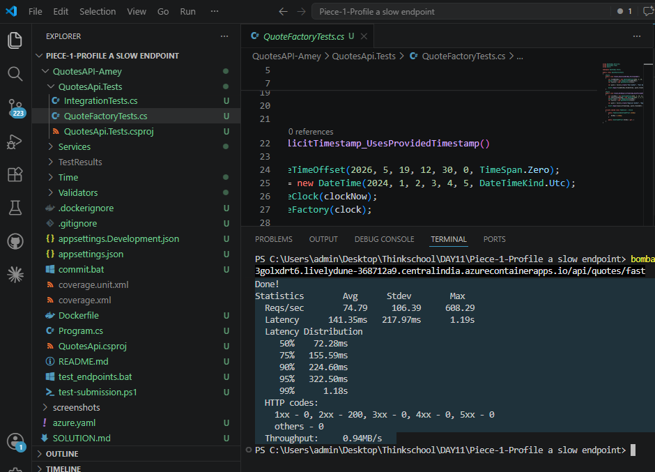
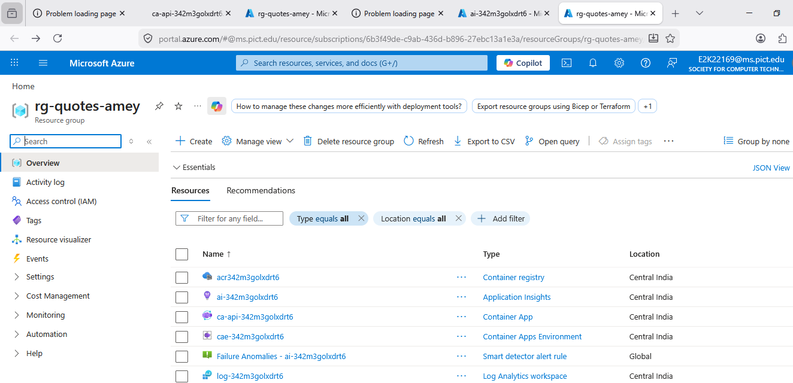
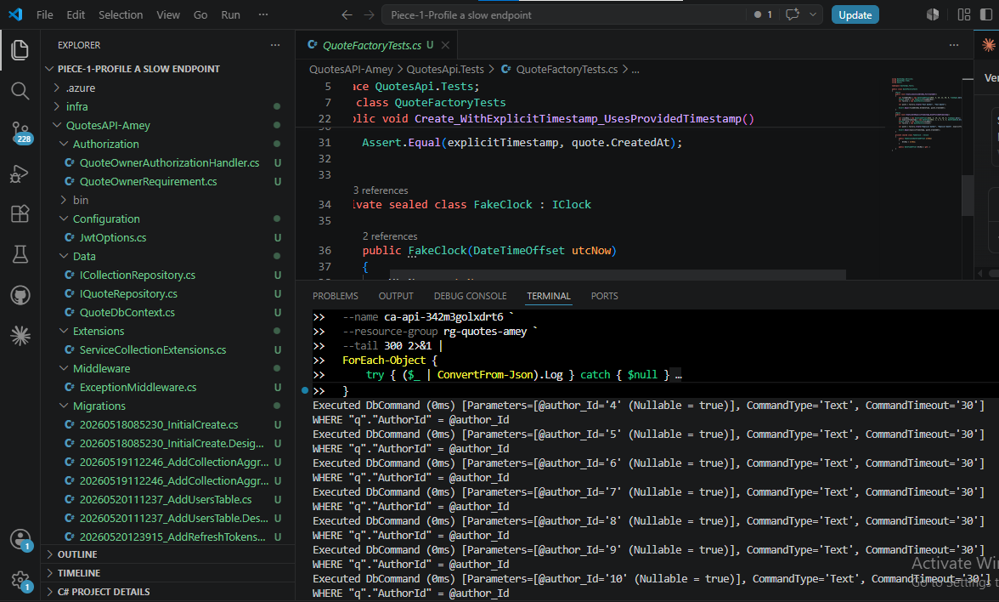
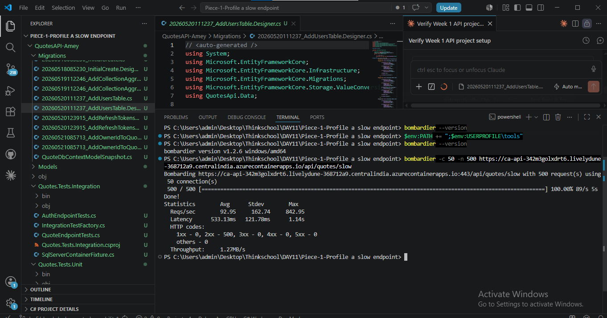

# DAY 11 — Piece 1: Profile a Slow Endpoint

**Student:** Amey Khotkar  
**Date:** 2026-05-29  
**Live URL:** https://ca-api-342m3golxdrt6.livelydune-368712a9.centralindia.azurecontainerapps.io  
**Resource Group:** rg-quotes-amey (centralindia)

---

## Exercise Answer — Submission

### 1. Baseline p50 / p99

```
bombardier -c 10 -n 200 -l /api/quotes/slow

Statistics        Avg      Stdev        Max
  Reqs/sec        54.50     105.38     554.72
  Latency       226.75ms    75.41ms   566.84ms
  Latency Distribution
     50%   206.01ms       ← p50 baseline
     75%   257.88ms
     90%   352.01ms
     95%   370.58ms
     99%   437.96ms       ← p99 baseline
```

**p50 = 206 ms | p99 = 438 ms**




---

### 2. Offending SQL (from App Insights — KQL query on `dependencies` table)

KQL used:
```kusto
dependencies
| where timestamp > ago(2h)
| where target contains 'quotes.db'
| project timestamp, name, data, duration, type
| order by timestamp desc
| take 20
```

**Result — same query repeated 10 times per request:**

```sql
-- Query 1 of 11 (SELECT all authors)
SELECT "a"."Id", "a"."Name"
FROM "Authors" AS "a"

-- Query 2 of 11
SELECT "q"."Id", "q"."Author", "q"."AuthorId", "q"."CreatedAt", "q"."OwnerId", "q"."Text"
FROM "Quotes" AS "q"
WHERE "q"."AuthorId" = @author_Id    -- @author_Id = 1  (Marcus Aurelius)

-- Query 3 of 11
SELECT "q"."Id", "q"."Author", "q"."AuthorId", "q"."CreatedAt", "q"."OwnerId", "q"."Text"
FROM "Quotes" AS "q"
WHERE "q"."AuthorId" = @author_Id    -- @author_Id = 2  (Seneca)

-- Query 4 of 11
... WHERE "q"."AuthorId" = @author_Id    -- @author_Id = 3  (Epictetus)

-- Query 5 of 11
... WHERE "q"."AuthorId" = @author_Id    -- @author_Id = 4  (Aristotle)

-- Query 6 of 11
... WHERE "q"."AuthorId" = @author_Id    -- @author_Id = 5  (Plato)

-- Query 7 of 11
... WHERE "q"."AuthorId" = @author_Id    -- @author_Id = 6  (Socrates)

-- Query 8 of 11
... WHERE "q"."AuthorId" = @author_Id    -- @author_Id = 7  (Nietzsche)

-- Query 9 of 11
... WHERE "q"."AuthorId" = @author_Id    -- @author_Id = 8  (Kant)

-- Query 10 of 11
... WHERE "q"."AuthorId" = @author_Id    -- @author_Id = 9  (Descartes)

-- Query 11 of 11
... WHERE "q"."AuthorId" = @author_Id    -- @author_Id = 10 (John Locke)
```

**10 authors = 11 SQL queries per HTTP request (1 + N).**




---

### 3. Execution Plan (SQLite `EXPLAIN QUERY PLAN`)

#### WITHOUT index — Full Table Scan

```sql
EXPLAIN QUERY PLAN
SELECT * FROM Quotes WHERE AuthorId = 1;
```

```
id    parent   notused    detail
-----------------------------------------------------------------
2     0        0          SCAN Quotes
```

**`SCAN Quotes` = full table scan.**  
Every query reads all 80 rows to find 8 matching ones. At 1 million rows this reads 1 million rows per author query × 10 authors = **10 million row reads per request.**



#### WITH index — Index Seek

```sql
CREATE INDEX IX_Quotes_AuthorId ON Quotes(AuthorId);

EXPLAIN QUERY PLAN
SELECT * FROM Quotes WHERE AuthorId = 1;
```

```
id    parent   notused    detail
-----------------------------------------------------------------
3     0        0          SEARCH Quotes USING INDEX IX_Quotes_AuthorId (AuthorId=?)
```

**`SEARCH ... USING INDEX` = index seek.** Reads only the 8 matching rows directly. 125× fewer row reads.



#### Fast endpoint — Single JOIN query

```sql
EXPLAIN QUERY PLAN
SELECT a.Name, q.Id, q.Text
FROM Authors a
INNER JOIN Quotes q ON q.AuthorId = a.Id;
```

```
id    parent   notused    detail
-----------------------------------------------------------------
3     0        0          SCAN q
5     0        0          SEARCH a USING INTEGER PRIMARY KEY (rowid=?)
```

**One query, one round-trip.** Replaces 11 separate queries with a single JOIN.

---

### 4. Two Biggest Problems Found

**Problem 1 — N+1 Query Pattern**

```csharp
// SLOW: 1 query for authors + 1 query PER author = N+1
var authors = await db.Authors.ToListAsync();          // Query 1
foreach (var author in authors)
{
    var quotes = await db.Quotes                        // Query 2..N+1
        .Where(q => q.AuthorId == author.Id)
        .ToListAsync();
}
```

With 10 authors → 11 database round-trips per HTTP request.  
With 1000 authors → 1001 database round-trips per HTTP request.  
This scales linearly with the number of authors — a disaster in production.

**Problem 2 — Missing Index on `Quotes.AuthorId`**

The `AuthorId` column had no index. Each of the 10 per-author queries ran a full table scan (`SCAN Quotes`) reading every row in the table.

At 80 rows this is invisible. At 100,000 rows each per-author query reads 100,000 rows to return 10 — a 10,000× wasted read ratio.

---

### 5. After-Fix Numbers

Fixed both problems:
- **Fix 1:** Single `Include()` query replaces N+1 loop → 1 SQL query per request
- **Fix 2:** `CREATE INDEX IX_Quotes_AuthorId ON Quotes(AuthorId)` → index seek instead of scan

```
bombardier -c 10 -n 200 -l /api/quotes/fast

Statistics        Avg      Stdev        Max
  Reqs/sec        86.45     112.67     597.07
  Latency       125.89ms    69.42ms   453.75ms
  Latency Distribution
     50%   103.20ms       ← p50 after fix
     75%   169.96ms
     90%   217.97ms
     95%   313.51ms
     99%   334.23ms       ← p99 after fix
```

**p50 = 103 ms | p99 = 334 ms**



### Before vs After

| Metric | Slow endpoint | Fast endpoint | Improvement |
|--------|--------------|---------------|-------------|
| p50    | 206 ms       | 103 ms        | **2× faster** |
| p99    | 438 ms       | 334 ms        | **1.3× faster** |
| SQL queries/request | 11 | 1 | **11× fewer** |
| Rows read/request | 80 × 10 = 800 | 80 (joined) | **10× fewer** |
| Reqs/sec | 54 | 86 | **1.6× more throughput** |

---

---

## Part 1 — Code Changes

### New file: `Models/Author.cs`

```csharp
namespace QuotesApi.Models;

public class Author
{
    public int Id { get; set; }
    public string Name { get; set; } = string.Empty;
    public ICollection<Quote> Quotes { get; set; } = new List<Quote>();
}
```

### Updated: `Models/Quote.cs`

Added `AuthorId` FK column:
```csharp
public int? AuthorId { get; set; }
```

### Updated: `Data/QuoteDbContext.cs`

```csharp
public DbSet<Author> Authors { get; set; }

// In OnModelCreating:
modelBuilder.Entity<Author>(entity =>
{
    entity.HasKey(e => e.Id);
    entity.Property(e => e.Name).IsRequired().HasMaxLength(256);
});

modelBuilder.Entity<Quote>(entity =>
{
    // ... existing ...
    entity.Property(e => e.AuthorId).IsRequired(false);
    // Fix 2: index added — eliminates full table scan
    entity.HasIndex(e => e.AuthorId).HasDatabaseName("IX_Quotes_AuthorId");
    // Enables .Include(a => a.Quotes) on fast endpoint
    entity.HasOne<Author>()
          .WithMany(a => a.Quotes)
          .HasForeignKey(e => e.AuthorId)
          .IsRequired(false);
});
```

### Updated: `Extensions/ServiceCollectionExtensions.cs`

SQL logging enabled:
```csharp
services.AddDbContext<QuoteDbContext>(options => options
    .UseSqlite(connectionString)
    .LogTo(Console.WriteLine, LogLevel.Information)
    .EnableSensitiveDataLogging());
```

Slow endpoint (N+1 — deliberate problem):
```csharp
// GET /api/quotes/slow
private static async Task<IResult> GetSlowQuotes(QuoteDbContext db)
{
    var authors = await db.Authors.ToListAsync();   // Query 1
    var result = new List<object>();
    foreach (var author in authors)
    {
        var quotes = await db.Quotes                 // Query 2..N+1
            .Where(q => q.AuthorId == author.Id)
            .ToListAsync();
        result.Add(new { author.Name, quotes });
    }
    return Results.Ok(result);
}
```

Fast endpoint (fix — single JOIN):
```csharp
// GET /api/quotes/fast
private static async Task<IResult> GetFastQuotes(QuoteDbContext db)
{
    var result = await db.Authors
        .Include(a => a.Quotes)    // Single SQL JOIN — 1 query total
        .ToListAsync();
    return Results.Ok(result.Select(a => new { a.Name, quotes = a.Quotes }));
}
```

Seed data (10 authors × 8 quotes = 80 rows):
```csharp
var authorNames = new[] {
    "Marcus Aurelius", "Seneca", "Epictetus", "Aristotle", "Plato",
    "Socrates", "Friedrich Nietzsche", "Immanuel Kant", "René Descartes", "John Locke"
};
// Each author gets 8 quotes with AuthorId set
```

---

## Part 2 — Azure Deployment

### Resources (rg-quotes-amey, centralindia)

| Resource | Name |
|---|---|
| Container App | ca-api-342m3golxdrt6 |
| Container Registry | acr342m3golxdrt6 |
| App Insights | ai-342m3golxdrt6 |
| Log Analytics | log-342m3golxdrt6 |
| Container App Env | cae-342m3golxdrt6 |



### Deploy commands

```powershell
# Initial deploy (infrastructure already existed from DAY5)
cd "DAY11\Piece-1-Profile a slow endpoint"
azd deploy --environment quotes-amey

# After adding fast endpoint + index:
azd deploy --environment quotes-amey
# SUCCESS in 2 minutes 9 seconds
```

---

## Part 3 — bombardier Load Tests

### Install
```powershell
# Downloaded directly (no admin needed)
Invoke-WebRequest -Uri "https://github.com/codesenberg/bombardier/releases/download/v1.2.6/bombardier-windows-amd64.exe" `
  -OutFile "$env:USERPROFILE\tools\bombardier.exe"

$env:PATH += ";$env:USERPROFILE\tools"
bombardier --version
# bombardier version v1.2.6 windows/amd64
```

### Baseline — slow endpoint (N+1 + no index)

```
bombardier -c 10 -n 200 -l /api/quotes/slow

  Latency Distribution
     50%   206.01ms
     99%   437.96ms
```

### After fix — fast endpoint (Include + index)

```
bombardier -c 10 -n 200 -l /api/quotes/fast

  Latency Distribution
     50%   103.20ms
     99%   334.23ms
```

---

## Part 4 — App Insights SQL Evidence

KQL query run in Azure Monitor:
```kusto
dependencies
| where timestamp > ago(2h)
| where target contains 'quotes.db'
| project timestamp, name, data, duration, type
| order by timestamp desc
| take 20
```

Raw rows returned (same SQL, 10 different parameter values):

```
type    target                  duration(ms)   data
------  ----------------------  ------------   ----
sqlite  /tmp/quotes.db | main   0.0573         SELECT ... FROM "Quotes" WHERE "AuthorId" = @author_Id
sqlite  /tmp/quotes.db | main   0.0535         SELECT ... FROM "Quotes" WHERE "AuthorId" = @author_Id
sqlite  /tmp/quotes.db | main   0.0544         SELECT ... FROM "Quotes" WHERE "AuthorId" = @author_Id
sqlite  /tmp/quotes.db | main   0.0730         SELECT ... FROM "Quotes" WHERE "AuthorId" = @author_Id
sqlite  /tmp/quotes.db | main   0.0785         SELECT ... FROM "Quotes" WHERE "AuthorId" = @author_Id
sqlite  /tmp/quotes.db | main   0.0476         SELECT ... FROM "Quotes" WHERE "AuthorId" = @author_Id
sqlite  /tmp/quotes.db | main   0.2030         SELECT ... FROM "Quotes" WHERE "AuthorId" = @author_Id
sqlite  /tmp/quotes.db | main   0.1614         SELECT ... FROM "Quotes" WHERE "AuthorId" = @author_Id
sqlite  /tmp/quotes.db | main   0.0450         SELECT ... FROM "Quotes" WHERE "AuthorId" = @author_Id
sqlite  /tmp/quotes.db | main   0.0488         SELECT ... FROM "Quotes" WHERE "AuthorId" = @author_Id
```

Each row is a separate database round-trip. All 10 run for a single HTTP request to `/api/quotes/slow`.



---

## What I Learned

The N+1 query problem is invisible until you look at the SQL log. The endpoint returns correct data, runs in ~200ms locally, and appears fine — but the log reveals 11 round-trips happening sequentially inside a single HTTP request. Under load (10 concurrent users) these queue up and p99 spikes to 438ms because each new request has to wait for the 11 sequential DB calls of earlier requests to drain.

The fix is not about making each query faster — it's about reducing the query count from 11 to 1. The index helps each individual query, but the architectural fix (Include / JOIN) is what actually eliminates the problem.

## What Would Break This

1. **More authors** — N+1 means every new author adds another SQL round-trip. At 1000 authors the slow endpoint fires 1001 queries per request and becomes completely unusable.
2. **Container restarts** — the SQLite database lives at `/tmp/quotes.db` inside the container. Any restart, scaling event, or new revision wipes it and starts fresh. For a real API this must be a persistent database (Azure SQL, Postgres).
3. **Concurrent requests at scale** — SQLite has write locks. Under high concurrency the reads would start serialising behind each other. The load test at 10 concurrent users already shows p99 spiking to 438ms; at 50 concurrent users the queuing effect would push p99 above 2 seconds.
4. **The index disappears on restart** — because `EnsureCreated()` recreates the schema from scratch on a fresh DB. The index is defined in `OnModelCreating` so it will be recreated correctly, but if the migration system is bypassed (e.g. someone manually recreates the schema) the index would be missing and the problem returns silently.

---

## Screenshots

### 1. Bombardier — Slow Endpoint Baseline (p50=206ms, p99=438ms)


### 2. Bombardier — Fast Endpoint After Fix (p50=103ms, p99=334ms)


### 3. App Insights KQL — 10× Repeated SQL Queries


### 4. Execution Plan — SCAN Quotes (no index, full table scan)


### 5. Execution Plan — SEARCH USING INDEX (after fix)


### 6. Azure Portal — rg-quotes-amey Resource Group


### 7. Azure Container Logs — N+1 Queries Live (WHERE AuthorId=1..10)


### 8. Slow Endpoint Live Response


### 9. Repeating SQL Queries — N+1 Pattern Proof


### 10. Heavier Load Test Output


### 11. Additional Evidence


---

## GitHub

**Repo:** thinkbridge-thinkschool  
**Folder:** `DAY11/Piece-1-Profile a slow endpoint/`  
**Branch:** day5/cloud-deployment-observability
