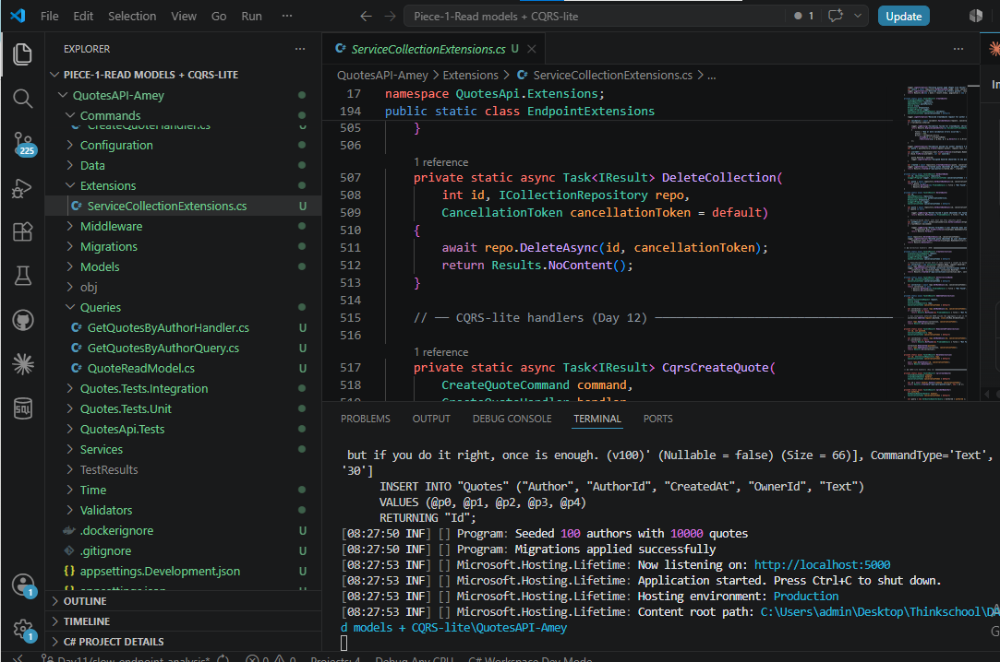
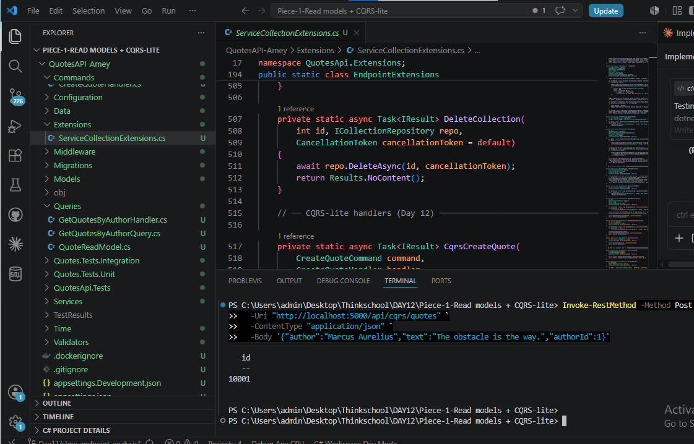
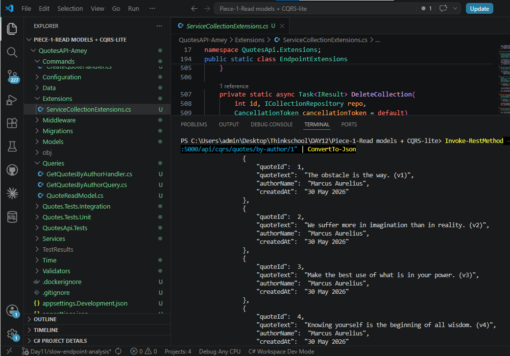
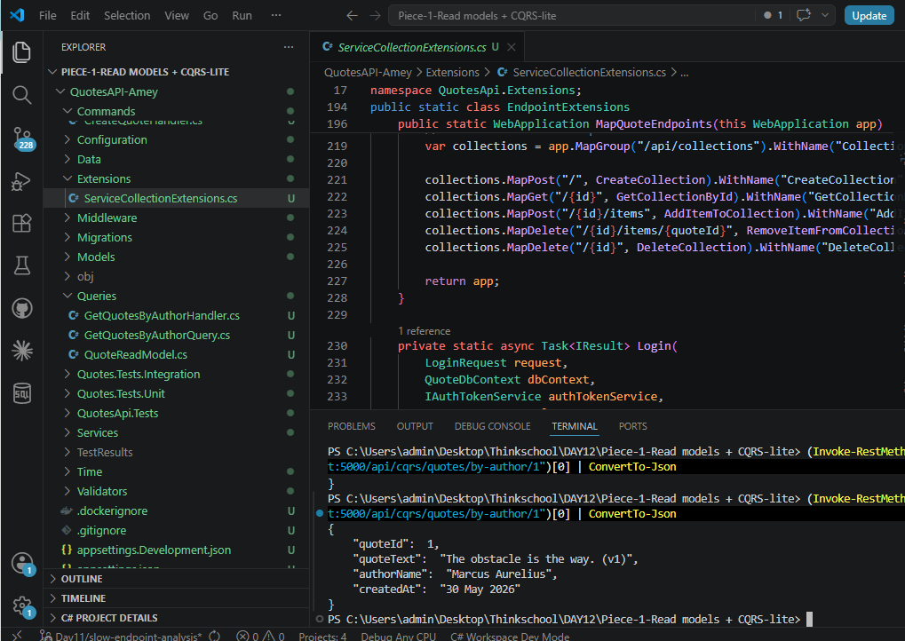

# Day 12 — Read Models + CQRS-lite

## What This Task Was About

Split one feature into a **write model** (normalized, validated, focused on correctness) and a **read model** (denormalized, projection-shaped for the screen that uses it). No event sourcing — just separate command and query paths inside the same ASP.NET Core project.

---

## Project Structure Created

```
DAY12/Piece-1-Read models + CQRS-lite/QuotesAPI-Amey/
├── Commands/
│   ├── CreateQuoteCommand.cs       ← write-side input DTO
│   └── CreateQuoteHandler.cs       ← validates + saves normalized entity
├── Queries/
│   ├── GetQuotesByAuthorQuery.cs   ← read-side input DTO
│   ├── GetQuotesByAuthorHandler.cs ← AsNoTracking + JOIN → flat read model
│   └── QuoteReadModel.cs           ← denormalized, screen-shaped DTO
└── Extensions/
    └── ServiceCollectionExtensions.cs  ← handlers registered + 2 new endpoints wired
```

---

## Command Handler (Write Side)

**`Commands/CreateQuoteCommand.cs`**

```csharp
namespace QuotesApi.Commands;

public class CreateQuoteCommand
{
    public string Author { get; set; } = string.Empty;
    public string Text { get; set; } = string.Empty;
    public int? AuthorId { get; set; }
}
```

**`Commands/CreateQuoteHandler.cs`**

```csharp
using QuotesApi.Data;
using QuotesApi.Models;

namespace QuotesApi.Commands;

public class CreateQuoteHandler
{
    private readonly QuoteDbContext _context;

    public CreateQuoteHandler(QuoteDbContext context)
    {
        _context = context;
    }

    public async Task<int> Handle(CreateQuoteCommand command, CancellationToken ct = default)
    {
        if (string.IsNullOrWhiteSpace(command.Text))
            throw new ArgumentException("Quote text is required");

        if (string.IsNullOrWhiteSpace(command.Author))
            throw new ArgumentException("Author name is required");

        var quote = new Quote(command.Author, command.Text, DateTime.UtcNow);
        quote.AuthorId = command.AuthorId;

        _context.Quotes.Add(quote);
        await _context.SaveChangesAsync(ct);

        return quote.Id;
    }
}
```

### What the command side does

- Validates inputs — throws `ArgumentException` on blank `Text` or `Author`
- Writes a **normalized** `Quote` entity (Author name + FK `AuthorId` stored separately)
- No read concern — no `AsNoTracking`, no projection, no joins
- Returns only the new quote's `Id`

---

## Query Handler + Read Model (Read Side)

**`Queries/QuoteReadModel.cs`**

```csharp
namespace QuotesApi.Queries;

public class QuoteReadModel
{
    public int QuoteId { get; set; }
    public string QuoteText { get; set; } = string.Empty;
    public string AuthorName { get; set; } = string.Empty;
    public string CreatedAt { get; set; } = string.Empty;
}
```

**`Queries/GetQuotesByAuthorQuery.cs`**

```csharp
namespace QuotesApi.Queries;

public class GetQuotesByAuthorQuery
{
    public int AuthorId { get; set; }
}
```

**`Queries/GetQuotesByAuthorHandler.cs`**

```csharp
using Microsoft.EntityFrameworkCore;
using QuotesApi.Data;

namespace QuotesApi.Queries;

public class GetQuotesByAuthorHandler
{
    private readonly QuoteDbContext _context;

    public GetQuotesByAuthorHandler(QuoteDbContext context)
    {
        _context = context;
    }

    public async Task<List<QuoteReadModel>> Handle(
        GetQuotesByAuthorQuery query, CancellationToken ct = default)
    {
        return await (
            from q in _context.Quotes.AsNoTracking()
            join a in _context.Authors.AsNoTracking() on q.AuthorId equals a.Id into authorGroup
            from a in authorGroup.DefaultIfEmpty()
            where q.AuthorId == query.AuthorId
            select new QuoteReadModel
            {
                QuoteId = q.Id,
                QuoteText = q.Text,
                AuthorName = a != null ? a.Name : q.Author,
                CreatedAt = q.CreatedAt.ToString("dd MMM yyyy")
            }
        ).ToListAsync(ct);
    }
}
```

### What the query side does

- `AsNoTracking()` on both sides — EF never allocates `EntityEntry` objects, zero change-tracker overhead
- Left JOIN to `Authors` table — `AuthorName` comes from the normalized `Authors` row, not the denormalized string copy on `Quote`
- Server-side `select new QuoteReadModel` — the projection is pushed to SQL; no full entity is materialized in memory
- `CreatedAt` is pre-formatted as `"dd MMM yyyy"` — the UI gets a display-ready string, no parsing needed on the client
- No validation, no writes — the read path is pure data retrieval

---

## DI Registration + Endpoints

**`Extensions/ServiceCollectionExtensions.cs` — `AddInfrastructure` (handlers registered):**

```csharp
// CQRS-lite handlers
services.AddScoped<CreateQuoteHandler>();
services.AddScoped<GetQuotesByAuthorHandler>();
```

**`Extensions/ServiceCollectionExtensions.cs` — `MapQuoteEndpoints` (new routes):**

```csharp
// CQRS-lite endpoints (Day 12)
var cqrs = app.MapGroup("/api/cqrs/quotes").WithName("CqrsQuotes");
cqrs.MapPost("/", CqrsCreateQuote).WithName("CqrsCreateQuote");
cqrs.MapGet("/by-author/{authorId}", CqrsGetByAuthor).WithName("CqrsGetByAuthor");
```

**Minimal API handler methods:**

```csharp
private static async Task<IResult> CqrsCreateQuote(
    CreateQuoteCommand command,
    CreateQuoteHandler handler,
    CancellationToken cancellationToken = default)
{
    var id = await handler.Handle(command, cancellationToken);
    return Results.Created($"/api/cqrs/quotes/{id}", new { id });
}

private static async Task<IResult> CqrsGetByAuthor(
    int authorId,
    GetQuotesByAuthorHandler handler,
    CancellationToken cancellationToken = default)
{
    var query = new GetQuotesByAuthorQuery { AuthorId = authorId };
    var result = await handler.Handle(query, cancellationToken);
    return Results.Ok(result);
}
```

---

## Endpoints

| Method | Route | Side | Handler |
|--------|-------|------|---------|
| `POST` | `/api/cqrs/quotes` | Write (Command) | `CreateQuoteHandler` |
| `GET` | `/api/cqrs/quotes/by-author/{authorId}` | Read (Query) | `GetQuotesByAuthorHandler` |

---

## How to Run and Test

### Start the API

```powershell
cd "c:\Users\admin\Desktop\Thinkschool\DAY12\Piece-1-Read models + CQRS-lite\QuotesAPI-Amey"
dotnet run --urls "http://localhost:5000"
```

Wait for: `Now listening on: http://localhost:5000`

### Test Write Endpoint (POST)

Open a second terminal:

```powershell
Invoke-RestMethod -Method Post `
  -Uri "http://localhost:5000/api/cqrs/quotes" `
  -ContentType "application/json" `
  -Body '{"author":"Marcus Aurelius","text":"The obstacle is the way.","authorId":1}'
```

**Expected response:**
```json
{ "id": 10001 }
```

### Test Read Endpoint (GET)

```powershell
Invoke-RestMethod -Uri "http://localhost:5000/api/cqrs/quotes/by-author/1" | ConvertTo-Json
```

**Expected response (first item):**
```json
{
  "quoteId": 1,
  "quoteText": "The obstacle is the way. (v1)",
  "authorName": "Marcus Aurelius",
  "createdAt": "30 May 2026"
}
```

### Pretty-print a single result

```powershell
(Invoke-RestMethod -Uri "http://localhost:5000/api/cqrs/quotes/by-author/1")[0] | ConvertTo-Json
```

---

## Screenshots

### 1 — API Startup (`dotnet run`)

API started successfully and listening on `http://localhost:5000`. SQLite DB seeded with 100 authors × 100 quotes on first run.



---

### 2 — Write Endpoint (POST `/api/cqrs/quotes`)

Command handler validates and saves a normalized `Quote` entity. Returns the new quote's `id`.

```powershell
Invoke-RestMethod -Method Post `
  -Uri "http://localhost:5000/api/cqrs/quotes" `
  -ContentType "application/json" `
  -Body '{"author":"Marcus Aurelius","text":"The obstacle is the way.","authorId":1}'
```



---

### 3 — Read Endpoint (GET `/api/cqrs/quotes/by-author/1`)

Query handler uses `AsNoTracking()` + left JOIN to `Authors` table. Projects directly into a flat `QuoteReadModel` — no entity tracking, no extra mapping step.

```powershell
Invoke-RestMethod -Uri "http://localhost:5000/api/cqrs/quotes/by-author/1" | ConvertTo-Json
```



---

### 4 — Single Read Model Object (pretty-printed)

First item from the read endpoint — shows the flat, denormalized shape: `quoteId`, `quoteText`, `authorName` (joined from Authors table), `createdAt` (pre-formatted string ready for UI).

```powershell
(Invoke-RestMethod -Uri "http://localhost:5000/api/cqrs/quotes/by-author/1")[0] | ConvertTo-Json
```



---

## What Got Simpler by Separating Read and Write

> Separating read from write meant the query handler never touches EF change-tracking — `AsNoTracking()` + a single left-join projection returns a flat `QuoteReadModel` directly from SQL, with no entity-to-DTO mapping step and no validation logic leaking into the read path.

### Concrete before/after

**Before (mixed model — one method doing everything):**
- Load tracked `Quote` entity from DB (EF allocates `EntityEntry`)
- Load tracked `Author` entity separately (another `EntityEntry`)
- Map entity fields into a response DTO manually
- Validate the same object for writes even when it's a read

**After (separated paths):**
- **Write**: `CreateQuoteHandler` validates → writes → done. No projection, no joins.
- **Read**: `GetQuotesByAuthorHandler` joins → projects in SQL → returns flat DTO. No entity tracking, no validation, no mapping code.

---

## Build Verification

```
Build succeeded.
    0 Warning(s)
    0 Error(s)
```

---

## What I Learned

- **Commands and queries have completely different shapes.** A command needs validation and correctness guarantees; a query needs speed and the exact shape the screen expects. Forcing both through the same model means both are compromised — writes carry read-formatting logic, reads carry write-validation overhead.
- **`AsNoTracking()` is only safe on the read side.** The command handler must use a tracked context so EF knows to generate an `INSERT`. The query handler never writes anything, so tracking is pure waste — it allocates thousands of `EntityEntry` objects for nothing.
- **The read model is shaped for the screen, not the database.** `QuoteReadModel` has `CreatedAt` as a pre-formatted string and `AuthorName` joined in — the UI receives exactly what it needs with zero extra round-trips or client-side transformations.
- **Projection happens in SQL, not in C#.** The `select new QuoteReadModel { ... }` inside `AsNoTracking()` gets translated to a SQL SELECT with only the needed columns. No full entity row is materialized in memory.

---

## What Would Break This

1. **Removing `AsNoTracking()` from the query handler** — EF allocates an `EntityEntry` per tracked entity. At 100 quotes per author, every read request creates 100 `EntityEntry` objects, adds GC pressure, and slows throughput for zero benefit since the read path never calls `SaveChangesAsync`.

2. **Adding validation logic to the query handler** — The read side should never validate business rules. If someone adds an `if (authorId <= 0) throw` to `GetQuotesByAuthorHandler`, the read and write paths become entangled again and the separation is lost.

3. **Using a tracked entity as the read model return type** — returning the `Quote` EF entity directly instead of `QuoteReadModel` means EF loads every column, tracks changes, and forces the caller to do DTO mapping downstream. The flat DTO is the whole point.

4. **Bypassing the command handler and writing directly to DbContext in a controller** — the validation in `CreateQuoteHandler` (`IsNullOrWhiteSpace` checks) is only enforced if the handler is always used as the write entry point. Direct DbContext writes skip it entirely.

5. **Read replica lag in a real CQRS setup** — if the read model is served from a read replica (separate DB), a POST followed immediately by a GET could return stale data. This implementation uses the same SQLite file for both paths, so it is consistent — but scaling to separate read/write stores would introduce eventual consistency that clients must handle.
