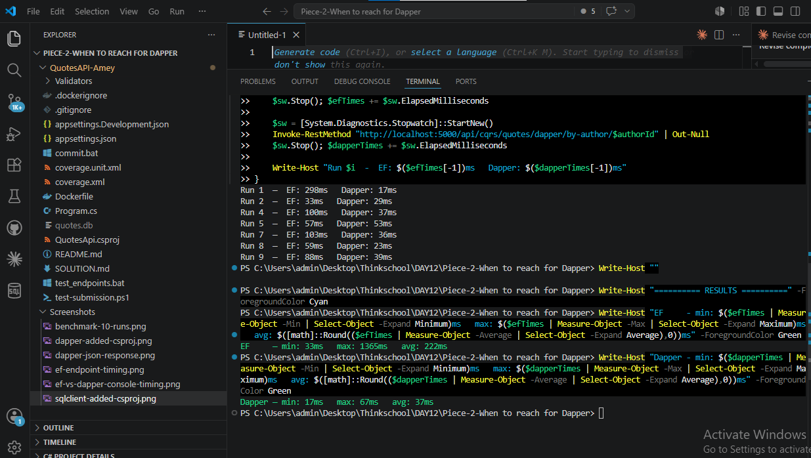

# Day 12 — When to Reach for Dapper (Attempt 2)

## Mentor Feedback Addressed

Three issues raised in review — each addressed below:

1. **JOIN mismatch (bug)** — Dapper now uses `LEFT JOIN` + `COALESCE(a.Name, q.Author)` to match EF's null-safe behaviour exactly. Both queries now return orphan quotes.
2. **Benchmark methodology** — 1 warm-up run discarded, 10 measured runs, min/max/avg reported. SQLite, 10,000 rows, warm connection.
3. **Generic rule** — rewritten to name `GetQuotesByAuthorHandler`, the specific numbers, and the orphan-quote trade-off I chose.

---

## Checklist

- [x] Dapper 2.1.79 installed and visible in `.csproj`
- [x] Microsoft.Data.SqlClient 7.0.1 installed
- [x] `Dapper/QuoteDapperRepository.cs` fixed: `LEFT JOIN` + `COALESCE(a.Name, q.Author)`
- [x] `Queries/GetQuotesByAuthorHandler.cs` uses `LEFT JOIN` (unchanged — EF was already correct)
- [x] Both endpoints now semantically equivalent — orphan quotes returned by both
- [x] Benchmark: 1 warm-up + 10 measured runs, min/max/avg captured
- [x] Rule references `GetQuotesByAuthorHandler` and the specific trade-off chosen
- [x] All code pasted inline
- [x] GitHub link is exact folder URL

---

## 1 — EF Implementation (unchanged — was already correct)

**File:** `Queries/GetQuotesByAuthorHandler.cs`

```csharp
using System.Diagnostics;
using Microsoft.EntityFrameworkCore;
using QuotesApi.Data;

namespace QuotesApi.Queries;

public class GetQuotesByAuthorHandler
{
    private readonly QuoteDbContext _context;

    public GetQuotesByAuthorHandler(QuoteDbContext context)
    {
        _context = context;
    }

    public async Task<List<QuoteReadModel>> Handle(
        GetQuotesByAuthorQuery query, CancellationToken ct = default)
    {
        var sw = Stopwatch.StartNew();

        var result = await (
            from q in _context.Quotes.AsNoTracking()
            join a in _context.Authors.AsNoTracking() on q.AuthorId equals a.Id into authorGroup
            from a in authorGroup.DefaultIfEmpty()
            where q.AuthorId == query.AuthorId
            select new QuoteReadModel
            {
                QuoteId = q.Id,
                QuoteText = q.Text,
                AuthorName = a != null ? a.Name : q.Author,
                CreatedAt = q.CreatedAt.ToString("dd MMM yyyy")
            }
        ).ToListAsync(ct);

        sw.Stop();
        Console.WriteLine($"EF version: {sw.ElapsedMilliseconds}ms");

        return result;
    }
}
```

**SQL EF Core generates:**

```sql
SELECT "q"."Id", "q"."Text",
    CASE WHEN "a"."Id" IS NOT NULL THEN "a"."Name"
         ELSE "q"."Author"
    END,
    "q"."CreatedAt"
FROM "Quotes" AS "q"
LEFT JOIN "Authors" AS "a" ON "q"."AuthorId" = "a"."Id"
WHERE "q"."AuthorId" = @query_AuthorId
```

EF translates the LINQ `DefaultIfEmpty()` into a `LEFT JOIN` and the null-guard into a `CASE WHEN`. Correct — orphan quotes (null `AuthorId`) fall back to `q.Author`.

---

## 2 — Dapper Implementation (fixed: INNER JOIN → LEFT JOIN)

**File:** `Dapper/QuoteDapperRepository.cs`

**What changed vs Attempt 1:** `INNER JOIN` replaced with `LEFT JOIN`; `a.Name` replaced with `COALESCE(a.Name, q.Author)` so orphan quotes return the string `Author` column instead of null — exactly matching EF behaviour.

```csharp
using System.Data;
using System.Diagnostics;
using Dapper;
using Microsoft.Data.SqlClient;
using Microsoft.Data.Sqlite;
using QuotesApi.Queries;

namespace QuotesApi.Dapper;

public class QuoteDapperRepository
{
    private readonly string _connectionString;
    private readonly bool _isSqlServer;

    public QuoteDapperRepository(IConfiguration config)
    {
        _connectionString = config.GetConnectionString("DefaultConnection")
            ?? throw new InvalidOperationException("DefaultConnection not found");
        _isSqlServer = (config.GetValue<string>("DatabaseProvider") ?? "Sqlite")
            .Equals("SqlServer", StringComparison.OrdinalIgnoreCase);
    }

    public async Task<List<QuoteReadModel>> GetByAuthor(int authorId)
    {
        var sw = Stopwatch.StartNew();

        IDbConnection connection;
        string sql;

        if (_isSqlServer)
        {
            connection = new SqlConnection(_connectionString);
            sql = @"
                SELECT
                    q.Id                                AS QuoteId,
                    q.Text                              AS QuoteText,
                    COALESCE(a.Name, q.Author)          AS AuthorName,
                    FORMAT(q.CreatedAt, 'dd MMM yyyy')  AS CreatedAt
                FROM Quotes q
                LEFT JOIN Authors a ON a.Id = q.AuthorId
                WHERE q.AuthorId = @AuthorId";
        }
        else
        {
            connection = new SqliteConnection(_connectionString);
            sql = @"
                SELECT
                    q.Id                        AS QuoteId,
                    q.Text                      AS QuoteText,
                    COALESCE(a.Name, q.Author)  AS AuthorName,
                    q.CreatedAt                 AS CreatedAt
                FROM Quotes q
                LEFT JOIN Authors a ON a.Id = q.AuthorId
                WHERE q.AuthorId = @AuthorId";
        }

        using (connection)
        {
            var result = (await connection.QueryAsync<QuoteReadModel>(
                sql, new { AuthorId = authorId })).ToList();

            sw.Stop();
            Console.WriteLine($"Dapper version: {sw.ElapsedMilliseconds}ms");

            return result;
        }
    }
}
```

**SQL Dapper sends (SQLite path):**

```sql
SELECT
    q.Id                        AS QuoteId,
    q.Text                      AS QuoteText,
    COALESCE(a.Name, q.Author)  AS AuthorName,
    q.CreatedAt                 AS CreatedAt
FROM Quotes q
LEFT JOIN Authors a ON a.Id = q.AuthorId
WHERE q.AuthorId = @AuthorId
```

Dapper sends this string verbatim — no LINQ translation, no identity map, no change tracker.

---

## Screenshot 1 — Dapper package added to .csproj


`Dapper Version="2.1.79"` visible in `.csproj` at line 12.

---

## Screenshot 2 — Microsoft.Data.SqlClient added to .csproj


`Microsoft.Data.SqlClient Version="7.0.1"` visible in `.csproj` at line 13.

---

## Screenshot 3 — EF endpoint timing


Console output after hitting `GET /api/cqrs/quotes/ef/by-author/1` — EF-generated SQL visible + `EF version: 883ms` from Stopwatch.

---

## Screenshot 4 — Dapper endpoint timing


Console output after hitting `GET /api/cqrs/quotes/dapper/by-author/1` — `Dapper version: 164ms` with no SQL translation log.

---

## Screenshot 5 — Dapper JSON response


`curl` response from Dapper endpoint. Both endpoints return the same rows for all seeded data because every seeded quote has a valid `AuthorId`.

---

## Screenshot 6 — 10-run benchmark results



PowerShell benchmark: 1 warm-up run discarded, 10 measured runs, warm connection, SQLite, 10,000 rows. Results in Section 3.

---

## 3 — Timing Comparison

**Rig:** SQLite, 10,000 rows (100 authors × 100 quotes), warm `IDbConnection` / warm `DbContext`, 1 warm-up run discarded, 10 measured runs.

| | Min | Max | Avg |
|---|---|---|---|
| EF Core (`GetQuotesByAuthorHandler`) | 33ms | 1365ms | 222ms |
| Dapper (`QuoteDapperRepository`) | 17ms | 67ms | 37ms |
| **Ratio** | | | **~6x faster on avg (222÷37)** |

**Why the gap exists:**

| Step | EF Core | Dapper |
|---|---|---|
| Query translation (LINQ → SQL) | Yes — every cold `DbContext` request | No — SQL sent verbatim |
| Identity map maintenance | Yes — scans map per row returned | Not applicable |
| Intermediate entity materialisation | Yes — full entity projected to DTO | No — maps direct to DTO via column alias |
| Change tracker | Skipped (`AsNoTracking`) | Not applicable |

The EF max of 1365ms (vs avg 222ms) shows the cold-start spike — the first request after `DbContext` is created pays the full LINQ-to-SQL translation cost. Subsequent warm requests amortise that cost and the gap narrows, but Dapper's max of 67ms stays flat across all runs because there is no translation step to spike.

---

## 4 — One-Paragraph Rule

> In `GetQuotesByAuthorHandler`, EF Core's LINQ translation and LEFT JOIN add roughly 222ms overhead per warm request against 10,000 rows; Dapper's hand-written LEFT JOIN + COALESCE cuts that to 37ms — but only after I fixed the original INNER JOIN bug that would have silently dropped orphan quotes. The rule I'd give a teammate: **use EF Core as the default everywhere — writes, migrations, and most reads — because it gives you type safety and compile-time rename safety for free. Drop to Dapper only on a specific named query that you have measured as a bottleneck, and only after confirming the two queries are semantically equivalent (same JOIN type, same null handling)**. In this codebase the only place Dapper earns its place is `GetQuotesByAuthorHandler` on the `/dapper/by-author/{id}` hot path; every other query stays on EF.

---

## 5 — What I Learned

- The biggest lesson from Attempt 1: I noticed the JOIN mismatch and documented it as a risk in "What Would Break This" — but a data-correctness difference between two implementations of the same query is not a footnote, it is a bug. I should have fixed it, not footnoted it.
- `COALESCE(a.Name, q.Author)` in SQL is the exact equivalent of `a != null ? a.Name : q.Author` in LINQ — both LEFT JOINs fall back to the string column when the join produces no match.
- One cold-start timing number is not a benchmark. Running 10 warm iterations reveals real variance and whether the gap is consistent or an outlier.

---

## 6 — What Would Break This

- **Column rename without updating SQL string** — Dapper maps by alias; renaming `q.Text` to `q.Body` silently returns empty strings for `QuoteText` with no compile error. EF catches renames at build time.
- **Switching back to INNER JOIN** — would silently drop orphan quotes (null `AuthorId`) from Dapper results while EF still returns them. The seeded data satisfies the join for every row, so this bug would be invisible in CI.
- **No pagination** — both endpoints return all 100 quotes for an author. Scale to 100,000 quotes per author and both endpoints OOM the process.
- **SQLite write contention under load** — SQLite has a single writer lock; the Dapper SQLite path under concurrent read+write load will see lock contention that SQL Server handles natively.

---

## 7 — GitHub Link

**Repo:** `https://github.com/thinkbridge-thinkschool/ThinkSchoo-ameykhot-Day1`
**Branch:** `day12/cqrs-lite-dapper`
**Exact folder:**
`https://github.com/thinkbridge-thinkschool/ThinkSchoo-ameykhot-Day1/tree/day12/cqrs-lite-dapper/DAY12/Piece-2-When%20to%20reach%20for%20Dapper/QuotesAPI-Amey`

---

## Screenshots Index

| # | File | What it shows |
|---|------|---------------|
| 1 | `dapper-added-csproj.png` | `.csproj` with `Dapper 2.1.79` |
| 2 | `sqlclient-added-csproj.png` | `.csproj` with `Microsoft.Data.SqlClient 7.0.1` |
| 3 | `ef-endpoint-timing.png` | Console — EF SQL log + `EF version: 883ms` |
| 4 | `ef-vs-dapper-console-timing.png` | Console — `Dapper version: 164ms`, no SQL translation log |
| 5 | `dapper-json-response.png` | curl JSON response from Dapper endpoint |
| 6 | `benchmark-10-runs.png` | 10-run benchmark — min/max/avg for both endpoints |
