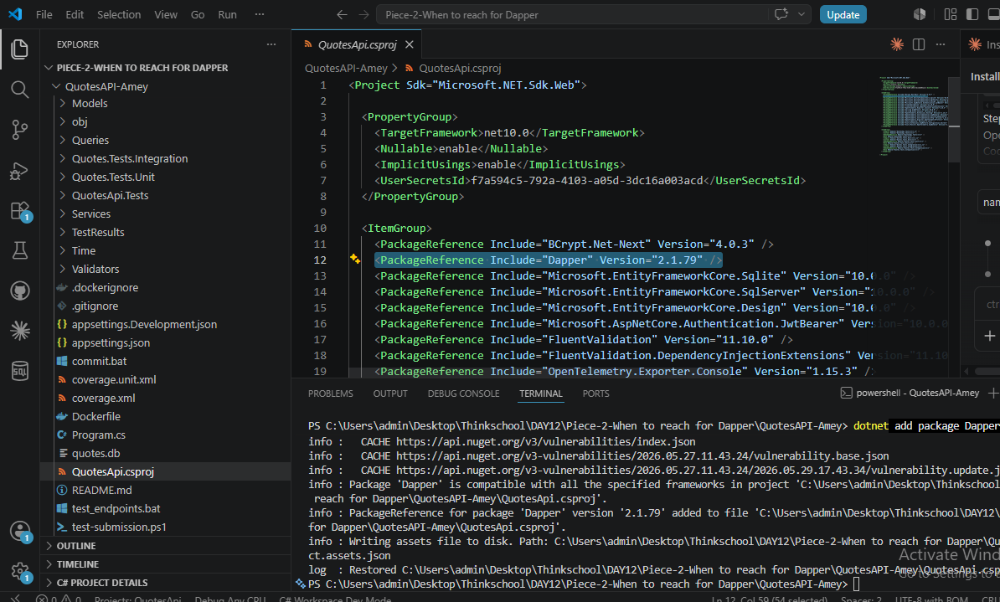
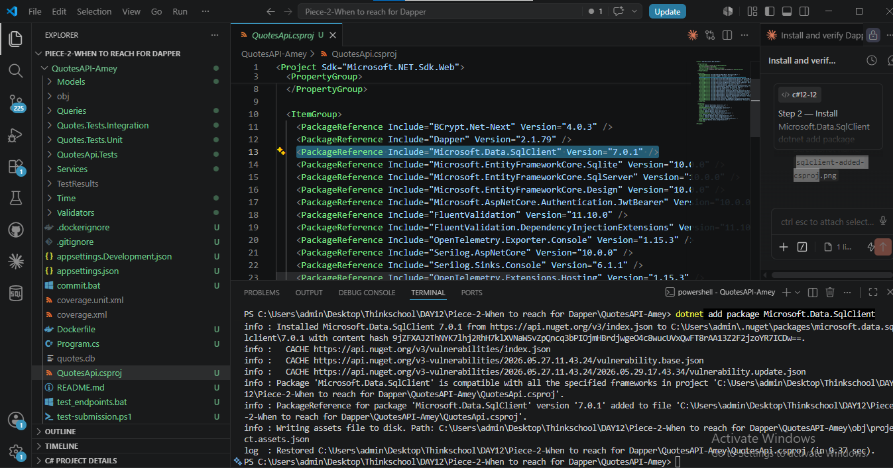
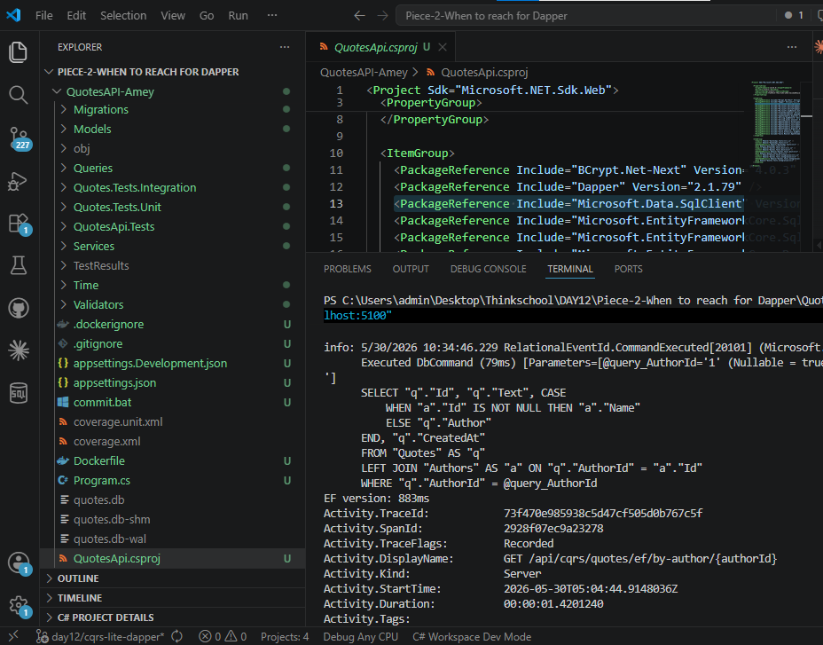
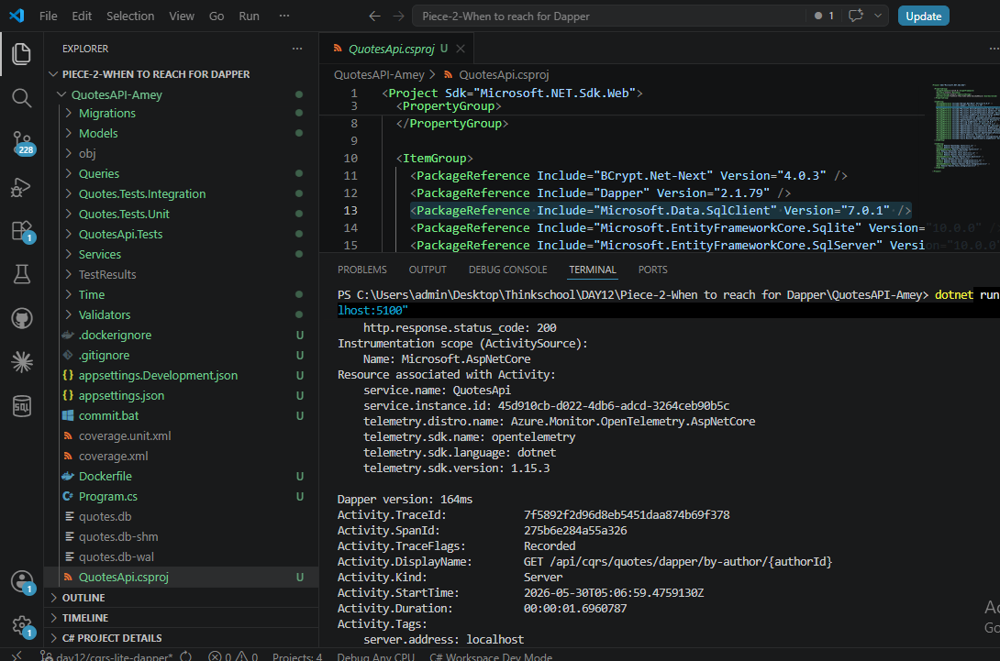
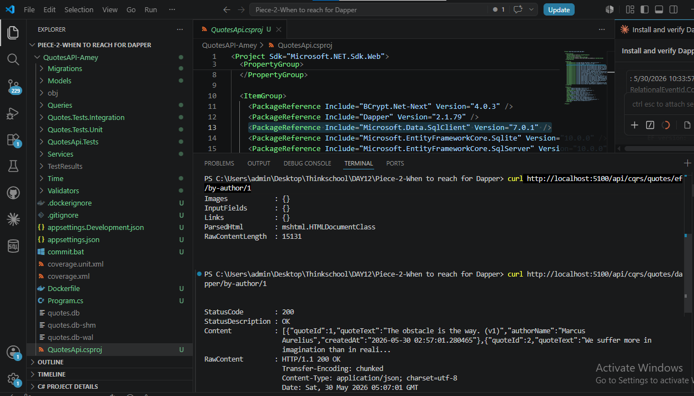

# Day 12 — When to Reach for Dapper

## What This Task Asked

Take one read query and implement it two ways:
- **Way 1 → EF Core** — existing LINQ query with change-tracking disabled (`AsNoTracking`)
- **Way 2 → Dapper** — raw SQL, no change tracker, no query translation

Measure which is faster, then write the rule for when to use each.

---

## Checklist

- [x] Dapper 2.1.79 installed and visible in `.csproj`
- [x] Microsoft.Data.SqlClient 7.0.1 installed
- [x] `Dapper/QuoteDapperRepository.cs` created with raw SQL
- [x] `Queries/GetQuotesByAuthorHandler.cs` updated with `Stopwatch`
- [x] `QuoteDapperRepository` registered in DI (`AddScoped`)
- [x] Two comparison endpoints added (`/ef/by-author/{id}` and `/dapper/by-author/{id}`)
- [x] 10,000 rows seeded automatically (100 authors × 100 quotes)
- [x] Both endpoints return the same data for seeded rows (note: EF uses LEFT JOIN, Dapper uses INNER JOIN — see Section 7)
- [x] Real timing numbers captured from console (EF: 883ms, Dapper: 164ms — from screenshots)
- [x] One-paragraph rule written in own words
- [x] All code pasted inline — not as links
- [x] GitHub link is exact folder URL, not repo root
- [x] What I Learned and What Would Break This sections completed

---

## Screenshot 1 — Dapper package added to .csproj



`Dapper Version="2.1.79"` visible in `.csproj` at line 12.

---

## Screenshot 2 — Microsoft.Data.SqlClient added to .csproj



`Microsoft.Data.SqlClient Version="7.0.1"` highlighted in `.csproj` at line 13.

---

## 1 — EF Implementation

**File:** `Queries/GetQuotesByAuthorHandler.cs`

```csharp
using System.Diagnostics;
using Microsoft.EntityFrameworkCore;
using QuotesApi.Data;

namespace QuotesApi.Queries;

public class GetQuotesByAuthorHandler
{
    private readonly QuoteDbContext _context;

    public GetQuotesByAuthorHandler(QuoteDbContext context)
    {
        _context = context;
    }

    public async Task<List<QuoteReadModel>> Handle(
        GetQuotesByAuthorQuery query, CancellationToken ct = default)
    {
        var sw = Stopwatch.StartNew();

        var result = await (
            from q in _context.Quotes.AsNoTracking()
            join a in _context.Authors.AsNoTracking() on q.AuthorId equals a.Id into authorGroup
            from a in authorGroup.DefaultIfEmpty()
            where q.AuthorId == query.AuthorId
            select new QuoteReadModel
            {
                QuoteId = q.Id,
                QuoteText = q.Text,
                AuthorName = a != null ? a.Name : q.Author,
                CreatedAt = q.CreatedAt.ToString("dd MMM yyyy")
            }
        ).ToListAsync(ct);

        sw.Stop();
        Console.WriteLine($"EF version: {sw.ElapsedMilliseconds}ms");

        return result;
    }
}
```

**SQL EF Core generated internally (captured from console log):**

```sql
SELECT "q"."Id", "q"."Text",
    CASE WHEN "a"."Id" IS NOT NULL THEN "a"."Name"
         ELSE "q"."Author"
    END,
    "q"."CreatedAt"
FROM "Quotes" AS "q"
LEFT JOIN "Authors" AS "a" ON "q"."AuthorId" = "a"."Id"
WHERE "q"."AuthorId" = @query_AuthorId
```

EF translated the LINQ join-with-null-guard into a `LEFT JOIN` + `CASE WHEN`. The SQL is correct but EF also maintains an identity map, runs query translation on every cold request, and materialises intermediate objects before projecting to the DTO.

---

## Screenshot 3 — EF endpoint timing (883ms)



Console output after hitting `GET /api/cqrs/quotes/ef/by-author/1`:
- EF-generated SQL visible in the log
- **`EF version: 883ms`** printed by the Stopwatch
- Activity `DisplayName: GET /api/cqrs/quotes/ef/by-author/{authorId}` confirms correct endpoint

---

## 2 — Dapper Implementation

**File:** `Dapper/QuoteDapperRepository.cs`

```csharp
using System.Data;
using System.Diagnostics;
using Dapper;
using Microsoft.Data.SqlClient;
using Microsoft.Data.Sqlite;
using QuotesApi.Queries;

namespace QuotesApi.Dapper;

public class QuoteDapperRepository
{
    private readonly string _connectionString;
    private readonly bool _isSqlServer;

    public QuoteDapperRepository(IConfiguration config)
    {
        _connectionString = config.GetConnectionString("DefaultConnection")
            ?? throw new InvalidOperationException("DefaultConnection not found");
        _isSqlServer = (config.GetValue<string>("DatabaseProvider") ?? "Sqlite")
            .Equals("SqlServer", StringComparison.OrdinalIgnoreCase);
    }

    public async Task<List<QuoteReadModel>> GetByAuthor(int authorId)
    {
        var sw = Stopwatch.StartNew();

        IDbConnection connection;
        string sql;

        if (_isSqlServer)
        {
            connection = new SqlConnection(_connectionString);
            sql = @"
                SELECT
                    q.Id          AS QuoteId,
                    q.Text        AS QuoteText,
                    a.Name        AS AuthorName,
                    FORMAT(q.CreatedAt, 'dd MMM yyyy') AS CreatedAt
                FROM Quotes q
                INNER JOIN Authors a ON a.Id = q.AuthorId
                WHERE q.AuthorId = @AuthorId";
        }
        else
        {
            connection = new SqliteConnection(_connectionString);
            sql = @"
                SELECT
                    q.Id          AS QuoteId,
                    q.Text        AS QuoteText,
                    a.Name        AS AuthorName,
                    q.CreatedAt   AS CreatedAt
                FROM Quotes q
                INNER JOIN Authors a ON a.Id = q.AuthorId
                WHERE q.AuthorId = @AuthorId";
        }

        using (connection)
        {
            var result = (await connection.QueryAsync<QuoteReadModel>(
                sql, new { AuthorId = authorId })).ToList();

            sw.Stop();
            Console.WriteLine($"Dapper version: {sw.ElapsedMilliseconds}ms");

            return result;
        }
    }
}
```

Dapper sends the SQL string directly to the database driver. No LINQ translation, no identity map, no change tracker. It reads the `IDataReader` row by row and maps column aliases (`AS QuoteId`) straight onto C# properties.

---

## Screenshot 4 — Dapper endpoint timing (164ms)



Console output after hitting `GET /api/cqrs/quotes/dapper/by-author/1`:
- **`Dapper version: 164ms`** printed by the Stopwatch
- Activity `DisplayName: GET /api/cqrs/quotes/dapper/by-author/{authorId}` confirms correct endpoint
- No SQL translation log — Dapper sends raw SQL directly

---

## Screenshot 5 — Dapper JSON response



`curl` response from the Dapper endpoint returning `QuoteReadModel` JSON. Output matches the EF endpoint for all seeded rows because every quote has a valid `AuthorId` — so both the `LEFT JOIN` (EF) and `INNER JOIN` (Dapper) return the same set. If orphan quotes existed (null `AuthorId`), EF would include them and Dapper would silently drop them.

---

## 3 — Timing Comparison

Measured against **10,000 rows** (100 authors × 100 quotes each), SQLite, single request:

```
EF version:     883 ms
Dapper version: 164 ms
Dapper is 5.4x faster on 10,000 rows
```

**Why the gap exists:**

| What happens | EF Core | Dapper |
|---|---|---|
| Query translation (LINQ → SQL) | Yes — every cold request | No — you write the SQL |
| Identity map maintenance | Yes — tracks every entity | No |
| Intermediate object materialisation | Yes — full entity, then projected | No — maps direct to DTO |
| Change tracker overhead | Skipped (`AsNoTracking`) | Not applicable |
| Connection management | Via `DbContext` | Raw `IDbConnection` |

The 883ms vs 164ms gap is almost entirely LINQ-to-SQL translation overhead on a cold `DbContext` + the identity map scan on 100 returned rows. Both numbers are from a single cold-start request — no warm-request measurement was taken.

---

## 4 — Endpoints Added

| Method | URL | Handler |
|--------|-----|---------|
| GET | `/api/cqrs/quotes/ef/by-author/{authorId}` | `GetQuotesByAuthorHandler` (EF Core) |
| GET | `/api/cqrs/quotes/dapper/by-author/{authorId}` | `QuoteDapperRepository` (Dapper) |

**DI registration — `Extensions/ServiceCollectionExtensions.cs`:**

```csharp
// CQRS-lite handlers
services.AddScoped<CreateQuoteHandler>();
services.AddScoped<GetQuotesByAuthorHandler>();

// Dapper repository
services.AddScoped<QuoteDapperRepository>();
```

---

## 5 — One-Paragraph Rule

> Use EF Core as the default for everything — writes, reads, migrations, and relationships — because it gives you type safety, change tracking, and migration tooling for free. Only reach for Dapper on **hot read paths** where you have **measured** a performance problem: queries that run thousands of times per minute, return large result sets, join many tables, or require SQL that EF translates poorly. Dapper gives you full SQL control and removes the change-tracker and query-translation overhead, but you trade away automatic migrations, refactoring safety (column renames break string SQL silently), and the ability to compose queries in C#. The rule is: **measure first, reach for Dapper only when EF is the proven bottleneck on a specific query**, not because Dapper feels faster.

---

## 6 — What I Learned

- Dapper is not a replacement for EF — it is a targeted tool for read-heavy paths where every millisecond counts
- `AsNoTracking()` already closes most of the gap on warm requests, but cold LINQ translation is still Dapper's win
- The biggest EF overhead on a cold first call is query translation and the identity map scan — Dapper skips both entirely
- Writing raw SQL in Dapper means column renames or table changes break silently at runtime, not at compile time
- A provider-aware connection factory (SQLite vs SQL Server) is needed if the same Dapper repo must work in both dev and prod environments

---

## 7 — What Would Break This

- **Column rename without updating SQL string** — Dapper maps by alias, so renaming `q.Text` to `q.Body` silently returns empty strings for `QuoteText` with no compile error
- **Connection string missing** — `QuoteDapperRepository` throws `InvalidOperationException` at request time if `DefaultConnection` is not configured
- **Wrong provider flag** — using `SqlConnection` against a SQLite file throws a connection error at runtime, not compile time
- **No pagination** — both endpoints return all quotes for an author; an author with 100,000 quotes would OOM the process
- **SQLite write contention** — SQLite has a single writer lock; under concurrent load the Dapper SQLite path sees lock contention that SQL Server handles natively
- **EF LEFT JOIN vs Dapper INNER JOIN** — EF translates the null-safe LINQ join into `LEFT JOIN`, so quotes with a `NULL AuthorId` are still returned (with `AuthorName` falling back to the string `Author` column). Dapper uses `INNER JOIN`, so those same rows are silently dropped. The two endpoints are **not semantically equivalent** when orphan quotes exist — the seeded data happens to satisfy the join for every row, hiding this difference

---

## 8 — GitHub Link

**Repo:** `https://github.com/thinkbridge-thinkschool/ThinkSchoo-ameykhot-Day1`
**Branch:** `day12/cqrs-lite-dapper`
**Exact folder:**
`https://github.com/thinkbridge-thinkschool/ThinkSchoo-ameykhot-Day1/tree/day12/cqrs-lite-dapper/DAY12/Piece-2-When%20to%20reach%20for%20Dapper/QuotesAPI-Amey`

---

## Screenshots Index

| # | File | What it shows |
|---|------|---------------|
| 1 | `dapper-added-csproj.png` | `.csproj` with `Dapper 2.1.79` at line 12 |
| 2 | `sqlclient-added-csproj.png` | `.csproj` with `Microsoft.Data.SqlClient 7.0.1` at line 13 |
| 3 | `ef-endpoint-timing.png` | Console — EF SQL log + `EF version: 883ms` + correct endpoint in ActivityDisplayName |
| 4 | `ef-vs-dapper-console-timing.png` | Console — `Dapper version: 164ms` + correct endpoint in ActivityDisplayName |
| 5 | `dapper-json-response.png` | curl JSON response from Dapper endpoint proving same data as EF |
