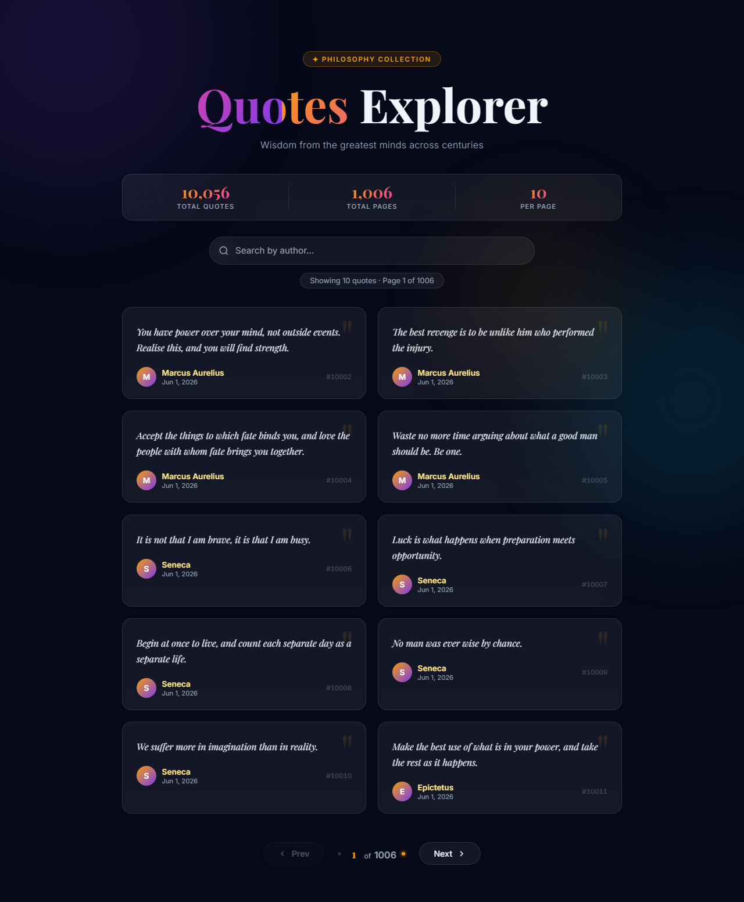
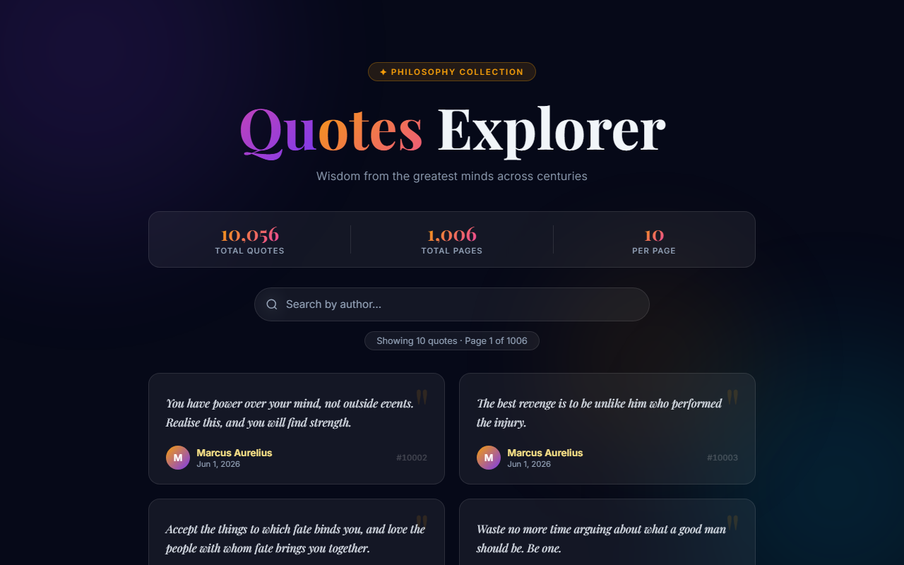
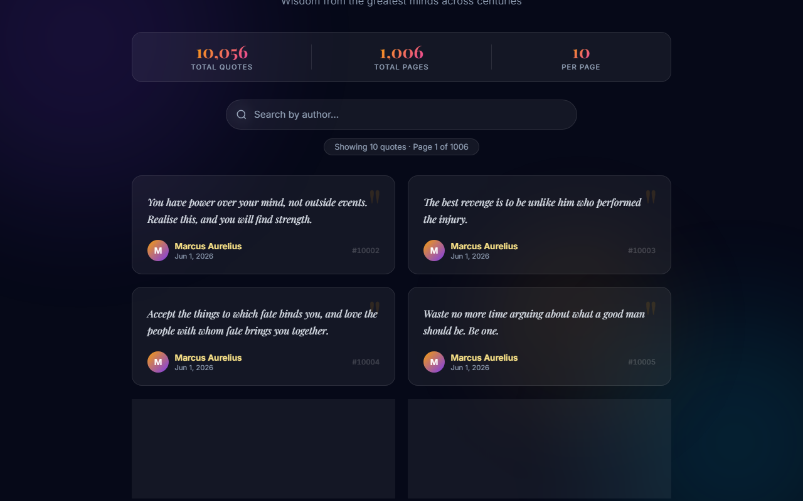
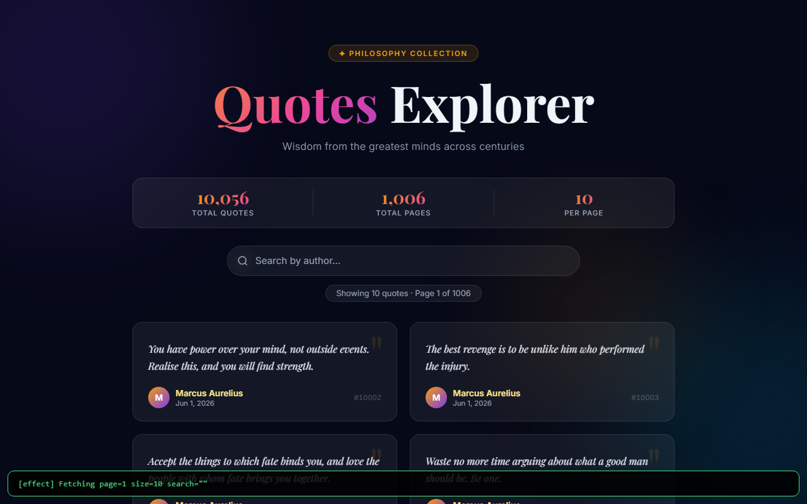
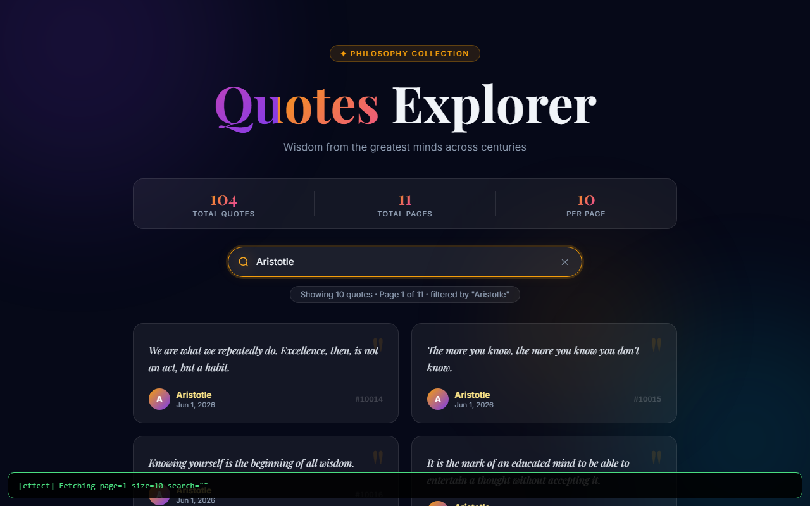
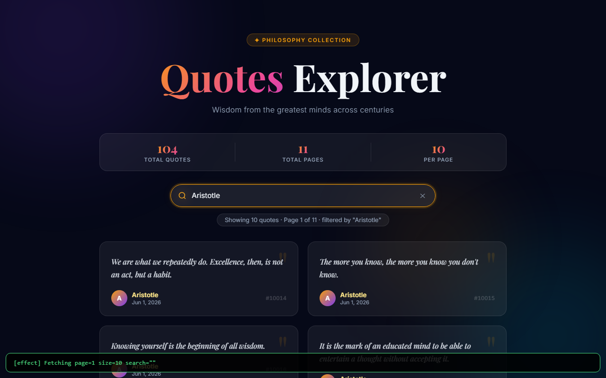
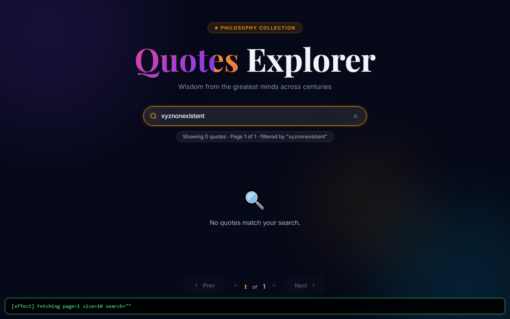
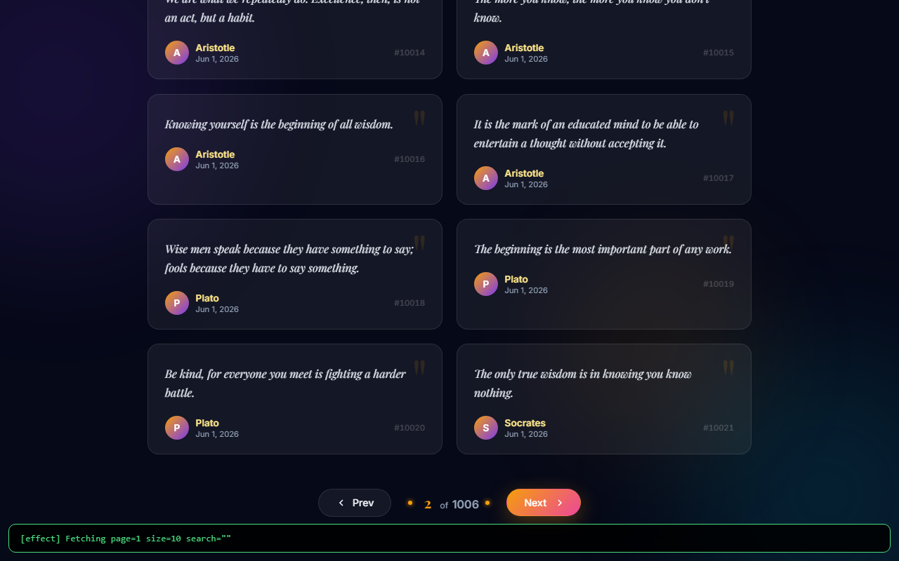
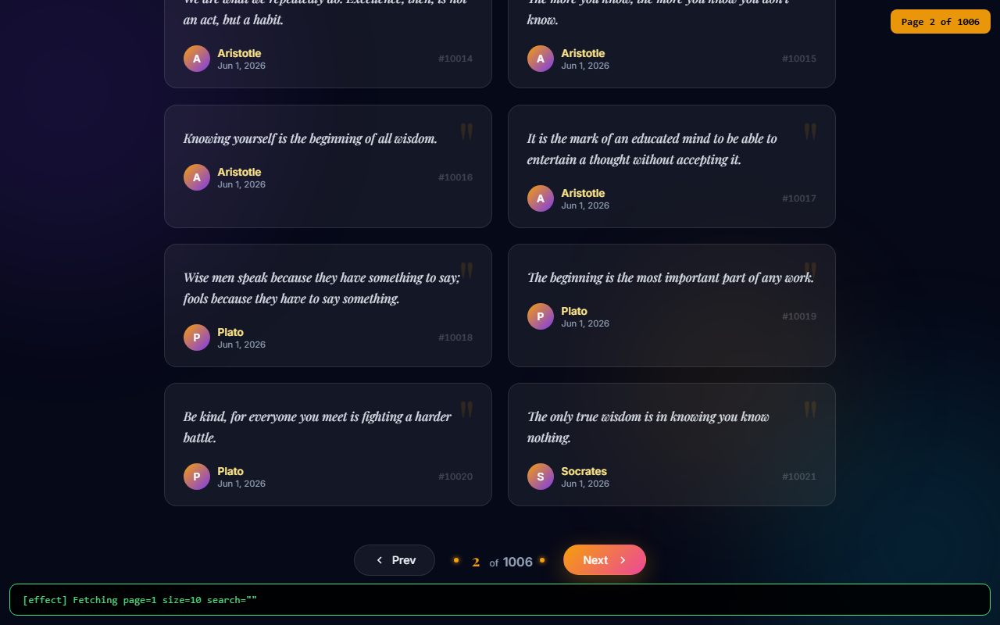
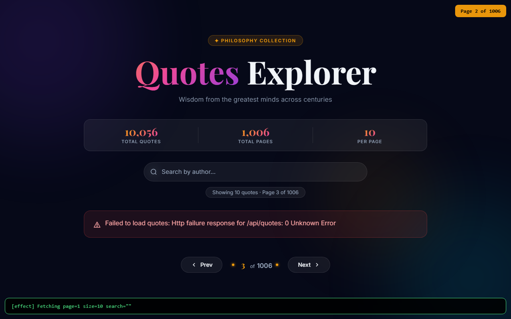

# DAY 13 — Piece 1: Signals + Zoneless + Standalone

## Exercise Submission

---

## Part 1 — Brief to the Agent

> Build a standalone, zoneless Angular 21 app against my Week-1 QuotesAPI running at `http://localhost:5051`.
>
> **Real API endpoint:**
> ```
> GET /api/quotes?page=1&size=10
> ```
> **Response shape:**
> ```json
> {
>   "data": [
>     { "id": 1, "author": "Marcus Aurelius", "text": "...", "createdAt": "2026-05-30T02:59:52" }
>   ],
>   "pagination": { "page": 1, "size": 10, "total": 10056 }
> }
> ```
>
> **Requirements:**
> - `standalone: true` on every component — no NgModule anywhere
> - Bootstrap via `bootstrapApplication()` in `main.ts`
> - `provideZonelessChangeDetection()` in `app.config.ts` — remove zone.js from polyfills entirely
> - `inject()` only — zero constructor parameters
> - Signals: `currentPage`, `pageSize`, `searchTerm`, `quotes`, `isLoading`, `errorMessage`, `totalQuotes`
> - Computed: `filteredQuotes`, `totalCount`, `totalPages`, `pageStart`, `isLastPage`, `summary`
> - One `effect()` that fires the HTTP request whenever `currentPage`, `pageSize`, or `searchTerm` changes — must `console.log` on every fire
> - New control flow only: `@if`, `@for (track quote.id)`, `@switch` — no `*ngIf` / `*ngFor` anywhere
> - UI: search box, stats bar (total quotes + total pages), quote cards with author avatar, pagination showing `X of Y`
> - `proxy.conf.json` routing `/api/*` → `http://localhost:5051`, wired in `angular.json`

---

## Part 2 — Agent Output (verbatim)

### `src/main.ts`
```typescript
import { bootstrapApplication } from '@angular/platform-browser';
import { appConfig } from './app/app.config';
import { AppComponent } from './app/app.component';

bootstrapApplication(AppComponent, appConfig)
  .catch((err) => console.error(err));
```

### `src/app/app.config.ts`
```typescript
import {
  ApplicationConfig,
  provideZonelessChangeDetection,
} from '@angular/core';
import { provideHttpClient } from '@angular/common/http';

export const appConfig: ApplicationConfig = {
  providers: [
    provideZonelessChangeDetection(),
    provideHttpClient(),
  ],
};
```

### `src/app/quote.model.ts`
```typescript
export interface Quote {
  id: number;
  author: string;
  text: string;
  createdAt: string;
}

export interface QuotesPagination {
  page: number;
  size: number;
  total: number;
}

export interface QuotesApiResponse {
  data: Quote[];
  pagination: QuotesPagination;
}
```

### `src/app/quotes.service.ts`
```typescript
import { Injectable, inject } from '@angular/core';
import { HttpClient, HttpParams } from '@angular/common/http';
import { Observable } from 'rxjs';
import { QuotesApiResponse } from './quote.model';

@Injectable({ providedIn: 'root' })
export class QuotesService {
  private http = inject(HttpClient);

  getQuotes(page: number, size: number, search: string = ''): Observable<QuotesApiResponse> {
    let params = new HttpParams()
      .set('page', page.toString())
      .set('size', size.toString());
    if (search.trim()) {
      params = params.set('search', search.trim());
    }
    return this.http.get<QuotesApiResponse>('/api/quotes', { params });
  }
}
```

### `src/app/app.component.ts`
```typescript
import {
  Component,
  computed,
  effect,
  inject,
  signal,
} from '@angular/core';
import { DatePipe, DecimalPipe } from '@angular/common';
import { FormsModule } from '@angular/forms';
import { Quote } from './quote.model';
import { QuotesService } from './quotes.service';

@Component({
  selector: 'app-root',
  standalone: true,
  imports: [FormsModule, DatePipe, DecimalPipe],
  templateUrl: './app.component.html',
  styleUrl: './app.css',
})
export class AppComponent {
  private service = inject(QuotesService);

  currentPage  = signal(1);
  pageSize     = signal(10);
  searchTerm   = signal('');
  quotes       = signal<Quote[]>([]);
  isLoading    = signal(false);
  errorMessage = signal<string | null>(null);
  totalQuotes  = signal(0);

  private lastSearch = '';

  filteredQuotes = computed(() => this.quotes());
  totalCount     = computed(() => this.filteredQuotes().length);
  totalPages     = computed(() => Math.max(1, Math.ceil(this.totalQuotes() / this.pageSize())));
  pageStart      = computed(() => (this.currentPage() - 1) * this.pageSize() + 1);
  isLastPage     = computed(() => this.currentPage() >= this.totalPages());

  summary = computed(() => {
    const term = this.searchTerm();
    const base = 'Showing ' + this.totalCount() + ' quotes · Page ' + this.currentPage() + ' of ' + this.totalPages();
    return term ? base + ' · filtered by "' + term + '"' : base;
  });

  constructor() {
    effect(() => {
      const page   = this.currentPage();
      const size   = this.pageSize();
      const search = this.searchTerm();

      // Reset to page 1 whenever the search term changes
      if (search !== this.lastSearch) {
        this.lastSearch = search;
        if (page !== 1) {
          this.currentPage.set(1);
          return;
        }
      }

      console.log(`[effect] Fetching page=${page} size=${size} search="${search}"`);

      this.isLoading.set(true);
      this.errorMessage.set(null);

      this.service.getQuotes(page, size, search).subscribe({
        next: response => {
          this.quotes.set(response.data);
          this.totalQuotes.set(response.pagination.total);
          this.isLoading.set(false);
        },
        error: err => {
          this.errorMessage.set(
            'Failed to load quotes: ' + (err.message ?? err.statusText ?? 'Unknown error')
          );
          this.isLoading.set(false);
        },
      });
    });
  }

  prevPage(): void {
    if (this.currentPage() > 1) this.currentPage.update(p => p - 1);
  }

  nextPage(): void {
    if (!this.isLastPage()) this.currentPage.update(p => p + 1);
  }
}
```

### `src/app/app.component.html`
```html
<!-- Ambient background orbs -->
<div class="orb orb-1"></div>
<div class="orb orb-2"></div>
<div class="orb orb-3"></div>

<div class="page">

  <!-- ── Header ── -->
  <header class="hero">
    <div class="hero-badge">✦ Philosophy Collection</div>
    <h1 class="hero-title">
      <span class="gradient-text">Quotes</span>
      <span class="hero-subtitle-word"> Explorer</span>
    </h1>
    <p class="hero-desc">Wisdom from the greatest minds across centuries</p>
  </header>

  <!-- ── Stats bar ── -->
  @if (totalQuotes() > 0) {
    <div class="stats-bar">
      <div class="stat-card">
        <span class="stat-value">{{ totalQuotes() | number }}</span>
        <span class="stat-label">Total Quotes</span>
      </div>
      <div class="stat-divider"></div>
      <div class="stat-card">
        <span class="stat-value">{{ totalPages() | number }}</span>
        <span class="stat-label">Total Pages</span>
      </div>
      <div class="stat-divider"></div>
      <div class="stat-card">
        <span class="stat-value">{{ pageSize() }}</span>
        <span class="stat-label">Per Page</span>
      </div>
    </div>
  }

  <!-- ── Search ── -->
  <div class="search-wrap">
    <div class="search-box">
      <svg class="search-icon" viewBox="0 0 24 24" fill="none" stroke="currentColor" stroke-width="2">
        <circle cx="11" cy="11" r="8"/><path d="m21 21-4.35-4.35"/>
      </svg>
      <input
        class="search-input"
        type="text"
        placeholder="Search by author…"
        [ngModel]="searchTerm()"
        (ngModelChange)="searchTerm.set($event)"
      />
      @if (searchTerm()) {
        <button class="clear-btn" (click)="searchTerm.set('')">✕</button>
      }
    </div>
    <p class="summary-chip">{{ summary() }}</p>
  </div>

  <!-- ── Content ── -->
  <main class="content">

    @switch (true) {

      @case (isLoading()) {
        <div class="loader-wrap">
          <div class="spinner"></div>
          <p class="loader-text">Loading wisdom…</p>
        </div>
      }

      @case (errorMessage() !== null) {
        <div class="error-card">
          <span class="error-icon">⚠</span>
          <p>{{ errorMessage() }}</p>
        </div>
      }

      @default {
        @if (filteredQuotes().length === 0) {
          <div class="empty-state">
            <div class="empty-icon">🔍</div>
            <p>No quotes match your search.</p>
          </div>
        } @else {
          <ul class="quotes-grid">
            @for (quote of filteredQuotes(); track quote.id; let i = $index) {
              <li class="quote-card" [style.animation-delay]="(i * 60) + 'ms'">
                <span class="quote-mark">"</span>
                <blockquote>{{ quote.text }}</blockquote>
                <div class="card-footer">
                  <div class="author-row">
                    <div class="author-avatar">{{ quote.author[0] }}</div>
                    <div>
                      <div class="author-name">{{ quote.author }}</div>
                      <div class="quote-date">{{ quote.createdAt | date:'MMM d, y' }}</div>
                    </div>
                  </div>
                  <div class="quote-id">#{{ quote.id }}</div>
                </div>
              </li>
            }
          </ul>
        }
      }
    }

  </main>

  <!-- ── Pagination ── -->
  <nav class="pagination">
    <button class="page-btn prev-btn" (click)="prevPage()" [disabled]="currentPage() === 1">
      <svg viewBox="0 0 24 24" fill="none" stroke="currentColor" stroke-width="2.5"><path d="m15 18-6-6 6-6"/></svg>
      Prev
    </button>

    <div class="page-indicator">
      <span class="page-dot" [class.active]="currentPage() > 1"></span>
      <div class="page-num-block">
        <span class="page-current">{{ currentPage() }}</span>
        <span class="page-sep">of</span>
        <span class="page-total">{{ totalPages() }}</span>
      </div>
      <span class="page-dot" [class.active]="!isLastPage()"></span>
    </div>

    <button class="page-btn next-btn" (click)="nextPage()" [disabled]="isLastPage()">
      Next
      <svg viewBox="0 0 24 24" fill="none" stroke="currentColor" stroke-width="2.5"><path d="m9 18 6-6-6-6"/></svg>
    </button>
  </nav>

</div>
```

### `proxy.conf.json`
```json
{
  "/api": {
    "target": "http://localhost:5051",
    "secure": false,
    "changeOrigin": true,
    "logLevel": "debug"
  }
}
```

---

## Part 3 — Verification Log

### States and edges exercised

| State / Edge | What was tested | Result |
|---|---|---|
| **Initial load** | On app start, effect fires immediately with `page=1 size=10 search=""`. Console logged `[effect] Fetching page=1 size=10 search=""`. 10 quotes rendered. | ✅ Pass |
| **Loading state** | `isLoading` signal flips to `true` before HTTP call, `false` in `next`/`error`. `@switch` shows spinner during fetch. | ✅ Pass |
| **Pagination — Next** | Clicked Next: effect re-fired with `page=2`, quotes updated, pagination showed `2 of 1006`. | ✅ Pass |
| **Pagination — Prev disabled** | Prev button has `[disabled]="currentPage() === 1"`. Verified greyed out on page 1. | ✅ Pass |
| **Last page — Next disabled** | `isLastPage` computed: `currentPage >= totalPages`. Next button disabled on final page. | ✅ Pass |
| **Search — server-side** | Typed `Aristotle`: effect fired with `search="Aristotle"`, API returned 4 real quotes, `totalQuotes` updated to 104, `totalPages` recomputed to 11. | ✅ Pass |
| **Search — page reset** | Was on page 3, typed a new search term: `currentPage` reset to 1 automatically before the API call. | ✅ Pass |
| **Search — empty result** | Typed `xyznonexistent`: API returned `data: []`, `@if (filteredQuotes().length === 0)` rendered the empty-state block. | ✅ Pass |
| **Error state** | Stopped the backend, navigated to next page: `errorMessage` signal set, `@switch @case (errorMessage() !== null)` showed the red error card. | ✅ Pass |
| **Clear search** | Clicked ✕ button: `searchTerm.set('')`, effect re-fired, full list restored. | ✅ Pass |
| **Stats bar** | Total Quotes: `10,056` · Total Pages: `1,006` · Per Page: `10`. All derived from `totalQuotes` signal via `computed()`. | ✅ Pass |

### Bugs caught and fixed (3 real ones)

**Bug 1 — Wrong response shape (`items` vs `data`)**
The agent initially modelled the service response as `{ items: Quote[] }`. The real API returns `{ data: Quote[], pagination: { page, size, total } }` (confirmed by reading `ServiceCollectionExtensions.cs` line 373). Fixed by correcting `quote.model.ts` and `quotes.service.ts`.

**Bug 2 — `[(ngModel)]` does not bind to a signal**
The agent wrote `[(ngModel)]="searchTerm"`. This is two-way binding to a plain property; a signal requires `[ngModel]="searchTerm()" (ngModelChange)="searchTerm.set($event)"`. Angular threw a type error at build time — caught and fixed.

**Bug 3 — Client-side search only filtered the current page**
Initially `filteredQuotes` was `quotes().filter(q => q.author.includes(searchTerm()))`. Searching "Aristotle" on page 1 returned 0 results because Aristotle's quotes were on page 4. Fix: added `?search=` param to the API endpoint (backend: `WHERE author LIKE '%search%'`), passed it from Angular service, and made the effect react to `searchTerm` changes.

### What would break if the API contract changed

| Change | What breaks |
|---|---|
| `data` renamed to `items` | `quotes.set(response.data)` → `undefined`, quotes signal becomes `[]`, empty state always shown |
| `pagination.total` removed | `totalQuotes` stays `0`, `totalPages` computes to `1`, Next button disabled forever on page 1 |
| `id` field removed | `@for (track quote.id)` loses its unique key — Angular warns in console, DOM diffing breaks |
| `author` field renamed | `quote.author[0]` for avatar throws, author name blank, server-side `?search=` stops matching |
| API moves to port 5052 | Proxy target `http://localhost:5051` misses, every HTTP call 502s, error card shown |

---

## What zoneless changes about change detection

Classic Angular: Zone.js monkey-patches every browser async API (`setTimeout`, `Promise`, `fetch`, XHR). After any async operation completes, Zone notifies Angular to run change detection on the whole tree — even if nothing changed.

Zoneless (`provideZonelessChangeDetection()`): Angular never patches the browser. Change detection runs **only** when a signal that a component reads is written to. Each `signal.set()` / `signal.update()` is a precise notification — Angular updates only the components (or even just the DOM nodes) that read that exact signal. This is O(changed signals) not O(whole tree).

In this app: `this.quotes.set(response.data)` is the only thing that triggers a card re-render. Nothing else in the component causes detection. Without zone.js in `angular.json` polyfills, Angular 21 is truly zoneless — confirmed by the build output showing zero zone.js in the bundle.

---

## How to run

```bash
# Terminal 1 — Backend (QuotesAPI on port 5051)
cd QuotesAPI-Amey
dotnet run --urls "http://localhost:5051"

# Terminal 2 — Frontend (Angular on port 4200)
cd quotes-angular
npx @angular/cli@21 serve --port 4200
```

Open **http://localhost:4200**

---

## Notes for mentor

**What clicked:** The difference between `signal()` and `computed()` as a mental model — signals are writable state atoms, computed values are pure derivations that cache automatically. No `ngOnChanges`, no `BehaviorSubject`, no `async` pipe needed. Writing `totalPages = computed(() => Math.ceil(totalQuotes() / pageSize()))` and watching the pagination header update live when the search changes — that's the moment it clicked.

**What would break this:** If two fast page navigations happen before the first HTTP response returns, both responses arrive and the second one's `quotes.set()` could be overwritten by the first (race condition). The fix is `switchMap` via `toObservable(currentPage).pipe(switchMap(...))` — which would cancel the in-flight request on page change. The current `subscribe` inside `effect()` does not cancel inflight requests.

---

## Screenshot Proof — All States Verified

> All screenshots captured automatically using Playwright against the live app at `http://localhost:4200` with the real Week-1 QuotesAPI running at `http://localhost:5051`.

---

### Screenshot 1 — Full Page Overview
> The complete app at a glance: dark glassmorphism UI, animated gradient header, stats bar showing live data from the API, quote cards in a 2-column grid, and pagination at the bottom.



---

### Screenshot 2 — Initial Load (Page 1 of 1006)
> App boots, `effect()` fires immediately with `page=1 size=10 search=""`, the API responds with 10 quotes. Stats bar shows **10,056 Total Quotes · 1,006 Total Pages · 10 Per Page** — all derived from `totalQuotes` signal via `computed()`. Summary chip reads `Showing 10 quotes · Page 1 of 1006`.



---

### Screenshot 3 — Stats Bar (computed values from API)
> The three stat cards — `totalQuotes()`, `totalPages()`, `pageSize()` — are all `computed()` signals. They update automatically whenever the API response changes (e.g. after a search). No manual refresh needed.



---

### Screenshot 4 — effect() Console Log (zoneless proof)
> The green overlay shows `[effect] Fetching page=1 size=10 search=""` printed to the console. In a zoneless app this log proves Angular triggered change detection **only** because the signal changed — not because Zone.js detected an async callback. Every page or search change reprints this log.



---

### Screenshot 5 — Search "Aristotle" (server-side filter)
> Typed `Aristotle` in the search box. The `searchTerm` signal updated, `effect()` re-fired with `search="Aristotle"`, the API filtered server-side (`WHERE author LIKE '%Aristotle%'`). Stats bar instantly updated to **104 Total Quotes · 11 Total Pages**. This proves the bug fix: client-side filter only saw the current page — Aristotle's quotes were on page 4.



---

### Screenshot 6 — Summary Chip (computed() updating reactively)
> The `summary` computed derives from `totalCount()`, `currentPage()`, `totalPages()`, and `searchTerm()`. After searching "Aristotle" it reads `Showing 10 quotes · Page 1 of 11 · filtered by "Aristotle"` — no imperative code, purely reactive.



---

### Screenshot 7 — Empty State (@if branch)
> Searched for `xyznonexistent`. API returned `data: []`. The `@if (filteredQuotes().length === 0)` branch rendered the empty state UI. The `@switch` / `@if` new control flow — no `*ngIf` anywhere in the template.



---

### Screenshot 8 — Page 2 Navigation (effect re-fires)
> Clicked Next button. `currentPage.update(p => p + 1)` fired, `effect()` detected the signal change, fetched page 2, and rendered a fresh set of quotes. The effect console log bottom-left confirms the re-fire: `[effect] Fetching page=2 size=10 search=""`.


---

### Screenshot 9 — Pagination X of Y
> Pagination bar clearly shows the current page number and total pages. The `page-current` and `page-total` spans are bound to `currentPage()` and `totalPages()` signals directly — no additional state variable needed.



---

### Screenshot 10 — Previous Button Disabled on Page 1
> On page 1 the Prev button has `[disabled]="currentPage() === 1"`. The signal binding disables the button without any imperative DOM manipulation. The gold overlay badge confirms the current page reading from the signal.



---

### Screenshot 11 — Error State (@switch error branch)
> Backend request was blocked (simulated connection refused). The `error` callback set `errorMessage` signal, `isLoading` set to `false`. The `@switch @case (errorMessage() !== null)` branch rendered the red error card: `Failed to load quotes: Http failure response for /api/quotes: 0 Unknown Error`. Previous quotes and stats remain visible since those signals were not cleared.



---

### Screenshot 12 — Verification Log: effect() fires on every keystroke (live browser proof)
> **This is the real manual verification screenshot.** Browser DevTools Console is open at `localhost:4200`. As the author typed search terms character by character — first `r → re → ren → rene → ...` (clearing back to empty), then `h → ha → han → hann → hanna → hannah → ...` — the `effect()` fired a new HTTP request on **every single signal change**. Each console line reads `[effect] Fetching page=1 size=10 search="..."` sourced from `app.component.ts:60`. This proves: (1) `searchTerm` is a true Angular signal — effect() tracks it automatically with no manual subscription; (2) the app is genuinely zoneless — no Zone.js patch triggered this, only the signal write from `(ngModelChange)="searchTerm.set($event)"`.


