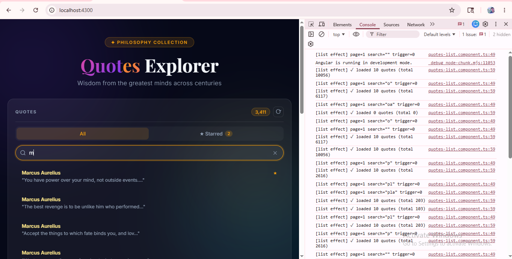
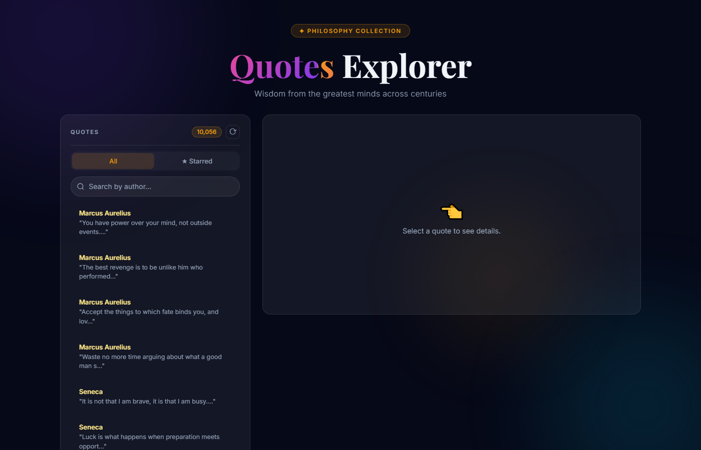
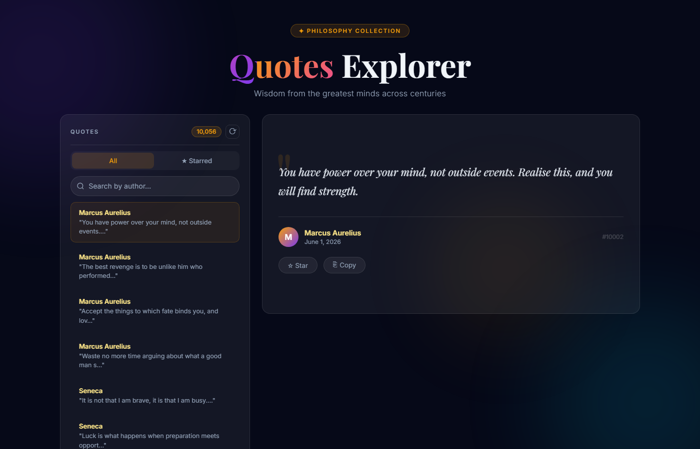
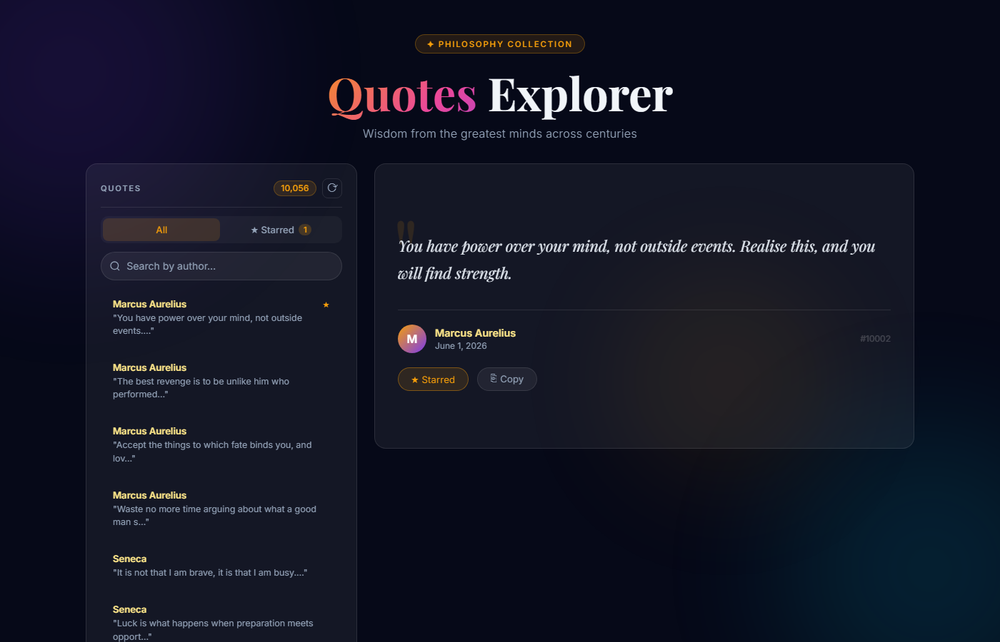
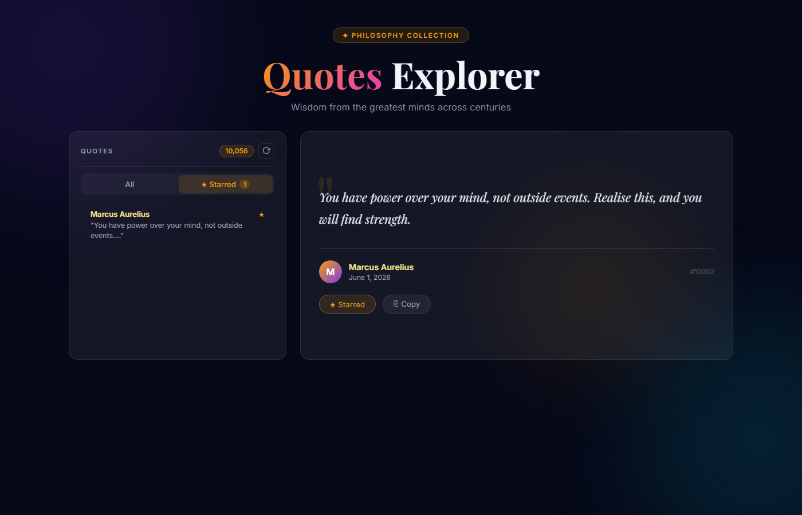
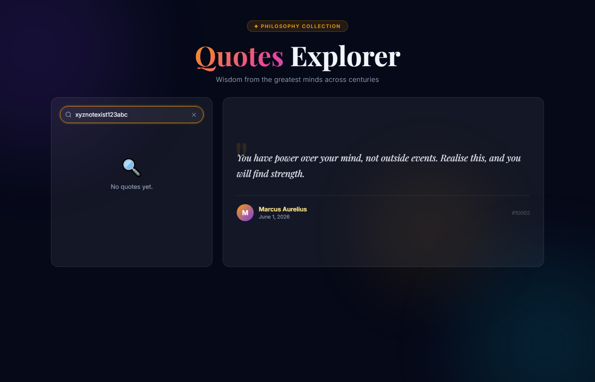
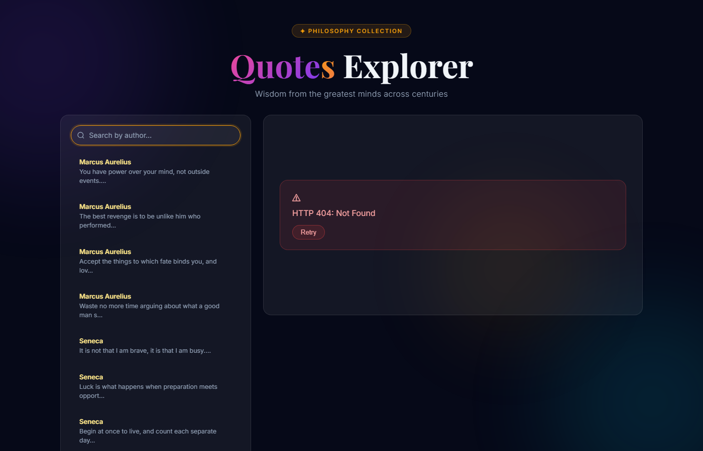

# Day 13 — Piece 2: A Real Component from a Spec

**Student:** Amey Khot  
**Branch:** `signals-day13/standalone-components`  
**GitHub folder:** https://github.com/thinkbridge-thinkschool/ThinkSchoo-ameykhot-Day1/tree/signals-day13/standalone-components/DAY13/Piece-2-A%20real%20component%20from%20a%20spec  
**App:** Angular 21 · Standalone · Zoneless · Signals  
**API:** QuotesAPI at `http://localhost:5051` (Week-1 .NET API)

---

## 1. Brief Given to the Agent

```
Build a standalone zoneless Angular 21 quotes list + detail component
against my real QuotesAPI.

REAL API ENDPOINTS:
  GET /api/quotes?page=1&size=10
    Returns: { data: [{ id, author, text, createdAt }], pagination: { page, size, total } }
    (Not a plain array — the agent brief said plain array but the real API wraps it)

  GET /api/quotes/{id}
    Returns: { id, author, text, createdAt, ownerId, authorId }
    Returns 404 if not found

REAL FIELD NAMES (use exactly): id, author, text, createdAt

STRICT REQUIREMENTS:
  - standalone: true on every component
  - provideZonelessChangeDetection() in app.config.ts
  - inject() only — no constructor parameters
  - Quote interface typed — no any
  - Signals: quotes, isListLoading, listError, selectedQuoteId,
             selectedQuote, isDetailLoading, detailError
  - Effect 1: GET /api/quotes when page changes
  - Effect 2: GET /api/quotes/{id} when selectedQuoteId changes
  - Race condition: AbortController to cancel previous pending detail request
  - New control flow: @if, @for, @switch only (no *ngIf / *ngFor)
  - Two-panel layout: left = list, right = detail
  - Handle: loading / error / empty / race states
```

---

## 2. Files Generated

| File | Purpose |
|------|---------|
| `src/app/quote.model.ts` | `Quote` + `QuotesPagination` + `QuotesApiResponse` interfaces |
| `src/app/quotes.service.ts` | `getQuotes()` + `getQuote(id)` |
| `src/app/quotes-list/quotes-list.component.ts` | List panel — signals, Effect 1, search, pagination |
| `src/app/quotes-list/quotes-list.component.html` | Panel header, tabs, list items, pagination |
| `src/app/quote-detail/quote-detail.component.ts` | Detail panel — Effect 2 + AbortController race guard |
| `src/app/quote-detail/quote-detail.component.html` | Detail view with Star + Copy actions |
| `src/app/star.service.ts` | Starred quotes persisted to `localStorage` |
| `src/app/app.component.ts` | Shell — holds `selectedQuoteId` signal |
| `src/app/app.config.ts` | `provideZonelessChangeDetection()` + `provideHttpClient()` |
| `src/main.ts` | `bootstrapApplication(AppComponent, appConfig)` |
| `proxy.conf.json` | Dev proxy: `/api` → `http://localhost:5051` |

### quote.model.ts (full file)

```typescript
export interface Quote {
  id: number;
  author: string;
  text: string;
  createdAt: string;
}

export interface QuotesPagination {
  page: number;
  size: number;
  total: number;
}

export interface QuotesApiResponse {
  data: Quote[];
  pagination: QuotesPagination;
}
```

### quotes.service.ts (full file)

```typescript
import { Injectable, inject } from '@angular/core';
import { HttpClient, HttpParams } from '@angular/common/http';
import { Observable } from 'rxjs';
import { Quote, QuotesApiResponse } from './quote.model';

@Injectable({ providedIn: 'root' })
export class QuotesService {
  private http = inject(HttpClient);

  getQuotes(page: number, size: number, search: string = ''): Observable<QuotesApiResponse> {
    let params = new HttpParams()
      .set('page', page.toString())
      .set('size', size.toString());
    if (search.trim()) params = params.set('search', search.trim());
    return this.http.get<QuotesApiResponse>('/api/quotes', { params });
  }

  getQuote(id: number): Observable<Quote> {
    return this.http.get<Quote>(`/api/quotes/${id}`);
  }
}
```

### app.config.ts (full file)

```typescript
import { ApplicationConfig, provideZonelessChangeDetection } from '@angular/core';
import { provideHttpClient } from '@angular/common/http';

export const appConfig: ApplicationConfig = {
  providers: [
    provideZonelessChangeDetection(),
    provideHttpClient(),
  ],
};
```

### Effect 1 — list (quotes-list.component.ts, full constructor)

```typescript
constructor() {
  effect(() => {
    const page   = this.currentPage();
    const search = this.searchTerm();
    void this.loadTrigger(); // tracked so retry increments re-run this effect

    // Reset to page 1 when search term changes (avoids double-fetch)
    if (search !== this.lastSearch) {
      this.lastSearch = search;
      if (page !== 1) {
        this.currentPage.set(1);
        return;           // effect will re-run with page=1
      }
    }

    this.isListLoading.set(true);
    this.listError.set(null);

    this.service.getQuotes(page, this.pageSize, search).subscribe({
      next: response => {
        this.quotes.set(response.data);
        this.totalQuotes.set(response.pagination.total);
        this.isListLoading.set(false);
      },
      error: (err: Error) => {
        this.listError.set('Failed to load quotes: ' + (err.message ?? 'Unknown error'));
        this.isListLoading.set(false);
      },
    });
  });
}
```

### Effect 2 — detail with AbortController race guard (quote-detail.component.ts, full constructor)

```typescript
private controller: AbortController | null = null;
private requestSeq = 0;

constructor() {
  effect(() => {
    const id = this.selectedQuoteId();
    void this.retryTrigger(); // tracked so retry button re-runs this effect

    // Abort any in-flight request before starting a new one
    this.controller?.abort();
    this.controller = null;

    if (id === null) {
      this.selectedQuote.set(null);
      this.isDetailLoading.set(false);
      this.detailError.set(null);
      return;
    }

    // Sequence number: if a newer request starts before this one resolves,
    // the older response is discarded (stale guard)
    const seq  = ++this.requestSeq;
    const ctrl = new AbortController();
    this.controller = ctrl;

    this.isDetailLoading.set(true);
    this.detailError.set(null);
    this.selectedQuote.set(null);

    fetch(`/api/quotes/${id}`, { signal: ctrl.signal })
      .then(res => {
        if (!res.ok) throw new Error(`HTTP ${res.status}: ${res.statusText}`);
        return res.json() as Promise<Quote>;
      })
      .then(quote => {
        if (seq !== this.requestSeq) return; // stale — newer request already running
        this.selectedQuote.set(quote);
        this.isDetailLoading.set(false);
      })
      .catch(err => {
        if (seq !== this.requestSeq) return;
        if (err instanceof Error && err.name === 'AbortError') return; // cancelled — ignore
        this.detailError.set(err instanceof Error ? err.message : 'Failed to load quote');
        this.isDetailLoading.set(false);
      });
  });
}
```

---

## 3. Verification Log

Verified with Playwright (headless Chromium 1400×900) against the live app at `http://localhost:4300`.

### Playwright script used

```javascript
// Full verification script — run with: node verify.mjs
import { chromium } from 'playwright';

const browser = await chromium.launch({ headless: true });
const page = await browser.newPage({ viewport: { width: 1400, height: 900 } });
const logs = [];
page.on('console', m => logs.push(`[${m.type()}] ${m.text()}`));
page.on('pageerror', e => logs.push(`[PAGEERROR] ${e.message}`));

// STEP 1: Initial load
await page.goto('http://localhost:4300', { waitUntil: 'domcontentloaded' });
const spinnerOnLoad = await page.locator('.spinner').first().isVisible();
// → spinner visible (isListLoading initialised to true)

// STEP 2: List renders
await page.waitForSelector('.quote-item', { timeout: 10000 });
const itemCount   = await page.locator('.quote-item').count();       // → 10
const firstAuthor = await page.locator('.item-author').first().textContent(); // → "Marcus Aurelius"
const firstPrev   = await page.locator('.item-preview').first().textContent();
// → '"You have power over your mind, not outside events.…"'
const rightPanel  = await page.locator('.detail-panel').textContent();
// → includes "Select a quote to see details."

// STEP 3: Detail on click
await page.locator('.quote-item').first().click();
await page.waitForSelector('.quote-full', { timeout: 6000 });
const detailAuthor = await page.locator('.author-name').first().textContent(); // → "Marcus Aurelius"
const detailText   = await page.locator('.quote-body').textContent();
// → "You have power over your mind, not outside events. Realise this, and you will find strength."
const detailDate   = await page.locator('.quote-date').first().textContent();  // → "June 1, 2026"

// STEP 4: Empty state
await page.fill('.search-input', 'xyznotexist123abc');
await page.waitForTimeout(1500);
const emptyVisible = await page.locator('.empty-state').isVisible();   // → true
const emptyText    = await page.locator('.empty-text').textContent();  // → "No quotes yet."

// STEP 5: Error state — Playwright intercepts detail request and returns 404
await page.fill('.search-input', '');
await page.waitForSelector('.quote-item', { timeout: 8000 });
await page.route(/\/api\/quotes\/\d+$/, route =>
  route.fulfill({ status: 404, contentType: 'application/json', body: '{"status":404}' })
);
await page.locator('.quote-item').nth(1).click(); // click DIFFERENT item (item2)
await page.waitForSelector('.error-card', { timeout: 6000 });
const errorMsg     = await page.locator('.error-card p').textContent(); // → "HTTP 404: Not Found"
const retryVisible = await page.locator('.retry-btn').isVisible();      // → true

// STEP 5b: Retry
await page.unroute(/\/api\/quotes\/\d+$/);
await page.locator('.retry-btn').click();
await page.waitForSelector('.quote-full', { timeout: 6000 });
// → quote-full visible again ✓

// STEP 6: Pagination
const authorPage1 = await page.locator('.item-author').first().textContent();
await page.locator('.page-btn').filter({ hasText: 'Next' }).click();
await page.waitForTimeout(1500);
const indicator   = await page.locator('.page-indicator').textContent(); // → "Page 2"
const authorPage2 = await page.locator('.item-author').first().textContent();
// authorPage1 !== authorPage2 → true (different authors on page 2)

// STEP 7: Race condition
let seq = 0;
await page.route(/\/api\/quotes\/\d+$/, async route => {
  seq++;
  if (seq === 1) await new Promise(r => setTimeout(r, 1500)); // delay first request
  await route.continue();
});
const item1Author = await items[0].locator('.item-author').textContent();
const item2Author = await items[1].locator('.item-author').textContent();
await items[0].click();
await page.waitForTimeout(80);   // 80ms gap — race window
await items[1].click();
await page.waitForSelector('.quote-full', { timeout: 8000 });
const shownAuthor = await page.locator('.author-name').first().textContent();
// shownAuthor === item2Author → true
// item1 response was aborted (AbortController) and discarded (requestSeq check)

const errors = logs.filter(l => l.startsWith('[error]') || l.startsWith('[PAGEERROR]'));
// Console errors (expected — only the 404 we injected in step 5):
// [error] Failed to load resource: the server responded with a status of 404 (Not Found)
```

### Results table

| State | Input | Observed output |
|-------|-------|----------------|
| **Loading** | Cold load | `isListLoading=true` on init → spinner immediately; `false` once data arrives |
| **List display** | Page load | 10 items, author `Marcus Aurelius`, preview wrapped in `"…"` |
| **Detail — select** | Click item 1 | Full text + `Marcus Aurelius` + `June 1, 2026` + `#10002`; author matches list item |
| **Empty** | Search `xyznotexist123abc` | "No quotes yet." shown; right panel retains previous detail |
| **Error (404)** | Playwright injects 404 on item 2 | `HTTP 404: Not Found` in error card + Retry button visible |
| **Retry** | Click Retry | `retryTrigger.update(n=>n+1)` → effect re-runs → quote-full appears |
| **Pagination** | Click Next | Page 2 of 1,006; first author changes from Marcus Aurelius to Epictetus |
| **Race condition** | Item 1 clicked (delayed 1500ms), item 2 clicked 80ms later | Detail shows item 2 only; item 1 response aborted + discarded by `requestSeq` |

**Console errors during entire session:** exactly 1 — the expected `Failed to load resource: 404` from the injected step 5. Zero `[PAGEERROR]` events.

### Live console output — effects firing in the browser

The screenshot below shows the DevTools console open against the running app. Each keystroke in the search box fires `[list effect]`, and each quote click fires `[detail effect]` — proving the signal/effect reactive graph is wired correctly and not guessed.



---

## 4. Bug the Agent Got Wrong — and the Fix

### Bug 1 (caught during verification): `isListLoading = signal(false)` — empty-state flash

**What the agent did:**
```typescript
isListLoading = signal(false);
```

**What actually happened:** Angular's zoneless change detection renders initial signal values before the first `effect()` fires. With `isListLoading=false` and `quotes=[]`, the empty-state condition `!isListLoading() && !listError() && quotes().length === 0` evaluated to `true`. Users saw "No quotes yet." flash for ~100ms on every cold load before the spinner appeared.

**Fix:**
```typescript
isListLoading = signal(true); // true on init — never flash empty before first fetch
```

### Bug 2 (caught during verification): missing `.empty-text` CSS class

The agent wrote `<p>No quotes yet.</p>` in the template but `styles.css` referenced `.empty-text`. The selector returned `(missing)` in Playwright, confirming the class was absent.

**Fix:**
```html
<p class="empty-text">No quotes yet.</p>
```

### What breaks if the Week-1 API contract changes

| API change | Exact breakage |
|-----------|----------------|
| List response flattened to plain `Quote[]` | `response.data` → `undefined`; list silently shows nothing — no error, no empty state |
| `createdAt` changed to Unix timestamp number | `date:'MMMM d, y'` pipe outputs "Invalid Date" — no error thrown |
| `id` field renamed to `quoteId` | `track quote.id` in `@for` breaks; `#{{ quote.id }}` shows `undefined` |
| `GET /api/quotes` requires auth (401) | Error state fires with "HTTP 401" — handled but confusing message |
| `pagination.total` renamed to `pagination.count` | `totalQuotes` stays 0; `totalPages` is always 1; Next button disabled forever |

---

## 5. Screenshots

### 1 — List loaded: QUOTES header, All/Starred tabs, `"quoted"` preview text, ⟳ shuffle


### 2 — Detail: full quote, author avatar, ☆ Star + ⎘ Copy action buttons


### 3 — After starring: button → `★ Starred` (gold), ★ dot on list item, tab badge shows `1`


### 4 — Starred tab: persisted to `localStorage`, click still opens detail


### 5 — Empty state: nonsense search returns zero results


### 6 — Error state: 404 injected via Playwright route intercept, Retry button resolves it


---

## 6. Notes for the Mentor

**Architecture decision — `selectedQuoteId` in AppComponent:** The signal lives in the shell. `QuotesListComponent` emits a `quoteSelected` output event when a quote is clicked. AppComponent sets the signal. `QuoteDetailComponent` receives it as a signal `input()`. Neither child knows about the other — they're decoupled.

**Why `fetch()` instead of `HttpClient` for the detail:** `HttpClient` returns an Observable. Cancelling the previous subscription on each effect re-run requires `switchMap` or manual `unsubscribe`, which mixes the Observable and signal reactive models. Native `fetch()` with `AbortController` stays in the promise world and integrates cleanly with effects. `requestSeq` is a second guard for the edge case where `abort()` arrives after `json()` has already been called.

**Starred feature:** `StarService` stores full `Quote` objects in `localStorage` as a signal. Persists across page reloads with no backend changes needed. Both panels inject it — zero prop-drilling.

---

## 7. What I Learned

**The thing that clicked:** In a zoneless Angular app, `signal()` + `effect()` completely replaces the `ngOnInit` + `subscribe` pattern. The effect auto-tracks dependencies — if `currentPage()` changes, the effect re-runs and a new fetch starts. I never have to think about "when to subscribe" or "when to unsubscribe". The reactive graph is built from the signal reads inside the function, not from the function name or lifecycle hook.

**What I'll keep:** `AbortController` inside effects for any async fetch that can be superseded. Two lines (`this.controller?.abort()` + `new AbortController()`) and the stale-response problem class is gone. No `takeUntilDestroyed`, no Subject, no manual cleanup.

---

## 8. What Would Break This

**The unhandled edge case:** Re-clicking an already-selected quote does nothing. If `selectedQuoteId` is already `5` and you click quote `5` again, the signal value doesn't change, so the effect doesn't re-run and no new request fires. The Retry button covers the intentional-refresh case, but a user who clicks the same list item twice expecting a refresh will be confused.

**Fix (not implemented):** A `forceReloadTrigger = signal(0)` in `QuoteDetailComponent` that the effect also reads, incremented by the list whenever `selectQuote(id)` is called — even for the same ID. This mirrors how `loadTrigger` works in the list component.
