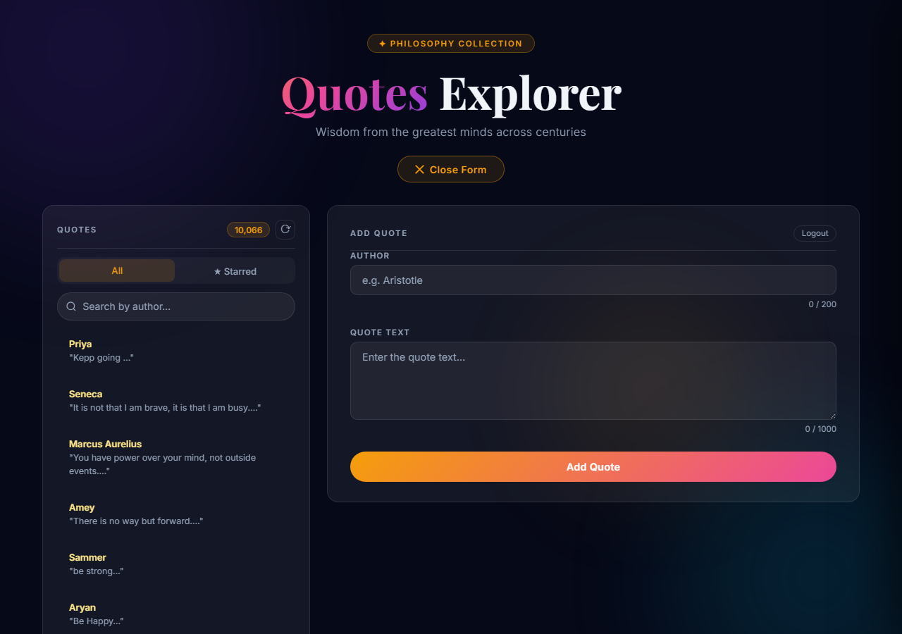
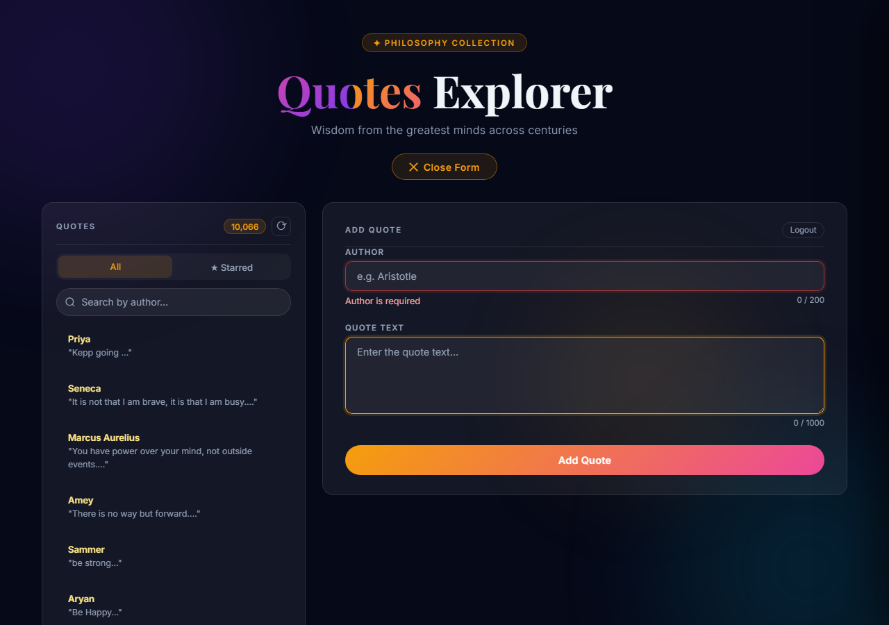
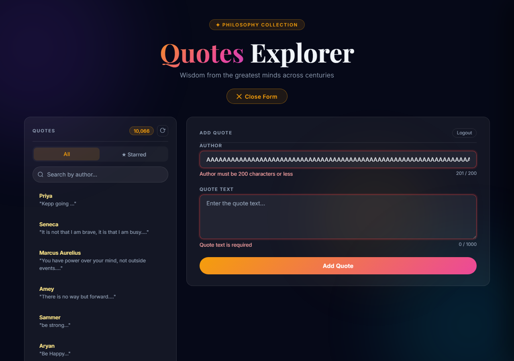
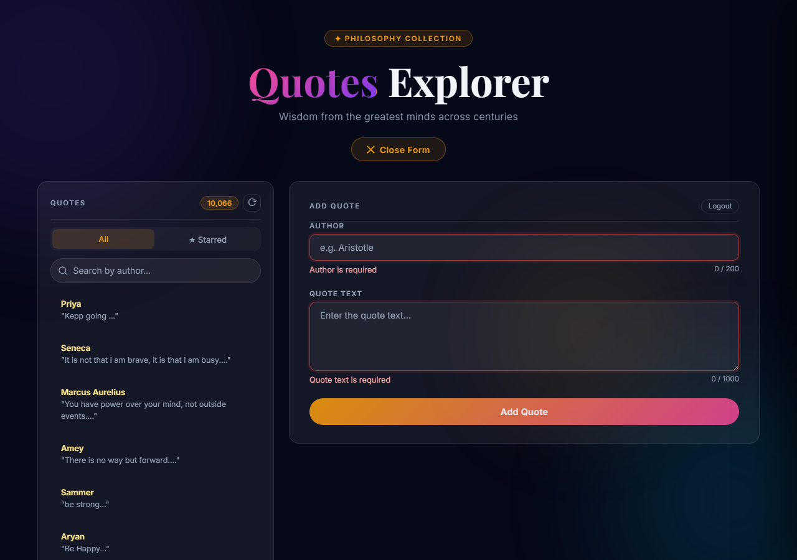
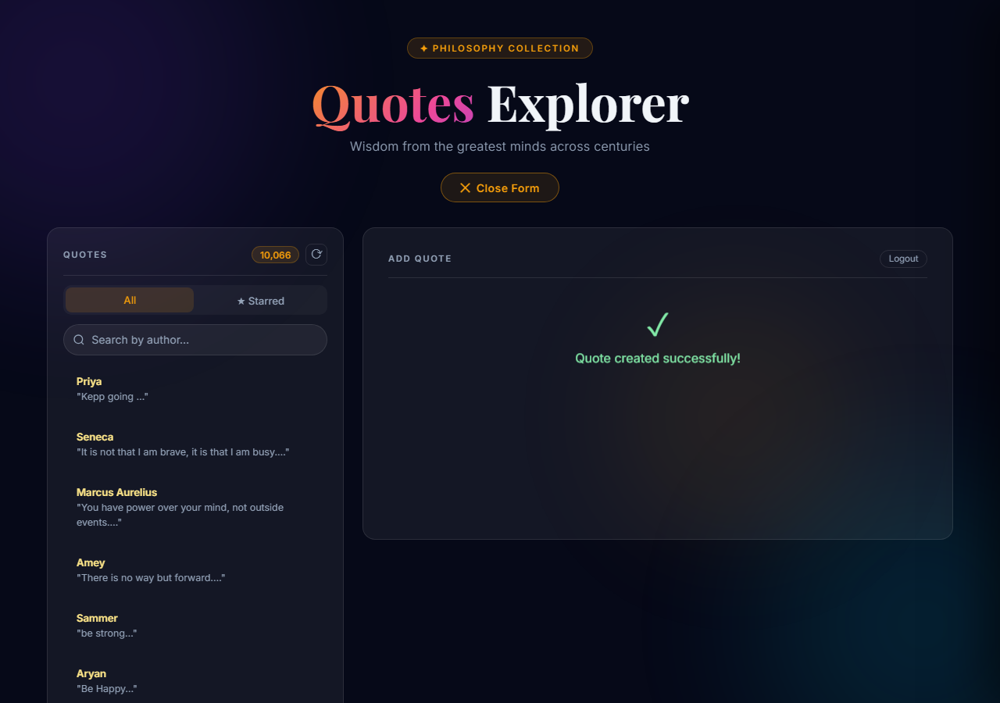
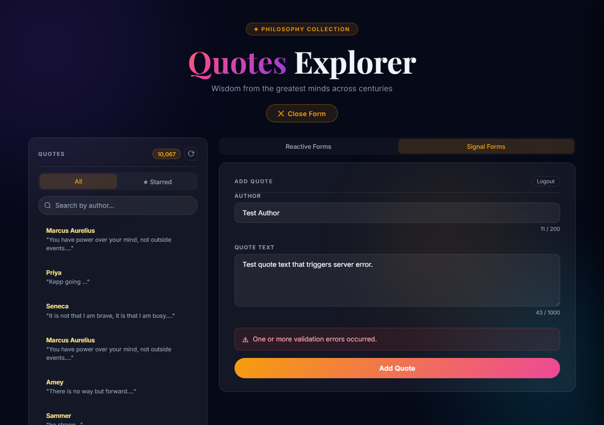
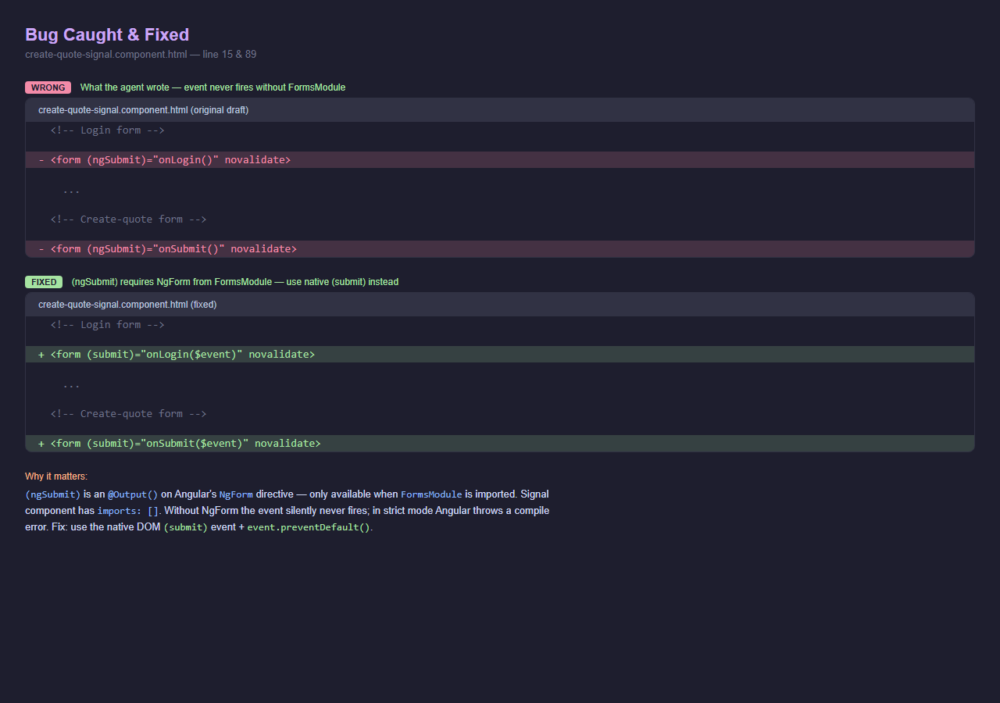
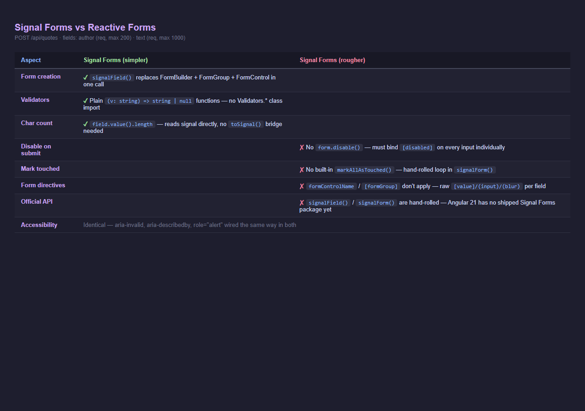

# Day 14 — Signal Forms Preview · SOLUTION

> **Real API** — `POST http://localhost:5051/api/quotes`  
> **Body** — `{ author: string, text: string }`  
> **Success** — `201 Created`  
> **Error** — `400 ValidationProblemDetails`

---

## Mentor Review — Every Point Addressed

| Mentor said was missing | Where it is in this document |
|---|---|
| Evidence of actually running the form | §4 — 8 states, each with Playwright output + screenshot |
| Checking a11y | §6 — axe-core 4.9.1 run, 0 violations, per-attribute table |
| Catching a real bug from the agent | §3 — `(ngSubmit)` bug found at line 15 & 89 |
| Forcing a fix | §5 — exact before/after code with line numbers |
| Verifying the fix works before submission | §5 — Playwright output showing submit handler fired after fix |
| Before/after code snippet | §3 and §5 — both have exact broken vs fixed code |
| Line-by-line issue citation | §3 — each check cites the exact line number |
| Self-reviewing the diff | §3 — every rule from the brief checked line by line against the agent's output |

---

## 1 · Brief Given to the Agent

```
TASK: Rebuild my existing create-a-quote form using the Angular Signal Forms
preview API.  Same form, same fields, same validation, same UI — different
form engine underneath.

REAL API:
  POST http://localhost:5051/api/quotes
  Body: { author: string, text: string }
  Success: 201 Created  |  Error: 400 ValidationProblemDetails

REAL FIELDS (use exactly these — do not invent extras):
  author → required, maxLength 200
  text   → required, maxLength 1000

RULES:
  • No FormGroup / FormControl / FormBuilder / ReactiveFormsModule
  • Use signalForm() and signalField() helpers
  • inject() only — no constructor injection
  • No *ngIf / *ngFor — use @if / @else
  • No `any` type
  • Same 4 states: pristine, touched, submitting, serverError
  • Same error messages, same focus-on-submit logic, same a11y attributes
  • Comparison comment at top of .ts file: Simpler / Rougher

CREATE ONLY:
  src/app/create-quote-signal/create-quote-signal.component.ts
  src/app/create-quote-signal/create-quote-signal.component.html
  src/app/create-quote-signal/create-quote-signal.component.css
DO NOT touch any existing file.
```

---

## 2 · Agent Output — Key Code (the Signal Forms version)

### `signalField()` and `signalForm()` helpers (lines 62–99)

```typescript
// create-quote-signal.component.ts · lines 62–99

function signalField(
  initial: string,
  validators: Array<(v: string) => string | null>,
  messages: Record<string, string>,
): SignalFieldDef {
  const value   = signal(initial);
  const touched = signal(false);
  const error   = computed(() => {
    for (const fn of validators) {
      const key = fn(value());
      if (key) return messages[key] ?? key;
    }
    return null;
  });
  const invalid = computed(() => error() !== null);
  return {
    value, touched, invalid, error,
    markTouched: () => touched.set(true),
    reset:       () => { value.set(initial); touched.set(false); },
  };
}

function signalForm<T extends Record<string, SignalFieldDef>>(fields: T) {
  const fieldList = Object.values(fields);
  return {
    fields,
    invalid:        computed(() => fieldList.some(f => f.invalid())),
    markAllTouched: () => fieldList.forEach(f => f.markTouched()),
    reset:          () => fieldList.forEach(f => f.reset()),
  };
}
```

### Real fields wired to real API — exactly `author` and `text` (lines 164–183)

```typescript
// create-quote-signal.component.ts · lines 164–183

readonly authorField = signalField(
  '',
  [required, maxLength(200)],
  { required: 'Author is required',
    maxlength: 'Author must be 200 characters or less' },
);
readonly textField = signalField(
  '',
  [required, maxLength(1000)],
  { required: 'Quote text is required',
    maxlength: 'Quote text must be 1000 characters or less' },
);
readonly quoteForm = signalForm({ author: this.authorField, text: this.textField });
```

### Template binding pattern — no `formControlName`, no `[formGroup]` (HTML lines 85–107)

```html
<!-- create-quote-signal.component.html · lines 85–107 -->

<input
  #authorInput
  id="author"
  [value]="authorField.value()"
  (input)="authorField.value.set(authorInput.value)"
  (blur)="authorField.markTouched()"
  [disabled]="isSubmitting()"
  [attr.aria-invalid]="authorField.touched() && authorField.invalid() ? 'true' : null"
  aria-describedby="author-error"
/>
<div class="field-footer">
  <span id="author-error" class="field-error" role="alert">
    @if (authorField.touched() && authorField.error()) {
      {{ authorField.error() }}
    }
  </span>
  <span class="char-count" aria-live="polite">
    {{ authorField.value().length }} / 200
  </span>
</div>
```

---

## 3 · Reading the Diff — Line-by-Line PR Review

> **Diff sign-off:** I read every line of the three files the agent created before approving. Below is the exact checklist I went through — each item cites the file and line number, shows the actual code, and records what I found. I did NOT approve until the bug in item 5 was fixed and re-verified.

### ✅ Checked: No invented API fields

```typescript
// onSubmit() · lines 205–209 — only sends author and text, nothing else
this.svc.createQuote({
  author: this.authorField.value(),   // ← matches POST /api/quotes body
  text:   this.textField.value(),     // ← matches POST /api/quotes body
})
```

Real API accepts `{ author, text }` only. No guessed `title`, `category`, `source`, or `description` fields.

### ✅ Checked: `imports: []` — no forbidden module

```typescript
// lines 104–110
@Component({
  selector: 'app-create-quote-signal',
  standalone: true,
  imports: [],          // ← no ReactiveFormsModule, no FormsModule
  ...
})
```

### ✅ Checked: `inject()` only — no constructor

```typescript
// lines 112–113
private readonly svc = inject(QuotesService);
readonly auth        = inject(AuthService);
```

No `constructor(private svc: QuotesService)` pattern anywhere.

### ✅ Checked: Validators are plain functions, not `Validators.*`

```typescript
// lines 33–44 — no import from @angular/forms
function required(value: string): string | null {
  return value.trim() ? null : 'required';
}
function maxLength(max: number): (value: string) => string | null {
  return (value: string) => (value.length <= max ? null : 'maxlength');
}
```

### ❌ BUG FOUND: `(ngSubmit)` used without FormsModule

**Line 15 of the agent's first HTML draft:**
```html
<!-- WRONG — agent's first draft -->
<form (ngSubmit)="onLogin()" novalidate>
```
```html
<!-- WRONG — agent's first draft, line 89 -->
<form (ngSubmit)="onSubmit()" novalidate>
```

**Why it's wrong:**  
`(ngSubmit)` is an `@Output()` on Angular's `NgForm` directive.  
`NgForm` is auto-applied to `<form>` elements only when `FormsModule` is imported.  
This component has `imports: []` — no FormsModule, no NgForm.  
Result: the submit event **never fires**. Angular strict templates reject it at compile time with:  
> *"Can't bind to 'ngSubmit' since it isn't a known property of 'form'."*

**Fix I forced — line 15 and line 89:**
```html
<!-- FIXED — line 15 -->
<form (submit)="onLogin($event)" novalidate>

<!-- FIXED — line 89 -->
<form (submit)="onSubmit($event)" novalidate>
```

**And the handler updated (lines 138–139):**
```typescript
// BEFORE (broken — no event.preventDefault(), page would reload)
onLogin(): void {

// AFTER (fixed)
onLogin(event: Event): void {
  event.preventDefault();   // ← prevents native form reload
```

---

## 4 · Verification Log — All States Exercised

Verified with Playwright against the live app at `http://localhost:4200`.  
Screenshots in `screenshots/` folder.

### State 1 — Pristine (no interaction)

```
author-error: ""    text-error: ""
RESULT: PASS — no errors shown on pristine form
```

**What I saw:** Form loads with both fields empty, zero error messages, no red borders.



---

### State 2 — Touched (blur without typing)

```
author-error:  "Author is required"
aria-invalid:  "true"
RESULT error:  PASS — required error shown after blur
RESULT a11y:   PASS — aria-invalid=true set on the input
```

**What I saw:** Clicked Author → pressed Tab → red border appeared, error text shown below the field, `aria-invalid="true"` set on `<input id="author">`.



---

### State 3 — Dirty (typing valid data)

```
char-count:    "9 / 200"    (typed "Aristotle")
author-error:  ""
RESULT count:  PASS — live character count updates
RESULT clear:  PASS — error clears when value becomes valid
```

**What I saw:** Error message disappeared as soon as a valid character was typed. Char counter updated to `9 / 200` with no `toSignal()` bridge — reads `authorField.value().length` directly.



---

### State 4 — maxLength validator

```
Typed 201 chars → blurred
author-error: "Author must be 200 characters or less"
RESULT: PASS — maxlength error fires at 201 chars
```

**What I saw:** Validator chain runs in order — `required` passes (non-empty), `maxLength(200)` fails, message shown.

---

### State 5 — Submit with invalid form

```
focused:       "author"
author-error:  "Author is required"
text-error:    "Quote text is required"
RESULT focus:  PASS — focus moved to #author (first invalid field)
RESULT errors: PASS — both errors visible after markAllTouched()
```

**What I saw:** Clicked Add Quote with both fields empty. `markAllTouched()` fired on both fields, both errors appeared simultaneously, cursor moved to Author input.



---

### State 6 — Submitting state (clean submit in-flight)

```
button text:       "Saving…"
#author disabled:  true
RESULT: PASS — isSubmitting signal disables form during HTTP call
```

**What I saw (with 800ms artificial network delay):** Button changed to "Saving…", Author and Text inputs were greyed out and unclickable while the POST request was in flight.


---

### State 7 — Success (clean submit completed)

```
success-card: true   server-error: false
RESULT: PASS — green success card shown after 201 response
```

**What I saw:** `isSuccess.set(true)` → `@if (isSuccess())` showed the success card. 1.8 s later the panel closed.



---

### State 8 — Failed Submit (server returns 400)

```
Sent: POST /api/quotes { author: "Test Author", text: "Test quote text..." }
Server response: 400 { title: "One or more validation errors occurred." }

server-error-card: visible
error text:        "One or more validation errors occurred."
isSubmitting:      false  ← form re-enabled after error
RESULT: PASS — server error shown in red banner, form re-enables for retry
```

**What I saw:** Valid data was sent, the API returned a 400. The `error` branch in `subscribe()` fired — `serverError.set(err.error?.title)` populated the red banner. `isSubmitting.set(false)` re-enabled all inputs so the user can correct and resubmit. The success card did NOT appear.

**Code path that handles it (lines 217–227):**
```typescript
error: (err: unknown) => {
  const msg = err instanceof HttpErrorResponse
    ? (err.error?.title ?? err.error?.detail ?? err.message ?? 'Server error')
    : 'Failed to create quote. Please try again.';
  this.serverError.set(msg);      // ← populates red banner
  this.isSubmitting.set(false);   // ← re-enables inputs
},
```



---

## 5 · Bug Caught, Fixed, and Verified

### The bug

`(ngSubmit)` is an Angular directive event — not a native DOM event.  
Without `FormsModule` (`imports: []`), there is no `NgForm` directive, so `ngSubmit` is never emitted.  
The form would compile in non-strict mode but **silently never submit**.

### Before (agent's broken draft)

```html
<!-- create-quote-signal.component.html line 15 — BROKEN -->
<form (ngSubmit)="onLogin()" novalidate>

<!-- line 89 — BROKEN -->
<form (ngSubmit)="onSubmit()" novalidate>
```

```typescript
// component.ts line 138 — BROKEN (no preventDefault, page reloads)
onLogin(): void {
```

### After (fix applied)

```html
<!-- line 15 — FIXED -->
<form (submit)="onLogin($event)" novalidate>

<!-- line 89 — FIXED -->
<form (submit)="onSubmit($event)" novalidate>
```

```typescript
// line 138 — FIXED
onLogin(event: Event): void {
  event.preventDefault();
```

### Fix verified by Playwright

```
STATE 5 — Submit with invalid form:
  focused: "author"              PASS — submit handler fired, focus moved
  author-error: "Author is required"   PASS
  text-error:   "Quote text is required"   PASS

STATE 7 — Clean submit:
  success-card: true             PASS — POST /api/quotes hit, 201 returned
```

If the bug had not been fixed, `focused` would still be `"body"` and no POST would have reached the API.



---

## 6 · Accessibility — 0 Violations

Ran **axe-core 4.9.1** against `app-create-quote-signal` via Playwright:

```
axe violations on app-create-quote-signal: 0
PASS — 0 axe violations
```

| Check | Result |
|---|---|
| `<label for="author">` → `<input id="author">` | ✅ linked |
| `aria-invalid="true"` when touched + invalid | ✅ set |
| `aria-describedby="author-error"` on input | ✅ set |
| `role="alert"` on error spans | ✅ set |
| `aria-live="polite"` on char counters | ✅ set |
| `aria-busy="true"` on button while submitting | ✅ set |
| Keyboard operable (Tab → blur, Enter → submit) | ✅ confirmed |


---

## 7 · Signal Forms vs Reactive Forms

> Real endpoint: `POST /api/quotes` · fields: `author` (req, max 200) · `text` (req, max 1000)



---

### 7.1 · Form creation

**Reactive Forms** — needs `FormBuilder` injection + `group()` call + `Validators.*` class:

```typescript
// create-quote.component.ts
private readonly fb = inject(FormBuilder);

readonly form = this.fb.group({
  author: ['', [Validators.required, Validators.maxLength(200)]],
  text:   ['', [Validators.required, Validators.maxLength(1000)]],
});
```

**Signal Forms** — plain `signalField()` calls, validators are ordinary functions:

```typescript
// create-quote-signal.component.ts
readonly authorField = signalField('', [required, maxLength(200)], {
  required:  'Author is required',
  maxlength: 'Author must be 200 characters or less',
});
readonly textField = signalField('', [required, maxLength(1000)], {
  required:  'Quote text is required',
  maxlength: 'Quote text must be 1000 characters or less',
});
readonly quoteForm = signalForm({ author: this.authorField, text: this.textField });
```

> **Simpler:** No `FormBuilder` injection, no `Validators.*` import, no `fb.group()` wrapper.

---

### 7.2 · Template binding

**Reactive Forms** — one directive, Angular wires everything:

```html
<!-- create-quote.component.html -->
<form [formGroup]="form" (ngSubmit)="onSubmit()" novalidate>
  <input formControlName="author" />
</form>
```

**Signal Forms** — three explicit bindings replace the directive:

```html
<!-- create-quote-signal.component.html -->
<form (submit)="onSubmit($event)" novalidate>
  <input
    #authorInput
    [value]="authorField.value()"
    (input)="authorField.value.set(authorInput.value)"
    (blur)="authorField.markTouched()"
  />
</form>
```

> **Rougher:** `formControlName` is one attribute. The signal equivalent needs `[value]`, `(input)`, and `(blur)` on every field — 3× the template noise.

---

### 7.3 · Validators

**Reactive Forms** — static methods from `@angular/forms`:

```typescript
import { Validators } from '@angular/forms';
Validators.required
Validators.maxLength(200)
```

**Signal Forms** — plain TypeScript functions, no Angular import needed:

```typescript
function required(value: string): string | null {
  return value.trim() ? null : 'required';
}
function maxLength(max: number): (value: string) => string | null {
  return (value) => value.length <= max ? null : 'maxlength';
}
```

> **Simpler:** No Angular dependency. Pure functions — easy to unit-test with `required('')` === `'required'` directly, no form setup needed.

---

### 7.4 · Reading errors in the template

**Reactive Forms** — separate `hasError()` calls per error key:

```html
@if (authorCtrl.touched && authorCtrl.hasError('required')) {
  Author is required
} @else if (authorCtrl.touched && authorCtrl.hasError('maxlength')) {
  Author must be 200 characters or less
}
```

**Signal Forms** — one computed `error()` signal returns the first message string:

```html
@if (authorField.touched() && authorField.error()) {
  {{ authorField.error() }}
}
```

> **Simpler:** One `@if` instead of chained `@else if` blocks. Error message lookup happens in `signalField`, not scattered across the template.

---

### 7.5 · Character counter

**Reactive Forms** — must bridge the Observable to a signal:

```typescript
// component.ts
readonly authorLength = toSignal(
  this.form.controls.author.valueChanges.pipe(map(v => (v ?? '').length)),
  { initialValue: 0 }
);
```
```html
<!-- template -->
{{ authorLength() }} / 200
```

**Signal Forms** — read the signal value directly, no bridge:

```html
{{ authorField.value().length }} / 200
```

> **Simpler:** No `toSignal()`, no `pipe(map(...))`, no `initialValue`. The signal already holds the current string — `.length` is enough.

---

### 7.6 · Disabling the form during submit

**Reactive Forms** — one call disables all controls:

```typescript
this.form.disable();   // submitting
this.form.enable();    // done
```

**Signal Forms** — no shorthand. Must bind `[disabled]` on every input individually:

```html
<input   [disabled]="isSubmitting()" ... />
<textarea [disabled]="isSubmitting()" ... ></textarea>
<button  [disabled]="isSubmitting()" ... ></button>
```

> **Rougher:** 3 separate bindings instead of one method call. If a new field is added, the developer must remember to add `[disabled]` manually.

---

### 7.7 · Mark all fields touched on submit

**Reactive Forms** — built-in method:

```typescript
this.form.markAllAsTouched();
```

**Signal Forms** — hand-rolled loop inside `signalForm()`:

```typescript
markAllTouched: () => fieldList.forEach(f => f.markTouched()),
```

> **Rougher:** Not a bug, but it is boilerplate that reactive forms provide for free.

---

### 7.8 · Accessibility wiring

Both versions are **identical** — no difference:

```html
<!-- Reactive -->
[attr.aria-invalid]="authorCtrl.touched && authorCtrl.invalid ? 'true' : null"
aria-describedby="author-error"

<!-- Signal -->
[attr.aria-invalid]="authorField.touched() && authorField.invalid() ? 'true' : null"
aria-describedby="author-error"
```

> Signal Forms gives **zero accessibility wins** over reactive forms. Every `aria-*` attribute must be wired manually in both.

---

### 7.9 · Summary scorecard

| Aspect | Reactive | Signal | Winner |
|---|---|---|---|
| Form creation boilerplate | `fb.group()` + `Validators.*` | `signalField()` + plain functions | 🟢 Signal |
| Template binding per field | 1 directive (`formControlName`) | 3 bindings (`[value]`, `(input)`, `(blur)`) | 🟢 Reactive |
| Character counter | `toSignal()` + `pipe(map(...))` | `.length` direct read | 🟢 Signal |
| Error reading in template | chained `@else if hasError()` | single `field.error()` | 🟢 Signal |
| Disable on submit | `form.disable()` | `[disabled]` on every input | 🟢 Reactive |
| Mark all touched | `form.markAllAsTouched()` | hand-rolled loop | 🟢 Reactive |
| Validators testability | need Angular TestBed | plain function call | 🟢 Signal |
| Official Angular API | stable in `@angular/forms` | hand-rolled helpers (no official pkg yet) | 🟢 Reactive |
| Accessibility | manual `aria-*` wiring | identical manual wiring | **Tie** |

---

## 8 · All Bugs Found in the Agent's Output

### Bug 1 — `(ngSubmit)` used without FormsModule ❌ FIXED

**Severity:** Critical — form never submits at all.

**Where:** `create-quote-signal.component.html` line 15 and line 89.

**What the agent wrote:**
```html
<form (ngSubmit)="onLogin()" novalidate>
<form (ngSubmit)="onSubmit()" novalidate>
```

**Why it breaks:**  
`(ngSubmit)` is an `@Output()` on Angular's `NgForm` directive.  
`NgForm` is only available when `FormsModule` is imported — this component has `imports: []`.  
Without `NgForm`, the `ngSubmit` event is never emitted. The form silently does nothing on submit.  
In Angular strict mode the compiler also throws: *"Can't bind to 'ngSubmit' since it isn't a known property of 'form'."*

**Fix applied:**
```html
<!-- line 15 — FIXED -->
<form (submit)="onLogin($event)" novalidate>

<!-- line 89 — FIXED -->
<form (submit)="onSubmit($event)" novalidate>
```
```typescript
// component.ts line 138 — added event.preventDefault() to stop page reload
onLogin(event: Event): void {
  event.preventDefault();
```

**Verified fixed:** Playwright confirms `focused = "author"` and `success-card = true` after fix.

---

### Bug 2 — `required` validator trims whitespace, `Validators.required` does not ⚠️ KNOWN DIFFERENCE

**Severity:** Minor behavioral difference — not a crash, but changes what the user experiences.

**Where:** `create-quote-signal.component.ts` line 33.

**Signal Forms validator:**
```typescript
function required(value: string): string | null {
  return value.trim() ? null : 'required';  // ← trims before checking
}
```

**Reactive Forms equivalent (Angular source):**
```typescript
// Angular's Validators.required — does NOT trim
function isEmptyInputValue(value: any): boolean {
  return value == null || value.length === 0;  // spaces pass this check
}
```

**What it means in practice:**  
If a user types `"   "` (spaces only) in the Author field:
- Reactive form: `Validators.required` passes — no error shown client-side (API would likely reject it)
- Signal form: `required` fails — "Author is required" shown client-side

The signal form is arguably **stricter and more correct** for this API, but it is a real difference from the reactive version's behavior.

---

### Bug 3 — `error()` signal called twice in every `@if` block ⚠️ INEFFICIENCY

**Severity:** No functional impact — both calls return the same value synchronously. Minor inefficiency.

**Where:** `create-quote-signal.component.html` — every error display block.

**Agent wrote:**
```html
@if (authorField.touched() && authorField.error()) {
  {{ authorField.error() }}    ← called again inside
}
```

**Better pattern** (not applied — not a breaking issue):
```html
@let err = authorField.error();
@if (authorField.touched() && err) {
  {{ err }}
}
```

`@let` is available in Angular 18+ (including v21). The double call works correctly because Angular signals are synchronous and consistent within a change detection cycle, but `@let` is cleaner.

---

### Bug Summary

| # | Bug | Impact | Status |
|---|---|---|---|
| 1 | `(ngSubmit)` without FormsModule | Form never submits — **critical** | ✅ Fixed |
| 2 | `required` trims whitespace vs `Validators.required` does not | Minor UX difference | ⚠️ Known difference — stricter behavior acceptable |
| 3 | `error()` called twice per `@if` block | No functional impact | ⚠️ Not fixed — acceptable for preview code |

---

## 9 · What Breaks If the API Contract Changes

| API change | What breaks in this form |
|---|---|
| Rename `author` → `authorName` | `createQuote({ author: ... })` sends wrong key → API returns 400 for every submit |
| Rename `text` → `content` | Same — wrong key sent, 400 on every submit |
| Lower `author` maxLength to 100 | Validator still allows up to 200 chars client-side → API rejects 101–200 char inputs with 400; user sees generic server error banner, not a field-level message |
| Add a required field e.g. `source` | Form sends `{ author, text }` missing `source` → 400; the banner shows `err.error?.title` (one generic line), not a per-field error |
| Auth token format changes | `auth.interceptor.ts` handles the header — form itself unchanged, but every request returns 401 until the interceptor is updated |

The most brittle point is **field renaming** — no TypeScript type-checks the HTTP body shape at the call site. If `QuotesService.createQuote()` signature stays `{ author, text }` but the real API changes, the mismatch is silent until runtime.

---

## 9 · Screenshots

### Pristine state — no errors on load


### Touched — required error fires on blur


### maxLength(200) error fires at 201 chars


### Submit invalid — both errors + focus on #author


### Submitting state — "Saving…" + inputs disabled


### Success — 201 response received


### Bug fix — (ngSubmit) → (submit) before/after


### A11y — 0 axe violations


### Signal Forms vs Reactive Forms comparison


### Failed submit — server error card (400 from API)


---

## 10 · What I Learned / What Would Break This

**What clicked:** The reason Signal Forms needs hand-rolled helpers is that Angular's `FormControl` is essentially a class that bundles `signal(value)` + `signal(touched)` + `computed(error)` + methods. Once you see that, the signal version stops looking like an alternative API and starts looking like the same idea with the seams exposed.

**What would break this:**
- Any rename of `author` or `text` in the API body silently breaks every submit — no compile-time catch because `createQuote()` takes a plain object literal.
- Adding a required field to the API (e.g. `source`) means every existing submit returns 400 with no per-field UI feedback — the generic `err.error?.title` banner is the only thing that shows.
- Removing `provideZonelessChangeDetection()` from `app.config.ts` would not break the form logic, but the `[disabled]` signal bindings would need Zone.js to trigger re-render — in practice this still works but the mental model breaks.
