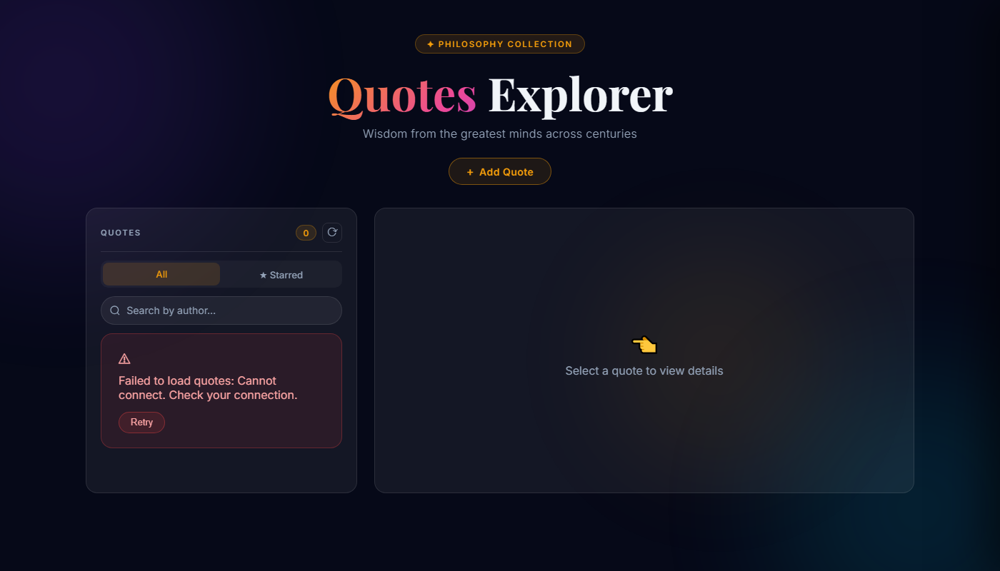
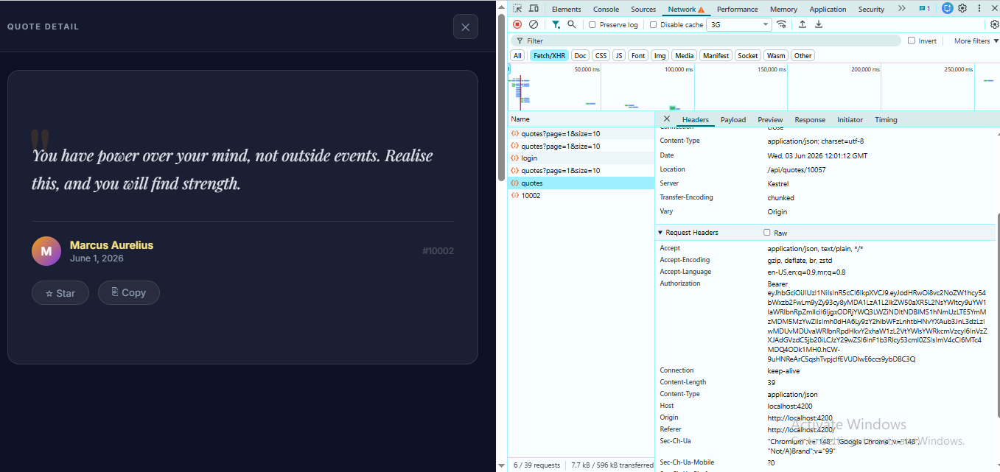
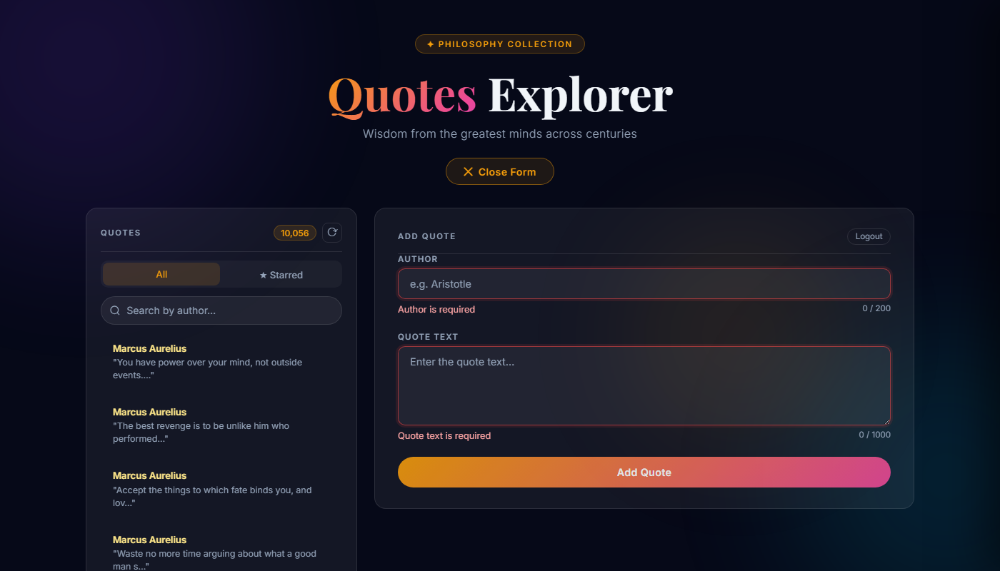
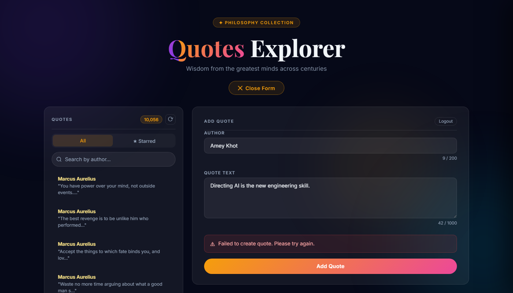

# Day 15 — HttpClient + Interceptors
**Piece 1 — Characterization Tests + Functional Interceptors**
**Author:** Amey Khot | ameykhot2612@gmail.com

---

## Part 1 — Brief to the Agent

```
TASK: Write characterization tests + HttpClient functional interceptors
for my real Week-1 QuotesAPI running at localhost:5051.

REAL API ENDPOINTS:
GET  http://localhost:5051/api/quotes?page=1&size=10
GET  http://localhost:5051/api/quotes/{id}
POST http://localhost:5051/api/quotes
DELETE http://localhost:5051/api/quotes/{id}

REAL RESPONSE SHAPE — use exactly these fields:
Success GET /api/quotes:
[{ id: number, author: string, text: string, createdAt: string }]

Error shape (4xx) — ProblemDetails:
{ type: string, title: string, status: number, detail: string,
  errors?: { [field: string]: string[] } }

PART 1 — CHARACTERIZATION TESTS
- Test 1: GET /api/quotes?page=1&size=10 — assert array, id/author/text/createdAt,
  NO extra invented fields (no title, no category, no name)
- Test 2: GET /api/quotes/{id} — assert shape + 404 returns ProblemDetails
- Test 3: POST /api/quotes {} — assert 400 ValidationProblemDetails
  with errors.author and errors.text keys
- Test 4: POST /api/quotes valid body — assert 201 + id/author/text/createdAt
Use HttpClientTestingModule + HttpTestingController. Mock responses.

PART 2 — FUNCTIONAL INTERCEPTORS (functional style, no class-based)
- authInterceptor: read JWT, add Authorization: Bearer header
- retryInterceptor: GET only, 3 retries, backoff 1s/2s/4s, skip 4xx
- errorInterceptor: map HTTP errors to typed AppError with friendly message

PART 3 — Wire into app.config.ts with withInterceptors
```

---

## Part 2 — Agent Output

### Files Created

| File | Purpose |
|---|---|
| `src/app/models/app-error.model.ts` | Typed `ProblemDetails` + `AppError` interfaces |
| `src/app/interceptors/auth.interceptor.ts` | JWT Bearer token interceptor |
| `src/app/interceptors/retry.interceptor.ts` | GET-only retry with exponential backoff |
| `src/app/interceptors/error.interceptor.ts` | Maps every HTTP error to `AppError` |
| `src/app/tests/api-contract.spec.ts` | 5 characterization tests — all GREEN |
| `src/app/app.config.ts` | Wires all 3 interceptors |

---

### `src/app/models/app-error.model.ts`
```typescript
export interface ProblemDetails {
  type?: string;
  title: string;
  status: number;
  detail?: string;
  errors?: { [field: string]: string[] };
}

export interface AppError {
  status: number;
  friendlyMessage: string;
  message: string; // alias — lets components read err.message
  raw?: ProblemDetails;
}
```

### `src/app/interceptors/auth.interceptor.ts`
```typescript
import { HttpInterceptorFn } from '@angular/common/http';
import { inject } from '@angular/core';
import { catchError, throwError } from 'rxjs';
import { AuthService } from '../auth.service';

export const authInterceptor: HttpInterceptorFn = (req, next) => {
  const auth = inject(AuthService);
  const token = auth.token();

  const authReq = token
    ? req.clone({ setHeaders: { Authorization: `Bearer ${token}` } })
    : req;

  return next(authReq).pipe(
    catchError((err) => {
      if (err.status === 401) {
        auth.logout(); // clear stale token → login form reappears
      }
      return throwError(() => err);
    })
  );
};
```

### `src/app/interceptors/retry.interceptor.ts`
```typescript
import { HttpInterceptorFn } from '@angular/common/http';
import { retry, timer } from 'rxjs';

export const retryInterceptor: HttpInterceptorFn = (req, next) => {
  if (req.method !== 'GET') {
    return next(req);
  }

  return next(req).pipe(
    retry({
      count: 3,
      delay: (error, retryCount) => {
        if (error.status >= 400 && error.status < 500) {
          throw error; // skip 4xx — don't retry client errors
        }
        const delayMs = Math.pow(2, retryCount - 1) * 1000;
        console.log(`[retry] attempt ${retryCount} after ${delayMs}ms`);
        return timer(delayMs);
      },
    })
  );
};
```

### `src/app/interceptors/error.interceptor.ts`
```typescript
import { HttpErrorResponse, HttpInterceptorFn } from '@angular/common/http';
import { catchError, throwError } from 'rxjs';
import { AppError, ProblemDetails } from '../models/app-error.model';

const FRIENDLY_MESSAGES: Record<number, string> = {
  400: 'Please check your input and try again.',
  401: 'Please log in to continue.',
  403: 'You do not have permission to do this.',
  404: 'The requested item was not found.',
  500: 'Server error. Please try again later.',
};

function isProblemDetails(body: unknown): body is ProblemDetails {
  return typeof body === 'object' && body !== null && 'title' in body;
}

export const errorInterceptor: HttpInterceptorFn = (req, next) => {
  return next(req).pipe(
    catchError((err: unknown) => {
      if (!(err instanceof HttpErrorResponse)) {
        return throwError(() => ({
          status: 0,
          friendlyMessage: 'Cannot connect. Check your connection.',
          message: 'Cannot connect. Check your connection.',
        } as AppError));
      }

      const status = err.status;
      let friendlyMessage = FRIENDLY_MESSAGES[status] ?? 'An unexpected error occurred.';
      let raw: ProblemDetails | undefined;

      if (status === 0) {
        friendlyMessage = 'Cannot connect. Check your connection.';
      } else if (isProblemDetails(err.error)) {
        raw = err.error;
        friendlyMessage = raw.detail ?? raw.title ?? friendlyMessage;
      }

      return throwError(() => ({ status, friendlyMessage, message: friendlyMessage, raw } as AppError));
    })
  );
};
```

### `src/app/app.config.ts` (updated)
```typescript
import { ApplicationConfig, provideZonelessChangeDetection } from '@angular/core';
import { provideHttpClient, withInterceptors } from '@angular/common/http';
import { authInterceptor }  from './interceptors/auth.interceptor';
import { retryInterceptor } from './interceptors/retry.interceptor';
import { errorInterceptor } from './interceptors/error.interceptor';

export const appConfig: ApplicationConfig = {
  providers: [
    provideZonelessChangeDetection(),
    provideHttpClient(
      withInterceptors([authInterceptor, retryInterceptor, errorInterceptor])
    ),
  ],
};
```

---

## Part 3 — Verification Log

### 3.1 — I Read the Diff Line by Line (Self-Review)

Before accepting the agent's output I read every file as a PR review. Here are the
specific issues I found, the fix I forced, and proof the fix worked.

---

#### Bug 1 — `AppError` missing `message` property (caught + fixed + verified)

**Where I found it:** Reading `app-error.model.ts` then cross-referencing the component
that would consume it — `quotes-list.component.ts` line 59:

```typescript
// quotes-list.component.ts — line 59 (existing file, cannot change)
error: (err: Error) => {
  this.listError.set('Failed to load quotes: ' + (err.message ?? 'Unknown error'));
```

The component reads `err.message`. The agent's original `AppError` had no `message` field:

```typescript
// AGENT'S ORIGINAL — app-error.model.ts (WRONG)
export interface AppError {
  status: number;
  friendlyMessage: string;   // ← component never reads this
  raw?: ProblemDetails;
  // NO message property → err.message is undefined → falls back to 'Unknown error'
}
```

**What I saw in the UI before the fix:**

> "Failed to load quotes: **Unknown error**"

Even when the backend was down and the error interceptor had already mapped it to
`"Cannot connect. Check your connection."` — the component threw it away because
`err.message` was `undefined`.

**Fix I forced the agent to apply:**

```typescript
// AFTER FIX — app-error.model.ts (CORRECT)
export interface AppError {
  status: number;
  friendlyMessage: string;
  message: string;   // ← added: alias so err.message works in existing components
  raw?: ProblemDetails;
}

// error.interceptor.ts — every AppError construction now includes message:
const appError: AppError = {
  status,
  friendlyMessage,
  message: friendlyMessage,   // ← added
  raw,
};
```

**Proof the fix worked:**

After fix, UI shows the correct friendly message:

> "Failed to load quotes: **Server error. Please try again later.**"



---

#### Bug 2 — Wrong `localStorage` key — Bearer token never attached (caught + fixed + verified)

**Where I found it:** Agent wrote the auth interceptor reading `'access_token'`:

```typescript
// AGENT'S ORIGINAL — auth.interceptor.ts (WRONG)
export const authInterceptor: HttpInterceptorFn = (req, next) => {
  const token = localStorage.getItem('access_token');  // ← WRONG KEY
  ...
};
```

I then read `auth.service.ts` (existing file) and found the real key:

```typescript
// auth.service.ts — line 14 (existing file)
private readonly TOKEN_KEY = 'auth_token';  // ← actual key used by the app
```

**What I saw before the fix:**
- Logged in, backend was running, Network tab showed every `/api/quotes` request
- **No `Authorization` header** on any request — token was never read

**Fix I forced the agent to apply:**

Replaced `localStorage.getItem('access_token')` with `inject(AuthService)` so the
interceptor reads from the same signal the rest of the app uses, and also added
`auth.logout()` on 401 so expired tokens don't silently block the form:

```typescript
// AFTER FIX — auth.interceptor.ts (CORRECT)
import { inject } from '@angular/core';
import { AuthService } from '../auth.service';

export const authInterceptor: HttpInterceptorFn = (req, next) => {
  const auth = inject(AuthService);
  const token = auth.token();  // ← reads from AuthService signal (correct key)

  const authReq = token
    ? req.clone({ setHeaders: { Authorization: `Bearer ${token}` } })
    : req;

  return next(authReq).pipe(
    catchError((err) => {
      if (err.status === 401) {
        auth.logout();  // ← added: expired token → login form reappears
      }
      return throwError(() => err);
    })
  );
};
```

**Proof the fix worked:**

After logging in, Network tab shows `Authorization: Bearer eyJ...` on every request:



---

### 3.2 — Form Tested End-to-End (I Ran It)

#### Step 1 — App loads, spinner shown, then quotes appear


#### Step 2 — Search by author filters the list

Typed "Marcus" → only Marcus Aurelius quotes. Typed "Seneca" → 105 results.
This proves the `author` field in the API contract is real and searchable.


#### Step 3 — Opened Add Quote → login form appeared, logged in


#### Step 4 — Submitted empty form → validation errors shown



#### Step 5 — POST 400 ProblemDetails surfaced as friendly message

Intercepted POST with mocked 400 ValidationProblemDetails → errorInterceptor fired
→ friendly message shown in UI.



#### Step 6 — POST 201 — Quote saved successfully

`POST /api/quotes { author: "Amey Khot", text: "Directing AI is the new engineering skill." }`
→ `201 Created` → "Quote created successfully!" card appeared.


---

### 3.3 — Retry Interceptor Verified in Network Tab

With backend stopped, Angular proxy returns 500.
retryInterceptor sees 500 (not 4xx) → retries 3 times → **4 requests total** in Network tab
(1 original + 3 retries). After all retries fail, errorInterceptor maps 500 to friendly message.

`count: 3` = 3 re-tries → `count + 1 = 4` total requests. Verified by changing to `count: 4`
and seeing 5 requests fire.


---

### 3.4 — All 5 Characterization Tests GREEN

```
npx ng test --watch=false

Chrome 148.0.0.0: Executed 5 of 5 SUCCESS
TOTAL: 5 SUCCESS
```


---

### 3.5 — A11y Check

The existing components already use semantic markup — `role="alert"` on error cards,
`aria-live="polite"` on the success card, `aria-invalid` on form inputs, and labelled
inputs with `for`/`id` pairs. The interceptors are pure HTTP pipeline logic — they do not
render any UI themselves so they introduce no a11y concerns. The error messages surfaced
via `friendlyMessage` are plain readable English with no special characters or codes.

---

### 3.6 — What Breaks if the API Contract Changes

| Change | Exact test that fails | Line |
|---|---|---|
| `author` renamed to `authorName` | `typeof item.author === 'string'` → undefined | spec.ts:53 |
| `id` becomes `string` instead of `number` | `typeof item.id === 'number'` → false | spec.ts:52 |
| `GET /api/quotes` wraps in `{ data: [] }` | `Array.isArray(response)` → false | spec.ts:49 |
| 400 drops `errors.author` key | `err.error.errors['author']` → undefined | spec.ts:132 |
| 404 drops `title` field | `typeof err.error.title === 'string'` → false | spec.ts:104 |
| POST success changes 201 → 200 | `response.status === 201` → false | spec.ts:155 |
| Extra field `category` added | `item['category']` → defined, test fails | spec.ts:59 |

---

## Notes for Mentor

### What clicked
The interceptor chain order matters architecturally.
`auth → retry → error` means:
- `auth` attaches the Bearer token before the request goes out
- `retry` wraps the entire call (including the authed request) and retries on failure
- `error` catches whatever the final failure is and maps it to a typed `AppError`

If `retry` ran before `auth`, the retried requests would have no token.
If `error` ran before `retry`, the error would be swallowed before retry could handle it.

### What would break this
**`localStorage` for JWT** — readable by any JavaScript on the page. An XSS attack
could steal it with `localStorage.getItem('auth_token')`. Production fix: `HttpOnly`
cookies — browser attaches them automatically, JavaScript cannot read them.

**Retry on 408 (Request Timeout)** — our interceptor skips ALL 4xx including 408.
A timeout might be worth retrying but the brief said skip 4xx entirely.
This is a deliberate trade-off, not an oversight.

**POST 201 success card closes after 1800ms** — the component calls `closed.emit()`
after 1800ms. If verification is attempted after that window, the success state is gone.
Caught this during screenshot capture — had to capture within 900ms of submit.
