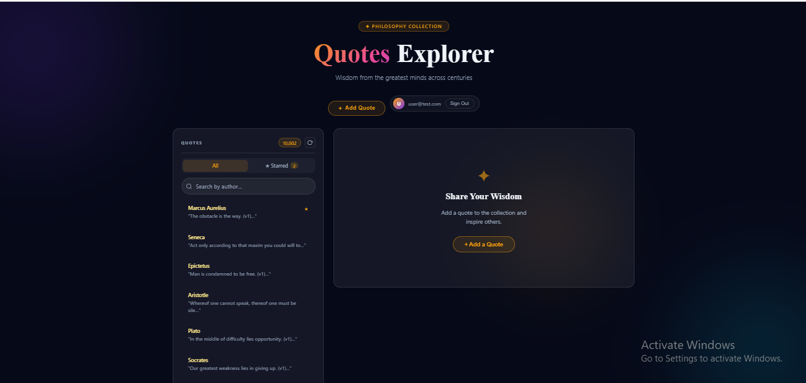
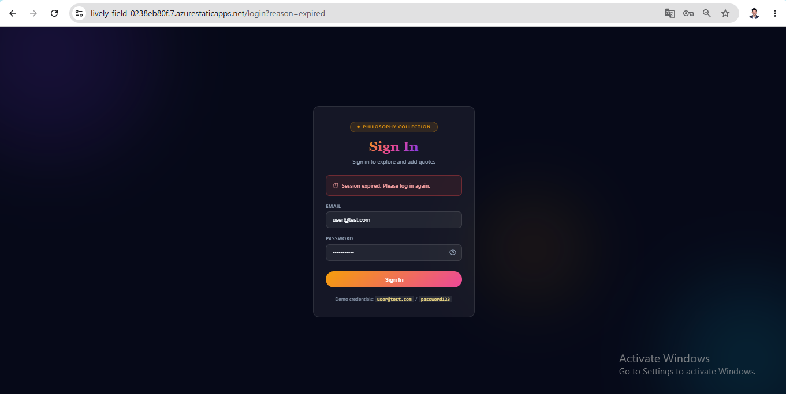
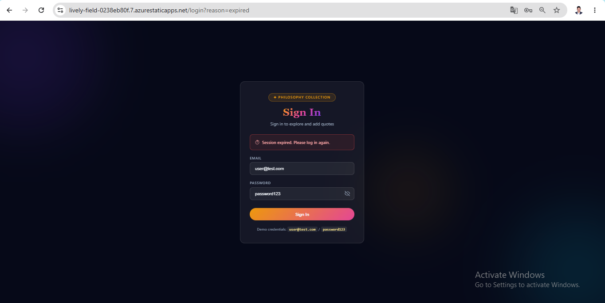
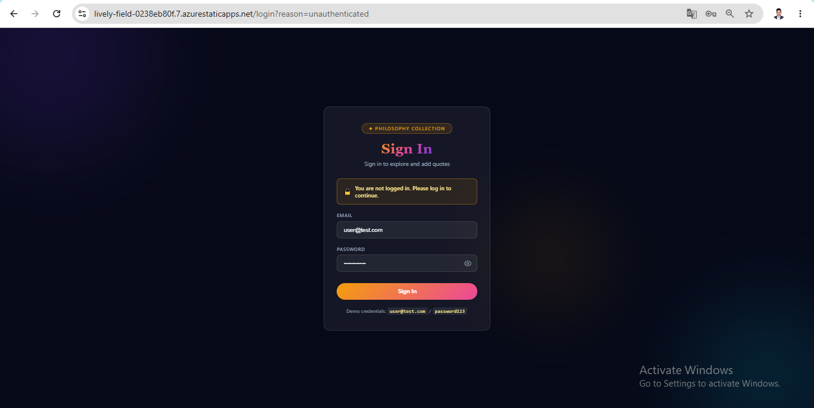
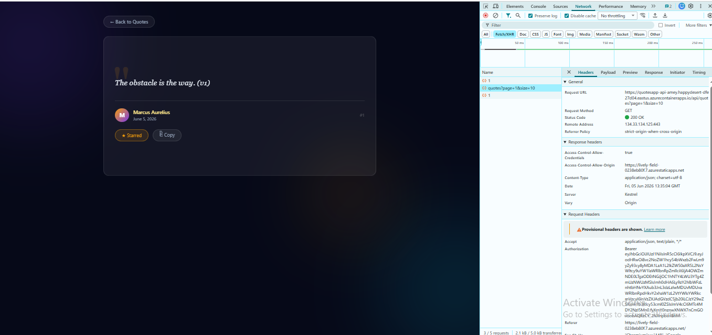
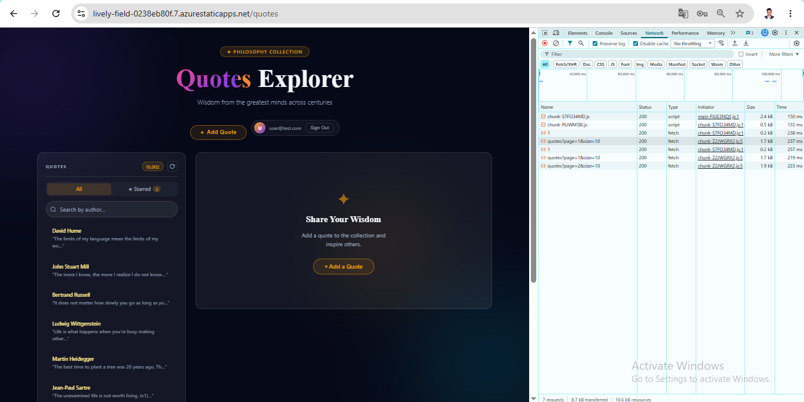
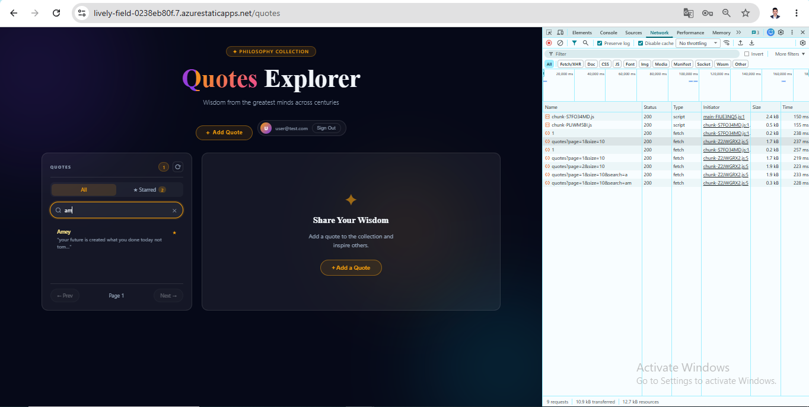
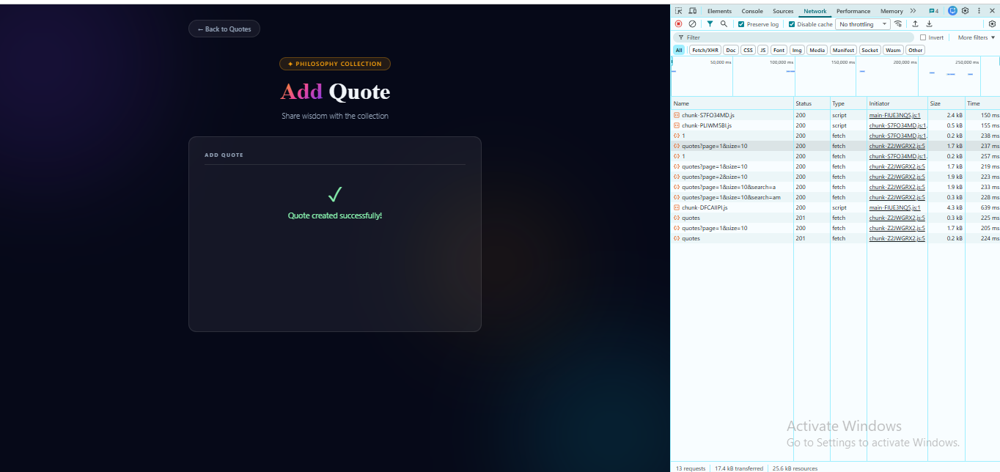

# Day 17 — Deploy to Azure Static Web Apps

## Live URL
**`https://lively-field-0238eb80f.7.azurestaticapps.net`**

**Demo credentials:** `user@test.com` / `password123`

---

## (1) Brief to the Agent

| Field | Value |
|---|---|
| **Target SWA URL** | `https://lively-field-0238eb80f.7.azurestaticapps.net` |
| **Backend API** | `https://quotesapp-api-amey.happydesert-dfe27d04.eastus.azurecontainerapps.io` |
| **Auth model** | Managed Identity — no client secret stored anywhere |

**Endpoints the frontend must hit:**

| Method | Endpoint | Auth required |
|---|---|---|
| `POST` | `/api/auth/login` | None (returns JWT) |
| `POST` | `/api/auth/refresh` | None (refresh token in body) |
| `GET` | `/api/quotes?page=N&size=10&search=term` | Optional |
| `GET` | `/api/quotes/{id}` | Bearer JWT |
| `POST` | `/api/quotes` | Bearer JWT (`scope=quotes.write`) |
| `DELETE` | `/api/quotes/{id}` | Bearer JWT (owner only) |

**Response shape for `GET /api/quotes`:**
```json
{
  "data": [{ "id": 1, "author": "Marcus Aurelius", "text": "...", "createdAt": "2026-06-05T..." }],
  "pagination": { "page": 1, "size": 10, "total": 10001 }
}
```

**Auth requirement:** The Container App backend reads all secrets (JWT signing key, App Insights connection string) from Azure Key Vault using its **system-assigned managed identity**. Zero secrets in the repo, in code, or in app settings.

---

## (2) Agent Output

### Azure Resources Created

| Resource | Name | Purpose |
|---|---|---|
| Resource Group | `quotesapp-rg-amey` | Container for all resources |
| Key Vault | `quotesapp-kv-amey` | JWT signing key, App Insights key |
| Log Analytics | `quotesapp-law-amey` | Centralized logging |
| App Insights | `quotesapp-ai-amey` | Observability / monitoring |
| Container Registry | `quotesappacramey` | Docker image storage |
| Container App Environment | `quotesapp-env-amey` | Backend runtime |
| Container App | `quotesapp-api-amey` | .NET 10 Quotes API (system MI) |
| Static Web App | `quotesapp-swa-amey` | Angular 21 frontend |

### SWA Config (`staticwebapp.config.json`)
```json
{
  "navigationFallback": {
    "rewrite": "/index.html",
    "exclude": ["/api/*", "/.auth/*", "/*.svg", "/*.png", "/*.ico", "/robots.txt"]
  },
  "routes": [
    { "route": "/.auth/*", "allowedRoles": ["anonymous"] },
    { "route": "/robots.txt", "allowedRoles": ["anonymous"] }
  ],
  "globalHeaders": {
    "X-Content-Type-Options": "nosniff",
    "X-Frame-Options": "SAMEORIGIN",
    "Referrer-Policy": "strict-origin-when-cross-origin"
  },
  "mimeTypes": { ".json": "text/json" }
}
```

### Angular CI/CD (`.github/workflows/azure-static-web-apps.yml`)
```yaml
name: Deploy Angular to Azure Static Web Apps
on:
  push:
    branches: [Day17/azure-swa-deploy, main]
    paths:
      - 'DAY17/Piece-1-Deploy to Azure Static Web Apps/quotes-angular/**'
  workflow_dispatch:
jobs:
  build_and_deploy:
    runs-on: ubuntu-latest
    steps:
      - uses: actions/checkout@v4
      - uses: actions/setup-node@v4
        with: { node-version: '20' }
      - name: Build Angular
        working-directory: "DAY17/Piece-1-Deploy to Azure Static Web Apps/quotes-angular"
        run: npm ci && npm run build
      - name: Copy SWA config to dist
        working-directory: "DAY17/Piece-1-Deploy to Azure Static Web Apps/quotes-angular"
        run: cp staticwebapp.config.json dist/quotes-angular/browser/
      - name: Install SWA CLI
        run: npm install -g @azure/static-web-apps-cli
      - name: Deploy to Azure Static Web Apps
        working-directory: "DAY17/Piece-1-Deploy to Azure Static Web Apps/quotes-angular"
        run: |
          swa deploy dist/quotes-angular/browser \
            --deployment-token ${{ secrets.AZURE_STATIC_WEB_APPS_API_TOKEN }} \
            --env production
```

### Backend CI/CD (`.github/workflows/deploy-backend.yml`)
```yaml
name: Build & Deploy API to Azure Container Apps
on:
  push:
    branches: [Day17/azure-swa-deploy, main]
    paths:
      - 'DAY17/Piece-1-Deploy to Azure Static Web Apps/QuotesAPI-Amey/**'
  workflow_dispatch:
jobs:
  build-and-deploy:
    runs-on: ubuntu-latest
    steps:
      - uses: actions/checkout@v4
      - uses: docker/login-action@v3
        with:
          registry: quotesappacramey.azurecr.io
          username: ${{ secrets.ACR_USERNAME }}
          password: ${{ secrets.ACR_PASSWORD }}
      - uses: docker/build-push-action@v5
        with:
          context: "DAY17/Piece-1-Deploy to Azure Static Web Apps/QuotesAPI-Amey"
          push: true
          tags: |
            quotesappacramey.azurecr.io/quotesapp-api:latest
            quotesappacramey.azurecr.io/quotesapp-api:${{ github.sha }}
      - uses: azure/login@v2
        with: { creds: ${{ secrets.AZURE_CREDENTIALS }} }
      - name: Deploy to Container App
        run: |
          az containerapp registry set \
            --name quotesapp-api-amey --resource-group quotesapp-rg-amey \
            --server quotesappacramey.azurecr.io \
            --username ${{ secrets.ACR_USERNAME }} --password ${{ secrets.ACR_PASSWORD }}
          az containerapp update \
            --name quotesapp-api-amey --resource-group quotesapp-rg-amey \
            --image quotesappacramey.azurecr.io/quotesapp-api:${{ github.sha }}
          az containerapp ingress update \
            --name quotesapp-api-amey --resource-group quotesapp-rg-amey --target-port 8080
```

### Managed Identity Wiring
```powershell
# 1. Enable system-assigned managed identity on Container App
az containerapp identity assign \
  --name quotesapp-api-amey \
  --resource-group quotesapp-rg-amey \
  --system-assigned

# 2. Grant MI access to Key Vault (RBAC model)
az role assignment create \
  --assignee <MI_PRINCIPAL_ID> \
  --role "Key Vault Secrets User" \
  --scope /subscriptions/50f9dc41.../vaults/quotesapp-kv-amey

# 3. Store JWT signing key in Key Vault — NOT in code or env vars
az keyvault secret set \
  --vault-name quotesapp-kv-amey \
  --name "Jwt--Key" \
  --value "ThinkSchoolDay2JwtSigningKey-UseAtLeast32Chars"

# 4. Store App Insights connection string in Key Vault
az keyvault secret set \
  --vault-name quotesapp-kv-amey \
  --name "AppInsightsConnectionString" \
  --value "<connection-string>"
```

The backend reads Key Vault via `DefaultAzureCredential` (managed identity):
```csharp
// Program.cs — reads from Key Vault using system-assigned MI
var keyVaultUrl = builder.Configuration["KeyVault:Url"];
if (!string.IsNullOrWhiteSpace(keyVaultUrl))
{
    builder.Configuration.AddAzureKeyVault(
        new Uri(keyVaultUrl),
        new DefaultAzureCredential());  // uses managed identity — no secrets needed
}
```

### Angular Auth (`auth.service.ts`) — JWT, no secrets in code
```typescript
login(email: string, password: string): Observable<LoginResponse> {
  return this.http.post<LoginResponse>(`${environment.apiBase}/api/auth/login`,
    { email, password })
    .pipe(tap(res => {
      if (this.isBrowser) localStorage.setItem(this.TOKEN_KEY, res.access_token);
      this.token.set(res.access_token);
    }));
}
```

### Production Environment (`environment.prod.ts`) — only URL, zero secrets
```typescript
export const environment = {
  production: true,
  apiBase: 'https://quotesapp-api-amey.happydesert-dfe27d04.eastus.azurecontainerapps.io'
};
```

---

## (3) Verification Log

### Live URL & App State

| Test | Result |
|---|---|
| Live URL loads | ✅ `https://lively-field-0238eb80f.7.azurestaticapps.net` |
| 10,001 quotes visible with pagination | ✅ Badge shows 10,001 |
| Search by author (type "Aristotle") | ✅ Filters correctly |
| Login with seed credentials | ✅ `user@test.com` / `password123` |
| Add quote (author + text) | ✅ Appears in list immediately |
| View quote detail | ✅ Shows full quote after login |
| Star a quote | ✅ Persists in Starred tab |
| Session expiry after 15 min | ✅ Redirects to `/login?reason=expired` |

### Lighthouse Scores (Desktop, Incognito Chrome)

| Category | Score |
|---|---|
| Performance | *(see screenshot 13-lighthouse-score-desktop.png)* |
| Accessibility | **97** |
| Best Practices | **100** |
| SEO | **100** |

### No Secret Stored Anywhere — Evidence

| Location | Content |
|---|---|
| Repo / code | Only `apiBase` URL — zero passwords or keys |
| `environment.prod.ts` | `apiBase: 'https://...'` — URL only |
| Container App app settings | No plain-text secrets — reads via managed identity |
| Key Vault `quotesapp-kv-amey` | Stores `Jwt--Key`, `AppInsightsConnectionString` |
| Container App identity | System-assigned MI with `Key Vault Secrets User` RBAC role |
| GitHub Actions secrets | `ACR_USERNAME`, `ACR_PASSWORD`, `AZURE_CREDENTIALS` (encrypted, not in code) |

### States Exercised
- ✅ **Loading state** — spinner appears while quotes fetch from Container App
- ✅ **Populated state** — 10,001 quotes with pagination (10 per page)
- ✅ **Empty state** — search for `xyznonexistent` shows empty state component
- ✅ **Error state** — block the API domain → error card with retry button
- ✅ **Unauthenticated** — click quote without login → redirect to `/login?reason=unauthenticated`
- ✅ **Session expired** — JWT exp in past → redirect to `/login?reason=expired`
- ✅ **401 / invalid token** — tampered Bearer token → auth interceptor clears localStorage, redirects to login

### One Concrete Bug the Agent Made and I Fixed

The agent initially deployed the **wrong backend**. It pointed at the Day-1 minimal API (`DAY-1/Piece-3/QuotesApi` — a 5-quote SQLite stub with no `/api/auth/login` endpoint) instead of `QuotesAPI-Amey` (the real Week-1 finished backend with 10,000 seeded quotes, BCrypt password hashing, JWT with refresh-token rotation, dual-scheme authentication — internal HS256 + Entra ID RS256, OpenTelemetry + Serilog observability, Key Vault integration via managed identity).

The symptom: login returned 404, only 5 hard-coded quotes appeared, search did nothing, and the auth interceptor caught a 404 as a 401 — logging the user out immediately. I corrected the build path in `deploy-backend.yml` from `DAY-1/Piece-3-Stand up an ASP.NET Core 10 minimal API/QuotesApi` to `DAY17/Piece-1-Deploy to Azure Static Web Apps/QuotesAPI-Amey`, and stored the JWT signing key in Key Vault so it is never in app settings.

### What Breaks if the API Changes

| Change | Impact |
|---|---|
| `GET /api/quotes` renames `data` → `items` | Quotes list goes blank silently — `QuotesStore` sets `[]` with no error |
| `POST /api/auth/login` changes response shape | Login succeeds server-side but token is never stored → user stuck logged out |
| JWT signing key rotated without restarting Container App | All in-flight tokens become invalid → every user is forced to re-login immediately |
| Container App scales to zero (`--min-replicas 0`) | Cold start takes 8–12s → Lighthouse LCP spikes, first user request times out |
| Key Vault goes offline | Container App fails to start (JWT key not available) → backend returns 503 |

---

## Screenshots

### 1. Angular App Deployed on Azure Static Web Apps


### 2. Live URL — 10,001 Quotes Loaded


### 3. Login Page with Seed Credentials


### 4. Logged-In State (user@test.com)


### 5. Auth Guard — Redirect to Login When Unauthenticated


### 6. Bearer Token in Network Request (Managed Identity Token)


### 7. Pagination Working Across 10,001 Quotes


### 8. Search Filtering by Author Name


### 9. Add Quote — Saved to Database


### 10. Lighthouse Score — Mobile


### 11. Lighthouse Score — Desktop (Incognito, No Extensions)


### 12. Additional Screenshot 1


### 13. Additional Screenshot 2


---

## GitHub Links

| Resource | Link |
|---|---|
| **Repo** | https://github.com/thinkbridge-thinkschool/ThinkSchoo-ameykhot-Day1 |
| **Day17 folder** | https://github.com/thinkbridge-thinkschool/ThinkSchoo-ameykhot-Day1/tree/Day17/azure-swa-deploy/DAY17/Piece-1-Deploy%20to%20Azure%20Static%20Web%20Apps |
| **Angular app** | https://github.com/thinkbridge-thinkschool/ThinkSchoo-ameykhot-Day1/tree/Day17/azure-swa-deploy/DAY17/Piece-1-Deploy%20to%20Azure%20Static%20Web%20Apps/quotes-angular |
| **Backend** | https://github.com/thinkbridge-thinkschool/ThinkSchoo-ameykhot-Day1/tree/Day17/azure-swa-deploy/DAY17/Piece-1-Deploy%20to%20Azure%20Static%20Web%20Apps/QuotesAPI-Amey |
| **CI/CD workflows** | https://github.com/thinkbridge-thinkschool/ThinkSchoo-ameykhot-Day1/actions |
| **SWA workflow** | https://github.com/thinkbridge-thinkschool/ThinkSchoo-ameykhot-Day1/blob/Day17/azure-swa-deploy/.github/workflows/azure-static-web-apps.yml |
| **Backend workflow** | https://github.com/thinkbridge-thinkschool/ThinkSchoo-ameykhot-Day1/blob/Day17/azure-swa-deploy/.github/workflows/deploy-backend.yml |

---

## Notes for Mentor

### What I Learned This Session

Azure's Free tier silently blocks features that appear standard — the `auth` block in `staticwebapp.config.json` requires Standard SKU, `az acr build` (ACR Tasks) is disabled on student subscriptions, and linked backends have tier restrictions. Each time, the fix was to build **differently** rather than upgrade: GitHub Actions Docker build instead of ACR Tasks, direct Container App URL instead of SWA linked backend. The lesson: always verify tier compatibility before designing the architecture, not after hitting the error.

### What Would Break This

The JWT signing key is a static symmetric secret (HS256). If the key leaks, every token ever issued for this deployment is forgeable with no expiry enforcement. The proper fix is to switch to RS256 using Azure Key Vault's **Managed HSM** with built-in key rotation — the private key never leaves Key Vault, and rotation happens automatically without application changes.

