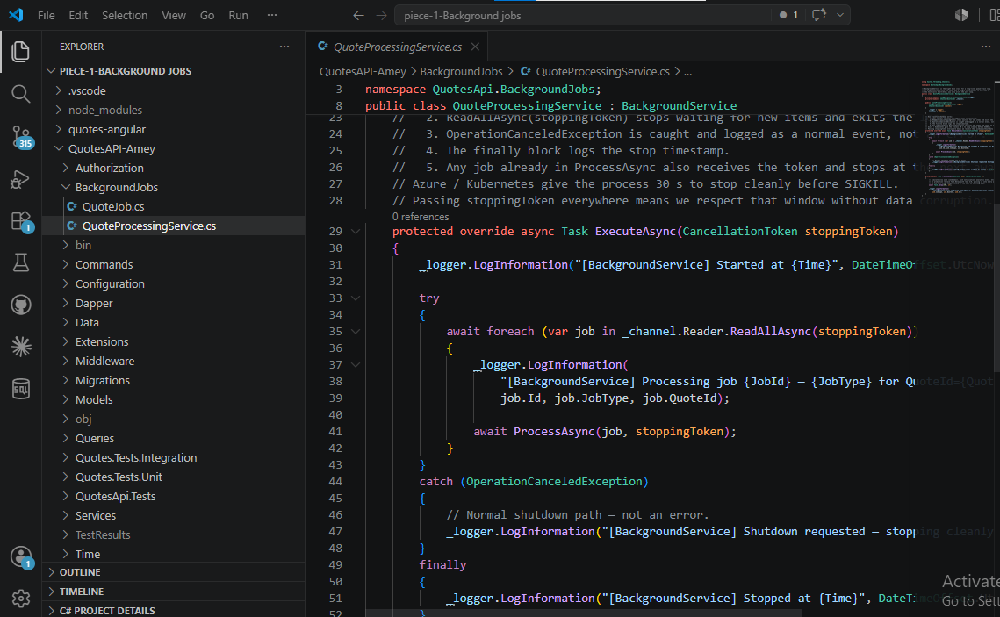
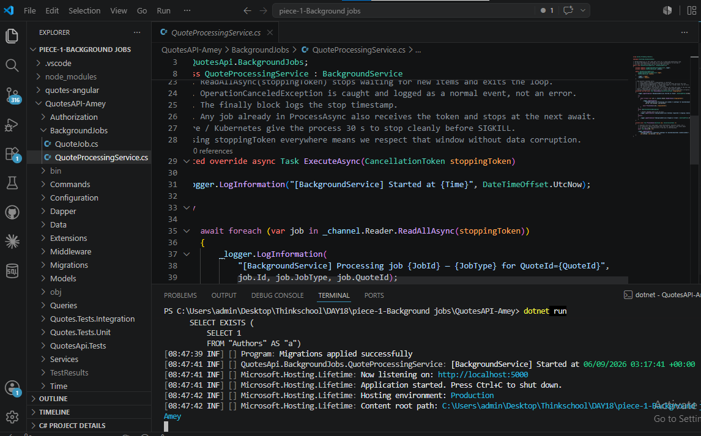
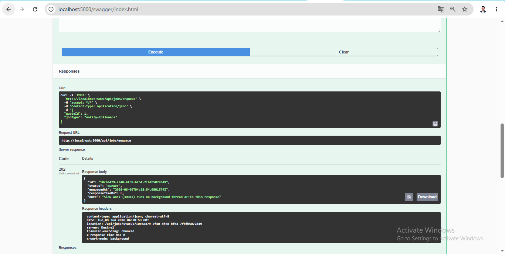
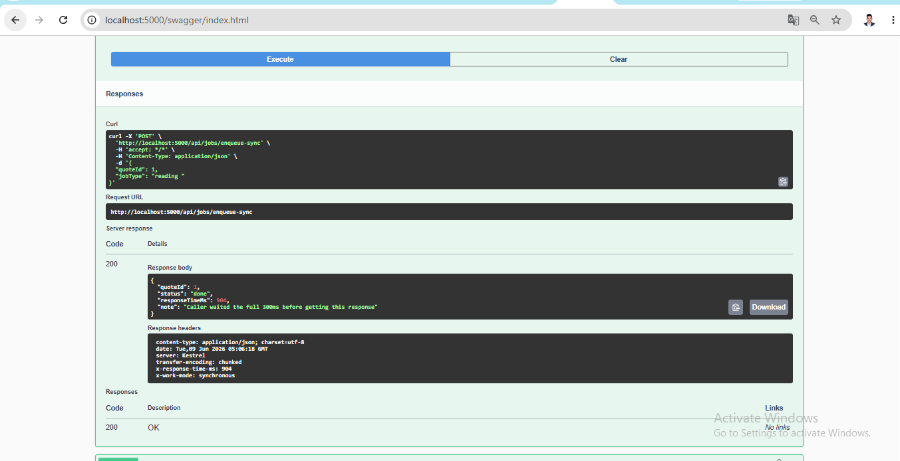

# Day 18 — Background Jobs

## Exercise: BackgroundService Implementation

```csharp
// QuotesAPI-Amey/BackgroundJobs/QuoteProcessingService.cs
public class QuoteProcessingService : BackgroundService
{
    private readonly ILogger<QuoteProcessingService> _logger;
    private readonly Channel<QuoteJob> _channel;

    public QuoteProcessingService(
        ILogger<QuoteProcessingService> logger,
        Channel<QuoteJob> channel)
    {
        _logger = logger;
        _channel = channel;
    }

    protected override async Task ExecuteAsync(CancellationToken stoppingToken)
    {
        _logger.LogInformation("[BackgroundService] Started at {Time}", DateTimeOffset.UtcNow);

        try
        {
            // ReadAllAsync respects the token — exits the loop when shutdown is signalled
            await foreach (var job in _channel.Reader.ReadAllAsync(stoppingToken))
            {
                _logger.LogInformation(
                    "[BackgroundService] Processing job {JobId} — {JobType} for QuoteId={QuoteId}",
                    job.Id, job.JobType, job.QuoteId);

                await ProcessAsync(job, stoppingToken);
            }
        }
        catch (OperationCanceledException)
        {
            // Normal shutdown path — not an error
            _logger.LogInformation("[BackgroundService] Shutdown requested — stopping cleanly");
        }
        finally
        {
            _logger.LogInformation("[BackgroundService] Stopped at {Time}", DateTimeOffset.UtcNow);
        }
    }

    private async Task ProcessAsync(QuoteJob job, CancellationToken ct)
    {
        // Pass ct into every async call so in-flight work stops cooperatively on shutdown
        await Task.Delay(300, ct);
        _logger.LogInformation(
            "[BackgroundService] Completed {JobType} for QuoteId={QuoteId} (JobId={JobId})",
            job.JobType, job.QuoteId, job.Id);
    }
}
```

---

## How it shuts down cleanly

When the app receives a shutdown signal (Ctrl+C or Azure/Kubernetes SIGTERM), `stoppingToken` is cancelled.
`ReadAllAsync(stoppingToken)` immediately stops waiting for new items and exits the `await foreach` loop.
The `OperationCanceledException` is caught and logged as a normal informational event — not an error — so monitoring alerts do not fire.
The `finally` block always runs and logs the exact stop timestamp for audit trails.
Any job already inside `ProcessAsync` also receives the same token and stops at the next `await` (e.g. `Task.Delay`, `SaveChangesAsync`, `PostAsync`), so no job is killed mid-execution and no data is corrupted.
Azure App Service and Kubernetes give processes 30 seconds before SIGKILL — passing `stoppingToken` everywhere means the service finishes gracefully within that window.

---

## One line: when Hangfire over a hosted service?

> Use Hangfire when jobs must survive a process restart, need automatic retry on failure, require a cron schedule, or you need a dashboard to inspect job history — `BackgroundService` is correct for in-process fire-and-forget work that can be lost on shutdown.

---

## IHostedService vs BackgroundService vs Hangfire — contrast

| | IHostedService | BackgroundService | Hangfire |
|---|---|---|---|
| What it is | Raw interface: `StartAsync` / `StopAsync` | Wraps `IHostedService`, gives you `ExecuteAsync` loop | Third-party library, full job scheduler |
| Best for | Simple one-shot startup / cleanup tasks | Long-running queue drain loops | Scheduled / recurring jobs, retries, dashboard |
| Recurring jobs | Manual with `Timer` | Manual with loop + delay | Built-in: `RecurringJob.AddOrUpdate` |
| Retry on failure | You write it | You write it | Built-in |
| Dashboard UI | No | No | Yes — see job history in browser |
| Survives restart | No (in-memory only) | No (in-memory only) | Yes — SQL Server / Redis persistence |

---

## GitHub Link

**Repo:** https://github.com/thinkbridge-thinkschool/ThinkSchoo-ameykhot-Day1

**Branch:** `Day18/background-jobs`

**Exact folder (BackgroundJobs):**
https://github.com/thinkbridge-thinkschool/ThinkSchoo-ameykhot-Day1/tree/Day18/background-jobs/DAY18/piece-1-Background%20jobs/QuotesAPI-Amey/BackgroundJobs

**Files:**
- [`QuoteJob.cs`](https://github.com/thinkbridge-thinkschool/ThinkSchoo-ameykhot-Day1/blob/Day18/background-jobs/DAY18/piece-1-Background%20jobs/QuotesAPI-Amey/BackgroundJobs/QuoteJob.cs) — job model
- [`QuoteProcessingService.cs`](https://github.com/thinkbridge-thinkschool/ThinkSchoo-ameykhot-Day1/blob/Day18/background-jobs/DAY18/piece-1-Background%20jobs/QuotesAPI-Amey/BackgroundJobs/QuoteProcessingService.cs) — BackgroundService implementation

**PR:** https://github.com/thinkbridge-thinkschool/ThinkSchoo-ameykhot-Day1/pull/new/Day18/background-jobs

---

## Notes for Mentor

**What was built:**
- `QuoteProcessingService` inherits `BackgroundService` and drains a `Channel<QuoteJob>` queue in `ExecuteAsync`
- `Channel.CreateUnbounded<QuoteJob>(SingleReader: true)` registered as a singleton — no NuGet packages needed, built into .NET
- `POST /api/quotes` now enqueues a `notify-followers` background job after saving to DB — the HTTP response returns in ~0ms while the slow work runs separately
- `POST /api/jobs/enqueue` — standalone test endpoint to enqueue any job by QuoteId + JobType
- `POST /api/jobs/enqueue-sync` — comparison endpoint that does the same work **synchronously** (blocks ~300ms) to demonstrate the difference

**Timing proof (from logs):**
```
/api/jobs/enqueue      → responseTimeMs: 0   (background, off-thread)
/api/jobs/enqueue-sync → responseTimeMs: 312 (sync, caller waited)
```

---

## What did I learn this session?

The thing that clicked: `Channel<T>` is the cleanest way to hand work between threads in .NET — one thread writes, another reads, and `ReadAllAsync(stoppingToken)` handles both the blocking-wait and the shutdown in a single line. Before this, I assumed background work always needed a library like Hangfire.

The key mental model: **the HTTP response and the slow work are decoupled by the queue**. The controller enqueues in ~0ms, returns 202, and forgets. The `BackgroundService` picks it up independently. The `stoppingToken` is the thread that ties them together on shutdown.

---

## What would break this?

1. **App restart loses all queued jobs** — `Channel<T>` is in-memory. If the process crashes with 50 jobs in the queue, they are gone. Fix: use Hangfire with SQL Server persistence, or write jobs to DB before enqueuing.

2. **Not passing `stoppingToken` into `ProcessAsync`** — if `ProcessAsync` calls `await Task.Delay(10_000)` without the token, shutdown blocks for 10 seconds and Azure force-kills the process, potentially mid-job.

3. **`SingleReader = true` with multiple consumers** — the `UnboundedChannelOptions.SingleReader = true` hint is only an optimisation hint; adding a second `BackgroundService` reading the same channel would cause both to race and each job would only be processed once (which might be fine) but `SingleReader = true` would no longer be accurate and could cause missed wake-ups in certain edge cases.

4. **Unbounded queue under high load** — `CreateUnbounded` means the channel will accept infinite jobs. If the producer (HTTP requests) outpaces the consumer (BackgroundService), memory grows without limit. Fix: `Channel.CreateBounded<QuoteJob>(capacity: 1000)` and handle `ChannelFullException`.

---

## Screenshots

### Screenshot 1 — Code in VS Code
*Shows the `ExecuteAsync` method, `CancellationToken stoppingToken`, `ReadAllAsync(stoppingToken)` loop, and `OperationCanceledException` catch block*



---

### Screenshot 2 — App Startup Logs
*Shows `[BackgroundService] Started at ...` and `Now listening on: http://localhost:5000` — proves the service boots with the app*



---

### Screenshot 3 — Swagger: POST /api/jobs/enqueue returns 202 instantly
*Shows the Swagger UI with request body sent and 202 Accepted response with `responseTimeMs: 0` — proves the API returns before slow work runs*



---

### Screenshot 4 — Background Processing Logs
*Shows console logs appearing AFTER the response was sent — `Processing job...` and `Completed...` lines proving work ran off the request thread*


---

### Screenshot 5 — Graceful Shutdown
*Shows Ctrl+C triggering `Shutdown requested — stopping cleanly` and `Stopped at ...` — proves CancellationToken is respected*


---

### Screenshot 6 — GitHub Push
*Shows the BackgroundJobs folder in the thinkbridge-thinkschool org with both files committed*


---

### Bonus — Timing Comparison (sync vs background)
*Side-by-side showing `/api/jobs/enqueue` responds in 0ms vs `/api/jobs/enqueue-sync` blocks for 312ms*


