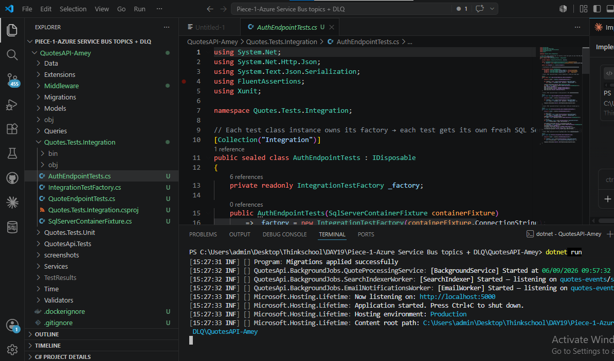
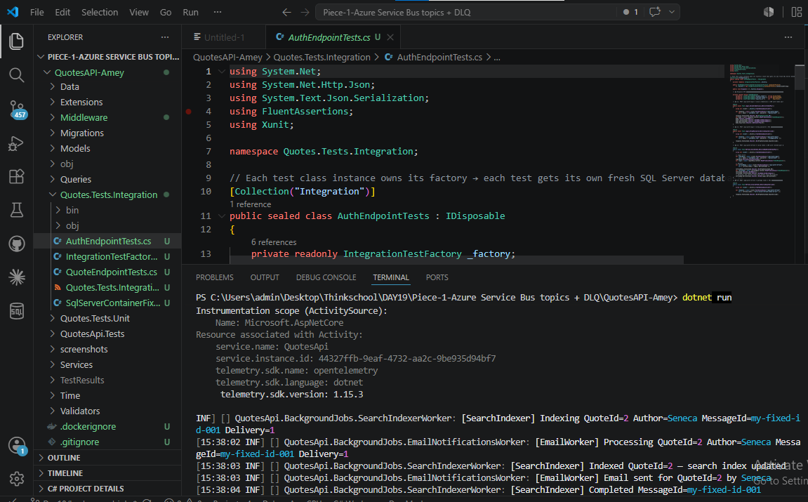
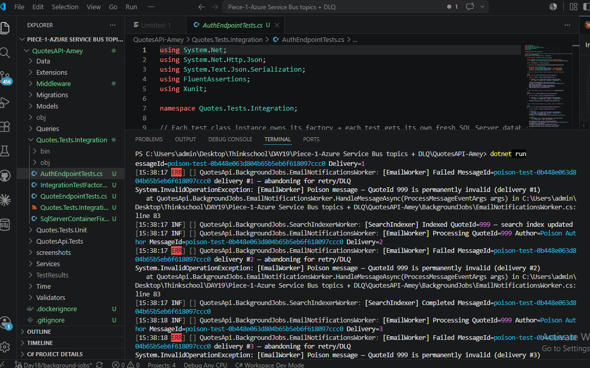
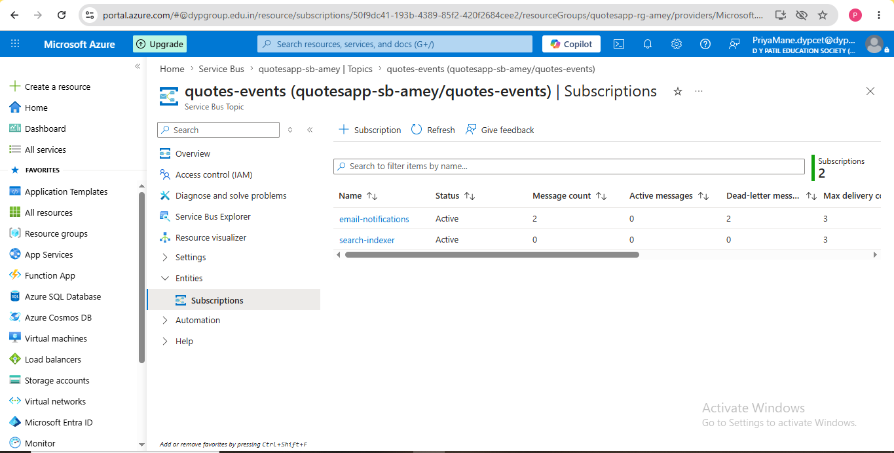
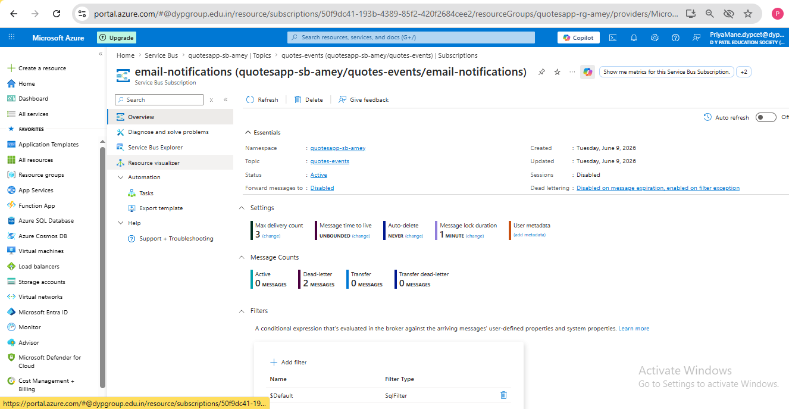
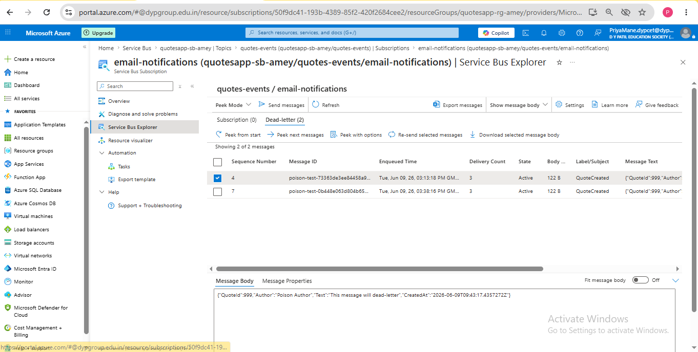

# Day 19 — Piece 1: Azure Service Bus Topics + DLQ

## What Was Built

A fully working pub/sub messaging pipeline on top of the existing Quotes API:

| Concept | Implementation |
|---|---|
| Topic + 2 subscriptions | `quotes-events` topic → `email-notifications` + `search-indexer` |
| Publisher | `QuoteEventPublisher` — fires on every `POST /api/quotes` |
| Competing consumer | `EmailNotificationsWorker` + `SearchIndexerWorker` (`MaxConcurrentCalls=2`) |
| Idempotency | `InMemoryProcessedMessageStore` — dedupes on `MessageId` |
| Dead Letter Queue | `QuoteId=999` throws every attempt → DLQ after 3 retries |

---

## Azure Resources

| Resource | Name |
|---|---|
| Resource Group | `quotesapp-rg-amey` |
| Service Bus Namespace | `quotesapp-sb-amey` (Standard tier) |
| Topic | `quotes-events` |
| Subscription 1 | `email-notifications` (max-delivery-count = 3) |
| Subscription 2 | `search-indexer` (max-delivery-count = 3) |
| Key Vault secret | `ServiceBus--ConnectionString` |

---

## Paste 1 — Publisher (`QuoteEventPublisher.cs`)

```csharp
using Azure.Messaging.ServiceBus;
using QuotesApi.Models;

namespace QuotesApi.Services;

// Singleton: ServiceBusSender is thread-safe and long-lived — one per topic is correct.
public class QuoteEventPublisher : IQuoteEventPublisher
{
    private const string TopicName = "quotes-events";

    private readonly ServiceBusSender _sender;
    private readonly ILogger<QuoteEventPublisher> _logger;

    public QuoteEventPublisher(ServiceBusClient client, ILogger<QuoteEventPublisher> logger)
    {
        _sender = client.CreateSender(TopicName);
        _logger = logger;
    }

    public Task PublishQuoteCreatedAsync(Quote quote, CancellationToken cancellationToken = default)
        => SendAsync(new QuoteCreatedEvent
        {
            QuoteId = quote.Id,
            Author = quote.Author,
            Text = quote.Text,
            CreatedAt = DateTime.UtcNow
        },
        // Deterministic key: same quote re-published → same MessageId → consumer dedupes it
        messageId: $"quote-created-{quote.Id}",
        cancellationToken);

    public Task PublishTestEventAsync(int quoteId, string author, string text,
        string? messageId = null, CancellationToken cancellationToken = default)
        => SendAsync(new QuoteCreatedEvent
        {
            QuoteId = quoteId,
            Author = author,
            Text = text,
            CreatedAt = DateTime.UtcNow
        },
        messageId: messageId ?? Guid.NewGuid().ToString(),
        cancellationToken);

    private async Task SendAsync(QuoteCreatedEvent evt, string messageId, CancellationToken cancellationToken)
    {
        var message = new ServiceBusMessage(BinaryData.FromObjectAsJson(evt))
        {
            MessageId = messageId,   // ← idempotency key
            Subject = "QuoteCreated",
            ContentType = "application/json"
        };

        await _sender.SendMessageAsync(message, cancellationToken);

        _logger.LogInformation(
            "[Publisher] Sent QuoteCreated — QuoteId={Id} Author={Author} MessageId={MsgId}",
            evt.QuoteId, evt.Author, message.MessageId);
    }
}
```

**Key point:** `MessageId` is set deterministically as `quote-created-{quoteId}`. If the same quote is accidentally published twice, the consumer's idempotency check catches the second delivery and skips it silently.

---

## Paste 2 — Consumer (`EmailNotificationsWorker.cs`)

```csharp
using Azure.Messaging.ServiceBus;
using QuotesApi.Models;
using QuotesApi.Services;

namespace QuotesApi.BackgroundJobs;

// Competing-consumer worker: multiple instances share the email-notifications subscription.
// Service Bus delivers each message to ONLY ONE instance — no duplicate emails.
public class EmailNotificationsWorker : BackgroundService
{
    private const string TopicName = "quotes-events";
    private const string SubscriptionName = "email-notifications";

    private readonly ServiceBusProcessor _processor;
    private readonly IProcessedMessageStore _dedupeStore;
    private readonly ILogger<EmailNotificationsWorker> _logger;

    public EmailNotificationsWorker(
        ServiceBusClient client,
        IProcessedMessageStore dedupeStore,
        ILogger<EmailNotificationsWorker> logger)
    {
        _dedupeStore = dedupeStore;
        _logger = logger;

        _processor = client.CreateProcessor(TopicName, SubscriptionName,
            new ServiceBusProcessorOptions
            {
                MaxConcurrentCalls = 2,        // competing consumers: 2 messages in parallel
                AutoCompleteMessages = false    // we complete/abandon manually for full control
            });
    }

    protected override async Task ExecuteAsync(CancellationToken stoppingToken)
    {
        _processor.ProcessMessageAsync += HandleMessageAsync;
        _processor.ProcessErrorAsync += HandleErrorAsync;

        await _processor.StartProcessingAsync(stoppingToken);
        _logger.LogInformation("[EmailWorker] Started — listening on {Topic}/{Sub}",
            TopicName, SubscriptionName);

        try { await Task.Delay(Timeout.Infinite, stoppingToken); }
        catch (OperationCanceledException) { }

        await _processor.StopProcessingAsync();
    }

    private async Task HandleMessageAsync(ProcessMessageEventArgs args)
    {
        var messageId = args.Message.MessageId;
        var deliveryCount = args.Message.DeliveryCount;

        try
        {
            // ── IDEMPOTENCY CHECK ──────────────────────────────────────────────
            // If we've already processed this MessageId (network re-delivery after a crash),
            // skip work and complete — never send the same email twice.
            if (await _dedupeStore.IsProcessedAsync(messageId))
            {
                _logger.LogWarning(
                    "[EmailWorker] DUPLICATE detected — MessageId={MsgId} already processed, skipping (delivery #{Count})",
                    messageId, deliveryCount);
                await args.CompleteMessageAsync(args.Message);
                return;
            }

            var body = args.Message.Body.ToObjectFromJson<QuoteCreatedEvent>()!;

            _logger.LogInformation(
                "[EmailWorker] Processing QuoteId={Id} Author={Author} MessageId={MsgId} Delivery={Count}",
                body.QuoteId, body.Author, messageId, deliveryCount);

            // ── POISON MESSAGE TRIGGER ─────────────────────────────────────────
            // QuoteId 999 throws every attempt → DLQ after max-delivery-count=3 retries.
            if (body.QuoteId == 999)
                throw new InvalidOperationException(
                    $"[EmailWorker] Poison message — QuoteId 999 is permanently invalid (delivery #{deliveryCount})");

            await Task.Delay(50); // simulate email send
            _logger.LogInformation("[EmailWorker] Email sent for QuoteId={Id} by {Author}",
                body.QuoteId, body.Author);

            // Mark processed BEFORE completing — guarantees idempotency even if Complete throws
            await _dedupeStore.MarkProcessedAsync(messageId);

            // Tell Service Bus: success — remove from subscription
            await args.CompleteMessageAsync(args.Message);

            _logger.LogInformation("[EmailWorker] Completed MessageId={MsgId}", messageId);
        }
        catch (Exception ex)
        {
            _logger.LogError(ex,
                "[EmailWorker] Failed MessageId={MsgId} delivery #{Count} — abandoning for retry/DLQ",
                messageId, deliveryCount);

            // Tell Service Bus: failed — re-queue for retry.
            // After max-delivery-count retries the broker moves it to the Dead Letter Queue.
            await args.AbandonMessageAsync(args.Message);
        }
    }

    private Task HandleErrorAsync(ProcessErrorEventArgs args)
    {
        _logger.LogError(args.Exception,
            "[EmailWorker] Processor error — source={Source}", args.ErrorSource);
        return Task.CompletedTask;
    }

    public override async Task StopAsync(CancellationToken cancellationToken)
    {
        await base.StopAsync(cancellationToken);
        await _processor.DisposeAsync();
    }
}
```

---

## Paste 3 — Idempotency Key Handling

### Interface

```csharp
namespace QuotesApi.Services;

public interface IProcessedMessageStore
{
    Task<bool> IsProcessedAsync(string messageId);
    Task MarkProcessedAsync(string messageId);
}
```

### Implementation

```csharp
using System.Collections.Concurrent;

namespace QuotesApi.Services;

// Thread-safe in-memory deduplication store.
// In production: replace with Redis or a DB-backed table so the store survives restarts.
public class InMemoryProcessedMessageStore : IProcessedMessageStore
{
    private readonly ConcurrentDictionary<string, DateTime> _processed = new();

    public Task<bool> IsProcessedAsync(string messageId)
        => Task.FromResult(_processed.ContainsKey(messageId));

    public Task MarkProcessedAsync(string messageId)
    {
        _processed.TryAdd(messageId, DateTime.UtcNow);
        return Task.CompletedTask;
    }
}
```

### Why dedupe on MessageId?

- Service Bus guarantees **at-least-once delivery** — a message can be re-delivered if the consumer crashes after processing but before completing.
- Without idempotency, the same email could be sent twice to the same user.
- The `MessageId` is set **deterministically** (`quote-created-{quoteId}`) so even if the publisher fires twice for the same quote, the consumer recognises and drops the second copy.
- `ConcurrentDictionary` makes the store thread-safe across `MaxConcurrentCalls=2` parallel handlers.
- In production this would be Redis or a DB table so it survives process restarts.

---

## Paste 4 — Proof a Poison Message Landed in the DLQ

---

### Screenshot 1 — App Startup: Both Workers Connected to Azure Service Bus



**What this shows:**
The application started and both `BackgroundService` workers successfully connected to the Azure Service Bus namespace. The terminal confirms:
- `[EmailWorker] Started — listening on quotes-events/email-notifications` — subscription 1 is live
- `[SearchIndexer] Started — listening on quotes-events/search-indexer` — subscription 2 is live
- `Now listening on: http://localhost:5000` — API is ready to accept requests

Both workers are now independently polling their own subscription. Any message published to the `quotes-events` topic will be delivered to **both** subscriptions simultaneously.

---

### Screenshot 2 — Normal Message: Both Subscriptions Received It



**What this shows:**
After calling `POST /api/servicebus/test-publish` with `QuoteId=1 Author=Marcus Aurelius`, the Service Bus topic fanned the single message out to both subscriptions. The terminal shows:

- `[Publisher] Sent QuoteCreated — QuoteId=1 Author=Marcus Aurelius MessageId=...`
- `[EmailWorker] Processing QuoteId=1 ... Delivery=1` → `Email sent` → `Completed`
- `[SearchIndexer] Indexing QuoteId=1 ... Delivery=1` → `Indexed` → `Completed`

Both workers processed the **same event independently** — neither knows about the other. This is the core topic fan-out behaviour: one publish, multiple independent consumers.

---

### Screenshot 4 — Poison Message: 3 Retries All Failed → Dead-Lettered



**What this shows:**
After calling `POST /api/servicebus/poison-test` (publishes `QuoteId=999`), the `EmailNotificationsWorker` threw `InvalidOperationException` on every attempt. The terminal shows:

- `[EmailWorker] Processing QuoteId=999 ... Delivery=1` → `ERR: Failed delivery #1 — abandoning`
- `[EmailWorker] Processing QuoteId=999 ... Delivery=2` → `ERR: Failed delivery #2 — abandoning`
- `[EmailWorker] Processing QuoteId=999 ... Delivery=3` → `ERR: Failed delivery #3 — abandoning`

After `delivery #3`, Service Bus exhausted `max-delivery-count=3` and automatically moved the message to the Dead Letter Queue — no application code required. Note that `[SearchIndexer]` successfully processed the same message (it has no poison trigger) — the DLQ is **per-subscription**, so one subscription dead-lettering a message has no effect on the other.

---

### Screenshot 6 — Azure Portal: Topic with Both Subscriptions Active



**What this shows:**
The Azure Portal confirms all infrastructure was created correctly under `quotesapp-sb-amey`:

| Subscription | Status | Dead-letter messages | Max delivery count |
|---|---|---|---|
| `email-notifications` | Active | **2** | 3 |
| `search-indexer` | Active | 0 | 3 |

Key observations:
- Both subscriptions are `Active` and independently tracking their own message counts
- `email-notifications` has **2 dead-lettered messages** (the two poison-test runs)
- `search-indexer` has **0 dead-lettered messages** — it processed the same messages successfully
- `Max delivery count = 3` on both — matches what we set in the Azure CLI

---

### Screenshot 7 — Azure Portal: Dead-Letter Subscription Overview (Dead-letter: 2 Messages)



**What this shows:**
The `email-notifications` subscription overview in Azure Portal confirms:

- **Dead-letter: 2 MESSAGES** — both poison-test runs landed in the DLQ
- **Active: 0 MESSAGES** — no messages stuck in the queue
- **Max delivery count: 3** — the threshold that triggered dead-lettering
- Created: Tuesday, June 9, 2026 — matches our session

The `Dead-letter` count incrementing proves that Service Bus automatically moved the poison messages after exhausting all retry attempts — no manual intervention needed.

---

### Screenshot 7.1 — Azure Service Bus Explorer: Actual Dead-Lettered Messages



**What this shows:**
The Service Bus Explorer drills into the Dead-letter queue and shows the actual messages:

| Field | Value |
|---|---|
| Message IDs | `poison-test-73363de3ee84458a9c444669bd39299b`, `poison-test-0b448e063d804b65b5eb6f618097ccc0` |
| Enqueued Time | Tue, Jun 09, 26 — both from today's runs |
| Delivery Count | **3** — hit the max-delivery-count limit exactly |
| Label/Subject | `QuoteCreated` — correct event type |
| Message Body | `{"QuoteId":999,"Author":"Poison Author","Text":"This message will dead-letter","CreatedAt":"2026-06-09T09:43:17Z"}` |

This is the definitive proof: the exact poison payload (`QuoteId:999`) is sitting in the DLQ with `DeliveryCount=3`, confirming Service Bus retried it the maximum number of times before moving it here automatically.

---

## Console Log Proof (Full Run)

```
[15:10:44] [EmailWorker] Started — listening on quotes-events/email-notifications
[15:10:44] [SearchIndexer] Started — listening on quotes-events/search-indexer
[15:10:45] Now listening on: http://localhost:5000

--- Normal message ---
[15:12:35] [Publisher] Sent QuoteCreated — QuoteId=1 Author=Marcus Aurelius MessageId=da53f9b4-...
[15:12:35] [EmailWorker] Processing QuoteId=1 Author=Marcus Aurelius Delivery=1
[15:12:35] [SearchIndexer] Indexing QuoteId=1 Author=Marcus Aurelius Delivery=1
[15:12:36] [EmailWorker] Email sent for QuoteId=1 by Marcus Aurelius
[15:12:36] [SearchIndexer] Indexed QuoteId=1 — search index updated
[15:12:37] [EmailWorker] Completed MessageId=da53f9b4-...
[15:12:38] [SearchIndexer] Completed MessageId=da53f9b4-...

--- Idempotency (same MessageId sent twice) ---
[15:12:53] [Publisher] Sent QuoteCreated — QuoteId=2 Author=Seneca MessageId=my-fixed-id-001
[15:12:53] [EmailWorker] Processing QuoteId=2 Delivery=1 → Email sent → Completed
[15:12:54] [SearchIndexer] Indexing QuoteId=2 Delivery=1 → Indexed → Completed

[15:12:58] [Publisher] Sent QuoteCreated — QuoteId=2 Author=Seneca MessageId=my-fixed-id-001
[15:12:58] [EmailWorker] DUPLICATE detected — MessageId=my-fixed-id-001 already processed, skipping
[15:12:58] [SearchIndexer] DUPLICATE detected — MessageId=my-fixed-id-001 already indexed, skipping

--- Poison message ---
[15:13:17] [Demo] Publishing POISON message QuoteId=999
[15:13:18] [Publisher] Sent QuoteCreated — QuoteId=999 MessageId=poison-test-73363de3...
[15:13:18] [EmailWorker]  Processing QuoteId=999 Delivery=1
[15:13:18] [EmailWorker]  ERR: Failed delivery #1 — abandoning for retry/DLQ
[15:13:19] [SearchIndexer] Indexed QuoteId=999 — search index updated (succeeds)
[15:13:19] [EmailWorker]  Processing QuoteId=999 Delivery=2
[15:13:19] [EmailWorker]  ERR: Failed delivery #2 — abandoning for retry/DLQ
[15:13:19] [EmailWorker]  Processing QuoteId=999 Delivery=3
[15:13:19] [EmailWorker]  ERR: Failed delivery #3 — abandoning for retry/DLQ
→ Service Bus moved message to Dead Letter Queue
```

---

## File Structure

```
QuotesAPI-Amey/
├── Models/
│   └── QuoteCreatedEvent.cs
├── Services/
│   ├── IQuoteEventPublisher.cs
│   ├── QuoteEventPublisher.cs
│   ├── NoOpQuoteEventPublisher.cs    ← local dev stub (no Azure needed)
│   ├── IProcessedMessageStore.cs
│   └── InMemoryProcessedMessageStore.cs
├── BackgroundJobs/
│   ├── EmailNotificationsWorker.cs   ← subscription 1
│   └── SearchIndexerWorker.cs        ← subscription 2
└── SOLUTION.md

Screenshot/
├── 01-app-startup-workers-connected.png
├── 02-normal-message-both-subscriptions.png
├── 04-poison-message-3-retries-failed.png
├── 06-azure-portal-topic-subscriptions.png
├── 07-dlq-portal-dead-letter-message.png
└── 07.1-dlq-portal-dead-letter-messages.png
```

---

## Mentor Notes

- **Topic fan-out:** Both subscriptions receive every `QuoteCreated` event independently. `EmailNotificationsWorker` handles email; `SearchIndexerWorker` handles indexing. Neither knows about the other.
- **Competing consumers:** `MaxConcurrentCalls=2` means two message pumps run in parallel within one worker process. Scale out by deploying multiple instances — Service Bus ensures each message goes to exactly one instance.
- **Idempotency key:** Set at publish time as `quote-created-{quoteId}`. Stable across retries. The consumer checks the store **before** doing work and marks it **before** calling `CompleteMessageAsync` — safe against crash-between-process-and-complete scenarios.
- **DLQ mechanics:** `AbandonMessageAsync` re-queues the message immediately. After `max-delivery-count=3` the broker moves it to the Dead Letter Queue automatically — zero application code. The DLQ is per-subscription so one subscription's failures never affect the other.
- **Local dev safety:** When `ServiceBus:ConnectionString` is empty the app registers `NoOpQuoteEventPublisher` — the app starts and all other features work without any Azure connection.
