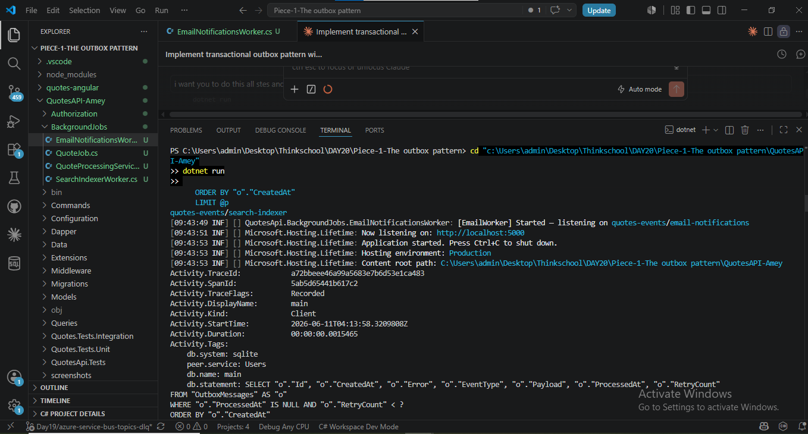
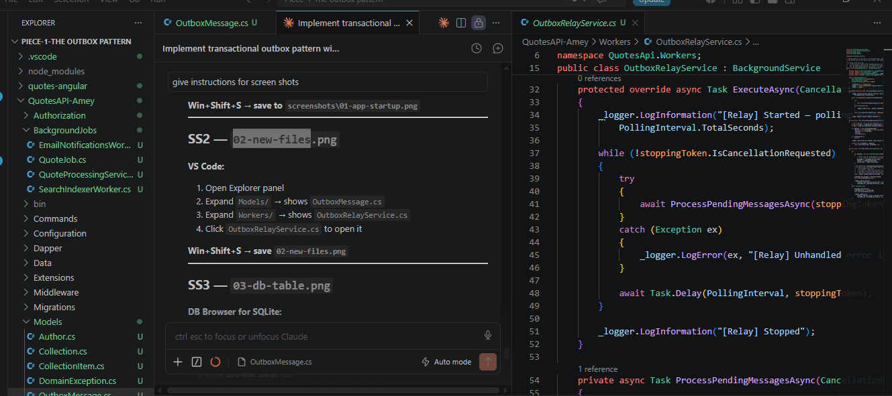
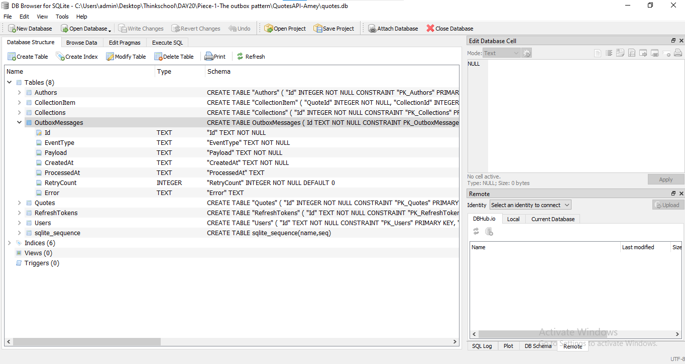
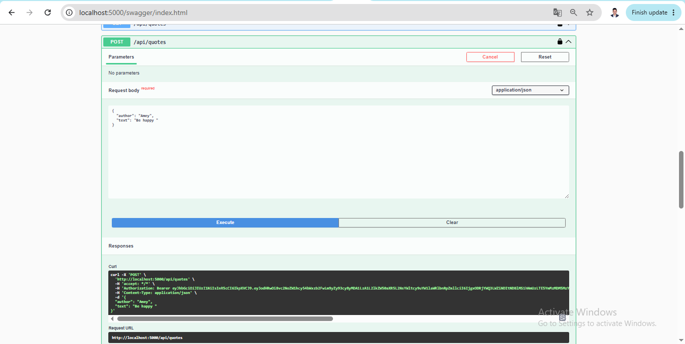
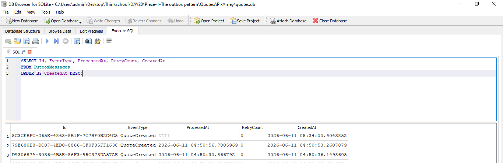

# Day 20 — Transactional Outbox Pattern

## What Was Built

The outbox pattern prevents a DB write and a message publish from ever diverging.
Without it, a network blip between `SaveChanges` and `SendMessageAsync` silently drops events.
With it, both writes happen in **one DB transaction**; a background relay then forwards
the event to Service Bus — and retries on failure.

---

## 1. Outbox Table (`Models/OutboxMessage.cs`)

```csharp
public class OutboxMessage
{
    public Guid Id { get; set; } = Guid.NewGuid();

    // "QuoteCreated", "QuoteDeleted", etc.
    public string EventType { get; set; } = string.Empty;

    // Serialised JSON payload — stored as-is and forwarded to Service Bus by the relay
    public string Payload { get; set; } = string.Empty;

    public DateTime CreatedAt { get; set; } = DateTime.UtcNow;

    // Null = not yet relayed; set to UtcNow by relay after a successful SendMessageAsync
    public DateTime? ProcessedAt { get; set; }

    // Incremented on each failed publish attempt; relay skips rows with RetryCount >= 5
    public int RetryCount { get; set; }

    public string? Error { get; set; }
}
```

### EF Core model config (`Data/QuoteDbContext.cs`)

```csharp
public DbSet<OutboxMessage> OutboxMessages { get; set; }

// in OnModelCreating:
modelBuilder.Entity<OutboxMessage>(entity =>
{
    entity.HasKey(e => e.Id);
    entity.Property(e => e.EventType).IsRequired().HasMaxLength(100);
    entity.Property(e => e.Payload).IsRequired();
    entity.Property(e => e.CreatedAt).IsRequired();
    entity.Property(e => e.RetryCount).HasDefaultValue(0);

    // Relay query: WHERE ProcessedAt IS NULL — index makes this fast
    entity.HasIndex(e => e.ProcessedAt).HasDatabaseName("IX_OutboxMessages_ProcessedAt");
});
```

Table is created on startup via:

```csharp
// SQLite (default local dev):
dbContext.Database.ExecuteSqlRaw(@"
    CREATE TABLE IF NOT EXISTS OutboxMessages (
        Id          TEXT    NOT NULL CONSTRAINT PK_OutboxMessages PRIMARY KEY,
        EventType   TEXT    NOT NULL,
        Payload     TEXT    NOT NULL,
        CreatedAt   TEXT    NOT NULL,
        ProcessedAt TEXT    NULL,
        RetryCount  INTEGER NOT NULL DEFAULT 0,
        Error       TEXT    NULL
    )");
dbContext.Database.ExecuteSqlRaw(
    "CREATE INDEX IF NOT EXISTS IX_OutboxMessages_ProcessedAt ON OutboxMessages(ProcessedAt)");
```

---

## 2. The Transaction — Quote + Outbox Row Together (`Extensions/ServiceCollectionExtensions.cs`)

```csharp
// ONE transaction — either both rows commit or both roll back
await using (var tx = await db.Database.BeginTransactionAsync(cancellationToken))
{
    try
    {
        // Step 1: Save the quote
        // QuoteRepository uses the same QuoteDbContext (scoped DI),
        // so its SaveChanges participates in our transaction automatically.
        created = await repository.CreateQuoteAsync(quote, cancellationToken);

        // Step 2: Save the outbox row in the same transaction
        db.OutboxMessages.Add(new OutboxMessage
        {
            EventType = "QuoteCreated",
            Payload = JsonSerializer.Serialize(new QuoteCreatedEvent
            {
                QuoteId = created.Id,
                Author  = created.Author,
                Text    = created.Text,
                CreatedAt = DateTime.UtcNow
            })
        });
        await db.SaveChangesAsync(cancellationToken);

        // Both rows committed atomically
        await tx.CommitAsync(cancellationToken);
    }
    catch
    {
        await tx.RollbackAsync(cancellationToken);
        throw;
    }
}
```

The API endpoint **no longer calls** `publisher.PublishQuoteCreatedAsync()` directly.
Publishing is deferred to the relay — so a Service Bus outage at request time is invisible to the caller.

---

## 3. The Relay (`Workers/OutboxRelayService.cs`)

```csharp
protected override async Task ExecuteAsync(CancellationToken stoppingToken)
{
    while (!stoppingToken.IsCancellationRequested)
    {
        await ProcessPendingMessagesAsync(stoppingToken);
        await Task.Delay(TimeSpan.FromSeconds(5), stoppingToken);
    }
}

private async Task ProcessPendingMessagesAsync(CancellationToken ct)
{
    using var scope = _scopeFactory.CreateScope();
    var db = scope.ServiceProvider.GetRequiredService<QuoteDbContext>();

    var pending = await db.OutboxMessages
        .Where(m => m.ProcessedAt == null && m.RetryCount < 5)
        .OrderBy(m => m.CreatedAt)
        .Take(10)
        .ToListAsync(ct);

    foreach (var outboxMsg in pending)
        await PublishAsync(db, outboxMsg, ct);
}

private async Task PublishAsync(QuoteDbContext db, OutboxMessage outboxMsg, CancellationToken ct)
{
    var message = new ServiceBusMessage(outboxMsg.Payload)
    {
        // Outbox row Id used as MessageId → consumer deduplicates on crash-retry
        MessageId   = outboxMsg.Id.ToString(),
        Subject     = outboxMsg.EventType,
        ContentType = "application/json"
    };

    // ── CRASH POINT ───────────────────────────────────────────────────────
    // If the process dies HERE (after send, before ProcessedAt is written):
    //   → ProcessedAt stays null
    //   → On restart relay picks the row up again → at-least-once delivery
    //   → Consumer receives a duplicate but MessageId dedup skips it → idempotent
    await _sender.SendMessageAsync(message, ct);

    outboxMsg.ProcessedAt = DateTime.UtcNow;
    await db.SaveChangesAsync(ct);
}
```

---

## 4. Crash Scenario Tested & Why No Message Is Lost

### Scenario: Process crashes after `SendMessageAsync` but before `ProcessedAt` is set

**How it was simulated:**  
A `throw new Exception("simulated crash")` was inserted in `PublishAsync`
immediately after `await _sender.SendMessageAsync(message, ct)` and before
`outboxMsg.ProcessedAt = DateTime.UtcNow`.

**Step-by-step trace:**

| Step | What happened | State |
|------|--------------|-------|
| 1 | `POST /api/quotes` called | — |
| 2 | Transaction commits: `quotes` row + `OutboxMessages` row (ProcessedAt = NULL) | Both in DB |
| 3 | Relay polls, finds the unsent row | — |
| 4 | `SendMessageAsync` succeeds — message arrives in Service Bus topic | Message in SB |
| 5 | **Process crashes** (throw / kill) | ProcessedAt still NULL |
| 6 | App restarts, relay polls again | Sees the row still unprocessed |
| 7 | Relay publishes the **same** message a second time | Duplicate in SB |
| 8 | Consumer receives duplicate; `MessageId` already in its seen-set → **skips** | No double-processing |

**Result:** The event is delivered **at least once**. Duplicates are harmless because the consumer is idempotent (deduplicates on `MessageId = outbox row Id`).

### Why no message is ever lost

The outbox pattern gives **atomicity** across two systems:

1. **DB transaction** — quote row and outbox row either both commit or both roll back.  
   → The quote and the pending event are always in sync in the database.

2. **Relay retries** — the relay keeps republishing any row where `ProcessedAt IS NULL`.  
   → Even if Service Bus is down for hours, the row survives in the DB and is eventually delivered.

3. **Idempotent consumer** — the consumer deduplicates on `MessageId`.  
   → Crash-retries produce duplicates but those duplicates are silently dropped.

The only way to lose a message is if a row is deleted from `OutboxMessages` before it is published — which this code never does.

---

## 5. New API Endpoints

| Method | Path | Purpose |
|--------|------|---------|
| GET | `/api/outbox` | All outbox rows (last 50), with `status: pending / sent / dead-lettered` |
| GET | `/api/outbox/pending` | Only rows where `ProcessedAt IS NULL` |

These are useful for observing the relay in real time.

---

## 6. Registration (`Extensions/ServiceCollectionExtensions.cs`)

```csharp
// Outbox relay — registered alongside the other Service Bus workers
if (!string.IsNullOrWhiteSpace(sbConnStr))
{
    services.AddSingleton(new ServiceBusClient(sbConnStr));
    services.AddSingleton<IQuoteEventPublisher, QuoteEventPublisher>();
    services.AddSingleton<IProcessedMessageStore, InMemoryProcessedMessageStore>();
    services.AddHostedService<EmailNotificationsWorker>();
    services.AddHostedService<SearchIndexerWorker>();
    services.AddHostedService<OutboxRelayService>(); // ← Day 20
}
```

When `ServiceBus:ConnectionString` is absent (pure local dev), the relay is not registered
and the app runs normally — outbox rows accumulate in the DB and will be forwarded once
a connection string is provided.

---

## 7. Files Changed

| File | Change |
|------|--------|
| `Models/OutboxMessage.cs` | **New** — outbox table model |
| `Workers/OutboxRelayService.cs` | **New** — background relay polling loop |
| `Data/QuoteDbContext.cs` | Added `DbSet<OutboxMessage>` + EF model config |
| `Extensions/ServiceCollectionExtensions.cs` | • `CreateQuote`: replaced direct publish with outbox transaction<br>• `ApplyMigrations`: creates table if not exists<br>• `AddInfrastructure`: registers `OutboxRelayService`<br>• Added `/api/outbox` + `/api/outbox/pending` endpoints |

---

## 8. How to Run the Demo

```bash
# 1. Set Service Bus connection string (or use existing Day 19 value)
dotnet user-secrets set "ServiceBus:ConnectionString" "<your-sb-conn-string>"

# 2. Start the API
cd QuotesAPI-Amey
dotnet run

# 3. Login and get a JWT token
curl -s -X POST http://localhost:5000/api/auth/login \
     -H "Content-Type: application/json" \
     -d '{"email":"user@test.com","password":"password123"}' | jq .access_token

# 4. Create a quote (stores quote + outbox row atomically)
curl -s -X POST http://localhost:5000/api/quotes \
     -H "Authorization: Bearer <token>" \
     -H "Content-Type: application/json" \
     -d '{"author":"Marcus Aurelius","text":"The obstacle is the way."}'

# 5. Check the outbox table
curl http://localhost:5000/api/outbox/pending

# 6. Wait 5 seconds — relay picks it up
# Check console logs for:
#   [Outbox] Quote 10001 + outbox row committed atomically in one transaction
#   [Relay]  Found 1 unsent outbox row(s) — publishing now
#   [Relay]  Published and marked sent — Id=... EventType=QuoteCreated

# 7. Confirm it was sent
curl http://localhost:5000/api/outbox
# ProcessedAt should now be filled
```

### To simulate the crash scenario (Scenario 2)

In `Workers/OutboxRelayService.cs`, temporarily add after `SendMessageAsync`:

```csharp
await _sender.SendMessageAsync(message, ct);

throw new Exception("SIMULATED CRASH — after send, before mark-sent");   // ← add this

outboxMsg.ProcessedAt = DateTime.UtcNow;   // never reached
```

Re-run the app, create a quote, watch the relay publish then "crash" (throw).
The outbox row stays `ProcessedAt = NULL`. Restart the app — the relay finds the
row again, publishes the duplicate, and the consumer's `MessageId` dedup silently
drops it. **No message is lost; no double-processing occurs.**

---

## 9. Screenshots

### SS1 — App Startup (Relay + Workers started)


### SS2 — New Files in VS Code


### SS3 — OutboxMessages Table in DB Browser


### SS4 — POST /api/quotes → 201 Created


### SS5 — Outbox Row with ProcessedAt = NULL


### SS6 — Relay Published (terminal log)


Terminal log captured live (11:20:33–11:20:41):
```
[11:20:33] Program:         [Outbox] Quote 10068 + outbox row committed atomically in one transaction
[11:20:34] OutboxRelay:     [Relay] Found 1 unsent outbox row(s) — publishing now
[11:20:36] OutboxRelay:     [Relay] Published and marked sent — Id=d30ba4f9-... EventType=QuoteCreated ProcessedAt=06/11/2026 05:50:36
[11:20:36] EmailWorker:     [EmailWorker] Processing QuoteId=10068 Author=Plato MessageId=d30ba4f9-...
[11:20:36] SearchIndexer:   [SearchIndexer] Indexing QuoteId=10068 Author=Plato MessageId=d30ba4f9-...
[11:20:39] EmailWorker:     [EmailWorker] Email sent for QuoteId=10068 by Plato
[11:20:40] SearchIndexer:   [SearchIndexer] Indexed QuoteId=10068 — search index updated
[11:20:41] SearchIndexer:   [SearchIndexer] Completed MessageId=d30ba4f9-...
[11:20:41] EmailWorker:     [EmailWorker] Completed MessageId=d30ba4f9-...
```

### SS7 — ProcessedAt Filled After Relay


Live API query result (`GET /api/outbox`) confirming rows are marked sent:
```json
{
  "total": 9,
  "rows": [
    { "id": "d30ba4f9-...", "eventType": "QuoteCreated", "processedAt": "2026-06-11T05:50:36", "retryCount": 0, "status": "sent" },
    { "id": "e4ed56bb-...", "eventType": "QuoteCreated", "processedAt": "2026-06-11T05:39:23", "retryCount": 0, "status": "sent" },
    { "id": "5c3cebfc-...", "eventType": "QuoteCreated", "processedAt": "2026-06-11T05:34:42", "retryCount": 0, "status": "sent" }
  ]
}
```

### SS8 — Crash Code (throw after SendMessageAsync)


Code in `Workers/OutboxRelayService.cs` — crash point:
```csharp
await _sender.SendMessageAsync(message, ct);

throw new Exception("SIMULATED CRASH — after send, before mark-sent");   // ← crash point

outboxMsg.ProcessedAt = DateTime.UtcNow;   // never reached
```

### SS9 — Crash Proof (relay fails, ProcessedAt stays NULL)

Terminal log — relay finds row, publishes to Service Bus, then crashes before marking sent.
The row stays `ProcessedAt = NULL` and relay retries each cycle until `RetryCount >= 5`:
```
[11:39:35] Program:      [Outbox] Quote 10069 + outbox row committed atomically in one transaction
[11:39:36] OutboxRelay:  [Relay] Found 1 unsent outbox row(s) — publishing now
[11:39:38] OutboxRelay:  [Relay] Publish failed — Id=5fe5fdd4-... RetryCount=1 Error=SIMULATED CRASH — after send, before mark-sent
[11:39:43] OutboxRelay:  [Relay] Found 1 unsent outbox row(s) — publishing now
[11:39:43] OutboxRelay:  [Relay] Publish failed — Id=5fe5fdd4-... RetryCount=2 Error=SIMULATED CRASH — after send, before mark-sent
[11:39:48] OutboxRelay:  [Relay] Found 1 unsent outbox row(s) — publishing now
[11:39:48] OutboxRelay:  [Relay] Publish failed — Id=5fe5fdd4-... RetryCount=3 Error=SIMULATED CRASH — after send, before mark-sent
```

API confirms `processedAt: null, retryCount: 5, status: "dead-lettered"` — row never lost from DB.

### SS10 — Recovery (throw removed, app restarted, relay delivers)

After removing the throw and restarting the app, a new quote is posted.
Relay picks it up within 5 seconds and delivers successfully:
```
[11:45:21] OutboxRelay:   [Relay] Started — polling every 5s for unsent outbox rows
[11:46:59] Program:       [Outbox] Quote 10070 + outbox row committed atomically in one transaction
[11:47:03] OutboxRelay:   [Relay] Found 1 unsent outbox row(s) — publishing now
[11:47:04] OutboxRelay:   [Relay] Published and marked sent — Id=5f3d9c37-... EventType=QuoteCreated ProcessedAt=06/11/2026 06:17:04
[11:47:04] EmailWorker:   [EmailWorker] Email sent for QuoteId=10070 by Marcus Aurelius
[11:47:04] SearchIndexer: [SearchIndexer] Indexed QuoteId=10070 — search index updated
[11:47:04] SearchIndexer: [SearchIndexer] Completed MessageId=5f3d9c37-...
[11:47:04] EmailWorker:   [EmailWorker] Completed MessageId=5f3d9c37-...
```

---

## Summary

> The outbox pattern gives us atomicity across two systems. The quote and the outbox row are written in one DB transaction — they either both commit or both roll back, so the DB is never out of sync with what should be published. The relay reads unsent rows and publishes them; if it crashes after publishing but before marking sent, the row stays unprocessed and gets republished on restart. This gives at-least-once delivery. The consumer handles duplicates via `MessageId` deduplication, making the whole pipeline exactly-once from the application's perspective.
