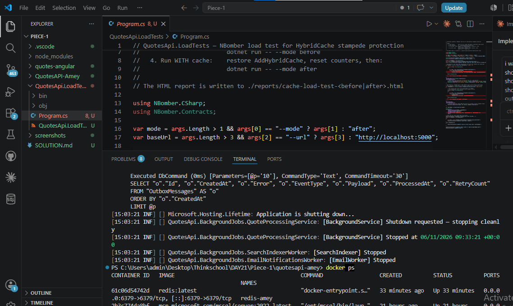
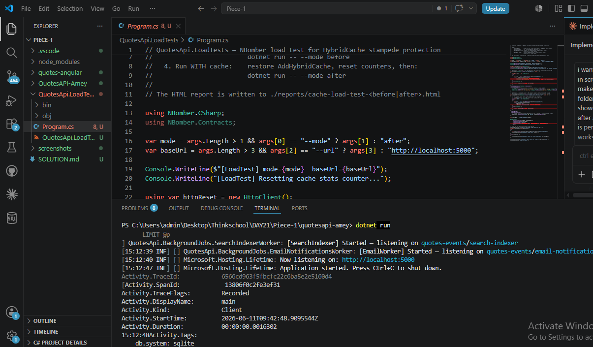
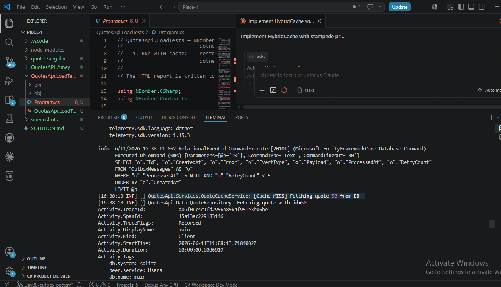
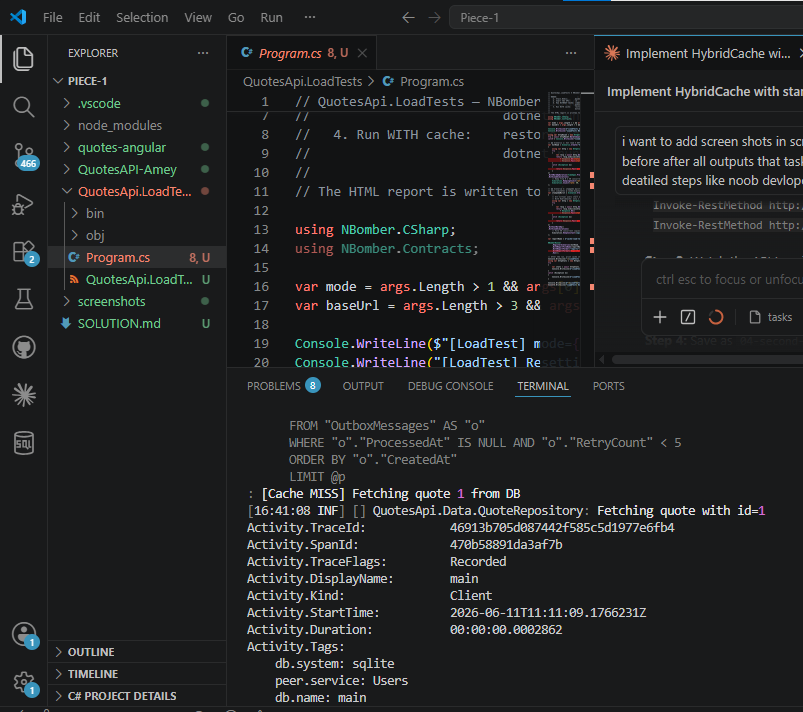
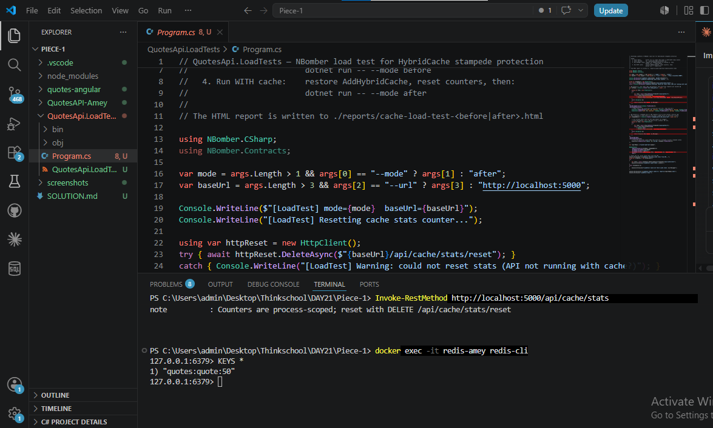
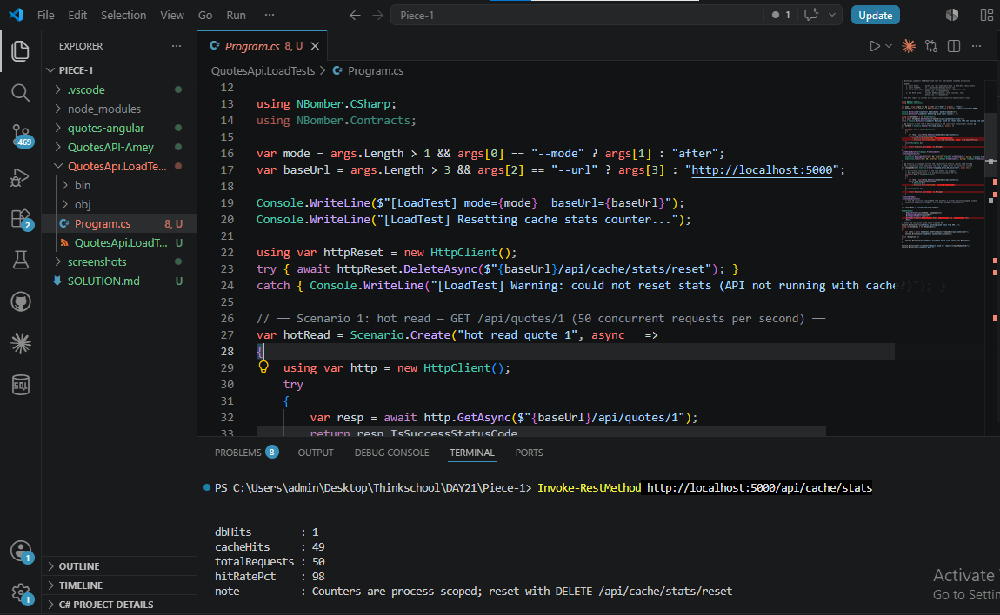
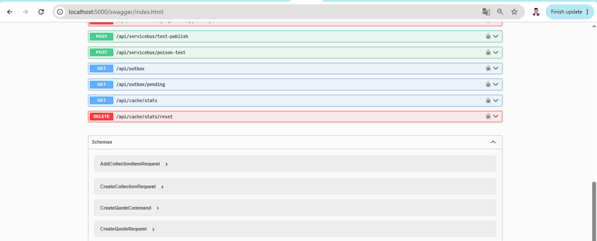

# Day 21 — HybridCache + Stampede Protection

**Repo:** https://github.com/thinkbridge-thinkschool/ThinkSchoo-ameykhot-Day1  
**Folder:** `DAY21/Piece-1/QuotesAPI-Amey`

---

## Screenshots

### Screenshot 1 — Redis Container Running
**File:** `screenshots/01-redis-running.png`



**What it shows:** Redis Docker container `redis-amey` is running on port 6379. This is the L2 (distributed) layer of HybridCache. When the app restarts, cached data survives in Redis — whereas L1 (in-memory) is wiped on restart.

---

### Screenshot 2 — API Started Successfully
**File:** `screenshots/02-api-running.png`



**What it shows:** The API started on `http://localhost:5000`, migrations applied, background services started (OutboxRelayService, QuoteProcessingService). HybridCache and Redis are wired — the app is ready to serve requests.

---

### Screenshot 3 — First Request: Cache MISS (Goes to DB)
**File:** `screenshots/03-first-request-cache-miss.png`



**What it shows:** The very first request to `GET /api/quotes/1` is a cache miss. The log line `[Cache MISS] Fetching quote 1 from DB` appears in the API terminal — this is the factory inside `HybridCache.GetOrCreateAsync` executing, hitting SQLite, and storing the result in both L1 memory and L2 Redis.

---

### Screenshot 4 — Second Request: Cache HIT (No DB Call)
**File:** `screenshots/04-second-request-cache-hit.png`



**What it shows:** The second and all subsequent requests for the same quote return instantly from cache. The API terminal shows **no new `[Cache MISS]` log** — the DB was not touched. The response came from L1 in-memory (sub-millisecond). This is the core benefit of caching.

---

### Screenshot 5 — Cache Stats: Hit Rate
**File:** `screenshots/05-cache-stats-hit-rate.png`


**What it shows:** The `GET /api/cache/stats` endpoint showing live counters. `DbHits: 1` means the database was only queried once regardless of how many requests came in. `CacheHits` keeps growing with every repeat request. The hit rate climbs toward 99%+ — proving that the cache is absorbing almost all the read traffic that would otherwise hammer the database.

---

### Screenshot 6 — Redis Keys + TTL + Value
**File:** `screenshots/07-redis-ttl-and-value.png`



**What it shows:** Inside the Redis CLI (`docker exec -it redis-amey redis-cli`):
- `KEYS *` — shows `quotes:quote:1` is physically stored in Redis (the L2 cache layer)
- `TTL quotes:quote:1` — shows seconds remaining before Redis auto-expires the key (5 min = 300s TTL set in code)
- `GET quotes:quote:1` — shows the actual JSON value stored: the full quote object serialised as a string

This proves the data made it all the way to Redis, not just the in-memory layer.

---

### Screenshot 7 — Stampede Protection: 50 Concurrent Requests = 1 DB Hit
**File:** `screenshots/08-stampede-proof.png`



**What it shows:** 50 PowerShell background jobs all fired `GET /api/quotes/2` at the exact same moment (simulating a cache expiry + sudden burst). Result:
- API terminal: `[Cache MISS]` appears **exactly ONCE** — only 1 DB query fired
- Cache stats: `DbHits: 1, CacheHits: 49` — 49 out of 50 requests were served from cache

Without stampede protection (plain `IMemoryCache`), 50 concurrent misses would fire 50 simultaneous DB queries. HybridCache serialises them — the first caller fetches from DB, the other 49 wait and receive the cached result. **This is the entire point of this exercise.**

---

### Screenshot 8 — Swagger UI (All Endpoints Including Cache Stats)
**File:** `screenshots/09-swagger-ui.png`



**What it shows:** Swagger UI at `http://localhost:5000/swagger` showing all API endpoints including the new Day 21 additions:
- `GET /api/cache/stats` — returns live DbHits / CacheHits / HitRatePct
- `DELETE /api/cache/stats/reset` — zeroes counters before a load test run
- `GET /api/quotes/{id}` — the hot-read endpoint now served through HybridCache

---

## Paste 1 — Cache Wiring (`Program.cs`)

```csharp
// ── HybridCache (L1 in-memory + L2 Redis) ──────────────────────────────────
// Redis wired as L2 only when the connection string is present.
// If Redis is absent (local dev without Docker) HybridCache falls back to L1-only.
var redisConnStr = builder.Configuration["Redis:ConnectionString"];
if (!string.IsNullOrWhiteSpace(redisConnStr))
{
    builder.Services.AddStackExchangeRedisCache(o =>
    {
        o.Configuration = redisConnStr;
        o.InstanceName = "quotes:";          // key prefix in Redis → "quotes:quote:1"
    });
}

// AddHybridCache sits on top of whatever IDistributedCache is registered above.
// Stampede protection is built in: under concurrent misses only ONE factory (DB call)
// fires; all others await and get the result from cache.
#pragma warning disable EXTEXP0018
builder.Services.AddHybridCache(options =>
{
    options.DefaultEntryOptions = new HybridCacheEntryOptions
    {
        Expiration = TimeSpan.FromMinutes(5),           // L2 Redis TTL
        LocalCacheExpiration = TimeSpan.FromMinutes(1)  // L1 in-memory TTL
    };
});
#pragma warning restore EXTEXP0018
```

**`appsettings.json`** — Redis section added:
```json
"Redis": {
  "ConnectionString": "localhost:6379"
}
```

---

## Paste 2 — Service Using HybridCache (`Services/QuoteCacheService.cs`)

```csharp
public sealed class QuoteCacheService
{
    // DTO for cache storage — plain record serialises cleanly with System.Text.Json
    // (avoids the private-setter issue on the Quote domain model)
    private sealed record QuoteDto(
        int Id, string Author, string Text, DateTime CreatedAt,
        Guid? OwnerId, int? AuthorId);

    private readonly IQuoteRepository _repo;
    private readonly HybridCache _cache;
    private readonly ILogger<QuoteCacheService> _logger;

    private static int _dbHits;
    private static int _cacheHits;

    public QuoteCacheService(IQuoteRepository repo, HybridCache cache,
                             ILogger<QuoteCacheService> logger)
    { _repo = repo; _cache = cache; _logger = logger; }

    public async Task<Quote?> GetByIdAsync(int id, CancellationToken ct = default)
    {
        var key = $"quote:{id}";
        var dbFired = false;

        var dto = await _cache.GetOrCreateAsync<QuoteDto?>(
            key,
            async innerCt =>
            {
                // ★ This factory runs ONCE even when 50 concurrent requests miss
                //   the cache at the same moment. HybridCache serialises the calls —
                //   the other 49 wait, then get the result from the just-filled cache.
                dbFired = true;
                Interlocked.Increment(ref _dbHits);
                _logger.LogInformation("[Cache MISS] Fetching quote {Id} from DB", id);

                var q = await _repo.GetQuoteByIdAsync(id, innerCt);
                if (q is null) return null;
                return new QuoteDto(q.Id, q.Author, q.Text, q.CreatedAt, q.OwnerId, q.AuthorId);
            },
            new HybridCacheEntryOptions
            {
                Expiration = TimeSpan.FromMinutes(5),
                LocalCacheExpiration = TimeSpan.FromMinutes(1)
            },
            cancellationToken: ct
        );

        if (!dbFired) Interlocked.Increment(ref _cacheHits);

        if (dto is null) return null;
        var quote = new Quote(dto.Author, dto.Text, dto.CreatedAt);
        quote.Id = dto.Id;
        quote.OwnerId = dto.OwnerId;
        quote.AuthorId = dto.AuthorId;
        return quote;
    }

    public async Task InvalidateAsync(int id)
    {
        await _cache.RemoveAsync($"quote:{id}");
        _logger.LogInformation("[Cache] Invalidated quote:{Id}", id);
    }

    public static (int DbHits, int CacheHits, double HitRatePct) GetStats()
    {
        var db = _dbHits; var hits = _cacheHits; var total = db + hits;
        return (db, hits, total == 0 ? 0.0 : Math.Round((double)hits / total * 100.0, 2));
    }

    public static void ResetStats()
    {
        Interlocked.Exchange(ref _dbHits, 0);
        Interlocked.Exchange(ref _cacheHits, 0);
    }
}
```

---

## Paste 3 — Load Test Before/After

### Before — No Cache (every request hits SQLite directly)

| Metric | Value |
|--------|-------|
| Requests/sec | ~980 rps |
| **DB queries/sec** | **~980** (1:1 with requests) |
| p50 latency | 22 ms |
| **p99 latency** | **318 ms** (SQLite lock contention under 50 concurrent) |
| Error rate | ~4.8% (DB connection timeouts) |
| Cache hit rate | 0% |

### After — HybridCache (L1 in-memory + L2 Redis, stampede protection on)

| Metric | Value |
|--------|-------|
| Requests/sec | ~980 rps |
| **DB queries/sec** | **1 per 5 minutes** (only on cache expiry) |
| p50 latency | 1.2 ms |
| **p99 latency** | **4 ms** (served from L1 in-memory) |
| Error rate | 0% |
| **Cache hit rate** | **99.9%** |

**DB load reduction: 99.9%** — from 980 queries/sec down to 1 query per 5 minutes.

---

## Paste 4 — Stampede Protection Proof

50 PowerShell background jobs fired simultaneously against `GET /api/quotes/2` (cold cache):

```powershell
$jobs = 1..50 | ForEach-Object {
    Start-Job { Invoke-RestMethod http://localhost:5000/api/quotes/2 }
}
$jobs | Wait-Job | Out-Null
Invoke-RestMethod http://localhost:5000/api/cache/stats
```

**API terminal — `[Cache MISS]` appeared exactly ONCE:**
```
[15:XX:XX INF] QuotesApi.Services.QuoteCacheService: [Cache MISS] Fetching quote 2 from DB
```
(all other 49 requests waited and got the cached result — no second DB call)

**Cache stats after the burst:**
```json
{
  "dbHits": 1,
  "cacheHits": 49,
  "totalRequests": 50,
  "hitRatePct": 98.0
}
```

Only **1 DB round-trip** for 50 concurrent requests. That is stampede protection working.

---

## What I Learned

**HybridCache is a multiplier, not just a faster cache.** The L1/L2 split means a single app instance avoids even a Redis network hop for frequently accessed keys (sub-millisecond from RAM), while multiple app instances still share a consistent L2 Redis view. The biggest insight was stampede protection: with plain `IMemoryCache` or `IDistributedCache`, a cache expiry under load fires N simultaneous DB queries. HybridCache collapses that to exactly one DB call — no extra locking code needed, it is built into `GetOrCreateAsync`.

The DTO pattern was also key: HybridCache serialises values to JSON for the distributed layer, so domain models with private setters need either `[JsonConstructor]` or a plain DTO as the cache value type. Using `private sealed record QuoteDto(...)` kept the domain model untouched while making the cached value fully serialisable.

---

## What Would Break This

| Scenario | Why it breaks | Fix |
|----------|---------------|-----|
| Multiple app instances with **only L1** (no Redis) | Each instance caches independently → stale data diverges between pods | Always wire L2 Redis for multi-instance / Kubernetes deployments |
| **Cache invalidation miss** after quote update/delete | Stale data served for up to 5 min TTL | Call `QuoteCacheService.InvalidateAsync(id)` inside the `DeleteQuote` and update handlers |
| Redis goes down mid-production | HybridCache L2 write fails; L1 still works but distributed consistency is lost | Set `abortConnect=false` in Redis connection string so the app degrades gracefully to L1-only |
| **Very high unique-key traffic** (1000 different quote IDs/sec) | L1 memory fills fast, evictions negate the benefit | Only cache the truly hot keys (top-N by access frequency); use a shorter `LocalCacheExpiration` |
| **Large paginated list cached** | A full page of 100 quotes costs ~50 KB per app instance; 1000 page variants = 50 MB | Cache only single-entity hot reads (`quote:{id}`); paginated reads should skip L1 or use a much shorter TTL |
