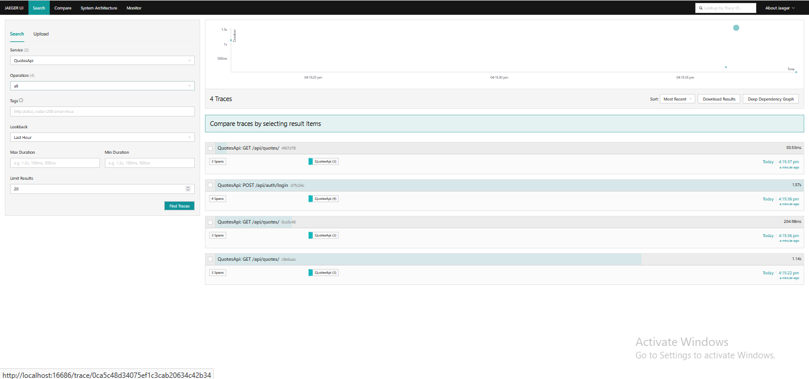

# Day 4 – Piece 5: Add OpenTelemetry Tracing

## OTel Setup

### Packages added (`QuotesApi.csproj`)

| Package | Version | Purpose |
|---------|---------|---------|
| `OpenTelemetry.Extensions.Hosting` | 1.15.3 | Core DI integration (`AddOpenTelemetry()`) |
| `OpenTelemetry.Instrumentation.AspNetCore` | 1.15.2 | Auto-span per HTTP request |
| `OpenTelemetry.Instrumentation.EntityFrameworkCore` | 1.15.1-beta.1 | Child span per EF Core query |
| `OpenTelemetry.Instrumentation.Http` | 1.15.1 | Child span per outbound `HttpClient` call |
| `OpenTelemetry.Exporter.OpenTelemetryProtocol` | 1.15.3 | OTLP gRPC export to Jaeger / Aspire |

---

### Configuration (`Program.cs`)

```csharp
builder.Services.AddOpenTelemetry()
    .ConfigureResource(r => r.AddService("QuotesApi"))
    .WithTracing(t => t
        .AddAspNetCoreInstrumentation()
        .AddEntityFrameworkCoreInstrumentation()
        .AddHttpClientInstrumentation()
        .AddSource(QuotesApi.Services.AuthTokenService.ActivitySourceName)
        .AddOtlpExporter(o =>
        {
            o.Endpoint = new Uri(builder.Configuration["OpenTelemetry:OtlpEndpoint"] ?? "http://localhost:4317");
        }));
```

The OTLP endpoint is read from `appsettings.json → OpenTelemetry:OtlpEndpoint` (default `http://localhost:4317`), so it can be overridden per environment.

---

### Custom spans (`Services/AuthTokenService.cs`)

`AuthTokenService` is the most non-trivial operation not covered by automatic instrumentation — it issues JWTs, hashes/stores refresh tokens, and detects token reuse. Two custom spans were added:

```csharp
public const string ActivitySourceName = "QuotesApi.AuthTokenService";
private static readonly ActivitySource _activitySource = new(ActivitySourceName);

// In IssueTokenPairAsync:
using var activity = _activitySource.StartActivity("issue-token-pair");
activity?.SetTag("user.id", user.Id.ToString());
activity?.SetTag("user.email", user.Email);
activity?.SetTag("token.lifetime_seconds", accessLifetimeSeconds);

// In RefreshAsync — security event tagging on reuse:
using var activity = _activitySource.StartActivity("refresh-token");
// ...on reuse detected:
activity?.SetTag("security.reuse_detected", true);
activity?.SetTag("user.id", existing.UserId.ToString());
activity?.SetStatus(ActivityStatusCode.Error, "Token reuse detected");
```

The `ActivitySourceName` constant is referenced in `Program.cs` via `.AddSource(...)` so OTel knows to sample and export these spans.

---

### Running a local Jaeger to see traces

```bash
docker run -d --name jaeger \
  -e COLLECTOR_OTLP_ENABLED=true \
  -p 4317:4317 \
  -p 16686:16686 \
  jaegertracing/all-in-one:latest
```

Then start the API (`dotnet run`) and call any endpoint:

```bash
curl -s http://localhost:5000/api/quotes
```

Open **http://localhost:16686** → select service `QuotesApi` → find the trace.

---

### Trace screenshot — Jaeger UI

Nested spans for `POST /api/auth/login` (ASP.NET Core → EF Core SELECT → custom `issue-token-pair` → EF Core INSERT):




### Trace structure for `POST /api/auth/login`

A login call produces nested spans visible in Jaeger:

```
POST /api/auth/login                          (AspNetCore instrumentation)
  └── SELECT ... FROM Users WHERE Email=?     (EF Core instrumentation)
  └── issue-token-pair                        (custom span — AuthTokenService)
        user.id = "9bb72369-..."
        user.email = "user@test.com"
        token.lifetime_seconds = 900
        └── INSERT INTO RefreshTokens ...     (EF Core instrumentation)
```

---

### Log ↔ Trace correlation

Serilog already stamps every log line with `TraceId` from `HttpContext.TraceIdentifier`. In .NET 10, `Activity.Current?.TraceId` is the W3C trace ID that OpenTelemetry uses. These are the **same ID** — logs and traces correlate automatically without any extra wiring.

Sample correlated output:

```
[14:47:32 INF] [00-4bf92f3577b34da6a3ce929d0e0e4736-00f067aa0ba902b7-01] Program: Login attempt for user user@test.com
[14:47:32 INF] [00-4bf92f3577b34da6a3ce929d0e0e4736-00f067aa0ba902b7-01] Program: Login succeeded for user 9bb72369-... (user@test.com)
```

The bracketed value is the W3C `traceparent` trace ID — paste it into Jaeger's search to jump directly to the trace.

---

## What I learned

OpenTelemetry's auto-instrumentation removes the tedious boilerplate of manually timing and tagging every database call and HTTP request. The real insight was that the W3C TraceId from `Activity.Current` is the same identifier Serilog emits in `{TraceId}` — you get free log-to-trace correlation without writing a single bridge. Custom `ActivitySource` spans are cheap to add (`source.StartActivity(...)` + nullable tags) and only need to be registered once with `.AddSource(...)` in the pipeline.

## What would break this

- **No Jaeger / collector running**: The OTLP exporter will queue and eventually drop spans silently — the API keeps working, but traces are lost. For production, configure the exporter with a retry policy or use the in-process console exporter as a fallback.
- **High-cardinality tags**: Tagging `user.email` on every span creates a unique tag value per user — this causes cardinality explosions in Jaeger's storage backend. For production, use `user.id` only (a stable GUID) and avoid tagging raw email strings.
- **Missing `.AddSource(...)`**: If the `ActivitySource` name is not registered via `.AddSource(ActivitySourceName)`, the `StartActivity` calls return `null` and custom spans are silently dropped. The null-conditional `?.` guards prevent crashes but no spans are exported.
- **Sampling rate**: Default is always-on (sample everything). Under high traffic this can overwhelm the collector — configure a tail-based or probabilistic sampler before going to production.
