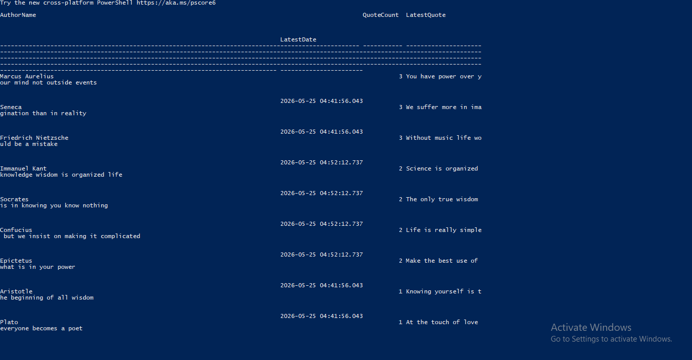
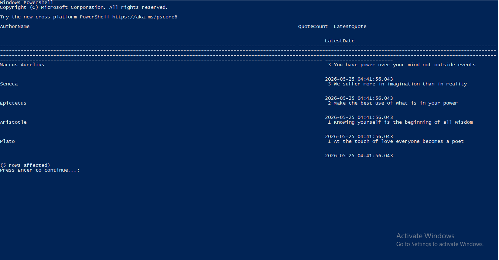
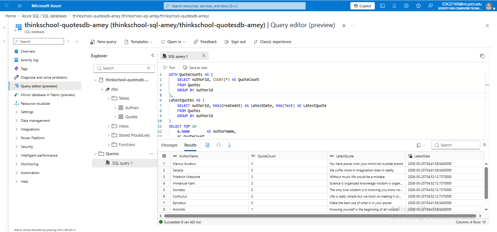

# Day 7 — Joins and CTEs at Depth

## Azure Resources

| Resource | Name |
|---|---|
| Resource Group | thinkschool-rg-amey |
| SQL Server | thinkschool-sql-amey |
| SQL Database | thinkschool-quotesdb-amey |
| Admin Login | sqladmin-amey |
| Location | Central India |

---

## Schema

```sql
Authors (Id INT PK IDENTITY, Name NVARCHAR(100))
Quotes  (Id INT PK IDENTITY, AuthorId INT FK → Authors.Id, Text NVARCHAR(500), CreatedAt DATETIME)
```

---

## Step 8 — Create Tables and Seed Data

```sql
CREATE TABLE Authors (
    Id   INT PRIMARY KEY IDENTITY,
    Name NVARCHAR(100)
);
GO

CREATE TABLE Quotes (
    Id        INT PRIMARY KEY IDENTITY,
    AuthorId  INT FOREIGN KEY REFERENCES Authors(Id),
    Text      NVARCHAR(500),
    CreatedAt DATETIME DEFAULT GETDATE()
);
GO

INSERT INTO Authors VALUES
('Marcus Aurelius'), ('Seneca'), ('Epictetus'), ('Aristotle'), ('Plato'),
('Socrates'), ('Friedrich Nietzsche'), ('Immanuel Kant'), ('René Descartes'), ('Confucius');
GO

INSERT INTO Quotes (AuthorId, Text) VALUES
(1, 'You have power over your mind not outside events'),
(1, 'The impediment to action advances action'),
(1, 'Very little is needed to make a happy life'),
(2, 'Luck is what happens when preparation meets opportunity'),
(2, 'We suffer more in imagination than in reality'),
(2, 'Begin at once to live and count each day as a separate life'),
(3, 'Make the best use of what is in your power'),
(3, 'He is a wise man who does not grieve'),
(4, 'Knowing yourself is the beginning of all wisdom'),
(5, 'At the touch of love everyone becomes a poet'),
(6, 'The only true wisdom is in knowing you know nothing'),
(6, 'Education is the kindling of a flame not the filling of a vessel'),
(7, 'Without music life would be a mistake'),
(7, 'That which does not kill us makes us stronger'),
(7, 'In individuals insanity is rare but in groups it is the rule'),
(8, 'Act only according to that maxim by which you can also will it to be universal'),
(8, 'Science is organized knowledge wisdom is organized life'),
(9, 'I think therefore I am'),
(10, 'It does not matter how slowly you go as long as you do not stop'),
(10, 'Life is really simple but we insist on making it complicated');
GO
```

---

## Step 9 — CTE Query

```sql
WITH QuoteCounts AS (
    SELECT
        AuthorId,
        COUNT(*) AS QuoteCount
    FROM Quotes
    GROUP BY AuthorId
),
LatestQuotes AS (
    SELECT
        AuthorId,
        MAX(CreatedAt) AS LatestDate,
        MAX(Text)      AS LatestQuote
    FROM Quotes
    GROUP BY AuthorId
)
SELECT TOP 10
    a.Name        AS AuthorName,
    qc.QuoteCount,
    lq.LatestQuote,
    lq.LatestDate
FROM Authors         a
INNER JOIN QuoteCounts qc ON a.Id = qc.AuthorId
INNER JOIN LatestQuotes lq ON a.Id = lq.AuthorId
ORDER BY qc.QuoteCount DESC;
GO
```

---

## Actual Result (live run on Azure SQL — 2026-05-25)

| # | AuthorName | QuoteCount | LatestQuote | LatestDate |
|---|---|---|---|---|
| 1 | Marcus Aurelius | 3 | You have power over your mind not outside events | 2026-05-25 04:41:56 |
| 2 | Seneca | 3 | We suffer more in imagination than in reality | 2026-05-25 04:41:56 |
| 3 | Friedrich Nietzsche | 3 | Without music life would be a mistake | 2026-05-25 04:52:12 |
| 4 | Immanuel Kant | 2 | Science is organized knowledge wisdom is organized life | 2026-05-25 04:52:12 |
| 5 | Socrates | 2 | The only true wisdom is in knowing you know nothing | 2026-05-25 04:52:12 |
| 6 | Confucius | 2 | Life is really simple but we insist on making it complicated | 2026-05-25 04:52:12 |
| 7 | Epictetus | 2 | Make the best use of what is in your power | 2026-05-25 04:41:56 |
| 8 | Aristotle | 1 | Knowing yourself is the beginning of all wisdom | 2026-05-25 04:41:56 |
| 9 | Plato | 1 | At the touch of love everyone becomes a poet | 2026-05-25 04:41:56 |
| 10 | René Descartes | 1 | I think therefore I am | 2026-05-25 04:52:12 |

**(10 rows affected)**

---

## Screenshots

### sqlcmd Terminal Output





### Azure Portal — Query Editor



---

## Why CTE over correlated subquery?

A CTE computes each aggregate (`COUNT`, `MAX`) once as a named set that the optimizer can hash and reuse. A correlated subquery in `SELECT` re-executes once per output row, making the query plan O(n × m) instead of O(n).

---

## Azure CLI Steps Run

| Step | Command | Result |
|---|---|---|
| 1 | `az login` | Logged in as E2K22169@ms.pict.edu |
| 2 | `az group create` | thinkschool-rg-amey created in Central India |
| 3 | `az sql server create` | thinkschool-sql-amey.database.windows.net ready |
| 4 | `az sql db create` | thinkschool-quotesdb-amey Online (Basic tier) |
| 5 | `az sql server firewall-rule create` | IP 115.160.209.210 + Azure services allowed |
| 6 | `az sql db show-connection-string` | sqlcmd connection string retrieved |
| 7–9 | `sqlcmd` | Tables created, 20 rows seeded, TOP 10 CTE query ran |

---

## Files

| File | Purpose |
|---|---|
| `queries.sql` | DDL, seed data, and CTE query |
| `Result.png` | Screenshot of live sqlcmd output (part 1) |
| `Result1.png` | Screenshot of live sqlcmd output (part 2) |
| `azure_portal.png` | Azure Portal Query Editor result screenshot |
| `SOLUTION.md` | This submission document |
