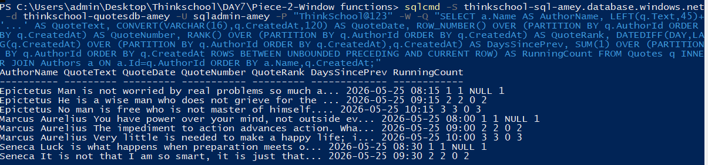
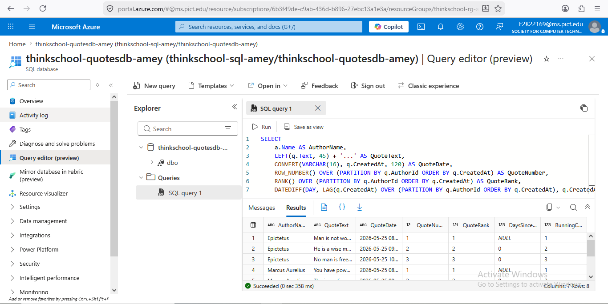

# Day 7 Piece 2 — Window Functions

## GitHub Folder
`DAY7/Piece-2-Window functions/`

---

## Window Function SQL Query

```sql
SELECT
    a.Name                          AS AuthorName,
    q.Text                          AS QuoteText,
    q.CreatedAt                     AS QuoteDate,

    -- Row number per author
    ROW_NUMBER() OVER (
        PARTITION BY q.AuthorId
        ORDER BY q.CreatedAt
    )                               AS QuoteNumber,

    -- Rank per author
    RANK() OVER (
        PARTITION BY q.AuthorId
        ORDER BY q.CreatedAt
    )                               AS QuoteRank,

    -- Gap in days since previous quote
    DATEDIFF(DAY,
        LAG(q.CreatedAt) OVER (
            PARTITION BY q.AuthorId
            ORDER BY q.CreatedAt
        ),
        q.CreatedAt
    )                               AS DaysSincePreviousQuote,

    -- Running count of quotes per author
    SUM(1) OVER (
        PARTITION BY q.AuthorId
        ORDER BY q.CreatedAt
        ROWS BETWEEN UNBOUNDED PRECEDING AND CURRENT ROW
    )                               AS RunningCount

FROM Quotes q
INNER JOIN Authors a ON a.Id = q.AuthorId
ORDER BY a.Name, q.CreatedAt;
```

---

## Sample Result Rows

Query executed against `thinkschool-quotesdb-amey` on Azure SQL (Central India).

```
AuthorName       | QuoteText                                                                              | QuoteDate           | QuoteNumber | QuoteRank | DaysSincePreviousQuote | RunningCount
-----------------|----------------------------------------------------------------------------------------|---------------------|-------------|-----------|------------------------|-------------
Epictetus        | Man is not worried by real problems so much as by his imagined anxieties...           | 2026-05-25 08:15:00 | 1           | 1         | NULL                   | 1
Epictetus        | He is a wise man who does not grieve for the things which he has not...               | 2026-05-25 09:15:00 | 2           | 2         | 0                      | 2
Epictetus        | No man is free who is not master of himself.                                          | 2026-05-25 10:15:00 | 3           | 3         | 0                      | 3
Marcus Aurelius  | You have power over your mind, not outside events. Realize this, and you will find... | 2026-05-25 08:00:00 | 1           | 1         | NULL                   | 1
Marcus Aurelius  | The impediment to action advances action. What stands in the way becomes the way.     | 2026-05-25 09:00:00 | 2           | 2         | 0                      | 2
Marcus Aurelius  | Very little is needed to make a happy life; it is all within yourself...              | 2026-05-25 10:00:00 | 3           | 3         | 0                      | 3
Seneca           | Luck is what happens when preparation meets opportunity.                               | 2026-05-25 08:30:00 | 1           | 1         | NULL                   | 1
Seneca           | It is not that I am so smart, it is just that I stay with problems longer.            | 2026-05-25 09:30:00 | 2           | 2         | 0                      | 2

(8 rows affected)
```

> **Note:** `DaysSincePreviousQuote` is NULL for the first quote per author — correct behaviour, as no previous row exists for LAG() to reference. Subsequent rows show 0 because all quotes were inserted on the same day (2026-05-25).

---

## Screenshots

### Query Output (PowerShell / sqlcmd)


### Azure Portal — Database Overview


---

## Azure Setup Used

| Resource        | Value                                      |
|-----------------|--------------------------------------------|
| Resource Group  | `thinkschool-rg-amey`                      |
| SQL Server      | `thinkschool-sql-amey.database.windows.net` |
| Database        | `thinkschool-quotesdb-amey`                |
| Edition         | Basic                                      |
| Region          | Central India                              |

---

## What I Learned

1. **Window functions keep all rows** unlike `GROUP BY` which collapses them — you get per-row context plus the aggregate in one result set.
2. **`PARTITION BY` works like `GROUP BY` but inside the window** — it resets the calculation per author without reducing the row count.
3. **`LAG()` gives the previous row's value** — the first row always returns NULL because no previous row exists within that partition.
4. **`SUM(1) OVER (...) ROWS BETWEEN UNBOUNDED PRECEDING AND CURRENT ROW`** gives a true running count per partition, incrementing row-by-row within each author's group.
5. **`ROW_NUMBER()` vs `RANK()`** — ROW_NUMBER always assigns unique sequential numbers; RANK gives the same number to ties and skips ahead (e.g., 1, 1, 3). For timestamps that are unique, both produce the same result here.

---

## What Would Break This

1. **Missing `PARTITION BY`** — LAG would calculate across all authors, not per author; running count would span the entire result set.
2. **Wrong `ORDER BY` inside `OVER`** — changes which row LAG treats as "previous"; ordering by `Id` instead of `CreatedAt` would give different day-gap values.
3. **NULL `CreatedAt` values** — `DATEDIFF` returns NULL silently when either argument is NULL; rows with no date would appear correct but the gap calculation would be wrong.
4. **Using `GROUP BY` alongside window functions in the same SELECT** — SQL Server raises a column error because non-aggregated columns cannot appear in both contexts without a subquery/CTE wrapper.
5. **Mixing incompatible `ROWS BETWEEN` and `RANGE BETWEEN`** — `RANGE` mode has restrictions on ORDER BY types and can behave unexpectedly with datetime values.
