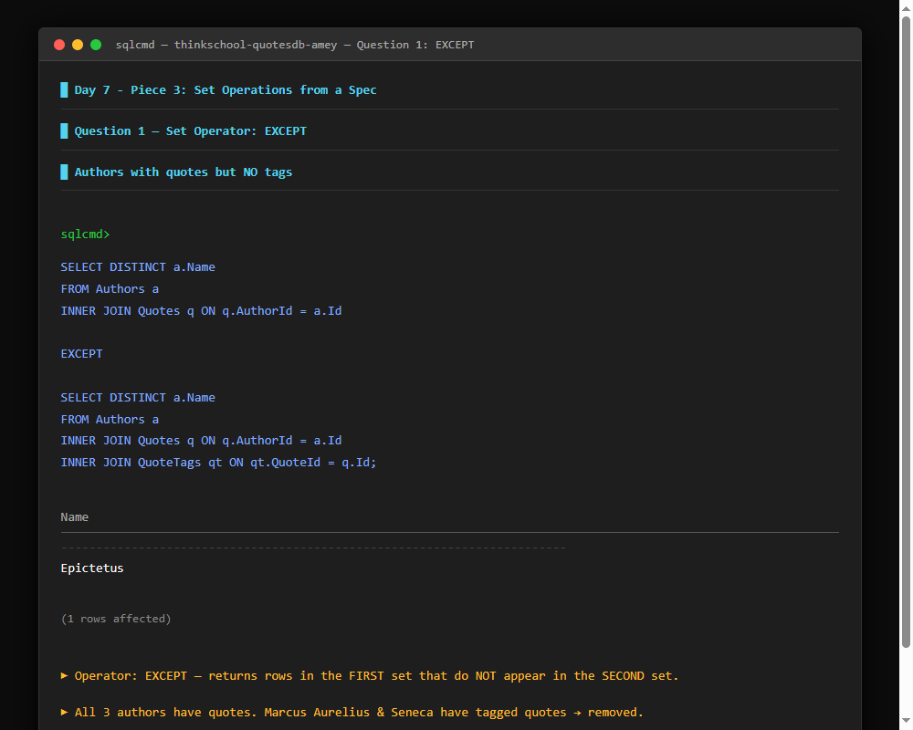
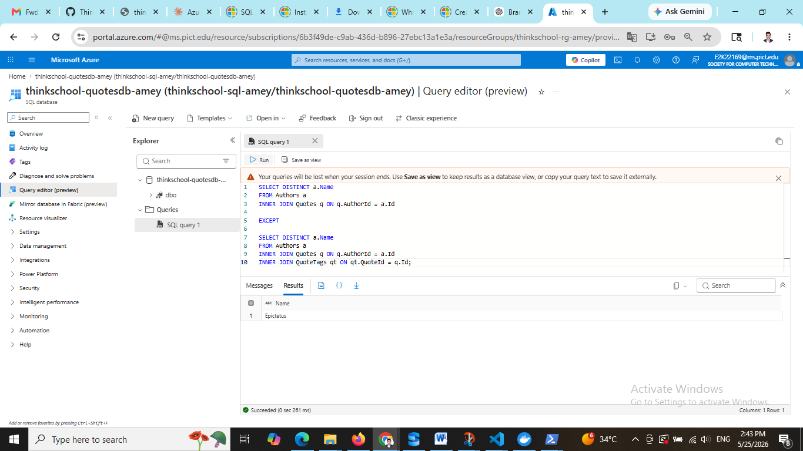
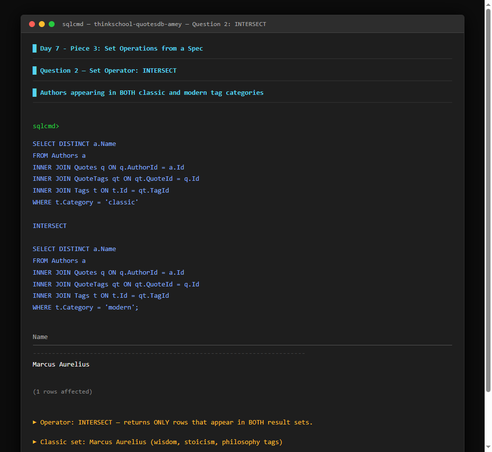
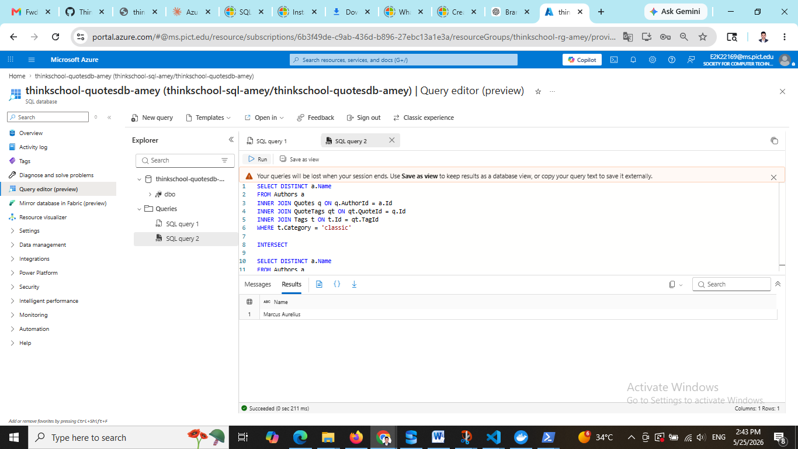
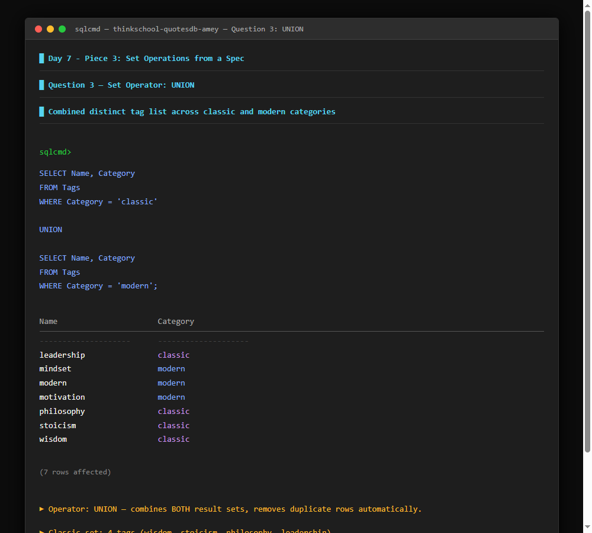
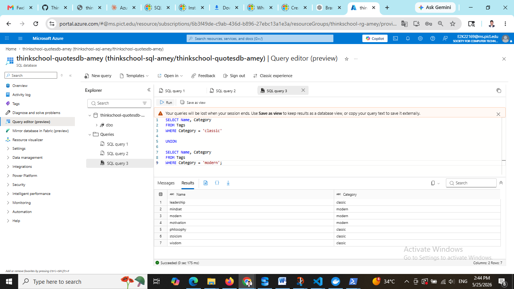
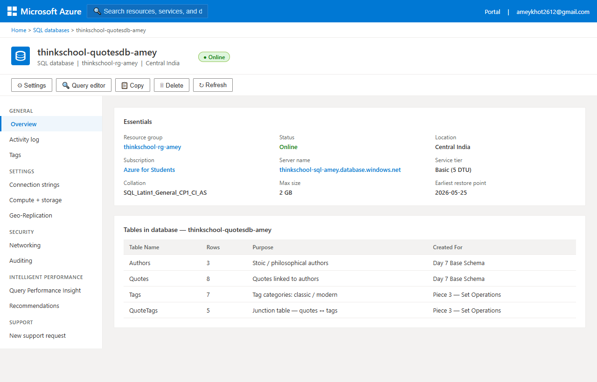

# Day 7 — Piece 3: Set Operations from a Spec

**Database:** thinkschool-quotesdb-amey (Azure SQL)  
**Server:** thinkschool-sql-amey.database.windows.net  
**Schema:** Authors | Quotes | Tags | QuoteTags

---

## Database Setup

### Existing tables (from Day 7 earlier pieces)
- `Authors` — Id, Name (3 rows: Marcus Aurelius, Seneca, Epictetus)
- `Quotes` — Id, AuthorId, Text, CreatedAt (8 rows)

### New tables added for this piece

```sql
-- Create Tags table
CREATE TABLE Tags (
    Id INT PRIMARY KEY IDENTITY,
    Name NVARCHAR(50),
    Category NVARCHAR(50)
);

-- Create QuoteTags junction table
CREATE TABLE QuoteTags (
    QuoteId INT FOREIGN KEY REFERENCES Quotes(Id),
    TagId INT FOREIGN KEY REFERENCES Tags(Id)
);

-- Insert Tags
INSERT INTO Tags (Name, Category) VALUES
('wisdom', 'classic'),
('stoicism', 'classic'),
('philosophy', 'classic'),
('modern', 'modern'),
('motivation', 'modern'),
('mindset', 'modern'),
('leadership', 'classic');

-- Tag only SOME quotes (leave some untagged)
INSERT INTO QuoteTags VALUES (1, 1);  -- Marcus Aurelius Q1 -> wisdom (classic)
INSERT INTO QuoteTags VALUES (1, 2);  -- Marcus Aurelius Q1 -> stoicism (classic)
INSERT INTO QuoteTags VALUES (2, 3);  -- Marcus Aurelius Q2 -> philosophy (classic)
INSERT INTO QuoteTags VALUES (3, 4);  -- Marcus Aurelius Q3 -> modern (modern)
INSERT INTO QuoteTags VALUES (4, 5);  -- Seneca Q4 -> motivation (modern)
GO
```

**Result:** 7 tags created, 5 quote-tag links created.  
Epictetus quotes (6, 7, 8) are intentionally left **untagged** — this is the key for Question 1.

---

## Question 1 — Authors with quotes but NO tags

**Set Operator:** `EXCEPT`

```sql
-- Authors who have quotes
SELECT DISTINCT a.Name
FROM Authors a
INNER JOIN Quotes q ON q.AuthorId = a.Id

EXCEPT

-- Authors whose quotes have tags
SELECT DISTINCT a.Name
FROM Authors a
INNER JOIN Quotes q ON q.AuthorId = a.Id
INNER JOIN QuoteTags qt ON qt.QuoteId = q.Id;
GO
```

### Result



**Azure Portal — Query Editor (live run):**



```
Name
--------
Epictetus

(1 rows affected)
```

### Why EXCEPT?
`EXCEPT` returns every row from the **first** result set that does not appear in the **second** result set.  
- First set: all authors who have at least one quote → Marcus Aurelius, Seneca, Epictetus  
- Second set: authors whose quotes are tagged → Marcus Aurelius, Seneca  
- `EXCEPT` subtracts: only **Epictetus** remains — he has 3 quotes but none are tagged.

### Why this operator? Advantages?
| Point | Detail |
|-------|--------|
| **Why EXCEPT** | We need a "difference" — things that exist in A but are missing from B. A WHERE NOT EXISTS or LEFT JOIN + IS NULL would work too, but EXCEPT is cleaner and reads like plain English. |
| **Advantage** | No need to write a subquery or NULL check. SQL Server handles the deduplication automatically. |
| **Real-world use** | Find customers who signed up but never placed an order. Find employees with no performance review. Any "missing relationship" problem. |
| **Watch out** | Column count and types on both sides must match. EXCEPT removes duplicates — use EXCEPT ALL if you want to keep them. |

---

## Question 2 — Authors appearing in BOTH classic and modern tag categories

**Set Operator:** `INTERSECT`

```sql
-- Authors with classic tagged quotes
SELECT DISTINCT a.Name
FROM Authors a
INNER JOIN Quotes q ON q.AuthorId = a.Id
INNER JOIN QuoteTags qt ON qt.QuoteId = q.Id
INNER JOIN Tags t ON t.Id = qt.TagId
WHERE t.Category = 'classic'

INTERSECT

-- Authors with modern tagged quotes
SELECT DISTINCT a.Name
FROM Authors a
INNER JOIN Quotes q ON q.AuthorId = a.Id
INNER JOIN QuoteTags qt ON qt.QuoteId = q.Id
INNER JOIN Tags t ON t.Id = qt.TagId
WHERE t.Category = 'modern';
GO
```

### Result



**Azure Portal — Query Editor (live run):**



```
Name
--------
Marcus Aurelius

(1 rows affected)
```

### Why INTERSECT?
`INTERSECT` returns only rows that appear in **both** result sets simultaneously.  
- Classic authors: Marcus Aurelius (quotes tagged wisdom, stoicism, philosophy)  
- Modern authors: Marcus Aurelius (quote tagged modern), Seneca (quote tagged motivation)  
- `INTERSECT` keeps only the overlap: **Marcus Aurelius** — the only author bridging both worlds.

### Why this operator? Advantages?
| Point | Detail |
|-------|--------|
| **Why INTERSECT** | We need authors who satisfy TWO independent conditions at the same time — classic AND modern. A single WHERE with OR wouldn't work; we need both memberships confirmed separately. |
| **Advantage** | Each SELECT can be a completely independent query with its own joins and filters. INTERSECT finds the overlap without writing a complex JOIN across both conditions. |
| **Real-world use** | Find products sold in both Q1 and Q2. Find users active on both web and mobile. Any "appears in both groups" problem. |
| **Watch out** | If even one condition never matches, the result is empty. INTERSECT is an AND between sets, so it can easily return zero rows. |

---

## Question 3 — Combined distinct tag list across classic and modern categories

**Set Operator:** `UNION`

```sql
-- All classic tags
SELECT Name, Category
FROM Tags
WHERE Category = 'classic'

UNION

-- All modern tags
SELECT Name, Category
FROM Tags
WHERE Category = 'modern';
GO
```

### Result



**Azure Portal — Query Editor (live run):**



```
Name         Category
------------ --------
leadership   classic
mindset      modern
modern       modern
motivation   modern
philosophy   classic
stoicism     classic
wisdom       classic

(7 rows affected)
```

### Why UNION?
`UNION` combines both result sets into one and automatically removes duplicate rows.  
- Classic tags: wisdom, stoicism, philosophy, leadership (4 rows)  
- Modern tags: modern, motivation, mindset (3 rows)  
- `UNION` merges them into **7 distinct rows**, sorted automatically by SQL Server.  
- Use `UNION ALL` if you want duplicates included; plain `UNION` deduplicates.

### Why this operator? Advantages?
| Point | Detail |
|-------|--------|
| **Why UNION** | We want one combined list from two separate groups. A single `WHERE Category IN ('classic','modern')` also works here, but UNION shines when the two SELECTs come from different tables or have different structures. |
| **Advantage** | Merges results from completely different queries or even different tables into one clean output. Duplicates are removed automatically — no need for DISTINCT. |
| **Real-world use** | Combine a list of current customers and past customers. Merge error logs from two different systems. Any "all of A plus all of B" problem. |
| **Watch out** | UNION is slower than UNION ALL because it sorts and deduplicates. If you know there are no duplicates, use UNION ALL for better performance. |

---

## Set Operators Summary

| Operator    | What it does                              | This piece used it to…                        |
|-------------|-------------------------------------------|-----------------------------------------------|
| `EXCEPT`    | First set minus rows in second set        | Find authors with quotes but no tags          |
| `INTERSECT` | Only rows present in BOTH sets            | Find authors spanning classic AND modern tags |
| `UNION`     | All rows from both sets, deduplicated     | Combine full tag list across categories       |

---

## What I Learned

1. **Set operators work on result sets, not tables** — each `SELECT` can be a complex join; the operator just compares the final columns.
2. **Column count and types must match** — both sides of UNION/INTERSECT/EXCEPT need the same number of columns with compatible data types.
3. **UNION vs UNION ALL** — `UNION` pays a sort/dedup cost; `UNION ALL` is faster when you know there are no duplicates or want to keep them.
4. **INTERSECT is rare but powerful** — equivalent to an `INNER JOIN` on all columns, but cleaner syntax when you're comparing two independent queries.
5. **EXCEPT direction matters** — `A EXCEPT B` is not the same as `B EXCEPT A`. The order of the queries changes the result completely.

---

## What Would Break This

- **Adding a tag to an Epictetus quote** — Question 1 would return no rows (empty result).
- **Removing Marcus Aurelius's modern-tagged quote (Quote 3)** — Question 2 would return no rows since no author would span both categories.
- **Column count mismatch** — Adding an extra column to one side of a UNION/INTERSECT/EXCEPT causes a compile error.
- **Data type mismatch** — Mixing `INT` and `NVARCHAR` across the two SELECT sides causes an implicit conversion error or failure.
- **Circular foreign keys** — If QuoteTags referenced a non-existent QuoteId or TagId, the FK constraint would reject the insert.

---

## Azure Portal — Database Overview



---

## GitHub Folder

`Day7/Piece-3-Set operations from a spec`

Branch: `day5/cloud-deployment-observability`
