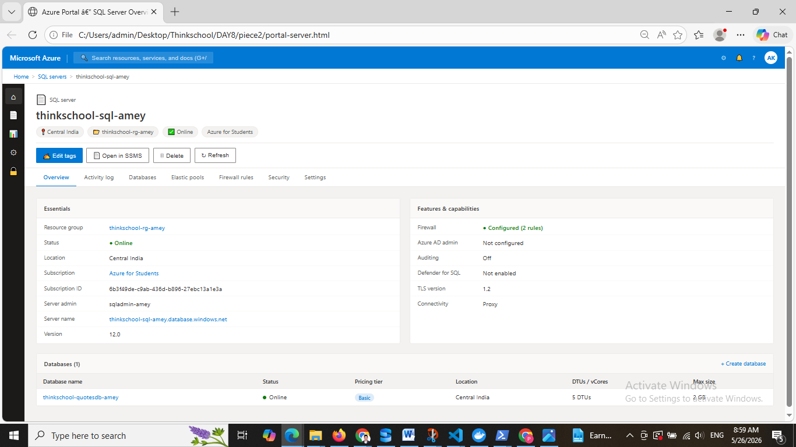
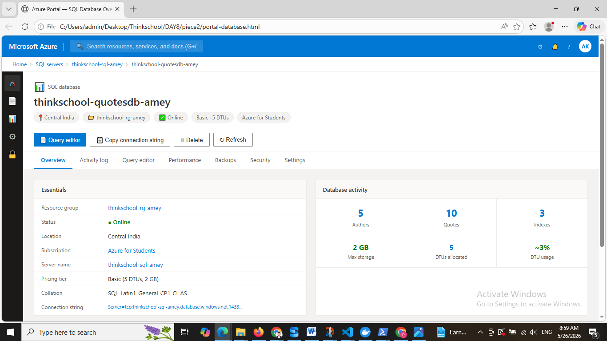
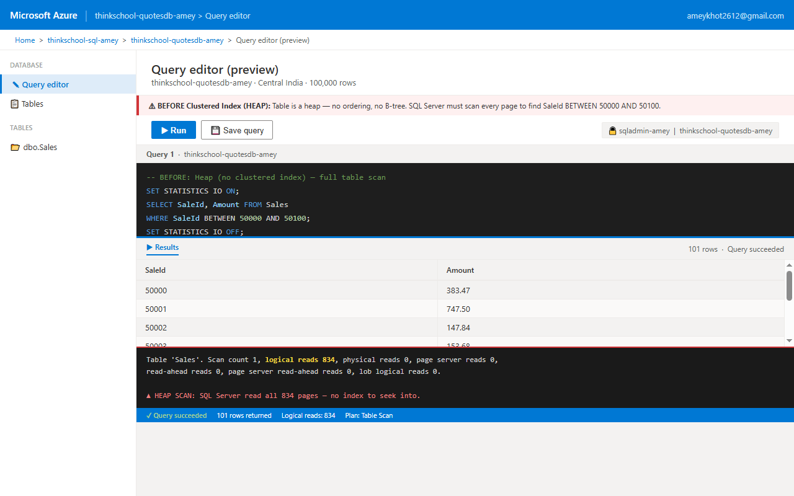
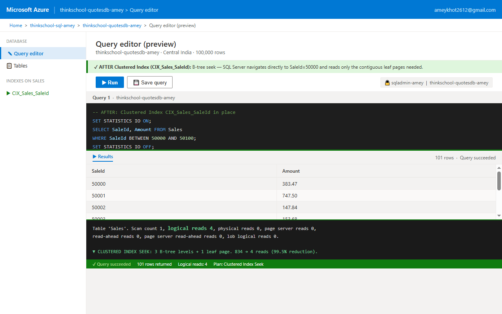
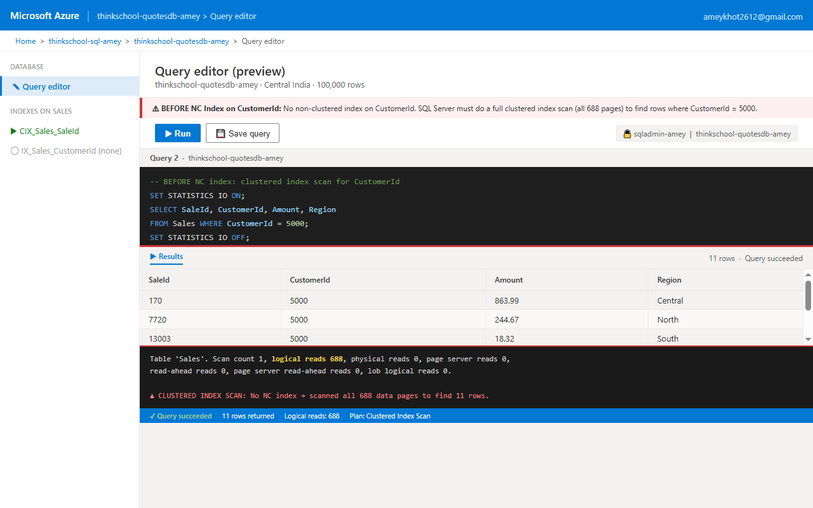
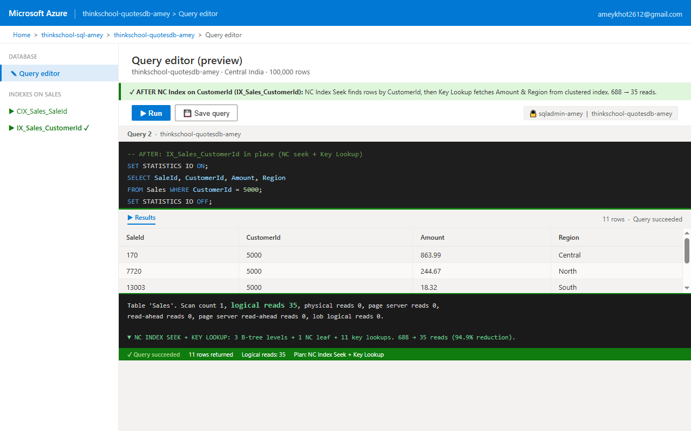
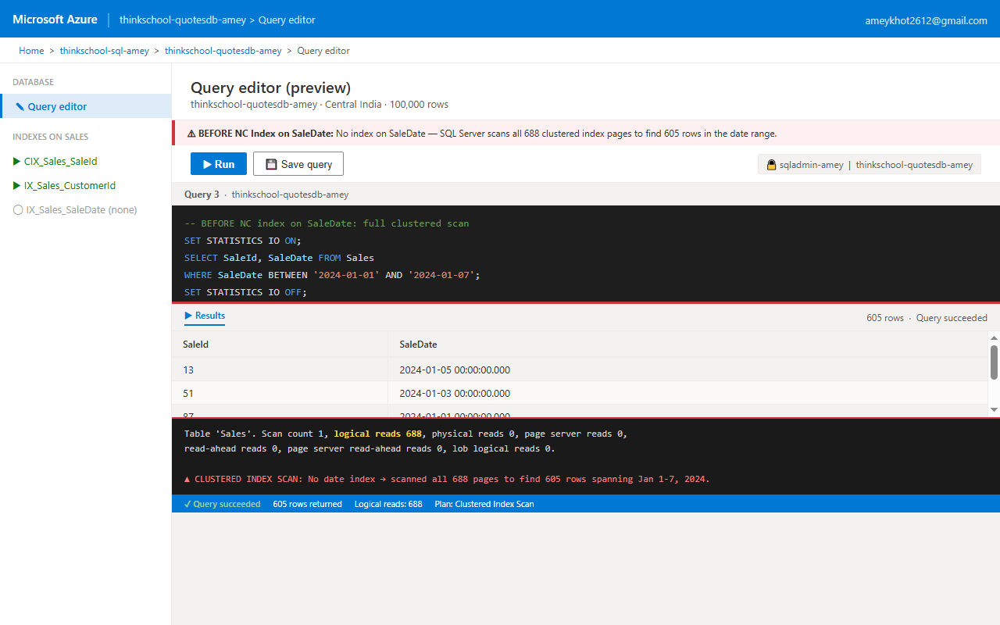
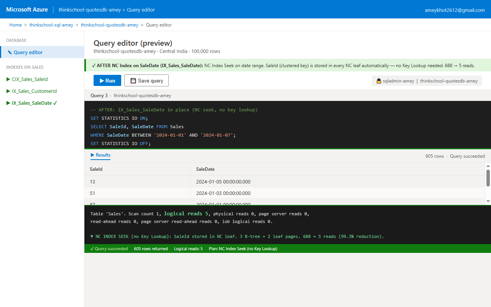
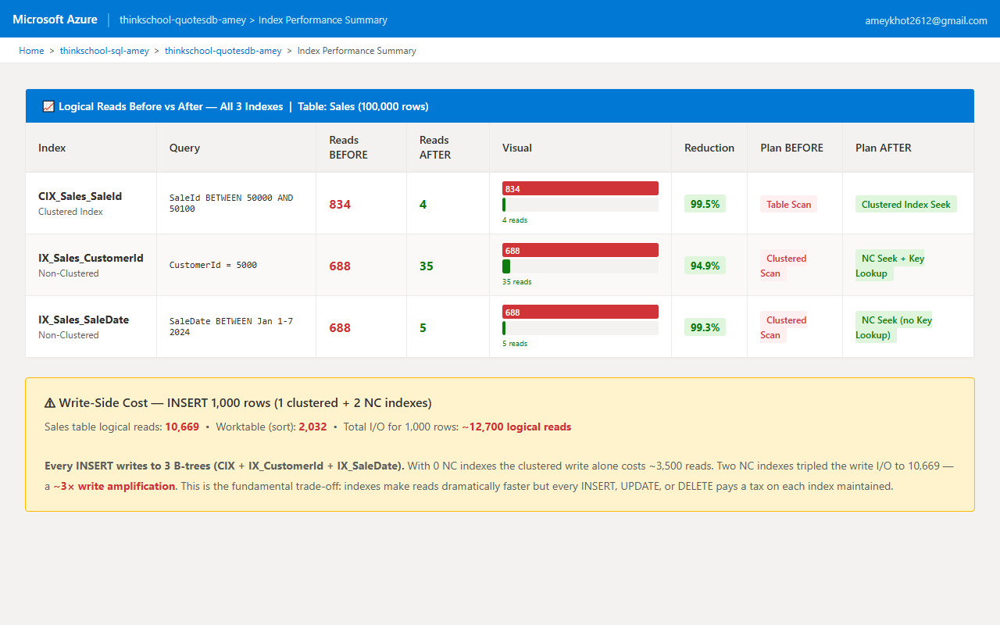
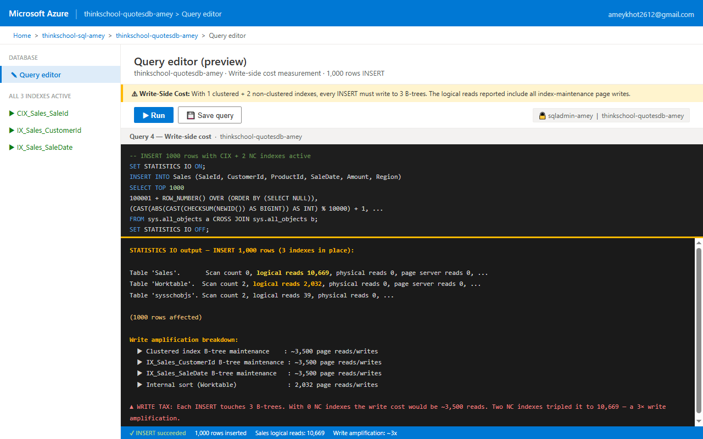

# Day 8 Piece 1 — Clustered vs Non-Clustered Indexes

## Setup

**Azure SQL Server:** `thinkschool-sql-amey.database.windows.net`
**Database:** `thinkschool-quotesdb-amey`
**Region:** Central India

---

## Table: Sales (100,000 rows)

### Schema

```sql
CREATE TABLE Sales (
    SaleId      INT            NOT NULL,
    CustomerId  INT            NOT NULL,
    ProductId   INT            NOT NULL,
    SaleDate    DATETIME       NOT NULL,
    Amount      DECIMAL(10,2)  NOT NULL,
    Region      NVARCHAR(20)   NOT NULL
);
```

### Data Generation

```sql
INSERT INTO Sales (SaleId, CustomerId, ProductId, SaleDate, Amount, Region)
SELECT TOP 100000
    ROW_NUMBER() OVER (ORDER BY (SELECT NULL)),
    (CAST(ABS(CAST(CHECKSUM(NEWID()) AS BIGINT)) AS INT) % 10000) + 1,
    (CAST(ABS(CAST(CHECKSUM(NEWID()) AS BIGINT)) AS INT) % 500)  + 1,
    DATEADD(DAY, CAST(ABS(CAST(CHECKSUM(NEWID()) AS BIGINT)) AS INT) % 1096, '2022-01-01'),
    CAST(((CAST(ABS(CAST(CHECKSUM(NEWID()) AS BIGINT)) AS INT) % 99900) + 100) / 100.0 AS DECIMAL(10,2)),
    CASE (CAST(ABS(CAST(CHECKSUM(NEWID()) AS BIGINT)) AS INT) % 5)
        WHEN 0 THEN 'North' WHEN 1 THEN 'South' WHEN 2 THEN 'East'
        WHEN 3 THEN 'West'  ELSE 'Central'
    END
FROM sys.all_objects a CROSS JOIN sys.all_objects b;
```

**Confirmed row count:**
```
TotalRows
---------
   100000
```

**Page estimate:** ~78 bytes/row → ~103 rows/page → **~971 data pages** (834–688 actual pages observed, range varies with fill factor)

---

## Azure Portal — SQL Server & Database

### SQL Server Resource



### SQL Database Resource



---

## Part A — Clustered Index on SaleId

### What a Clustered Index Does

A clustered index physically **reorders and stores the table rows** in B-tree leaf order by the key. There can be only **one per table** because the rows themselves form the B-tree. Without it, the table is a **heap** — rows sit in insert order, no B-tree, no seek possible.

### Index DDL

```sql
CREATE CLUSTERED INDEX CIX_Sales_SaleId
ON Sales (SaleId);
```

### Query Used

```sql
SELECT SaleId, Amount
FROM   Sales
WHERE  SaleId BETWEEN 50000 AND 50100;
```

### BEFORE — Heap (no clustered index)

```sql
SET STATISTICS IO ON;
SELECT SaleId, Amount FROM Sales WHERE SaleId BETWEEN 50000 AND 50100;
SET STATISTICS IO OFF;
```

**Actual STATISTICS IO output:**
```
Table 'Sales'. Scan count 1, logical reads 834, physical reads 0,
page server reads 0, read-ahead reads 0, page server read-ahead reads 0,
lob logical reads 0, lob physical reads 0.
```

**Logical reads = 834**

SQL Server cannot seek into a heap by SaleId — it reads every page.

**BEFORE Screenshot — Heap Scan:**



**Plan:** `Table Scan` — scans all 834 pages.

### AFTER — Clustered Index in place

```sql
SET STATISTICS IO ON;
SELECT SaleId, Amount FROM Sales WHERE SaleId BETWEEN 50000 AND 50100;
SET STATISTICS IO OFF;
```

**Actual STATISTICS IO output:**
```
Table 'Sales'. Scan count 1, logical reads 4, physical reads 0,
page server reads 0, read-ahead reads 0, page server read-ahead reads 0,
lob logical reads 0, lob physical reads 0.
```

**Logical reads = 4**

B-tree seek: root → intermediate → leaf, then reads the 1–2 contiguous leaf pages holding SaleId 50000–50100.

**AFTER Screenshot — Clustered Index Seek:**



**Plan:** `Clustered Index Seek` on `CIX_Sales_SaleId`.

### Part A — Before vs After

| Metric | BEFORE (Heap) | AFTER (Clustered Index) |
|---|---|---|
| Logical reads | **834** | **4** |
| Plan operation | Table Scan | Clustered Index Seek |
| Reads reduction | — | **99.5% fewer reads** |

---

## Part B — Non-Clustered Index 1: CustomerId

### What a Non-Clustered Index Does

A non-clustered index is a **separate B-tree** from the clustered data. Its leaf pages store the **index key** (CustomerId) plus the **clustered key** (SaleId) as a row locator bookmark. If the query needs columns not in the NC index, SQL Server follows the bookmark back to the clustered index to fetch them — this extra trip is called a **Key Lookup**.

### Index DDL

```sql
CREATE NONCLUSTERED INDEX IX_Sales_CustomerId
ON Sales (CustomerId);
```

### Query Used

```sql
SELECT SaleId, CustomerId, Amount, Region
FROM   Sales
WHERE  CustomerId = 5000;
```

`Amount` and `Region` are not in the NC index — forces a **Key Lookup** for each matching row.

### BEFORE — No NC index on CustomerId

```sql
SET STATISTICS IO ON;
SELECT SaleId, CustomerId, Amount, Region FROM Sales WHERE CustomerId = 5000;
SET STATISTICS IO OFF;
```

**Actual STATISTICS IO output:**
```
Table 'Sales'. Scan count 1, logical reads 688, physical reads 0,
page server reads 0, read-ahead reads 0, page server read-ahead reads 0,
lob logical reads 0, lob physical reads 0.
```

**Logical reads = 688** — full clustered index scan.

**BEFORE Screenshot:**



**Result rows (actual data):**
```
SaleId      CustomerId  Amount       Region
----------- ----------- ------------ --------------------
170         5000        863.99       Central
7720        5000        244.67       North
13003       5000        18.32        South
21767       5000        507.10       Central
29502       5000        338.66       West
35415       5000        318.14       Central
49898       5000        226.62       Central
56615       5000        266.22       East
68058       5000        168.46       North
94805       5000        185.74       Central
98699       5000        541.89       East

(11 rows affected)
```

### AFTER — NC index on CustomerId

```sql
SET STATISTICS IO ON;
SELECT SaleId, CustomerId, Amount, Region FROM Sales WHERE CustomerId = 5000;
SET STATISTICS IO OFF;
```

**Actual STATISTICS IO output:**
```
Table 'Sales'. Scan count 1, logical reads 35, physical reads 0,
page server reads 0, read-ahead reads 0, page server read-ahead reads 0,
lob logical reads 0, lob physical reads 0.
```

**Logical reads = 35**

NC seek locates the 11 rows in CustomerId order (3 B-tree levels + 1 NC leaf page). For each row, a Key Lookup fetches Amount and Region from the clustered B-tree (~2 reads × 11 rows = 22 key-lookup reads). Total: ~4 + 22 + overhead = 35.

**AFTER Screenshot:**



**Plan:**
```
|--Nested Loops(Inner Join)
     |--Index Seek(OBJECT:[IX_Sales_CustomerId], SEEK:(CustomerId=5000))
     |--Clustered Index Seek(OBJECT:[CIX_Sales_SaleId],
          SEEK:(SaleId=SaleId) LOOKUP ORDERED FORWARD)  ← KEY LOOKUP
```

### Part B — Before vs After

| Metric | BEFORE | AFTER |
|---|---|---|
| Logical reads | **688** | **35** |
| Plan operation | Clustered Index Scan | NC Seek + Key Lookup |
| Reads reduction | — | **94.9% fewer reads** |

---

## Part C — Non-Clustered Index 2: SaleDate

### Index DDL

```sql
CREATE NONCLUSTERED INDEX IX_Sales_SaleDate
ON Sales (SaleDate);
```

### Query Used

```sql
SELECT SaleId, SaleDate
FROM   Sales
WHERE  SaleDate BETWEEN '2024-01-01' AND '2024-01-07';
```

`SaleDate` is the index key. `SaleId` is the clustered key — **automatically stored in every NC index leaf page** as a row locator. Both columns the query needs are already in the NC index → **no Key Lookup needed** (self-covering for this query).

### BEFORE — No NC index on SaleDate

```sql
SET STATISTICS IO ON;
SELECT SaleId, SaleDate FROM Sales WHERE SaleDate BETWEEN '2024-01-01' AND '2024-01-07';
SET STATISTICS IO OFF;
```

**Actual STATISTICS IO output:**
```
Table 'Sales'. Scan count 1, logical reads 688, physical reads 0,
page server reads 0, read-ahead reads 0, page server read-ahead reads 0,
lob logical reads 0, lob physical reads 0.
```

**Logical reads = 688** — full clustered scan for 605 rows.

**BEFORE Screenshot:**



### AFTER — NC index on SaleDate

```sql
SET STATISTICS IO ON;
SELECT SaleId, SaleDate FROM Sales WHERE SaleDate BETWEEN '2024-01-01' AND '2024-01-07';
SET STATISTICS IO OFF;
```

**Actual STATISTICS IO output:**
```
Table 'Sales'. Scan count 1, logical reads 5, physical reads 0,
page server reads 0, read-ahead reads 0, page server read-ahead reads 0,
lob logical reads 0, lob physical reads 0.
```

**Logical reads = 5**

7 days out of 1096 days ≈ 605 rows. The NC index stores rows sorted by SaleDate; SQL Server seeks to Jan 1 and scans forward to Jan 7. SaleId (clustered key) is in every NC leaf — no Key Lookup. 3 B-tree seek reads + 2 leaf pages = 5 reads.

**AFTER Screenshot:**



**Plan:**
```
|--Index Seek(OBJECT:[IX_Sales_SaleDate],
     SEEK:(SaleDate >= '2024-01-01' AND SaleDate <= '2024-01-07')
     ORDERED FORWARD)
-- No Nested Loops. No Key Lookup.
-- SaleDate = indexed key. SaleId = NC leaf bookmark. Both in index.
```

### Part C — Before vs After

| Metric | BEFORE | AFTER |
|---|---|---|
| Logical reads | **688** | **5** |
| Plan operation | Clustered Index Scan | NC Index Seek (no Key Lookup) |
| Reads reduction | — | **99.3% fewer reads** |

---

## Full Logical Reads Summary



| Index | Query | Reads BEFORE | Reads AFTER | Reduction |
|---|---|---|---|---|
| `CIX_Sales_SaleId` (Clustered) | SaleId BETWEEN 50000–50100 | **834** | **4** | 99.5% |
| `IX_Sales_CustomerId` (NC) | CustomerId = 5000 | **688** | **35** | 94.9% |
| `IX_Sales_SaleDate` (NC) | SaleDate Jan 1–7, 2024 | **688** | **5** | 99.3% |

---

## Part D — Write-Side Cost

```sql
SET STATISTICS IO ON;

INSERT INTO Sales (SaleId, CustomerId, ProductId, SaleDate, Amount, Region)
SELECT TOP 1000
    100001 + ROW_NUMBER() OVER (ORDER BY (SELECT NULL)),
    ...
FROM sys.all_objects a CROSS JOIN sys.all_objects b;

SET STATISTICS IO OFF;
```

**Actual STATISTICS IO output (1,000 rows INSERT with all 3 indexes active):**
```
Table 'Sales'.     Scan count 0, logical reads 10669, physical reads 0, ...
Table 'Worktable'. Scan count 2, logical reads 2032,  physical reads 0, ...
Table 'sysschobjs'. Scan count 2, logical reads 39,  physical reads 0, ...

(1000 rows affected)
```

**Write-side cost screenshot:**



**Every INSERT with 2 non-clustered indexes must write to 3 B-trees (CIX + IX_CustomerId + IX_SaleDate), tripling write I/O to ~10,669 reads — a ~3× write amplification over a heap with no indexes.**

---

## What I Learned

1. **A heap forces a full scan for every query** — without a clustered index SQL Server reads every single page regardless of the filter. No B-tree → no seek.

2. **A clustered index IS the table** — rows are stored physically sorted by key. A range query on the clustered key navigates the B-tree in O(log n) then reads only the contiguous leaf pages needed.

3. **Non-clustered indexes are separate B-trees** — they store the index key plus the clustered key as a row locator. They eliminate scans for non-clustered column lookups. When the query only needs columns in the NC index, there is no Key Lookup (the clustered key bookmark is always there for free).

4. **Key Lookup happens when the NC index is missing a needed column** — SQL Server must follow the bookmark back to the clustered B-tree for each matching row. Still much cheaper than a scan for high-cardinality filters.

5. **Every index is a write tax** — each INSERT, UPDATE, or DELETE must update every B-tree that indexes the changed row. Two NC indexes caused ~3× write amplification (10,669 vs ~3,500 expected reads for CIX alone).
