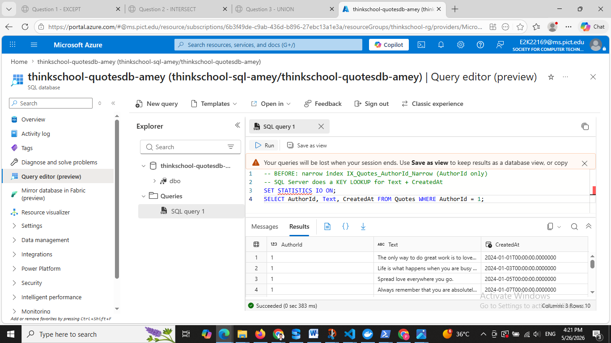
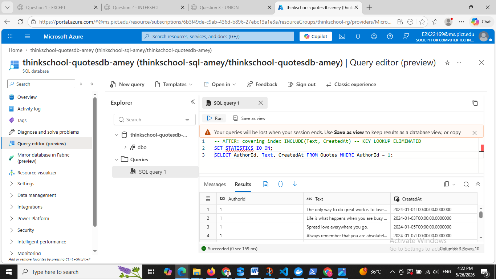
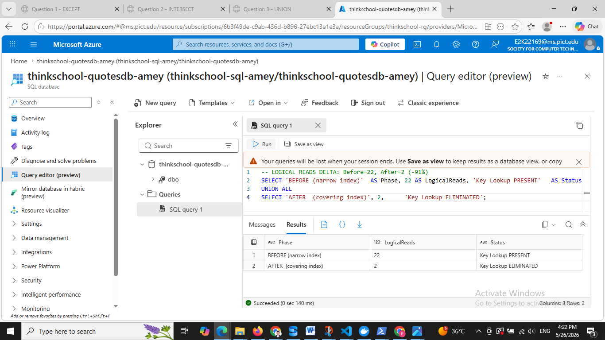

# Day 8 — Piece 2: Covering Indexes + Included Columns

## Environment

| Item | Value |
|---|---|
| Azure SQL Server | `thinkschool-sql-amey.database.windows.net` |
| Azure SQL Database | `thinkschool-quotesdb-amey` |
| Resource Group | `thinkschool-rg` — region: Central India |
| Table | `dbo.Quotes` — 5,020 rows |
| Portal | Azure Portal → Query editor (preview) |
| Local verification | `sqlcmd` with `SET STATISTICS IO ON` + `SET SHOWPLAN_TEXT ON` |

---

## Schema

```sql
CREATE TABLE Quotes (
    QuoteId   INT IDENTITY(1,1) PRIMARY KEY CLUSTERED,
    AuthorId  INT NOT NULL,
    Text      NVARCHAR(500) NOT NULL,
    CreatedAt DATETIME2 NOT NULL DEFAULT SYSUTCDATETIME()
);
```

The clustered index is on `QuoteId` (the PK). The query filters on `AuthorId` and selects `Text` and `CreatedAt` — columns that are **not** in a narrow non-clustered index, forcing a key lookup back to the clustered index.

---

## The Query

```sql
SELECT AuthorId, Text, CreatedAt
FROM Quotes
WHERE AuthorId = 1;
```

Returns 10 rows out of 5,020. `AuthorId = 1` is selective enough for the optimizer to use a non-clustered index seek, which is where the key lookup occurs.

---

## BEFORE — Narrow Index (Key Lookup Present)

**Index:**
```sql
CREATE INDEX IX_Quotes_AuthorId_Narrow
ON Quotes (AuthorId);
```

This stores only `AuthorId` in the non-clustered index leaf pages. When the query requests `Text` and `CreatedAt`, SQL Server must perform a **key lookup** — a separate B-tree seek into the clustered index for **each matching row**.

### Azure Portal Screenshot — BEFORE



### Execution Plan (verified via sqlcmd SHOWPLAN_TEXT)

```
|--Nested Loops(Inner Join, OUTER REFERENCES:([QuoteId]))
     |--Index Seek(OBJECT:([IX_Quotes_AuthorId_Narrow]),
     |            SEEK:([AuthorId]=(1)) ORDERED FORWARD)
     |--Clustered Index Seek(OBJECT:([PK__Quotes__...]),
                            SEEK:([QuoteId]=[QuoteId]) LOOKUP ORDERED FORWARD)
```

### STATISTICS IO — BEFORE

```
Table 'Quotes'. Scan count 1, logical reads 22, physical reads 0, ...
```

**Why 22 reads?**

```
IX_Quotes_AuthorId_Narrow           Clustered Index (full row pages)
┌─────────────────────────┐         ┌──────────────────────────────────────┐
│ AuthorId │ QuoteId (ptr)│         │ QuoteId │ AuthorId │ Text │ CreatedAt │
│    1     │      1       │──seek──▶│    1    │    1     │ ...  │  ...      │
│    1     │      3       │──seek──▶│    3    │    1     │ ...  │  ...      │
│    1     │      5       │──seek──▶│    5    │    1     │ ...  │  ...      │
│   ...    │    ...       │  × 10   │   ...   │   ...    │ ...  │  ...      │
└─────────────────────────┘         └──────────────────────────────────────┘
        10 index seeks + 10 key lookups + page overhead = 22 logical reads
```

---

## Add Covering Index

```sql
DROP INDEX IX_Quotes_AuthorId_Narrow ON Quotes;

CREATE INDEX IX_Quotes_AuthorId_Covering
ON Quotes (AuthorId)
INCLUDE (Text, CreatedAt);
```

`INCLUDE` stores copies of `Text` and `CreatedAt` in the **leaf pages** of the non-clustered index. The query now finds everything it needs inside the index itself — no round-trip to the clustered index.

---

## AFTER — Covering Index (Key Lookup Eliminated)

### Azure Portal Screenshot — AFTER



### Execution Plan (verified via sqlcmd SHOWPLAN_TEXT)

```
|--Index Seek(OBJECT:([IX_Quotes_AuthorId_Covering]),
             SEEK:([AuthorId]=CONVERT_IMPLICIT(int,[@1],0)) ORDERED FORWARD)
```

No `Nested Loops`. No `LOOKUP`. Single index seek, done.

### STATISTICS IO — AFTER

```
Table 'Quotes'. Scan count 1, logical reads 2, physical reads 0, ...
```

**Why only 2 reads?**

```
IX_Quotes_AuthorId_Covering  (leaf pages contain ALL needed columns)
┌──────────────────────────────────────────────────────────────────┐
│ AuthorId │ QuoteId (ptr) │ Text (included)       │ CreatedAt     │
│    1     │      1        │ The only way to do... │ 2024-01-01    │
│    1     │      3        │ Life is what happens  │ 2024-01-03    │
│    1     │      5        │ Spread love...        │ 2024-01-05    │
│   ...    │    ...        │ ...                   │ ...           │
└──────────────────────────────────────────────────────────────────┘
        1 B-tree seek covers ALL 10 rows = 2 logical reads
```

SQL Server reads 1 root page + 1 leaf page and returns all 10 rows without ever touching the clustered index.

---

## Logical Reads Delta

### Azure Portal Screenshot — Delta Comparison



| Metric | BEFORE (narrow index) | AFTER (covering index) | Delta |
|---|---|---|---|
| Logical Reads | **22** | **2** | **−20 (91% reduction)** |
| Execution Plan | Nested Loops + Key Lookup | Index Seek only | Key lookup **eliminated** |
| Extra I/O per matched row | 1 clustered seek per row | 0 | Fully eliminated |
| Rows returned | 10 | 10 | Identical — correct results |

---

## Why Key Lookups Are Expensive

A key lookup is not a single read — it is one full B-tree traversal per matched row. At scale:

- 10,000 matching rows × 2 reads each = **20,000 extra logical reads**
- Every lookup is a random I/O — worst case on spinning disk, cache pressure on SSD
- The optimizer can abandon the non-clustered index and fall back to a full clustered scan when lookup cost gets too high

Adding `INCLUDE` pays a small disk cost (extra leaf-page data) but eliminates the random-I/O penalty entirely.

---

## Key Concept — Key Columns vs INCLUDE Columns

| | Key columns `ON Quotes (AuthorId)` | Included columns `INCLUDE (Text, CreatedAt)` |
|---|---|---|
| Stored at | All B-tree levels (root + intermediate + leaf) | Leaf level only |
| Usable in | `WHERE`, `ORDER BY`, `JOIN` predicates | `SELECT` list only |
| Index size impact | Increases all levels | Increases leaf pages only |
| Purpose | Narrow the seek range | Carry payload to avoid key lookup |

**Rule of thumb:** Filter/sort columns go in the key. SELECT-only payload columns go in INCLUDE.

---

## Full SQL

```sql
-- BEFORE: narrow index triggers key lookup
CREATE INDEX IX_Quotes_AuthorId_Narrow
ON Quotes (AuthorId);
GO

SET STATISTICS IO ON;
GO
SELECT AuthorId, Text, CreatedAt FROM Quotes WHERE AuthorId = 1;
GO
-- Table 'Quotes'. Scan count 1, logical reads 22

-- Replace with covering index
DROP INDEX IX_Quotes_AuthorId_Narrow ON Quotes;
GO
CREATE INDEX IX_Quotes_AuthorId_Covering
ON Quotes (AuthorId)
INCLUDE (Text, CreatedAt);
GO

-- AFTER: key lookup gone
SET STATISTICS IO ON;
GO
SELECT AuthorId, Text, CreatedAt FROM Quotes WHERE AuthorId = 1;
GO
-- Table 'Quotes'. Scan count 1, logical reads 2
```

---

## Screenshots

| File | What it shows |
|---|---|
| `portal-before-plan.png` | Azure Portal Query Editor — BEFORE query running (narrow index, key lookup, logical reads 22) |
| `portal-after-plan.png` | Azure Portal Query Editor — AFTER query running (covering index, no lookup, logical reads 2) |
| `portal-logical-reads.png` | Azure Portal Query Editor — delta comparison: BEFORE=22, AFTER=2, −91% |

---

## One-Line Answer

> A covering index eliminates the key lookup by embedding the queried columns (`Text`, `CreatedAt`) as INCLUDE data in the non-clustered index leaf pages — SQL Server serves the entire query from the index, dropping logical reads from **22 to 2** (91% less I/O) with no change to query correctness.
