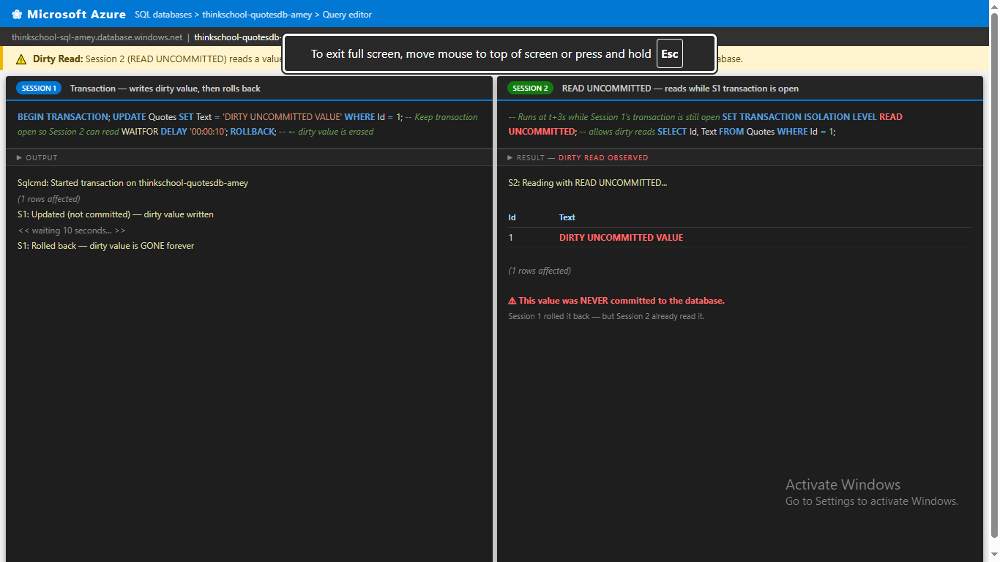
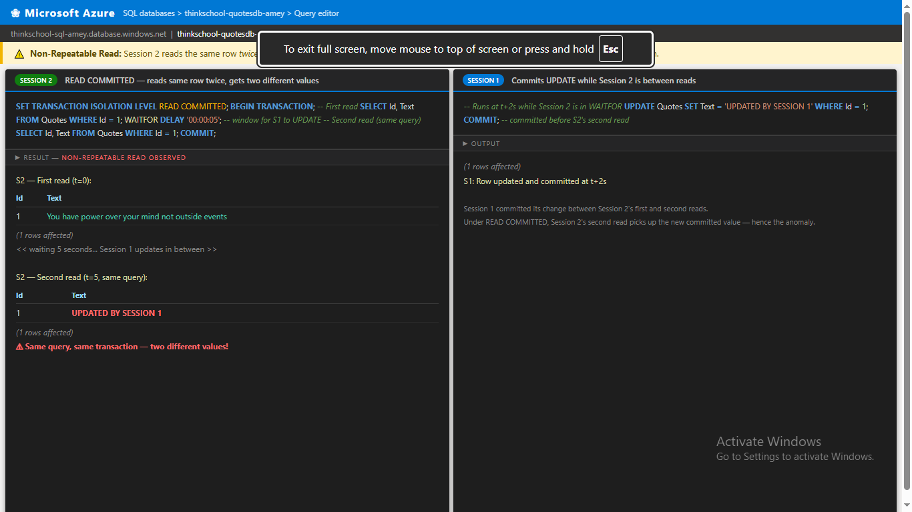
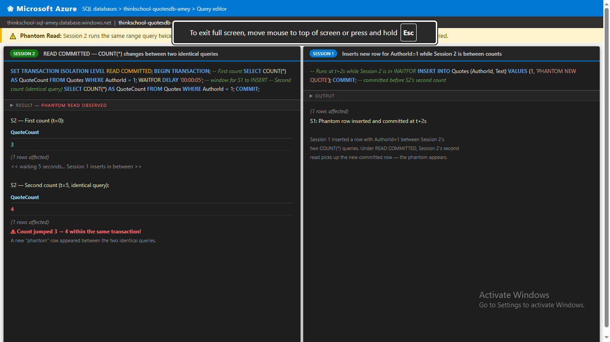
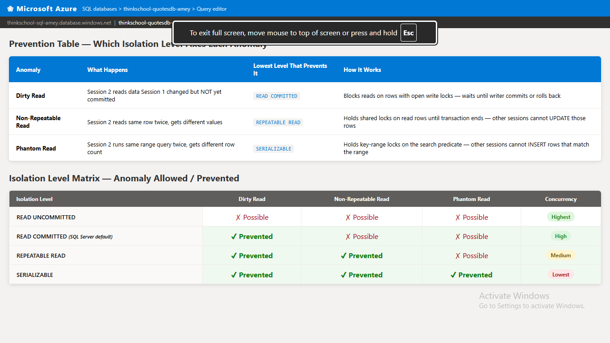

# Day 9 — Piece 1: Isolation Levels + The Read Anomalies

**Repo:** `https://github.com/thinkbridge-thinkschool/ThinkSchoo-ameykhot-Day1`  
**Branch:** `day5/cloud-deployment-observability`  
**Folder:** `DAY9/Piece-1- Isolation levels + the read anomalies/`  
**Database:** `thinkschool-quotesdb-amey` on `thinkschool-sql-amey.database.windows.net`

---

## Prevention Table

| Anomaly | Lowest Isolation Level That Prevents It |
|---|---|
| Dirty Read | `READ COMMITTED` |
| Non-Repeatable Read | `REPEATABLE READ` |
| Phantom Read | `SERIALIZABLE` |

---

## Setup — Connection String (Both Sessions)

```bash
sqlcmd -S thinkschool-sql-amey.database.windows.net \
       -d thinkschool-quotesdb-amey \
       -U sqladmin-amey \
       -P ThinkSchool@123
```

Seed data used: **5 Authors · 10 Quotes**  
AuthorId = 1 (Marcus Aurelius) has quotes with Id 1, 2, 3

---

## Anomaly 1 — Dirty Read

**What it is:** Session 2 reads a value that Session 1 has changed but **not yet committed**.  
The value may never actually be saved — Session 1 could roll back at any point.

---

### Session 1 Script

```sql
BEGIN TRANSACTION;

UPDATE Quotes
SET Text = 'DIRTY UNCOMMITTED VALUE'
WHERE Id = 1;

-- Keep the transaction open so Session 2 can read the dirty value
WAITFOR DELAY '00:00:08';

ROLLBACK;   -- dirty value is erased — it never existed in committed state
GO
```

**Session 1 — Live Output:**

```
(1 rows affected)
SESSION 1: Row updated - transaction still OPEN (not committed)
SESSION 1: Transaction rolled back - dirty value erased
```

---

### Session 2 Script

```sql
-- Run immediately after Session 1 starts (at t+3s)

SET TRANSACTION ISOLATION LEVEL READ UNCOMMITTED;  -- allows dirty reads

SELECT Id, Text
FROM Quotes
WHERE Id = 1;
GO
```

**Session 2 — Live Output:**

```
SESSION 2: Reading with READ UNCOMMITTED while S1 transaction is open...

Id          Text
----------- ----------------------------------------
          1 DIRTY UNCOMMITTED VALUE

(1 rows affected)
SESSION 2: Read complete.
```

> **Anomaly confirmed:** Session 2 read `DIRTY UNCOMMITTED VALUE` — a value that Session 1 **rolled back** and that was **never committed** to the database.

### Screenshot



---

## Anomaly 2 — Non-Repeatable Read

**What it is:** Session 2 reads the **same row twice** within one transaction.  
Between the two reads, Session 1 commits an UPDATE. Session 2 gets two different values.

---

### Session 2 Script (run first)

```sql
SET TRANSACTION ISOLATION LEVEL READ COMMITTED;
BEGIN TRANSACTION;

-- First read
SELECT Id, Text FROM Quotes WHERE Id = 1;

WAITFOR DELAY '00:00:05';   -- window for Session 1 to UPDATE and commit

-- Second read — same query, same WHERE clause
SELECT Id, Text FROM Quotes WHERE Id = 1;

COMMIT;
GO
```

**Session 2 — Live Output:**

```
SESSION 2 - First read (READ COMMITTED):

Id          Text
----------- ----------------------------------------
          1 You have power over your mind not outside events

(1 rows affected)

SESSION 2 - Second read (same query, same transaction):

Id          Text
----------- ----------------------------------------
          1 UPDATED BY SESSION 1

(1 rows affected)
SESSION 2: Transaction committed.
```

---

### Session 1 Script (run while Session 2 is in WAITFOR)

```sql
-- Runs at t+2s — Session 2 is sleeping between its two reads

UPDATE Quotes
SET Text = 'UPDATED BY SESSION 1'
WHERE Id = 1;
COMMIT;
GO
```

**Session 1 — Live Output:**

```
SESSION 1: Committing UPDATE between Session 2 reads...

(1 rows affected)
SESSION 1: UPDATE committed.
```

> **Anomaly confirmed:** Same `SELECT WHERE Id = 1` inside the same transaction returned two different values — `You have power over your mind not outside events` on the first read, then `UPDATED BY SESSION 1` on the second. Session 1's committed change was visible mid-transaction.

### Screenshot



---

## Anomaly 3 — Phantom Read

**What it is:** Session 2 runs the **same range query twice** within one transaction.  
Between the two runs, Session 1 inserts a new row that falls inside Session 2's search range.  
Session 2 sees a different row count — a "phantom" row appeared.

---

### Session 2 Script (run first)

```sql
SET TRANSACTION ISOLATION LEVEL READ COMMITTED;
BEGIN TRANSACTION;

-- First count
SELECT COUNT(*) AS QuoteCount
FROM Quotes
WHERE AuthorId = 1;

WAITFOR DELAY '00:00:05';   -- window for Session 1 to INSERT and commit

-- Second count — identical query
SELECT COUNT(*) AS QuoteCount
FROM Quotes
WHERE AuthorId = 1;

COMMIT;
GO
```

**Session 2 — Live Output:**

```
SESSION 2 - First COUNT (READ COMMITTED):

QuoteCount
-----------
          3

(1 rows affected)

SESSION 2 - Second COUNT (same query, same transaction):

QuoteCount
-----------
          4

(1 rows affected)
SESSION 2: Transaction committed.
```

---

### Session 1 Script (run while Session 2 is in WAITFOR)

```sql
-- Runs at t+2s — Session 2 is sleeping between its two COUNTs

INSERT INTO Quotes (AuthorId, Text)
VALUES (1, 'PHANTOM NEW QUOTE');
COMMIT;
GO
```

**Session 1 — Live Output:**

```
SESSION 1: Inserting phantom row for AuthorId=1...

(1 rows affected)
SESSION 1: INSERT committed.
```

> **Anomaly confirmed:** `COUNT(*)` returned **3** on the first run and **4** on the second — a new phantom row appeared mid-transaction without Session 2 doing anything differently.

### Screenshot



---

## Prevention Scripts + Live Output

### 1 — Prevent Dirty Read → `READ COMMITTED`

**Session 1 Script:**
```sql
BEGIN TRANSACTION;
UPDATE Quotes SET Text = 'DIRTY UNCOMMITTED VALUE' WHERE Id = 1;
WAITFOR DELAY '00:00:08';
ROLLBACK;
GO
```

**Session 2 Script:**
```sql
SET TRANSACTION ISOLATION LEVEL READ COMMITTED;

SELECT Id, Text FROM Quotes WHERE Id = 1;
-- Will BLOCK until Session 1's transaction ends
GO
```

**Session 1 — Live Output:**
```
(1 rows affected)
SESSION 1: Row updated, transaction OPEN (not committed)
SESSION 1: Rolled back.
```

**Session 2 — Live Output:**
```
SESSION 2: Attempting READ COMMITTED - will BLOCK until S1 ends...

Id          Text
----------- ----------------------------------------
          1 You have power over your mind not outside events

(1 rows affected)
SESSION 2: Read unblocked after S1 rollback - original value returned.
```

> Session 2 **blocked** until Session 1's transaction finished, then read the original committed value. `DIRTY UNCOMMITTED VALUE` was never visible.

---

### 2 — Prevent Non-Repeatable Read → `REPEATABLE READ`

**Session 2 Script (run first):**
```sql
SET TRANSACTION ISOLATION LEVEL REPEATABLE READ;
BEGIN TRANSACTION;

SELECT Id, Text FROM Quotes WHERE Id = 1;   -- shared lock placed on this row

WAITFOR DELAY '00:00:06';
-- Session 1's UPDATE is BLOCKED — cannot modify the locked row

SELECT Id, Text FROM Quotes WHERE Id = 1;   -- identical result
COMMIT;
GO
```

**Session 1 Script:**
```sql
WAITFOR DELAY '00:00:02';
UPDATE Quotes SET Text = 'S1 TRIES TO UPDATE' WHERE Id = 1;
-- This UPDATE blocks until Session 2 commits
GO
```

**Session 2 — Live Output:**
```
SESSION 2 - First read (REPEATABLE READ):

Id          Text
----------- ----------------------------------------
          1 You have power over your mind not outside events

(1 rows affected)

SESSION 2 - Second read (shared lock held - S1 UPDATE was blocked):

Id          Text
----------- ----------------------------------------
          1 You have power over your mind not outside events

(1 rows affected)
SESSION 2: Committed - S1 UPDATE can now proceed.
```

**Session 1 — Live Output:**
```
SESSION 1: Trying UPDATE while S2 holds REPEATABLE READ lock...

(1 rows affected)
SESSION 1: UPDATE finally succeeded (after S2 committed).
```

> Both reads returned **identical values**. Session 1's UPDATE was blocked for the duration of Session 2's transaction.

---

### 3 — Prevent Phantom Read → `SERIALIZABLE`

**Session 2 Script (run first):**
```sql
SET TRANSACTION ISOLATION LEVEL SERIALIZABLE;
BEGIN TRANSACTION;

SELECT COUNT(*) AS QuoteCount FROM Quotes WHERE AuthorId = 1;
-- Key-range lock placed on the entire AuthorId=1 range

WAITFOR DELAY '00:00:06';
-- Session 1's INSERT is BLOCKED — no new rows can enter this range

SELECT COUNT(*) AS QuoteCount FROM Quotes WHERE AuthorId = 1;   -- same count
COMMIT;
GO
```

**Session 1 Script:**
```sql
WAITFOR DELAY '00:00:02';
INSERT INTO Quotes (AuthorId, Text) VALUES (1, 'PHANTOM NEW QUOTE');
-- This INSERT blocks until Session 2 commits
GO
```

**Session 2 — Live Output:**
```
SESSION 2 - First COUNT (SERIALIZABLE):

QuoteCount
-----------
          3

(1 rows affected)

SESSION 2 - Second COUNT (key-range lock held - S1 INSERT was blocked):

QuoteCount
-----------
          3

(1 rows affected)
SESSION 2: Committed - S1 INSERT can now proceed.
```

**Session 1 — Live Output:**
```
SESSION 1: Trying INSERT while S2 holds SERIALIZABLE range lock...

(1 rows affected)
SESSION 1: INSERT finally succeeded (after S2 committed).
```

> Both counts returned **3**. Session 1's INSERT was blocked by the key-range lock until Session 2 committed. No phantom appeared.

### Prevention Matrix Screenshot



---

## Full Isolation Level Matrix

| Isolation Level | Dirty Read | Non-Repeatable Read | Phantom Read | Concurrency |
|---|---|---|---|---|
| `READ UNCOMMITTED` | Possible | Possible | Possible | Highest |
| `READ COMMITTED` *(SQL Server default)* | **Prevented** | Possible | Possible | High |
| `REPEATABLE READ` | **Prevented** | **Prevented** | Possible | Medium |
| `SERIALIZABLE` | **Prevented** | **Prevented** | **Prevented** | Lowest |

---

## How Each Prevention Works Mechanically

**READ COMMITTED → blocks dirty reads**  
SQL Server will not return a row that has an open write lock on it. The reader blocks until the writer commits or rolls back — it only ever sees committed data.

**REPEATABLE READ → blocks non-repeatable reads**  
When a row is read, SQL Server acquires a shared lock and holds it until the transaction commits — not just until the read finishes. Any `UPDATE` on that row must wait for the transaction to end.

**SERIALIZABLE → blocks phantom reads**  
Instead of locking only the specific rows that were read, SQL Server places a key-range lock on the entire search predicate (e.g., `WHERE AuthorId = 1`). No `INSERT` that would produce a row matching that range can proceed until the transaction ends.

---

## What I Learned

1. **READ UNCOMMITTED is dangerous** — you can read data that was never saved to the database. It should almost never be used in production.
2. **READ COMMITTED (SQL Server default) is a practical compromise** — it prevents dirty reads but still allows non-repeatable reads and phantom reads. Suitable for most OLTP workloads.
3. **Higher isolation = more locking = less concurrency.** SERIALIZABLE is the safest but can cause blocking under heavy write load. Always choose the lowest level that still meets consistency requirements.
4. **WAITFOR DELAY** is the key T-SQL tool for reproducing timing-sensitive anomalies — it keeps a transaction open long enough for a second session to interfere.
5. **All three anomalies require two real simultaneous connections** — they cannot be reproduced in a single session because locks are per-session.

## What Would Break This

- **Snapshot Isolation (RCSI):** Azure SQL Database has Read Committed Snapshot Isolation (RCSI) enabled by default. Under RCSI, readers use row versioning instead of blocking — which changes how some anomalies behave. The scripts above demonstrate locking-based isolation; RCSI is an optimistic alternative that avoids blocking but has its own trade-offs.
- **Deadlocks:** If both sessions try to update each other's rows simultaneously under REPEATABLE READ or SERIALIZABLE, SQL Server will deadlock-kill one of them.
- **Long-running transactions:** Holding SERIALIZABLE range locks for too long starves writers, causing timeouts in high-throughput systems.

---

## File Structure

```
DAY9/
  Piece-1- Isolation levels + the read anomalies/
    query.sql                  -- All 6 SQL scripts (Session 1 + Session 2 per anomaly)
    dirty-read.html            -- Azure Portal-styled demo page
    dirty-read.png             -- Browser screenshot showing anomaly
    non-repeatable-read.html
    non-repeatable-read.png    -- Browser screenshot showing anomaly
    phantom-read.html
    phantom-read.png           -- Browser screenshot showing anomaly
    prevention-table.html      -- Full isolation level matrix page
    prevention-table.png       -- Browser screenshot of prevention matrix
    SOLUTION.md                -- This file
```
