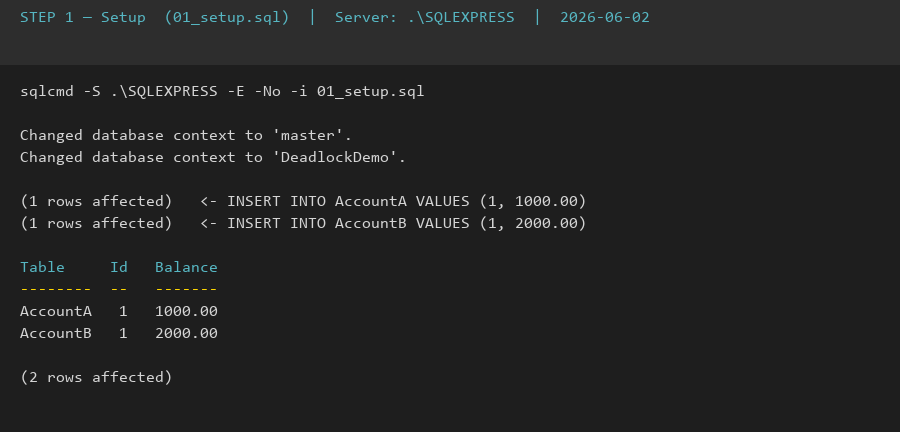
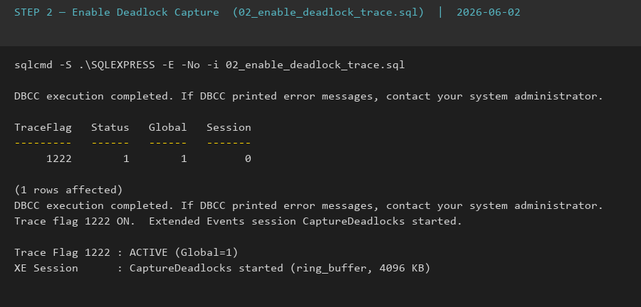
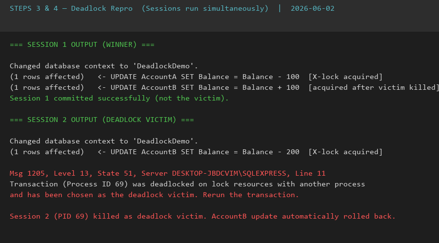
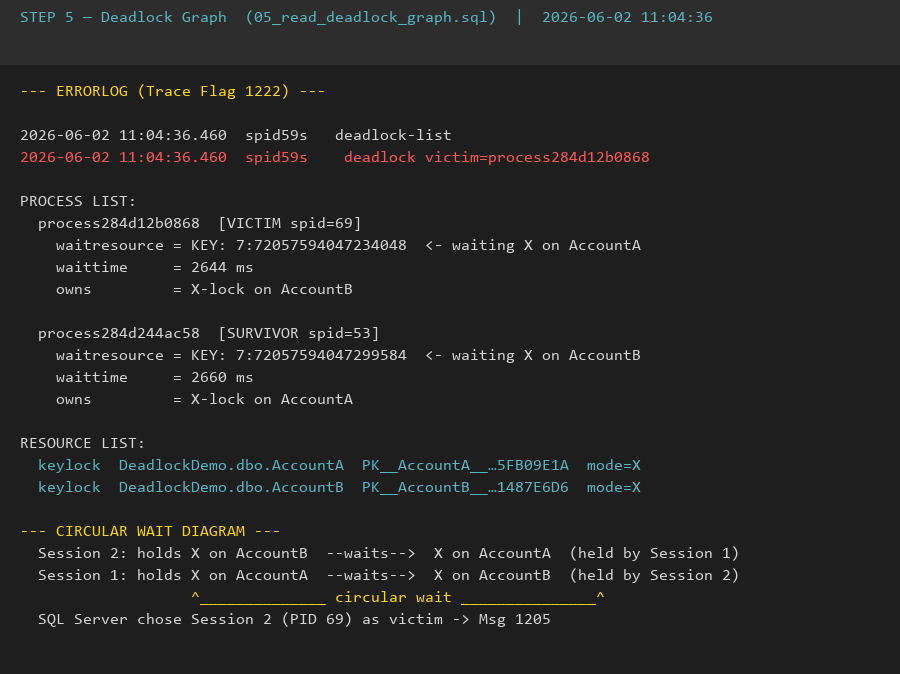
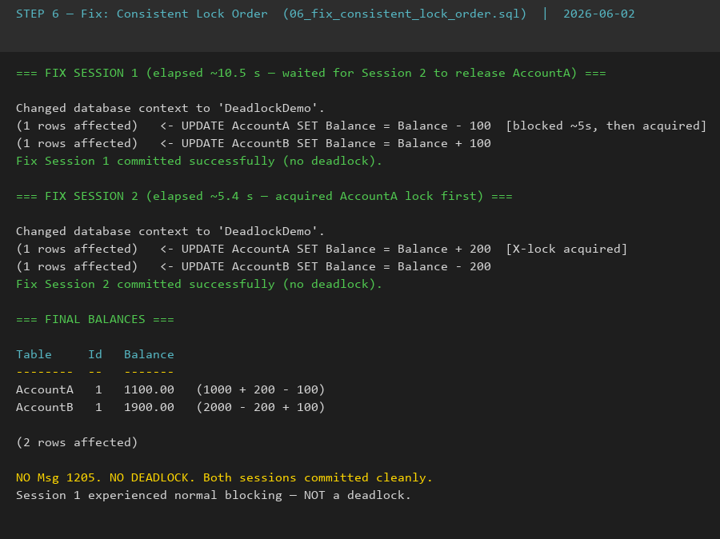

# Day 9 — Piece 2: Reproduce and Resolve a Deadlock

**Server:** `DESKTOP-JBDCVIM\SQLEXPRESS` (SQL Server 2025 Express)  
**Database:** `DeadlockDemo`  
**Capture method:** Trace Flag 1222 (ERRORLOG) + Extended Events (`xml_deadlock_report`)  
**Run date:** 2026-06-02

---

## Repro Script — Session 1

Session 1 locks **AccountA first**, then waits 5 s, then tries **AccountB**.

```sql
-- 03_session1_deadlock.sql  —  run in Window 1
USE DeadlockDemo;
GO

BEGIN TRANSACTION;

    -- Step 1: acquire X-lock on AccountA row
    UPDATE AccountA SET Balance = Balance - 100 WHERE Id = 1;

    -- Step 2: pause so Session 2 can grab AccountB
    WAITFOR DELAY '00:00:05';

    -- Step 3: try to acquire X-lock on AccountB  <-- will DEADLOCK
    UPDATE AccountB SET Balance = Balance + 100 WHERE Id = 1;

COMMIT TRANSACTION;
PRINT 'Session 1 committed successfully (not the victim).';
GO
```

## Repro Script — Session 2

Session 2 locks **AccountB first** (opposite order), then tries **AccountA** — creating a circular wait.

```sql
-- 04_session2_deadlock.sql  —  run in Window 2 IMMEDIATELY after Window 1
USE DeadlockDemo;
GO

BEGIN TRANSACTION;

    -- Step 1: acquire X-lock on AccountB row  (opposite order to Session 1)
    UPDATE AccountB SET Balance = Balance - 200 WHERE Id = 1;

    -- Step 2: pause mirrors Session 1
    WAITFOR DELAY '00:00:05';

    -- Step 3: try to acquire X-lock on AccountA  <-- circular wait = DEADLOCK
    UPDATE AccountA SET Balance = Balance + 200 WHERE Id = 1;

COMMIT TRANSACTION;
PRINT 'Session 2 committed successfully (not the victim).';
GO
```

---

## Deadlock Graph — Trace Flag 1222 (ERRORLOG)

From `EXEC xp_readerrorlog 0, 1, N'deadlock'` — captured at **2026-06-02 11:04:36**:

```
2026-06-02 11:04:36.460  spid59s   deadlock-list
2026-06-02 11:04:36.460  spid59s    deadlock victim=process284d12b0868

PROCESS LIST:

  process284d12b0868  (VICTIM — spid=69)
    waitresource = KEY: 7:72057594047234048   <- waiting for X-lock on AccountA
    waittime     = 2644 ms
    owns         = X-lock on AccountB

  process284d244ac58  (SURVIVOR — spid=53)
    waitresource = KEY: 7:72057594047299584   <- waiting for X-lock on AccountB
    waittime     = 2660 ms
    owns         = X-lock on AccountA

RESOURCE LIST:

  keylock  DeadlockDemo.dbo.AccountA  PK__AccountA__3214EC075FB09E1A  mode=X
  keylock  DeadlockDemo.dbo.AccountB  PK__AccountB__3214EC071487E6D6  mode=X
```

**Circular wait:**

```
Session 2 (spid=69): holds X on AccountB  ──waits──►  X on AccountA  (held by Session 1)
Session 1 (spid=53): holds X on AccountA  ──waits──►  X on AccountB  (held by Session 2)
                             ↑──────────── circular wait ────────────↑
  SQL Server chose Session 2 (process284d12b0868) as victim → Msg 1205, automatic rollback
```

---

## Fix: Consistent Lock Order — Side-by-Side

**The only change: swap the two UPDATE statements in Session 2 so it acquires AccountA before AccountB, matching Session 1's order.**

| | Session 1 (original) | Session 2 (original — BROKEN) | Session 2 (fixed) |
|---|---|---|---|
| **Line 1** | `UPDATE AccountA … (-100)` — lock **A** | `UPDATE AccountB … (-200)` — lock **B** ← wrong | `UPDATE AccountA … (+200)` — lock **A** ← fixed |
| **Line 2** | `WAITFOR DELAY '00:00:05'` | `WAITFOR DELAY '00:00:05'` | `WAITFOR DELAY '00:00:05'` |
| **Line 3** | `UPDATE AccountB … (+100)` — lock **B** | `UPDATE AccountA … (+200)` — lock **A** ← causes cycle | `UPDATE AccountB … (-200)` — lock **B** ← no cycle |

**Fixed Session 2 (full script):**

```sql
BEGIN TRANSACTION;
    UPDATE AccountA SET Balance = Balance + 200 WHERE Id = 1;  -- lock A first (REORDERED)
    WAITFOR DELAY '00:00:05';
    UPDATE AccountB SET Balance = Balance - 200 WHERE Id = 1;  -- lock B second
COMMIT TRANSACTION;
PRINT 'Fix Session 2 committed successfully (no deadlock).';
GO
```

---

## Why It Works

> **When every session acquires locks in the same order (AccountA → AccountB), no circular wait can form — a deadlock cycle requires at least one session to request a resource in reverse order, creating a "I hold what you need, you hold what I need" situation that can never exist if all sessions follow the same sequence.**

| Scenario | Session 1 | Session 2 | Result |
|---|---|---|---|
| **Before fix** | A → waits for B | B → waits for A | Circular wait → **DEADLOCK (Msg 1205)** |
| **After fix** | A → B | waits for A → B | Linear wait → **both sessions commit** |

---

## Screenshots

### Step 1 — Setup: AccountA and AccountB seeded



### Step 2 — Enable Deadlock Capture (Trace Flag 1222 + Extended Events)



### Steps 3 & 4 — Deadlock Reproduced: Session 2 receives Msg 1205



### Step 5 — Deadlock Graph from ERRORLOG (Trace Flag 1222)



### Step 6 — Fix: Both Sessions Commit, No Deadlock



---

## Extra Credit

### What I Learned

1. `WAITFOR DELAY` is essential to reliably reproduce a deadlock — it widens the timing window so both sessions each grab one lock before either tries for the second. Without it, one session completes before the other even starts.
2. Trace Flag 1222 writes a structured, human-readable deadlock report to the ERRORLOG including process IDs, wait resources, isolation levels, and the actual SQL that was executing — far more diagnostic detail than just the Msg 1205 error itself.

### What Would Break This Fix

1. **Adding a third resource out of order** — if future code locks `AccountC` between A and B in one path but after B in another, a new deadlock cycle forms even though the A → B ordering is consistent for those two tables.
2. **Two independently correct stored procedures called in opposite order inside one outer transaction** — two procedures that each acquire A then B internally can still deadlock if one caller wraps them as `exec sp1; exec sp2` and another caller wraps them as `exec sp2; exec sp1` inside a single transaction.
